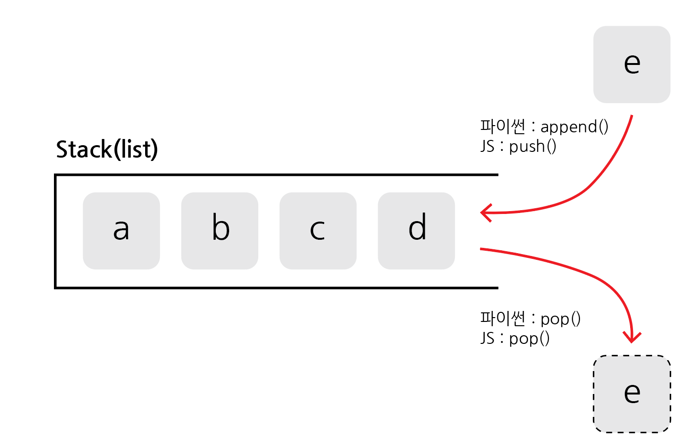
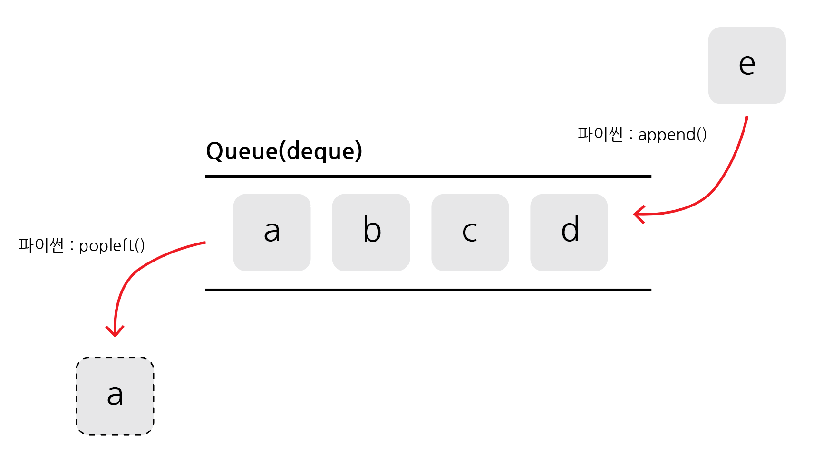

# 스택, 큐

## 목차

1. [스택(Stack)](#1-스택stack)
2. [큐(Queue)](#2-큐queue)

<br>
<br>

## 1. 스택(Stack)

-   먼저 들어 온 데이터가 나중에 나가는 자료구조(선입후출, Last-In First-Out(LIFO))
-   입구와 출구가 동일한 형태로 볼 수 있음
-   스택 동작은 삽입, 삭제 2가지의 동작으로 이루어짐
    -   파이썬에서는 삽입(append), 삭제(pop) 이용
    -   자바스크립트에서는 삽입(push), 삭제(pop) 이용



<스택 도식화>

ex) 박스쌓기, 브라우저 뒤로가기...

<br>

```bash
ex)

# 스택 구현 예제 (Python)

stack = []

# 삽입(5) - 삽입(2) - 삽입(3) - 삽입(7) - 삭제() - 삽입(1) -삽입(4) - 삭제()
stack.append(5)
stack.append(2)
stack.append(3)
stack.append(7)
stack.pop()
stack.append(1)
stack.append(4)
stack.pop()

print(stack[::-1])
print(stack)

출력
>> [1, 3, 2, 5] # 상단 원소부터 출력
>> [5, 2, 3, 1] # 하단 원소부터 출력
```

-   파이썬과 자바스크립트의 경우, 별도 표준 라이브러리 없이 스택 구현 가능
-   `파이썬`의 경우, `리스트(list)` 자료형을 통해 스택 구현이 가능
-   `자바스크립트`의 경우, `배열(Array)` 자료형을 통해 스택 구현이 가능
-   append()와 pop()의 `시간복잡도`는 상수시간 `O(1)`

<br>
<br>

## 2. 큐(Queue)

-   먼저 들어온 데이터가 먼저 나가는 자료구조(선입선출, First-In First-Out(FIFO))
-   입구와 출구가 뚫린 터널의 형태로 볼 수 있음
-   `deque(double-ended queue)` 사용
-   큐 동작은 삽입, 삭제 2가지로 이루어짐
    -   파이썬에서 삽입(append), 삭제(popleft, 왼쪽의 요소 꺼내기)를 이용



<큐 도식화>

ex) 창구 번호표 대기열, 자동차 터널...

<br>

```bash
ex)

# 큐 구현 예제 (Python)

from collections import deque

# 큐(Queue) 구현을 위해 deque 라이브러리 사용
queue = deque()

# 삽입(5) - 삽입(2) - 삽입(3) - 삽입(7) - 삭제() - 삽입(1) - 삽입(4) - 삭제()
queue.append(5)
queue.append(2)
queue.append(3)
queue.append(7)
queue.popleft()
queue.append(1)
queue.append(4)
queue.popleft()

print(queue) # 먼저 들어온 순서대로 출력
queue.reverse()
print(queue) # 나중에 들어온 순서대로 출력

출력
>> deque([3, 7, 1, 4])
>> deque([4, 1, 7, 3])
```

-   단순 리스트만으로도 기능적으로 큐를 구현할 수 있지만, 시간복잡도가 높아져 비효율적임
-   `리스트`를 이용하여 큐를 구현할 경우, `pop()`을 이용해 특정 인덱스의 원소를 꺼내고 원소의 `위치를 조정하는 과정`이 필요하여 `O(K)`만큼의 시간복잡도가 발생
-   따라서 `deque 라이브러리`를 이용
-   deque 라이브러리는 스택과 큐 자료구조의 장점을 합쳐놓은 형태
-   append()와 popleft()의 `시간복잡도`는 상수시간 `O(1)`
