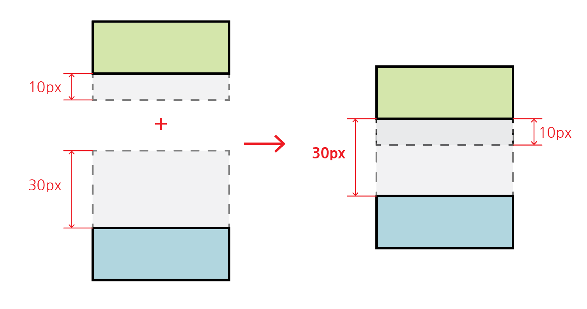

# Box Model

## - 목차
1. [CSS Box Model](#1-css-box-model)
2. [구성 요소](#2-구성-요소)
    - [Box의 구성](#1-box의-구성)
        - [Box 요소 연습](#--box-요소-연습)
    - [box-sizing 속성](#2-box-sizing-속성)
3. [박스 타입](#3-박스-타입)
    - [Block & Inline](#1-block--inline)
        - [박스 타입 연습](#--박스-타입-연습)
    - [block 타입 특징](#2-block-타입-특징)
    - [inline 타입 특징](#3-inline-타입-특징)
4. [참고](#4-참고)
    - [shorthand 속성 - border](#--shorthand-속성---border)
    - [shorthand 속성 - margin & padding](#--shorthand-속성---margin--padding)
    - [display: inline-block](#--display-inline-block)
    - [Margin collapsing(마진 상쇄)](#--margin-collapsing마진-상쇄)

---

## (1) CSS Box Model

- 모든 HTML 요소를 `(사각형) 박스`로 표현


<HTML 요소는 모양에 상관없이 박스로 표현>


<네이버를 구성하는 크고 작은 박스 모델>


---

## (2) 구성 요소

- 박스 모델에 대한 `크기`, `여백`, `테두리` 등의 스타일을 지정하는 디자인 개념

### **1) Box의 구성**


<박스 모델의 레이어별 명칭>

- `마진(Margin)` : 박스와 다른 요소 사이 공백으로 가장 바깥 영역
- `경계선(Border)` : 컨텐츠와 패딩을 감싸는 테두리
- `패딩(Padding)` : 컨텐츠 주위에 위치하는 공백
- `컨텐츠(Content)` : 컨텐츠가 표시되는 영역


<박스 모델 방향별 명칭>

- 방향별 구분 : 각 방향에 따라 `top`, `bottom`, `left`, `right`로 구분됨
- 컨텐츠 크기 : 높이는 `height`, 너비는 `width`로 구분됨

<br>

### - Box 요소 연습

```html
<body>
    <div class="box1">box1</div>
    <div class="box2">box2</div>
</body>
```

```css
.box1 {
    width: 300px;
    padding-left: 25px;
    padding-bottom: 25px;
    margin-left: 25px;
    margin-top: 50px;
    border-width: 3px;
    border-color: black;
    border-style: solid;
}

.box2 {
    width: 300px;
    padding: 25px 50px;
    margin: 25px auto;
    border: 1px dashed black;
}
```


<박스 모델 요소 연습 결과>

<br>

### **2) box-sizing 속성**

- 요소의 너비와 높이를 `계산하는 방법`을 지정
- `기본적`으로 요소의 너비와 높이는 `컨텐츠의 영역`을 대상으로 함
  - `box-sizing: content-box;`
- 주로 `경계선 영역`으로 변경하여 사용
  - `box-sizing: border-box;`


```css
* {
    box-sizing: content-box;
}

* {
    box-sizing: border-box;
}
```


---

## (3) 박스 타입

### **1) Block & Inline**

- Normal flow : 기본적으로 Block 및 Inline 요소가 기본적으로 배치되는 방향


- Inline Direction : 행(가로) 방향
- Block Direction : 열(세로) 방향

<br>

### - 박스 타입 연습

```html
<!--박스 타입 예시문-->

<h1>Normal flow</h1>
<p>Lorem, ipsum dolor sit amet consect explicabo?</p>
<div>
  <p>block 요소는 기본적으로 부모 요소의 너비 100%를 차지하며, 자식 콘텐츠의 최대 높이를 취한다.</p>
  <p>block 요소의 총 너비와 총 높이는 content + padding + border width/height다.</p>
</div>
<p>block 요소는 서로 margins로 구분된다.</p>
<p>inline 요소는 <span>이 것처럼</span> 자체 콘텐츠의 너비와 높이만 차지한다.
그리고 inline 요소는 <a href="#">width나 height 속성을 지정 할 수 없다.</a>
</p>
<p>
  물론 이미지도  인라인 요소다.
  단, 이미지는 다른 inline 요소와 달리 width나 height로 크기를 조정할 수 있다.
</p>
<p>
  만약 inline 요소의 크기를 제어하려면 block 요소로 변경하거나 inline-block 요소로 설정해주어야 한다.
</p>
```

```css
/*css 예시*/

a, span, img {
  border: 1px solid red;
}

h1, p, div {
  border: 1px solid blue;
}
```


<박스 타입 연습 결과>

<br>

### **2) block 타입 특징**

- 항상 새로운 행으로 나뉨
- width와 height 속성을 사용하여 너비와 높이를 지정할 수 있음
- 기본적으로 width 속성을 지정하지 않으면, 박스는 inline 방향으로 사용 가능한 모든 너비를 차지함(너비 100% 채움)
- 대표적인 block 타입
  - ex) h1~6, p, div

<br>

### **3) inline 타입 특징**

- 새로운 행으로 나뉘지 않음
- width와 height 속성을 사용할 수 없음(img 제외)
- 수직방향
  - padding, margins, borders가 적용되지만 다른 요소를 밀어낼 수는 없음
- 수평방향
  - padding, margins, borders가 적용되어 다른 요소를 밀어낼 수 있음
- 대표적인 inline 타입
  - ex) a, img, span


---

## (4) 참고

### - shorthand 속성 - border

- border-width, border-style, border-color를 한 번에 설정하는 속성

```css
/*순서는 상관없음*/

.box1 {
  border: 1px solid black;
}

/*1px 굵기의 검정 실선의 경계선*/
```

<br>

### - shorthand 속성 - margin & padding

- 4방향의 속성을 따로 지정하는 것이 아닌 한 번에 지정하는 속성

```css
/*4개 - 상하좌우*/
.box1 {
  margin: 10px 20px 30px 40px;
  padding: 10px 20px 30px 40px;
}

/*3개 - 상/좌우/하*/
.box2 {
  margin: 10px 20px 30px;
  padding: 10px 20px 30px;
}

/*2개 - 상하/좌우*/
.box3 {
  margin: 10px 20px;
  padding: 10px 20px;
}

/*1개 - 공통*/
.box4 {
  margin: 10px;
  padding: 10px;
}
```

<br>

### - display: inline-block

- inline과 block 요소 사이의 중간 지점을 제공하는 display 값
- 요소가 `줄 바꿈 되는 것을 원하지 않으면`서 `너비와 높이를 적용`하고 싶은 경우에 사용
- block 요소의 특징을 가짐
  - 너비 및 높이 속성이 준수
  - 패딩, 여백 및 경계선으로 인해 다른 요소가 상자에서 밀려남

<br>

### - Margin collapsing(마진 상쇄)

- 두 block 타입 요소의 margin-top과 margin-bottom이 만나 `큰 값을 가진 margin`으로 결합되는 현상
- 웹 개발자가 레이아웃을 더욱 쉽게 관리할 수 있도록 함



<마진 상쇄>