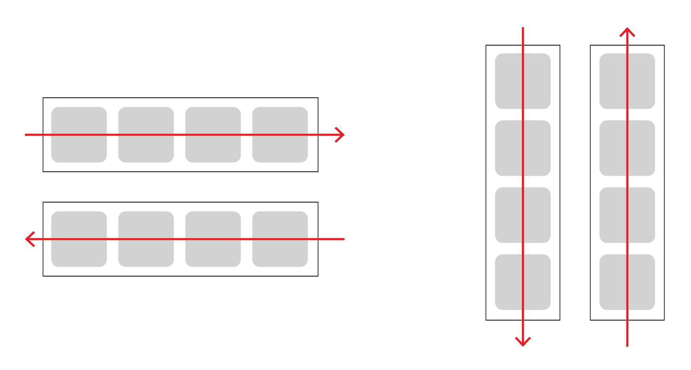
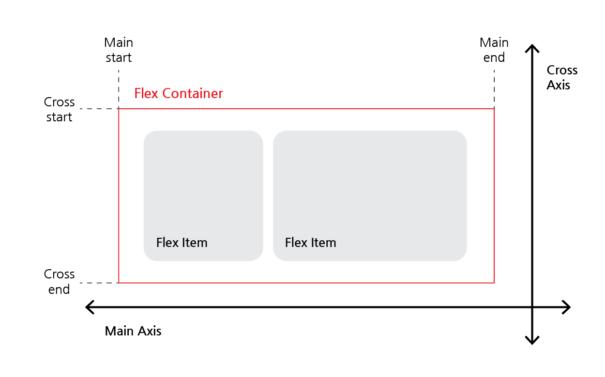

# Flexbox

## - 목차
1. [CSS Flexbox](#1-css-flexbox)
    - [Flexbox 기본사항](#1-flexbox-기본사항)
2. [Flexbox 레이아웃 구성](#2-flexbox-레이아웃-구성)
    - [Flexbox 속성](#1-flexbox-속성)
        - [Flex Container 관련 속성](#--flex-container-관련-속성)
        - [Flex Item 관련 속성](#--flex-item-관련-속성)
        - [Flex Container 지정](#--flex-container-지정)
        - [flex-direction 지정](#--flex-direction-지정)
        - [flex-wrap](#--flex-wrap)
        - [justify-content](#--justify-content)
        - [align-content](#--align-content)
        - [align-items](#--align-items)
        - [align-self](#--align-self)
        - [flex-grow](#--flex-grow)
        - [flex-basis](#--flex-basis)
    - [목적에 따른 분류](#2-목적에-따른-분류)
    - [속성명 Tip](#3-속성명-tip)
3. [Flexbox 반응형 레이아웃](#3-flexbox-반응형-레이아웃)
    - [반응형 레이아웃](#1-반응형-레이아웃)
4. [참고](#4-참고)
    - [justify-items 및 justify-self 속성이 없는 이유](#1-justify-items-및-justify-self-속성이-없는-이유)
    - [Shorthand - flex-flow](#2-shorthand---flex-flow)
    - [Shorthand - flex](#3-shorthand---flex)

---

## (1) CSS Flexbox

- 요소를 `행과 열`의 형태로 배치하는 1차원 레이아웃 방식
- 요소 간의 `공간 배열`과 `정렬`

<Flexbox 1차원 레이아웃 개념>

 

### **1) Flexbox 기본사항**

- `Main Axis (주 축)`
  - flex item들이 배치되는 기본 축
  - main start에서 시작하여 main end 방향으로 배치

- `Cross Axis (교차 축)`
  - main axis에 수직인 축
  - cross start에서 cross end 방향으로 배치

- `Flex Container`
  - `display: flex;` 혹은 `display: inline-flex;`가 설정된 부모 요소
  - 이 컨테이너의 1차 자식요소들이 Flex Item이 됨
  - flexbox 속성 값들을 사용하여 자식 요소 Flex Item들을 배치

- `Flex Item`
  - Flex Container 내부에 레이아웃 되는 항목들

---

## (2) Flexbox 레이아웃 구성

### **1) Flexbox 속성**

### - Flex Container 관련 속성

- `display`, `flex-direction`, `flex-wrap`, `justify-content`, `align-items`, `align-content`

 

### - Flex Item 관련 속성

- `align-self`, `flex-grow`, `flex-shrink`, `flex-basis`, `order`

 

### - Flex Container 지정

- flex item은 `행(가로)`으로 나열
- flex item은 주축의 시작 선에서 시작
- flex item은 교차축의 크기를 채우기 위해 늘어남

 

### - flex-direction 지정

- flex item이 나열되는 방향을 지정
- `column`으로 지정할 경우, 주축이 변경됨
- `-reverse`로 지정하면 시작 선과 끝 선이 서로 바뀜

 

### - flex-wrap

- flex item 목록이 flex container의 하나의 행에 다 들어가지 않을 경우, `다른 행에 배치할지` 여부 설정(개행 여부)
- 화면 너비를 조절하여 확인

 

### - justify-content

- 주축을 따라 flex item과 `주위에 공간을 분배`

 

### - align-content

- 교차축을 따라 flex item과 주위에 공간을 분배
- flex-wrap이 wrap 또는 wrap-reverse로 설정된 여러 행에만 적용됨
- 한 줄짜리 행에는 (flex-wrap이 nowrap으로 설정된 경우) 효과 없음

 

### - align-items

- 교차축을 따라 flex item행을 정렬

 

### - align-self

- 교차축을 따라 개별 flex item을 정렬

 

### - flex-grow

- 남는 행 여백을 비율에 따라 각 flex-item에 분배
- flex-grow의 반대는 flex-shrink
  - 넘치는 너비를 분배해서 줄임

 

### - flex-basis

- flex item의 초기 크기 값을 지정
- flex-basis와 width 값을 동시에 적용한 경우, flex-basis가 우선 시 됨

### **2) 목적에 따른 분류**

- 배치 설정
  - flex-direction
  - flex-wrap

- 공간분배
  - justify-content
  - align-content

- 정렬
  - align-items
  - align-self

 

### **3) 속성명 Tip**

- justify : 주축
- align : 교차축

---

## (3) Flexbox 반응형 레이아웃

### **1) 반응형 레이아웃**

- flex-wrap, flex-grow, flex-basis 등을 사용하여 반응형 레이아웃 구현

---

## (4) 참고

### **1) justify-items 및 justify-self 속성이 없는 이유**

- `필요가 없음`
- `margin: auto;`를 통해 정렬 및 배치가 가능함

 

### **2) Shorthand - flex-flow**

- flex-flow

 

### **3) Shorthand - flex**

- flex