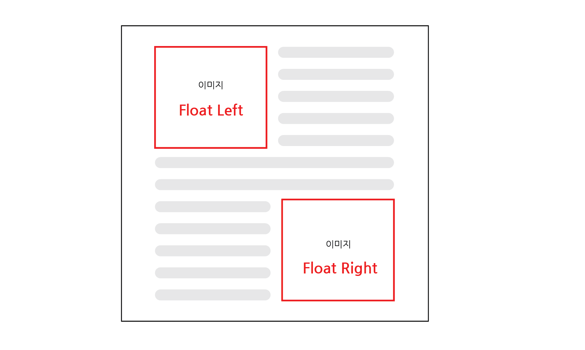
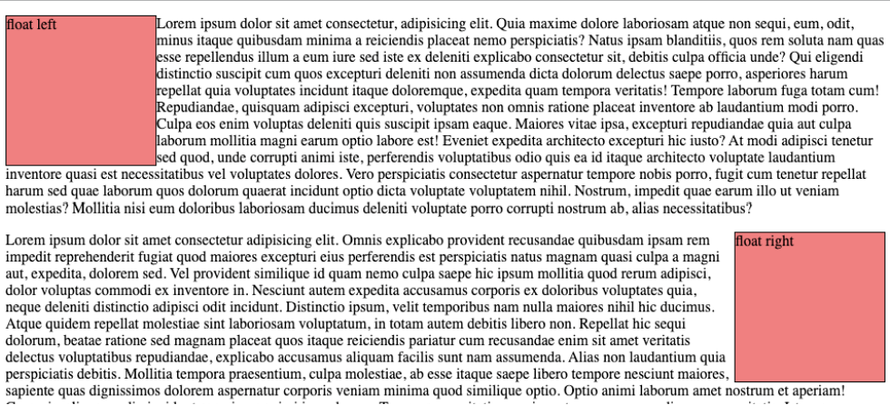

# Float

## - 목차
1. [CSS Float](#1-css-float)
    - [Float 탄생 배경](#1-float-탄생-배경)
        - [Float 예시](#--float-예시)
2. [참고](#2-참고)

---

## (1) CSS Float

- 요소를 `띄워서` 텍스트 및 인라인 요소가 그 주위를 `감싸도록` 하는 배치
- 왼쪽 혹은 오른쪽으로 띄워 Normal flow에서 벗어남

<br>

### **1) Float 탄생 배경**

- 텍스트 열 내부에 떠다니는 이미지를 포함하면서도 해당 이미지 좌우에 텍스트를 둘러싸는 간단한 레이아웃을 구현하기 위해 도입
- ex) 신문, 뉴스 레이아웃



<Float 개념>

<br>

### - Float 예시

```html
<div class="box float-left">float left</div>
<p>...</p>
<div class="box float-right">float right</div>
<p>...</p>
```

```css
.box {
    width: 10rem;
    height: 10rem;
    border: 1px solid black;
    background-color: lightcoral;
}

.float-left {
    float: left;
}

.float-right {
    float: right;
}
```



<Float 예시 결과>


---

## (2) 참고

- Float는 초기의 목적에서 확장되어 웹 페이지 전체의 레이아웃을 구성하는데 사용되었으나, `Flexbox`와 `Grid`의 등장으로 초기 목적으로 회귀