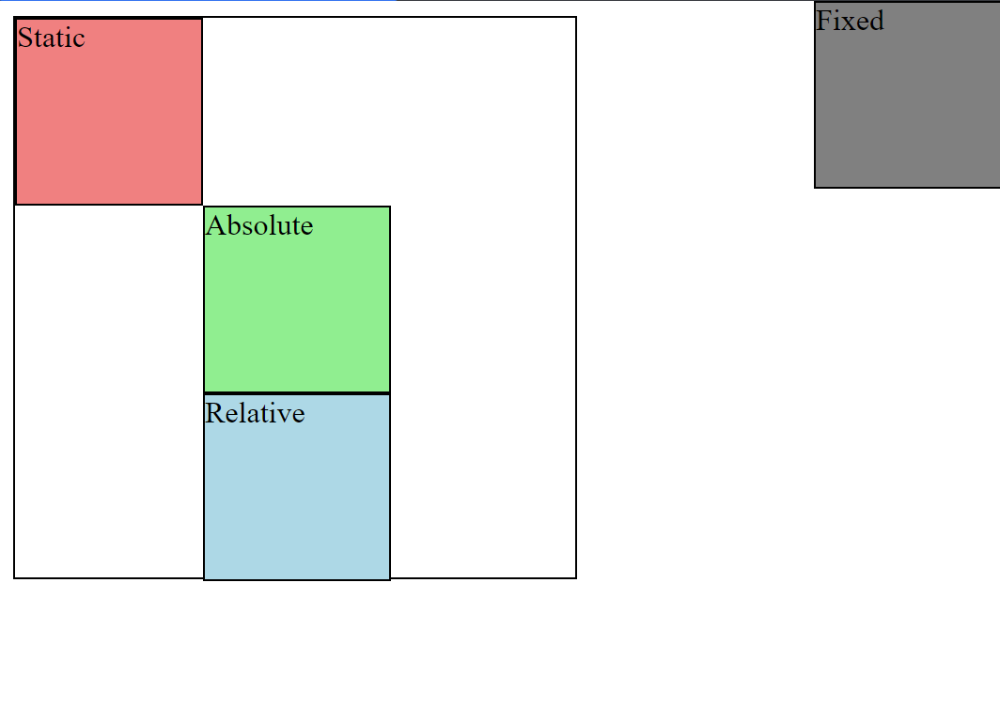
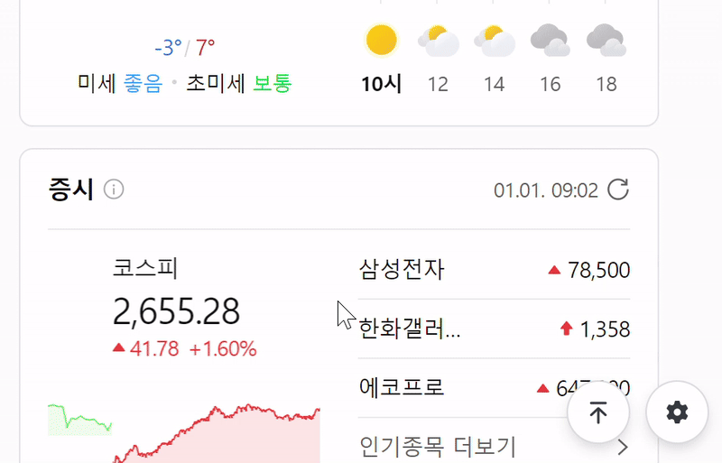
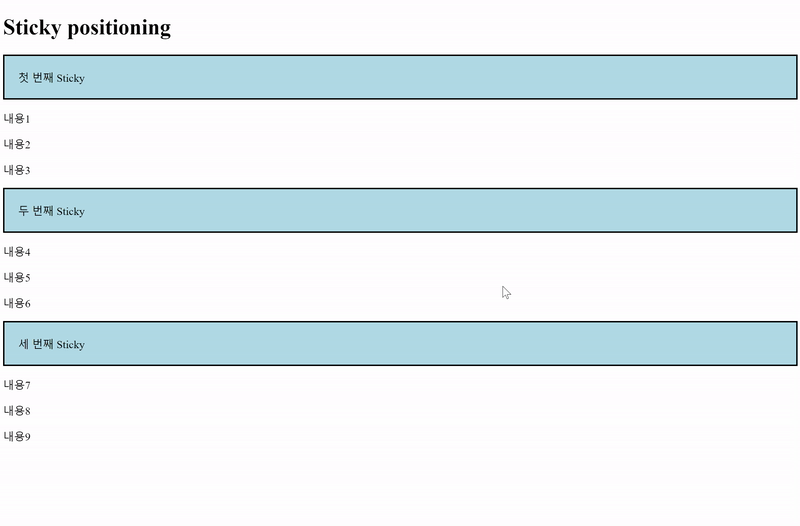
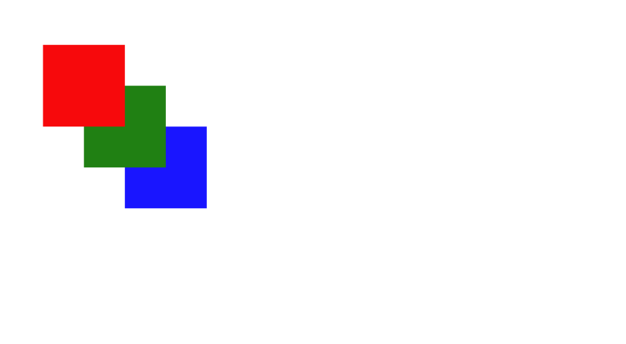

# 포지션

## - 목차
1. [CSS Layout](#1-css-layout)
2. [CSS Position](#2-css-position)
    - [Position 유형](#1-position-유형)
        - [static](#--static-)
        - [relative](#--relative)
        - [absolute](#--absolute)
        - [fixed](#--fixed)
        - [sticky](#--sticky)
    - [z-index](#2-z-index)
        - [z-index 예시](#--z-index-예시)
3. [참고 : Position의 역할](#3-참고--position의-역할)

---

## (1) CSS Layout

- 각 요소의 위치와 크기를 조정하여 웹 페이지의 디자인을 결정하는 것

---

## (2) CSS Position

- Normal flow에서 요소를 끄집어내어 `다른 위치로 배치`하는 것
  - ex) 다른 요소 위에 놓기, 화면 특정 위치에 고정시키기 등...

<br>

### **1) Position 유형**

### - static 

- 기본 값
- 요소를 Normal flow에 따라 배치

<br>

### - relative

- 요소를 Normal flow에 따라 배치
- 기존에 위치할`자기 자신 위치를 기준`으로 이동
- 요소가 차지하는 공간은 static일 때와 같음

<br>

### - absolute

- 요소를 Normal flow에서 제거
- 가장 가까운 `relative 부모 요소를 기준`으로 이동
- 문서에서 요소가 차지하는 공간이 없어짐

<br>

### - fixed

- 요소를 Normal flow에서 제거
- 현재 `화면영역(Viewport)을 기준`으로 이동
- 문서에서 요소가 차지하는 공간이 없어짐

```html
<body>
    <div class="container">
        <div class="box static">Static</div>
        <div class="box absolute">Absolute</div>
        <div class="box relative">Relative</div>
        <div class="box fixed">Fixed</div>
    </div>
</body>
```

```css
* {
    box-sizing: border-box;
}

body {
    height: 1500px;
}

.container {
    position: relative;
    height: 300px;
    width: 300px;
    border: 1px solid black;
}

.box {
    height: 100px;
    width: 100px;
    border: 1px solid black;
}

.static {
    position: static;
    background-color: lightcoral;
}

.absolute {
    position: absolute;
    background-color: lightgreen;
    top: 100px;
    left: 100px;
}

.relative {
    position: relative;
    background-color: lightblue;
    top: 100px;
    left: 100px;
}

.fixed {
    position: fixed;
    background-color: gray;
    top: 0;
    right: 0;
}
```



<static, absolute, relative, fixed 비교>



<fixed 적용 예시 - top 버튼>

<br>

### - sticky

- 요소를 Normal flow에 따라 배치
- 가장 가까운 block 부모 요소를 기준으로 이동
- 요소가 `특정 임계점`(ex. viewport의 상단으로부터 10px)에 스크롤될 경우, 그 위치에 고정됨(fixed)
- 만약 다음 sticky 요소가 나오면 다음 sticky 요소가 이전 sticky 요소의 자리를 대체
  - 이전 sticky 요소가 고정되어 있던 위치와 다음 sticky 요소가 고정되어야 할 위치가 겹치게 되기 때문

```html
<!--Sticky 예시-->

<h1>Sticky positioning</h1>
<div>
  <div class="sticky">첫 번째 Sticky</div>
  <div>
    <p>내용1</p>
    <p>내용2</p>
    <p>내용3</p>
  </div>
  <div class="sticky">두 번째 Sticky</div>
  <div>
    <p>내용4</p>
    <p>내용5</p>
    <p>내용6</p>
  </div>
  <div class="sticky">세 번째 Sticky</div>
  <div>
    <p>내용7</p>
    <p>내용8</p>
    <p>내용9</p>
  </div>
</div>
```

```css
body {
    height: 1500px;
}

.sticky {
    position: sticky;
    top: 0;
    background-color: lightblue;
    padding: 20px;
    border: 2px solid black;
}
```



<sticky 예시 결과>


<sticky 적용 예시 - 메뉴바 스크롤 시>

<br>

### **2) z-index**

- 요소가 겹쳤을 때 `어떤 요소 순으로 위`에 나타낼 지를 결정함
  - ex) 포토샵의 레이어 개념
- z축 (스크린 표면으로부터 사용자 얼굴 쪽으로 향하는 라인) 기준 정렬
- 정수 값을 사용하여 z축 순서를 지정함
- 더 큰 값을 가진 요소가 작은 값의 요소를 덮음(`큰 값을 우선`)


<z-index 개념>

<br>

### - z-index 예시

```html
<div class="container">
  <div class="box red"></div>
  <div class="box green"></div>
  <div class="box blue"></div>
</div>
```

```css
.container {
  position: relative;
}

.box {
  position: absolute;
  width: 100px;
  height: 100px;
}

.red {
  background-color: red;
  top: 50px;
  left: 50px;
  z-index: 3;
}

.green {
  background-color: green;
  top: 100px;
  left: 100px;
  z-index: 2;
}

.blue {
  background-color: blue;
  top: 150px;
  left: 150px;
  z-index: 1;
}
```



<z-index 예시 결과>


---

## (3) 참고 : Position의 역할

- CSS Position은 전체 페이지에 대한 레이아웃을 구성하는 것이 아닌 페이지의 `특정 항목의 위치를 조정`하는 것에 관한 것