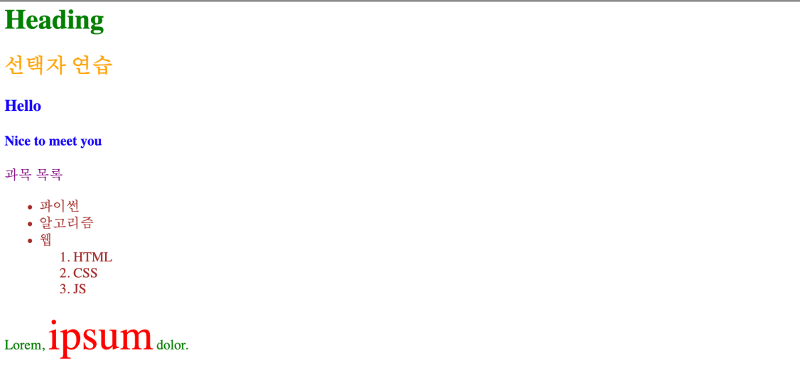
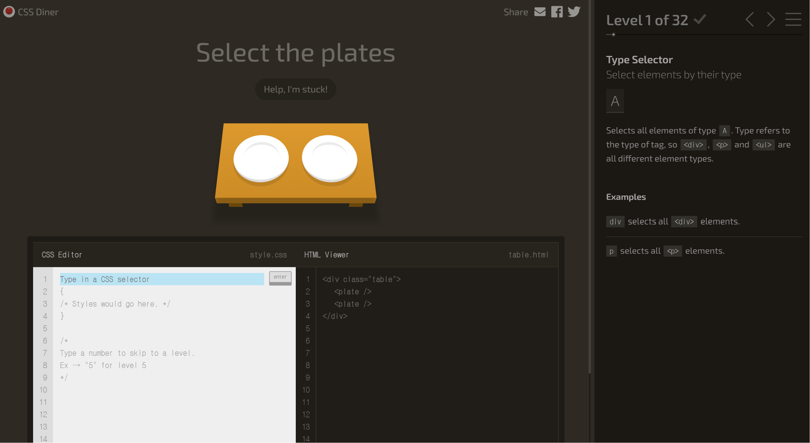

# CSS 소개

## - 목차
1. [CSS 소개](#1-css-소개)
    - [CSS](#1-css)
        - [CSS 구문](#--css-구문)
        - [CSS 적용 방법](#--css-적용-방법)
2. [Selector Elements](#2-select-elements)
    - [CSS Selectors](#1-css-selectors)
        - [CSS Selectors 종류](#--css-selectors-종류)
        - [CSS Selectors 특징](#--css-selectors-특징)
        - [CSS Selectors 예시](#--css-selectors-예시)
        - [CSS Selectors 연습 사이트 참고](#--css-selectors-연습-사이트-참고)
3. [Cascade & Specificity](#3-cascade--specificity)
    - [Cascade & Specificity](#1-cascade--specificity)
        - [Cascade(계단식)](#--cascade계단식)
        - [Specificity(우선 순위)](#--specificity우선-순위)
        - [우선 순위 높은 순](#--우선-순위-높은-순)
    - [상속](#2-상속)
        - [상속 예시](#--상속-예시)
4. [참고](#4-참고)
    - [CSS 스타일 모든 속성을 외우는 것 아님](#--css-스타일-모든-속성을-외우는-것-아님)
    - [속성은 되도록 class만 사용하도록 함](#--속성은-되도록-class만-사용하도록-함)
    - [CSS 상속 여부는 MDN 문서에서 확인](#--css-상속-여부는-mdn-문서에서-확인)
   
---

## (1) CSS 소개

### **1) CSS**

- Cascading Style Sheet의 약자로 웹 페이지의 디자인과 레이아웃을 구성하는 언어

<br>

### - CSS 구문

```css
/*css 예시*/

h1 {
    color: blue;
    font-size: 15px;
}
```

- `h1` : 선택자(Selector)
- `color: blue;` : 선언(Declaration)
- `font-size` : 속성(Property)
- `15px` : 값(Value)

<br>

### - CSS 적용 방법

1) 인라인(Inline) 스타일

    - 태그명 뒤에 공백을 두고 `style="(선언)"`으로 스타일링
    - 스타일을 쉽고 빠르게 수정 가능
    - 스타일 시트를 별도로 로드하지 않아도 되므로 초기 페이지 로딩 속도가 빨라짐
    - 재사용성이 떨어지고, 코드의 복잡도가 증가하여 관리가 어려움
    - 가독성도 안좋음
    - 사용하는 것을 지양함 

    ```html
    <!--인라인 스타일 예시-->
    
    <!DOCTYPE html>
    <html lang="en">
    <head>
        ...
    </head>
    <body>
        <h1 style="color: blue; background-color: yellow;">Hello, World!</h1>
    </body>
    </html>
    ```
   
<br>

2) 내부(Internal) 스타일 시트

   - HTML의 설정을 담당하는 `<head>` 태그 안에 `<style>` 태그를 두어 스타일 속성을 작성
   - 인라인 스타일과 내부 스타일을 동시에 작성할 경우, `인라인 스타일을 우선순위`로 적용
    
    ```html
    <!--   내부 스타일링 예시-->
    
    <!DOCTYPE html>
    <html lang="en">
    <head>
        ...
        <title>Document</title>
        <style>
            h1 {
                color: blue;
                background-color: yellow;
            }
        </style>
    </head>
    <body>
        <h1>Hello, World!</h1>
    </body>
    </html>
    ```

<br>

3) 외부(External) 스타일 시트

   - 외부 스타일 시트 작성방식은 내부 스타일과 똑같지만, `<style>` 태그 안에 코드를 작성하는 것이 아닌 `별도의 CSS파일`을 생성하여 코드를 작성하고 HTML파일에서 `<link>`태그를 이용하여 연결하는 방식
   - 연결하고자 하는 CSS파일의 경로를 `href="(경로)"`안에 입력

    ```html
    <!--외부 스타일링 예시-->
    
    <!DOCTYPE html>
    <html lang="en">
    <head>
        ...
        <!--별도의 CSS파일 불러오기-->
        <link rel="stylesheet" href="style.css">
        <title>Document</title>
    </head>
    <body>
        <h1>Hello, World!</h1>
    </body>
    </html>
    ```
    
    ```css
    /*별도의 CSS파일 생성*/
    
    h1 {
        color: blue;
        background-color: yellow;
    }
    ```
   

---

## (2) Select Elements

### **1) CSS Selectors**

- HTML 요소를 선택하여 스타일을 적용할 수 있도록 함

<br>

### - CSS Selectors 종류

- 기본 선택자
  - 전체(*) 선택자
  - 요소(tag) 선택자
  - 클래스(class) 선택자
  - 아이디(id) 선택자
  - 속성(attr) 선택자
  

- 결합자 (Combinators)
  - 자손 결합자(" "(space))
  - 자식 결합자(>)

<br>

### - CSS Selectors 특징

- 요소 선택자
  - 지정한 모든 태그를 선택


- 클래스 선택자
  - 주어진 클래스 속성을 가진 모든 요소를 선택
  - ex) `.index`는 `class="index"`를 가진 모든 요소 선택


- 아이디 선택자
  - 주어진 아이디 속성을 가진 요소 선택
  - 문서에는 주어진 아이디를 가진 요소가 `하나만` 있어야 함
  - ex) `#index`는 `id="index"`를 가진 요소를 선택


- 자손 선택자
  - 첫 번째 요소의 자손 요소들 선택
  - ex) `p span`은 `<p> 태그 안의 모든 <span> 태그`를 선택 (`하위 레벨 상관없이`)


- 자식 선택자
  - 첫 번째 요소의 직계 자식만 선택
  - ex) `ul > li`은 `<ul> 태그 안의 모든 <li> 태그`를 선택 (`한 단계 아래 자식들만`)

<br>

### - CSS Selectors 예시

```html
<body>
    <h1 class="green">Heading</h1>
    <h2>선택자 연습</h2>
    <h3>Hello</h3>
    <h4>Nice to meet you</h4>
    <p id="purple">과목 목록</p>
    <ul class="green">
        <li>파이썬</li>
        <li>알고리즘</li>
        <li>웹
            <ol>
                <li>HTML</li>
                <li>CSS</li>
                <li>JS</li>
            </ol>
        </li>
    </ul>
    <p class="green">Lorem, <span>ipsum</span> dolor.</p>
</body>
```

```html
<style>
    /*전체 선택자*/
    * {
        color: red;
    }
    
    /*타입 선택자*/
    h2 {
        color: orange;
    }
    
    h3, h4 {
        color: blue;
    }
    
    /*클래스 선택자*/
    .green {
        color: green;
    }
    
    /*아이디 선택자*/
    #purple {
        color: purple;
    }
    
    /*자식 결합자*/
    .green > span {
        font-size: 50px;
    }
    
    /*자손 결합자*/
    .green li {
        color: brown;
    }
</style>
```



<CSS 선택자 예시 결과>

<br>

### - CSS Selectors 연습 사이트 참고

[CSS Diner] https://flukeout.github.io/



---

## (3) Cascade & Specificity

### **1) Cascade & Specificity**

- `Cascade` : 계단식
- `Specificity` : 우선 순위
- 동일한 요소에 적용 가능한 같은 `스타일을 두 가지 이상` 작성했을 경우, `어떤 규칙이 우선 시`되는지 결정하는 것

<br>

### - Cascade(계단식)

- `동일한 우선 순위`를 같는 규칙이 적용될 때, CSS에서 `마지막`에 나오는 규칙이 우선 시 됨

```css
/*동일한 우선 순위의 선택자*/

h1 {
    color: red;
}

h1 {
    color: blue;
}
```

- 이 경우에 `<h1>` 태그 내용의 색상은 나중에 작성된 `blue`가 적용됨

<br>

### - Specificity(우선 순위)

- 선택자 별로 정해진 우선 순위 점수에 따라서 점수가 높은 규칙이 적용됨

```css
.make-red {
    color: red;
}

h1 {
    color: blue;
}
```

- 위의 두 선택자가 `<h1>` 태그에 모두 적용 되었을 때, 클래스 선택자가 우선 시 되어 `red`가 적용됨

<br>

### - 우선 순위 높은 순

1) Importance
   - `!importance` : Cascade의 구조를 무시하고 모든 우선 순위 점수 계산을 무효화하는 `가장 높은 우선순위`로 반드시 필요한 경우를 제외하고 `사용하는 것을 지양`함


2) 우선 순위
   - `인라인 스타일` > `아이디 선택자` > `클래스 선택자` > `요소 선택자`


3) 소스 코드 순서(나중에 작성된 스타일 우선 시 함)

<br>

### **2) 상속**

- 기본적으로 CSS는 상속을 통해 부모 요소의 속성을 자식 요소에게 상속함
- 이를 이용하여 코드의 재사용성을 높임


- 상속되는 속성
  - Text 관련 요소(font, color, text-align), opacity, visibility 등


- 상속되지 않는 속성
  - Box model 관련 요소(width, height, margin, padding, border, box-sizing, display)
  - Position 관련 요소(position, top/right/bottom/left, z-index) 등

<br>

### - 상속 예시

```html
<ul class="parent">
    <li class="child">Hello</li>
    <li class="child">bye</li>
</ul>
```

```css
.parent {
    /*상속 O*/
    color: red;
    
    /*상속 X*/
    border: 1px solid black;
}
```


<CSS 상속 예시결과>


---

## (4) 참고

### - CSS 스타일 모든 속성을 외우는 것 아님

- 주로 활용하는 속성 위주로 학습

<br>

### - 속성은 되도록 class만 사용하도록 함

- 개발 시, 아이디 선택자, 요소 선택자 등 여러 선택자를 사용할 경우, 우선 순위 규칙에 따라 예상치 못한 스타일 규칙이 적용되어 전반적인 유지보수에 어려움이 있을 수 있음
- 문서에서 유일하게 적용될 스타일인 경우에만 아이디 선택자 사용을 고려

<br>

### - CSS 상속 여부는 MDN 문서에서 확인

- MDN 각 문서의 하단에 속성별로 상속 여부를 확인할 수 있음