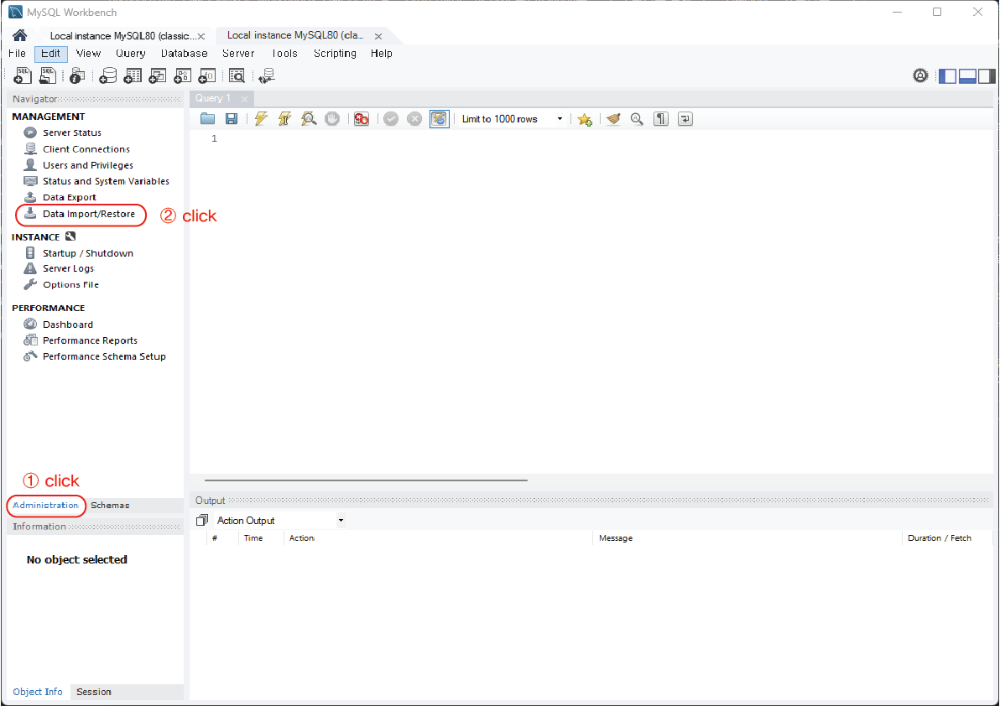
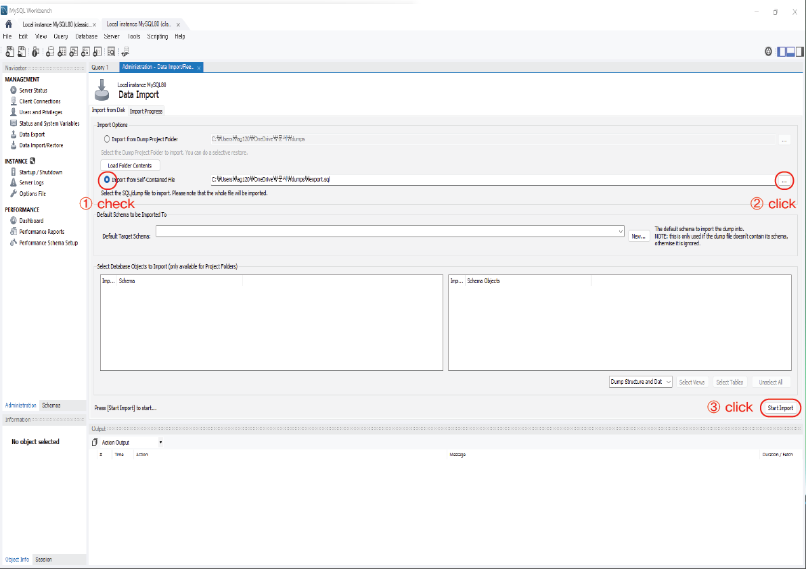
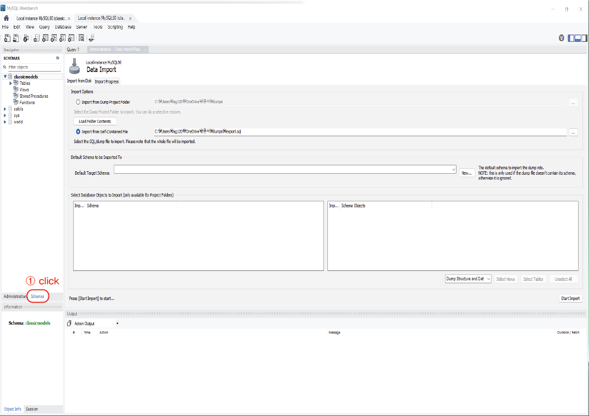
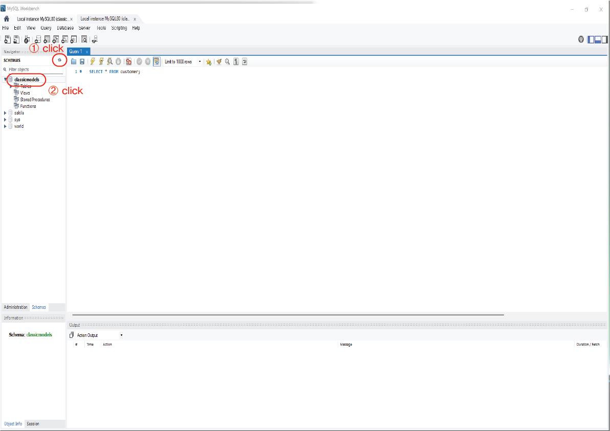

# MySQL_Workbench

## (1) Workbench 정의

> MySQL의 워크벤치는 아래의 이미지와 같이 SQL의 개발과 관리, DB설계, 생성 및 유지를 위한 단일 개발 통합 환경을 제공하는 `비주얼 데이터베이스 설계 도구(GUI Tool)`이다.

(출처 : MySQL)

---

## (2) MySQL_Workbench 설치

[MySQL_다운로드링크](https://dev.mysql.com/downloads/installer/)

```bash
'패스워드' 생성 및 '한글입력설정'
```

---

## (3) Workbench 활용 MySQL DB접속 방법

### **1) MySQL 접속**


### **2) 실습 데이터베이스 넣기**
- 좌측 메뉴탭에서 `Administration` 클릭
  - `Data Import/Restore` 클릭


- `Import from Self - Contained File` 체크
  - 우측 `...` 클릭
  - 다운로드 받은 `sample_db.sql 파일` 선택
  - `Start Import`


- `Import Completed` 확인

### **3) 실습 데이터베이스 확인**
- 좌측 메뉴탭에서 `schema` 클릭
  - `새로고침` 클릭
  - 데이터베이스 `classicmodels` 확인



---

## (4) 실습 데이터베이스에 대한 쿼리(Query)문 작성 및 쿼리문 실행 방법

```bash
쿼리(Query) : 데이터베이스에서 '특정 원하는 정보를 추출'하기 위해 요청하는 과정을 말한다.

ex) 브라우져 검색기능, 온라인 쇼핑몰 가격범위설정, 지도검색 등등
```

### **1) 쿼리문 작성**
- 실습 데이터베이스인 `classicmodels` 더블클릭

- 상단 탭의 `Query(쿼리에디터)` 클릭

- 입력창에 쿼리문 입력
```sql
ex) SELECT * FROM customers;
```

- `번개 아이콘`을 클릭하여 쿼리 실행

- 하단 테이블 뷰어를 통해 출력된 `데이터 확인`하기
