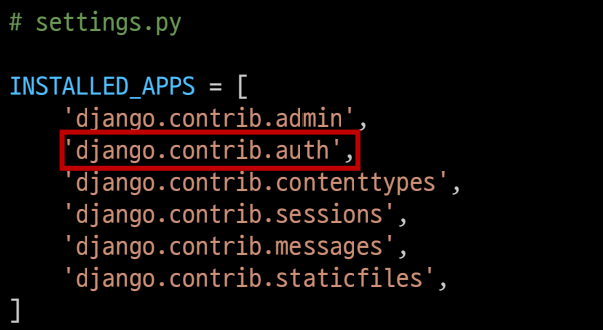
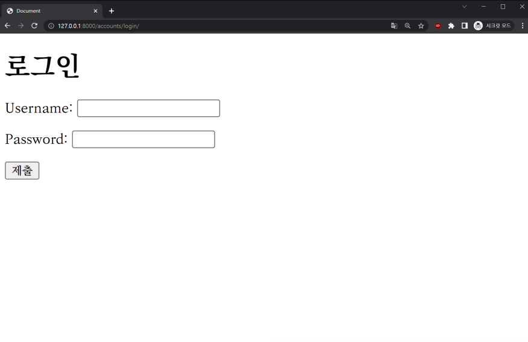
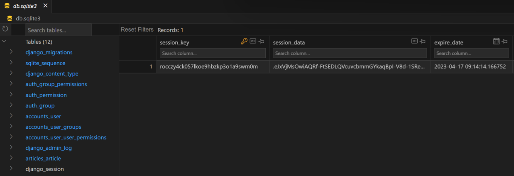
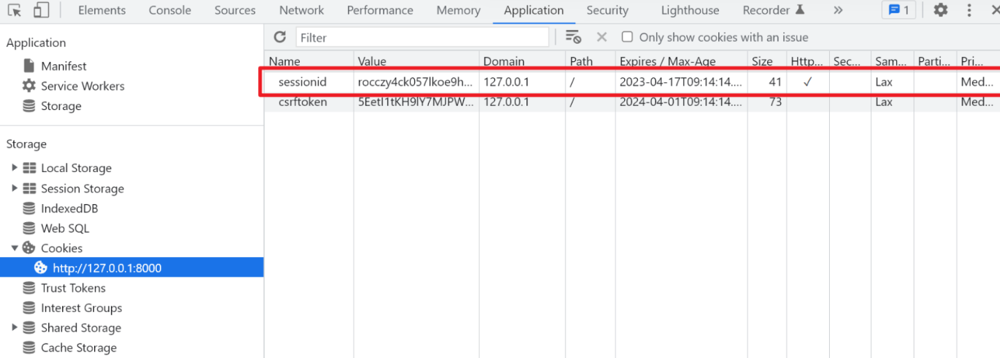
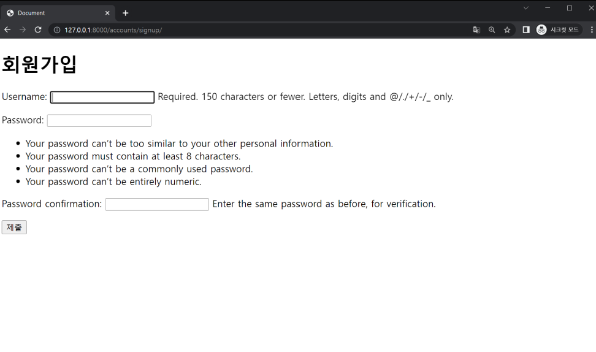
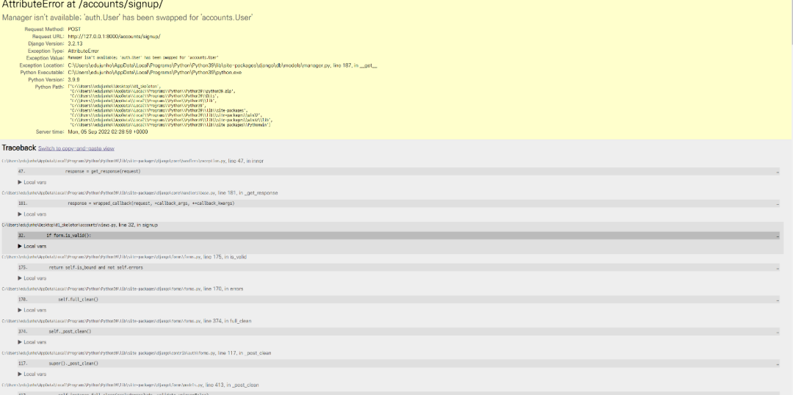
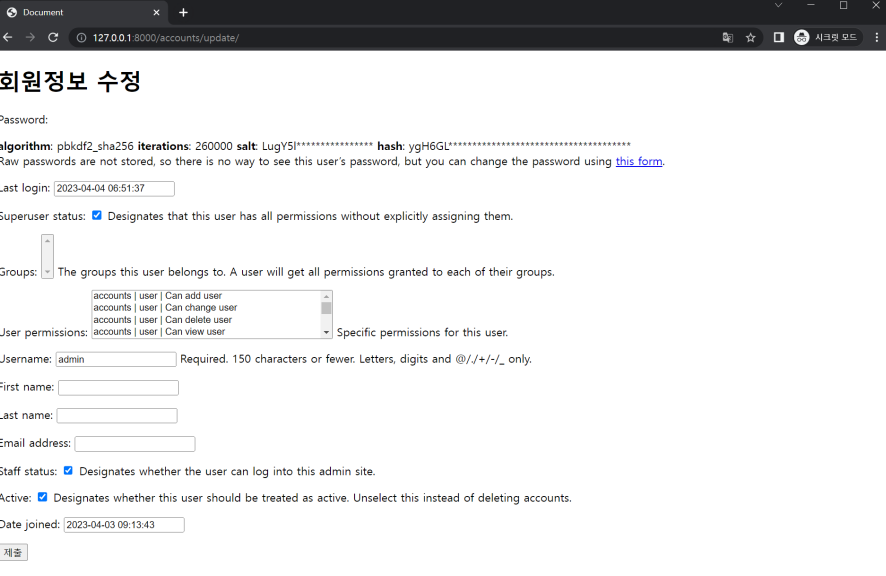
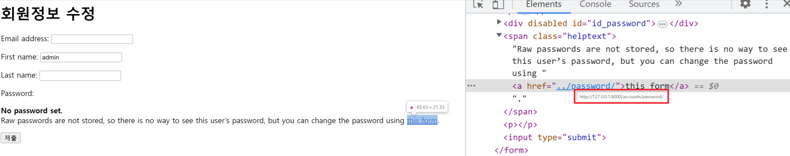
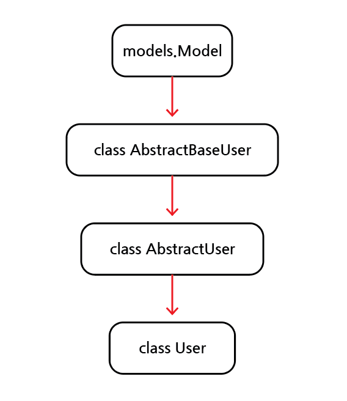

# Authentication

## 목차

1. [Django Authentication System](#1-django-authentication-system)
    1. [Authentication](#1-1-authentication)
    2. [Authorization](#1-2-authorization)
    3. [사전 설정](#1-3-사전-설정)
2. [Custom User model](#2-custom-user-model)
    1. [Custom User model로 대체](#2-1-custom-user-model로-대체)
    2. [상속](#2-2-상속)
    3. [User 모델 지정](#2-3-user-모델-지정)
    4. [admin site에 등록하기](#2-4-admin-site에-등록하기)
        - [주의](#주의)
        - [반드시 User 모델을 대체해야하는가?](#반드시-user-모델을-대체해야하는가)
3. [Login](#3-login)
    1. [AuthenticationForm()](#3-1-authenticationform)
        - [login의 url 설정](#login의-url-설정)
        - [login의 views 함수의 GET method 설정](#login의-views-함수의-get-method-설정)
        - [login의 html 페이지](#login의-html-페이지)
        - [login의 views 함수의 POST method 설정](#login의-views-함수의-post-method-설정)
    2. [login() 함수](#3-2-login-함수)
    3. [get_user() 메서드](#3-3-get_user-메서드)
        - [login시, Session 데이터 확인](#login시-session-데이터-확인)
4. [Logout](#4-logout)
    1. [logout(request)](#4-1-logoutrequest)
        - [logout의 url 설정](#logout의-url-설정)
        - [logout의 views 함수의 설정](#logout의-views-함수의-설정)
        - [logout의 html 페이지](#logout의-html-페이지)
5. [Template with Authentication data](#5-template-with-authentication-data)
    1. [현재 로그인 되어있는 유저정보 출력](#5-1-현재-로그인-되어있는-유저정보-출력)
        - [context processors](#--context-processors)
6. [회원가입](#6-회원가입)
    1. [UserCreationForm()](#6-1-usercreationform)
    2. [회원가입 페이지 만들기](#6-2-회원가입-페이지-만들기)
        - [회원가입 url 설정](#--회원가입-url-설정)
        - [회원가입 GET 요청 시, view 함수 설정](#--회원가입-get-요청-시-view-함수-설정)
        - [회원가입 html 페이지](#--회원가입-html-페이지)
        - [회원가입 POST 요청 시, view 함수 설정](#--회원가입-post-요청-시-view-함수-설정)
        - [회원가입 후 에러](#--회원가입-후-에러)
        - [커스텀 User 모델 사용을 위해 Form 다시 작성](#--커스텀-user-모델-사용을-위해-form-다시-작성)
        - [get_user_model()](#--get_user_model)
        - [User 모델을 직접 참조하지 않는 이유](#--user-모델을-직접-참조하지-않는-이유)
        - [커스텀 Form을 사용하여 회원가입 view 함수 수정](#--커스텀-form을-사용하여-회원가입-view-함수-수정)
7. [회원탈퇴](#7-회원탈퇴)
    1. [회원탈퇴 로직 작성]
        - [회원탈퇴 url 설정](#--회원탈퇴-url-설정)
        - [회원탈퇴 view 함수 작성](#--회원탈퇴-view-함수-작성)
        - [회원탈퇴 html 작성](#--회원탈퇴-html-작성)
8. [회원정보 수정](#8-회원정보-수정)
    1. [UserChangeForm()](#8-1-userchangeform)
    2. [회원정보 수정 페이지 작성](#8-2-회원정보-수정-페이지-작성)
        - [회원정보 수정 url 설정](#--회원정보-수정-url-설정)
        - [회원정보 수정 GET 요청 시, view 함수 설정](#--회원정보-수정-get-요청-시-view-함수-설정)
        - [회원정보 수정 html 페이지](#--회원정보-수정-html-페이지)
        - [UserChangeForm 사용 시, 문제](#--userchangeform-사용-시-문제)
        - [CustomUserChangeForm의 fields 재정의](#--customuserchangeform의-fields-재정의)
        - [회원정보 수정 POST 요청 시, view 함수 설정](#--회원정보-수정-post-요청-시-view-함수-설정)
9. [비밀번호 변경](#9-비밀번호-변경)
    1. [PasswordChangeForm()](#9-1-passwordchangeform)
    2. [비밀번호 변경 페이지 작성](#9-2-비밀번호-변경-페이지-작성)
        - [비밀번호 변경 url 설정](#--비밀번호-변경-url-설정)
        - [비밀번호 변경 GET 요청 시, view 함수 설정](#--비밀번호-변경-get-요청-시-view-함수-설정)
        - [비밀번호 변경 html 페이지](#--비밀번호-변경-html-페이지)
        - [비밀번호 변경 POST 요청 시, view 함수 설정](#--비밀번호-변경-post-요청-시-view-함수-설정)
    3. [비밀번호 변경 시 Session 무효화](#9-3-비밀번호-변경-시-session-무효화)
        - [update_session_auth_hash(request, user)](#--update_session_auth_hashrequest-user)
        - [update_session_auth_hash를 view 함수에 적용](#--update_session_auth_hash를-view-함수에-적용)
10. [로그인 사용자에 대한 접근 제한](#10-로그인-사용자에-대한-접근-제한)
    1. [로그인 사용자에 대한 접근을 제한하는 2가지 방법](#10-1-로그인-사용자에-대한-접근을-제한하는-2가지-방법)
    2. [is_authenticated](#10-2-is_authenticated)
        - [로그인과 비로그인 상태에서 출력되는 링크 다르게 설정](#--로그인과-비로그인-상태에서-출력되는-링크-다르게-설정)
        - [로그인 된 사용자의 경우, 로그인/회원가입 로직을 수행할 수 없도록 처리](#--로그인-된-사용자의-경우-로그인회원가입-로직을-수행할-수-없도록-처리)
    3. [login_required](#10-3-login_required)
        - [인증된 사용자만 게시글 작성/수정/삭제 할 수 있도록 설정](#--인증된-사용자만-게시글-작성수정삭제-할-수-있도록-설정)
        - [인증된 사용자만 로그아웃/회원탈퇴/회원정보 수정/비밀번호 변경 할 수 있도록 설정](#--인증된-사용자만-로그아웃회원탈퇴회원정보-수정비밀번호-변경-할-수-있도록-설정)
11. [참고](#11-참고)
    1. [User 모델 상속 관계](#11-1-user-모델-상속-관계)
        - [AbstractUser class](#--abstractuser-class)
        - [추상 기본 클래스](#--추상-기본-클래스)
    2. [데코레이터(Decorator)](#11-2-데코레이터decorator)
    3. [회원가입 후, 로그인까지 된 상태로 진행하기](#11-3-회원가입-후-로그인까지-된-상태로-진행하기)
    4. [회원탈퇴 시, 유저의 Session 정보도 함께 지우기](#11-4-회원탈퇴-시-유저의-session-정보도-함께-지우기)

<br>
<br>

## 1. Django Authentication System

-   `사용자 인증`과 관련된 기능을 모아 놓은 시스템
-   인증과 권한 부여를 함께 제공 및 처리함

<br>



<setting의 django authentication system>

<br>

### 1-1. Authentication

-   `인증`으로 사용자가 자신이 누구인지 확인하는 것
-   신원 확인

<br>

### 1-2. Authorization

-   인증된 사용자가 수행할 수 있는 작업을 결정
-   `권한`을 부여

<br>

### 1-3. 사전 설정

-   app `accounts` 생성 및 등록
-   auth와 관련한 경로 및 키워드들은 django의 내부적으로 accounts라는 이름으로 사용하고 있기에 accounts로 지정하는 것을 권장함

<br>

```python
# project/urls.py

urlpatterns = [
    ...,
    path('accounts/', include('accounts.urls')),
]
```

```python
# accounts/urls.py

from django.urls import path
from . import views

app_name = 'accounts'
urlpatterns = []
```

<br>
<br>

## 2. Custom User model

### 2-1. Custom User model로 대체

-   django가 기본적으로 제공하는 `User model`은 내장된 auth 모듈의 `User 클래스`를 사용
-   별도 설정없이 사용할 수 있어서 간편하지만, 직접 `수정할 수 없음`
-   [Django - 유저모델 대체하기](https://docs.djangoproject.com/en/3.2/topics/auth/customizing/#substituting-a-custom-user-model)

<br>

### 2-2. 상속

-   `AbstractUser`를 `상속`받는 커스텀 `User 클래스` 작성
-   기존 User 클래스도 AbstractUser를 상속받기 때문에 커스텀 User 클래스도 같은 모습을 가지게 됨

<br>

```python
# accounts/models.py

from django.contrib.auth.models import AbstractUser

class User(AbstractUser):
    pass
```

<br>

### 2-3. User 모델 지정

-   django 프로젝트가 사용하는 기본 User 모델을 커스텀한 User 모델로 지정

<br>

```python
# settings.py

AUTH_USER_MODEL = 'accounts.User'
```

<br>

### 2-4. admin site에 등록하기

-   등록해야만 admin site에 출력됨

<br>

```python
# accounts/admin.py

from django.contrib import admin
from django.contrib.auth.admin import UserAdmin
from .models import User

admin.site.register(User, UserAdmin)
```

<br>

### - 주의

-   프로젝트 중간에 AUTH_USER_MODEL을 변경할 수 없음
-   만약, 진행이 이미 되었다면 데이터 베이스 초기화 한 후 진행해야 함

<br>

### - 반드시 User 모델을 대체해야하는가?

-   Django에서 공식적으로 `커스텀 User 모델을 설정`하는 것을 강력하게 `권장`하고 있음(highly recommended)
-   기본 User 모델과 동일하게 작동하는 동시에 필요 시, 맞춤 설정 가능하기 때문
-   단, 앞선 주의와 같이 User 모델 대체 작업은 프로젝트의 모든 migrations 혹은 첫 migrate 실행 전 수행되어야 함

<br>
<br>

## 3. Login

-   `Session`을 생성하는 과정

<br>

### 3-1. AuthenticationForm()

-   로그인을 위한 built-in form

<br>

### - login의 url 설정

```python
# accounts/urls.py

app_name = 'accounts'
urlpatterns = [
    path('login/', views.login, name='login'),
]
```

<br>

### - login의 views 함수의 GET method 설정

```python
# accounts/views.py

from django.contrib.auth.forms import AuthenticationForm

def login(request):
    if request.method == 'POST':
        pass
    else:
        form = AuthenticationForm()
    context = {
        'form': form,
    }
    return render(request, 'accounts/login.html', context)
```

-   GET method로 login 요청을 받으면 form으로 인증 폼인 AuthenticationForm을 받아 로그인 페이지로 context에 담아 전달

<br>

### - login의 html 페이지

```html
<!-- accounts/login.html -->

<h1>로그인</h1>
<form action="" method="POST">
     {{ form.as_p }}
    <input type="submit" />
</form>
```

<br>



<로그인 페이지>

<br>

### - login의 views 함수의 POST method 설정

```python
# accounts/views.py

from django.shortcuts import render, redirect
from django.contrib.auth import login as auth_login
from django.contrib.auth.forms import AuthenticationForm

def login(request):
    if request.method == 'POST':
        form = AuthenticationForm(request, request.POST)
        # form = AuthenticationForm(request, data=request.POST)
        if form.is_valid():
            auth_login(request, form.get_user())
            return redirect('acticles:index')
    else:
        form = AuthenticationForm()
    context = {
        'form': form,
    }
    return render(request, 'accounts/login.html', context)
```

<br>

### 3-2. login() 함수

```
login(request, user)
```

-   인증된 사용자를 로그인 하는 함수

<br>

### 3-3. get_user() 메서드

-   AuthenticationForm의 인스턴스 메서드
-   유효성 검사를 통과했을 때, 로그인을 한 사용자 객체를 반환함

<br>

### - login시, Session 데이터 확인



-   DB 테이블에서 django로부터 발급받은 Session 확인

<br>



-   브라우저 개발자 도구에서 확인
-   개발자 도구 -> Application -> Cookies

<br>
<br>

## 4. Logout

-   Session을 삭제하는 과정

<br>

### 4-1. logout(request)

-   현재 요청에 대한 Session 데이터를 DB에서 삭제
-   클라이언트 쿠키에서도 session id를 삭제

<br>

### - logout의 url 설정

```python
# accounts/urls.py

urlpatterns = [
    path('logout/', views.logout, name='logout'),
]
```

<br>

### - logout의 views 함수의 설정

```python
# accounts/views.py

from django.contrib.auth import logout as auth_logout

def logout(request):
    auth_logout(request)
    return redirect('articles:index')
```

<br>

### - logout의 html 페이지

```html
<!-- articles/index.html -->

<h1>Articles</h1>
<form action="" method="POST">
    
    <input type="submit" value="Logout" />
</form>
```

<br>
<br>

## 5. Template with Authentication data

-   템플릿에서 인증 관련 데이터를 출력하는 방법

<br>

### 5-1. 현재 로그인 되어있는 유저정보 출력

```html
<!-- articles/index.html -->

<h3>Hello, {{ user }}</h3>
```

<br>

### - context processors

-   템플릿에 렌더링 될 때, 호출 가능한 context 데이터 목록
-   작성된 context 데이터는 기본적으로 템플릿에서 사용 가능한 변수로 포함됨
-   Django에서 자주 사용되는 데이터 목록을 미리 템플릿에 로드해둔 것

```python
# settings.py

TEMPLATES = [
    {
        ...
        'OPTIONS': {
            'context_processors': [
                'django.template.context_processors.debug',
                'django.template.context_processors.request',
                'django.contrib.auth.context_processors.auth',
                'django.contrib.messages.context_processors.messages',
            ],
        },
    },
]
```

<br>
<br>

## 6. 회원가입

-   User 객체를 생성하는 것

<br>

### 6-1. UserCreationForm()

-   회원가입을 위한 built-in ModelForm

<br>

### 6-2. 회원가입 페이지 만들기

### - 회원가입 url 설정

```python
# accounts/urls.py

app_name='accounts'
urlpatterns = [
    ...,
    path('signup/', views.signup, name='signup'),
]
```

<br>

### - 회원가입 GET 요청 시, view 함수 설정

```python
# accounts/views.py

from django.contrib.auth.forms import UserCreationForm

def signup(request):
    if request.method == 'POST':
        pass
    else:
        form = UserCreationForm()
    context = {
        'form': form,
    }
    return render(request, 'accounts/signup.html', context)
```

<br>

### - 회원가입 html 페이지

```html
<!-- accounts/signup.html -->

<h1>회원가입</h1>
<form action="" method="POST">
     {{ form.as_p }}
    <input type="submit" />
</form>
```

<br>



<회원가입 페이지>

<br>

### - 회원가입 POST 요청 시, view 함수 설정

```python
# accounts/views.py

from django.contrib.auth.forms import UserCreationForm

def signup(request):
    if request.method == 'POST':
        form = UserCreationForm(request.POST)
        if form.is_valid():
            form.save()
            return redirect('articles:index')
    else:
        form = UserCreationForm()
    context = {
        'form': form,
    }
    return render(request, 'accounts/signup.html', context)
```

<br>

### - 회원가입 후 에러



<회원가입 후 에러 발생>

-   회원가입에서 사용하는 `UserCreationForm()`이 커스텀 User 모델이 아닌 `기본 유저 모델`로 인해 작성된 클래스이기 때문

<br>

### - 커스텀 User 모델 사용을 위해 Form 다시 작성

-   `UserCreationForm()`, `UserChangeForm()` : 두 개의 form 모두 기본 유저 모델을 사용
-   회원가입 및 회원정보 수정을 위해 커스텀 User 모델과 같이 `커스텀 Form`을 작성해 주어야 함

```python
# accounts/forms.py

from django.contrib.auth import get_user_model
from django.contrib.auth.forms import UserCreationForm, UserChangeForm

class CustomUserCreationForm(UserCreationForm):
    class Meta(UserCreationForm.Meta):
        model = get_user_model()

class CustomUserChangeForm(UserChangeForm):
    class Meta(UserChangeForm.Meta):
        model = get_user_model()
```

<br>

### - get_user_model()

-   현재 프로젝트에서 `활성화된 사용자 모델(Active User Model)`을 반환하는 함수

<br>

### - User 모델을 직접 참조하지 않는 이유

-   get_user_model()을 사용하면 커스텀 User 모델을 자동으로 반환(간편함)
-   Django에서 공식적으로 User 클래스 직접 참조보다 get_user_model()을 통해 참조해야 함을 강조

<br>

### - 커스텀 Form을 사용하여 회원가입 view 함수 수정

```python
# accounts/views.py

from .forms import CustomUserCreationForm

def signup(request):
    if request.method == 'POST':
        form = CustomUserCreationForm(request.POST)
        if form.is_valid():
            form.save()
            return redirect('articles:index')
    else:
        form = CustomUserCreationForm()
    context = {
        'form': form,
    }
    return render(request, 'accounts/signup.html', context)
```

<br>
<br>

## 7. 회원탈퇴

-   User 객체를 삭제하는 것

<br>

### 7-1. 회원탈퇴 로직 작성

### - 회원탈퇴 url 설정

```python
# accounts/urls.py

app_name = 'accounts'
urlpatterns = [
    ...,
    path('delete/', views.delete, name='delete'),
]
```

<br>

### - 회원탈퇴 view 함수 작성

```python
# accounts/views.py

def delete(request):
    request.user.delete()
    return redirect('articles:index')
```

<br>

### - 회원탈퇴 html 작성

```html
<!-- accounts/index.html -->

<form action="" method="POST">
    
    <input type="submit" value="회원탈퇴" />
</form>
```

<br>
<br>

## 8. 회원정보 수정

-   User 객체를 수정하는 것

<br>

### 8-1. UserChangeForm()

-   회원정보 수정을 위한 built-in ModelForm

<br>

### 8-2. 회원정보 수정 페이지 작성

### - 회원정보 수정 url 설정

```python
# accounts/url.py

app_name = 'accounts'
urlpatterns = [
    ...,
    path('update/', views.update, name='update'),
]
```

<br>

### - 회원정보 수정 GET 요청 시, view 함수 설정

```python
# accounts/views.py

from .forms import CustomUserChangeForm

def update(request):
    if request.method == 'POST':
        pass
    else:
        form = CustomUserChangeForm(instance=request.user)
    context = {
        'form': form,
    }
    return render(request, 'accounts/update.html', context)
```

<br>

### - 회원정보 수정 html 페이지

```html
<!-- accounts/update.html -->

<h1>회원정보 수정</h1>
<form action="" method="POST">
     {{ form.as_p }}
    <input type="submit" />
</form>
```

<br>



<회원정보 수정 페이지>

<br>

### - UserChangeForm 사용 시, 문제

-   일반 유저가 접근해서는 안 될 `모든 정보들(fields)`까지 수정이 가능해짐
-   따라서 `CustomUserChangeForm`을 통해 `접근 가능한 필드들만` 받을 수 있게 조정해야 함

<br>

### - CustomUserChangeForm의 fields 재정의

```python
# accounts/forms.py

class CustomUserChangeForm(UserChangeForm):
    class Meta(UserChangeForm.Meta):
        model = get_user_model()
        fields = ('email', 'first_name', 'last_name')
```

-   User Model의 필드만 수정할 수 있도록 명시

<br>

### - 회원정보 수정 POST 요청 시, view 함수 설정

```python
# accounts/views.py

from .forms import CustomUserChangeForm

def update(request):
    if request.method == 'POST':
        form = CustomUserChangeForm(request.POST, instance=request.user)
        # form = CustomUserChangeForm(data=request.POST, instance=request.user)
        if form.is_valid():
            form.save()
            return redirect('articles:index')
    else:
        form = CustomUserChangeForm(instance=request.user)
    context = {
        'form': form,
    }
    return render(request, 'accounts/update.html', context)
```

<br>
<br>

## 9. 비밀번호 변경

- Django에서는 비밀번호 변경 페이지를 회원정보 수정 form에서 별도의 주소로 제공하고 있음



<기본 제공되는 비밀번호 변경 페이지>

<br>

### 9-1. PasswordChangeForm()

- 비밀번호 변경을 위한 built-in Form

<br>

### 9-2. 비밀번호 변경 페이지 작성

### - 비밀번호 변경 url 설정

```python
# accounts/urls.py

app_name = 'accounts'
urlpatterns = [
    ...,
    path('password/', views.change_password, name='change_password'),
]
```

<br>

### - 비밀번호 변경 GET 요청 시, view 함수 설정

```python
# accounts/views.py

from django.contrib.auth.forms import PasswordChangeForm

def change_password(request):
    if request.method == 'POST':
        pass
    else:
        form = PasswordChangeForm(request.user)
    context = {
        'form': form,
    }
    return render(request, 'accounts/change_password.html', context)
```

<br>

### - 비밀번호 변경 html 페이지

```html
<!--accounts/change_password.html-->

<h1>비밀번호 변경</h1>
<form action="" method="POST">
    
    {{ form.as_p }}
    <input type="submit">
</form>
```

<br>

### - 비밀번호 변경 POST 요청 시, view 함수 설정

```python
# accounts/views.py

def change_password(request):
    if request.method == 'POST':
        form = PasswordChangeForm(request.user, request.POST)
        # form = PasswordChangeForm(user=request.user, data=request.POST)
        if form.is_valid():
            form.save()
            return redirect('articles:index')
    else:
        form = PasswordChangeForm(request.user)
    context = {
        'form': form,
    }
    return render(request, 'accounts/change_password.html', context)
```

<br>

### 9-3. 비밀번호 변경 시 Session 무효화

- 비밀번호가 변경될 경우, `기존의 Session`과 `회원 인증 정보`가 일치하지 않아 `로그인 상태가 유지가 안됨`

<br>

### - update_session_auth_hash(request, user)

- 비밀번호 변경 시, `Session이 무효화 되는 것을 방지`
- 비밀번호 변경되어도 로그아웃 되지 않도록 `새로운 비밀번호의 Session 데이터`로 기존의 Session을 `업데이트` 함

<br>

### - update_session_auth_hash를 view 함수에 적용

```python
# accounts/views.py

from django.contrib.auth import update_session_auth_hash

def change_password(request):
    if request.method == 'POST':
        form = PasswordChangeForm(request.user, request.POST)
        # form = PasswordChangeForm(user=request.user, data=request.POST)
        if form.is_valid():
            form.save()
            update_session_auth_hash(request, user)
            return redirect('articles:index')
    else:
        form = PasswordChangeForm(request.user)
    context = {
        'form': form,
    }
    return render(request, 'accounts/change_password.html', context)
```

- index 페이지로 리다이렉트 되기 전, Session 업데이트

<br>
<br>

## 10. 로그인 사용자에 대한 접근 제한

### 10-1. 로그인 사용자에 대한 접근을 제한하는 2가지 방법

- `is_authenticated` : 속성
- `login_required` : 데코레이터

<br>

### 10-2. is_authenticated

- 사용자가 인증되었는지 여부를 알 수 있는 User model의 속성(attribute)
- 모든 `User 인스턴스`에 대해 항상 `True`인 읽기 전용 속성이며, `AnonymousUser`에 대해서는 항상 `False`임
- 권한과 관련없고, Session도 확인하지 않고 `로그인 유무`만 판단

<br>

### - 로그인과 비로그인 상태에서 출력되는 링크 다르게 설정

```html
<!--articles/index.html-->


    <h3>hello {{ user }}</h3>
    <form action="" method="POST">
        
        <input type="submit" value="logout">
    </form>
    <form action="" method="POST">
        
        <input type="submit" value="회원탈퇴">
    </form>
    <a href="">회원정보 수정</a>

    <a href="">로그인</a>
    <a href="">회원가입</a>

```

- DTL(Django Template Language)의 태그 `if 구문`으로 로그인 유무를 분기 처리함
- `로그인 된` 사용자의 경우, `로그아웃`, `회원탈퇴`, `회원정보 수정` 링크를 보여줌
- `로그인 안 된` 사용자의 경우, `로그인`, `회원가입`의 링크를 보여줌

<br>

### - 로그인 된 사용자의 경우, 로그인/회원가입 로직을 수행할 수 없도록 처리

```python
# accounts/views.py

def login(request):
    if request.user.is_authenticated:
        return redirect('articles:index')
    ...

def signup(request):
    if request.user.is_authenticated:
        return redirect('articles:index')
    ...
```

<br>

### 10-3. login_required

- 인증된 사용자에 대해서만 view 함수를 실행시키는 데코레이터
- 로그인 하지 않은 사용자의 경우, `/accounts/login/` 주소로 리다이렉트 시킴

<br>

### - 인증된 사용자만 게시글 작성/수정/삭제 할 수 있도록 설정

```python
# acticles/views.py

from django.contrib.auth.decorators import login_required

@login_required
def create(request):
    pass

@login_required
def delete(request):
    pass

@login_required
def update(request):
    pass
```

- 해당 view 함수 위에 데코레이터 `@login_required` 붙이기

<br>

### - 인증된 사용자만 로그아웃/회원탈퇴/회원정보 수정/비밀번호 변경 할 수 있도록 설정

```python
# accounts/views.py

from django.contrib.auth.decorators import login_required

@login_required
def logout(request):
    pass

@login_required
def delete(request):
    pass

@login_required
def update(request):
    pass

@login_required
def change_password(request):
    pass
```

- 해당 view 함수 위에 데코레이터 `@login_required` 붙이기

<br>
<br>

## 11. 참고

### 11-1. User 모델 상속 관계

<p align=center>
    
</p>

-   Django User 모델 상속은 다음과 같은 순서로 이루어짐

<br>

### - AbstractUser class

-   관리자 권한과 함께 완전한 기능을 가지고 있는 User model을 구현하는 `추상 기본 클래스`

<br>

### - 추상 기본 클래스

-   몇 가지 공통 정보를 여러 다른 모델에 넣을 때 사용하는 클래스
-   데이터 베이스 테이블을 만드는데 사용되지 않으며, 대신 다른 모델의 기본 클래스로 사용되는 경우, 해당 필드가 하위 클래스의 필드에 추가됨

<br>

### 11-2. 데코레이터(Decorator)

- 기존에 작성된 함수에 기능을 추가하고 싶을 경우, 해당 함수를 수정하지 않고 `기능만 추가해주는 함수`

<br>

### 11-3. 회원가입 후, 로그인까지 된 상태로 진행하기

```python
# accounts/views.py

def signup(request):
    if request.method == 'POST':
        form = CustomUserCreationForm(request.POST)
        if form.is_valid():
            user = form.save()
            auth_login(request, user)
            return redirect('articles:index')
    else:
        ...
```

- form을 저장한 후, `auth_login()`을 통해 로그인 수행하고 index 페이지로 리다이렉트 시킴

<br>

### 11-4. 회원탈퇴 시, 유저의 Session 정보도 함께 지우기

```python
# accounts/views.py

def delete(request):
    request.user.delete()
    auth_logout(request)
```

- `탈퇴(delete()) -> 로그아웃(auth_logout())`의 순서를 지켜야 함
- 로그아웃을 먼저 하면 요청하는 유저의 객체정보가 없어져서 어떤 유저를 탈퇴시켜야하는지 모르기 때문