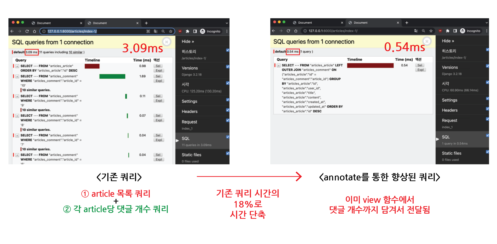
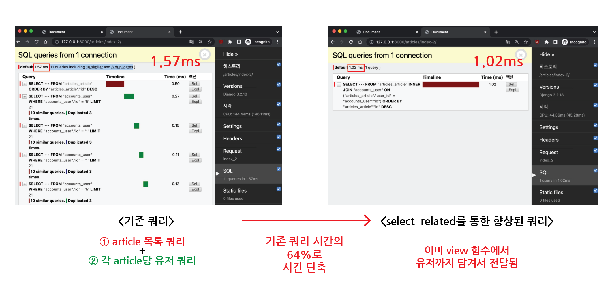
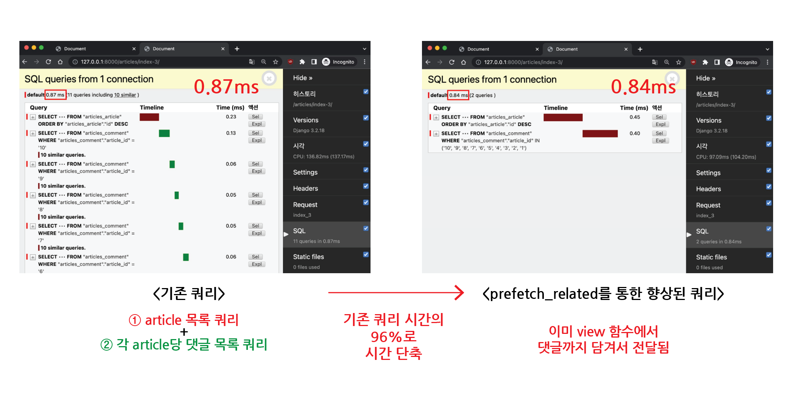
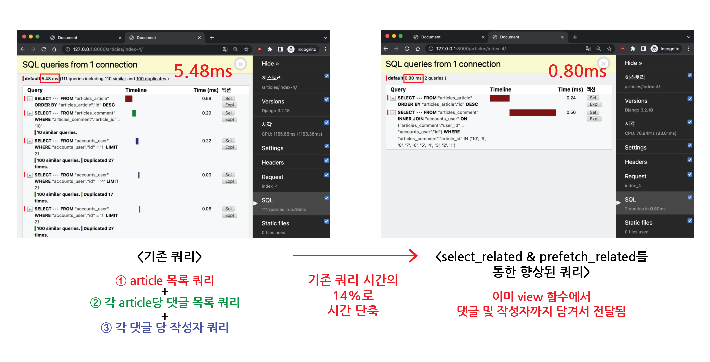

# Query 향상시키기

## 목차

1. [Improve Query](#1-improve-query)
2. [annotate](#2-annotate)
    1. [annotate 예시](#2-1-annotate-예시)
        - [게시글 목록 조회 시, 댓글 개수도 출력하는 경우](#--게시글-목록-조회-시-댓글-개수도-출력하는-경우)
        - [view 함수에서 annotate 사용](#--view-함수에서-annotate-사용)
3. [select_related](#3-select_related)
    1. [select_related 예시](#3-1-select_related-예시)
        - [게시글 목록 조회 시, 게시글 작성 유저 이름도 출력하는 경우](#--게시글-목록-조회-시-게시글-작성-유저-이름도-출력하는-경우)
        - [view 함수에서 select_related 사용](#--view-함수에서-select_related-사용)
4. [prefetch_related](#4-prefetch_related)
    1. [prefetch_related 예시](#4-1-prefetch_related-예시)
        - [게시글 목록 조회 시, 댓글 목록도 출력하는 경우](#--게시글-목록-조회-시-댓글-목록도-출력하는-경우)
        - [view 함수에서 prefetch_related 사용](#--view-함수에서-prefetch_related-사용)
5. [selected_related & prefetch_related](#5-selected_related--prefetch_related)
    1. [selected_related & prefetch_related 예시](#5-1-selected_related--prefetch_related-예시)
        - [게시글 목록 조회 시, 댓글 목록과 각 댓글 작성자도 출력하는 경우](#--게시글-목록-조회-시-댓글-목록과-각-댓글-작성자도-출력하는-경우)
        - [view 함수에서 select_related & prefetch_related 사용](#--view-함수에서-select_related--prefetch_related-사용)

<br>
<br>

## 1. Improve Query

- 같은 결과에 대한 `쿼리 개수를 줄여서` 조회하기 (최적화 조회)
- 최적화를 위해 고민하는 것은 도움이 되나 오히려 섣부른 최적화는 큰 도움이 안 될 수 있기에 `무조건 최적화를 진행하는 것은 지양함`

<br>
<br>

## 2. annotate

- SQL의 `GROUP BY` 절을 활용함

<br>

### 2-1. annotate 예시

### - 게시글 목록 조회 시, 댓글 개수도 출력하는 경우

- index 페이지에서 게시글 목록과 각 게시글에 대한 댓글 개수를 함께 출력하는 상황에서 페이지 출력을 최적화 할 수 있음
- 기존에는 각 게시글 별 댓글 개수를 `반복 평가`했었음

```html
<!--articles/index.html-->


    ...
    <p>댓글 개수 : {{ article.comment_set.all }}</p>

```

<br>

### - view 함수에서 annotate 사용

- annotate를 사용하여 첫 조회 시, 댓글의 개수까지 한 번에 context에 담아서 전달

```python
# articles/views.py

def index(request):
    # articles = Article.objects.order_by('-pk')
    articles = Article.objects.annotate(Count('comment')).order_by('-pk')
    context = {
        'articles': articles,
    }
    return render(request, 'articles/index.html', context)
```

```html
<!--articles/index.html-->


    ...
    <p>댓글 개수 : {{ article.comment__count }}</p>

```

- 이를 통해 게시글 목록 당 댓글 개수만큼 쿼리했던 것을 `1 query`로 줄임

<br>



<annotate로 향상된 Query>

<br>
<br>

## 3. select_related

- 1:1 또는 N:1 `정참조 관계`에서 사용
- SQL의 `INNER JOIN` 절을 활용

<br>

### 3-1. select_related 예시

### - 게시글 목록 조회 시, 게시글 작성 유저 이름도 출력하는 경우

- index 페이지에서 게시글 목록과 각 게시글에 작성 유저 이름을 함께 출력하는 상황에서 페이지 출력을 최적화 할 수 있음
- 기존에는 각 게시글 출력 후, 작성 유저 이름을 `반복 평가`했었음

```html
<!--articles/index.html-->


    <p>작성자 : {{ article.user.username }}</p>
    <p>제목 : {{ article.title }}</p>

```

<br>

### - view 함수에서 select_related 사용

- select_related를 사용하여 article 조회 시, user까지 한 번에 context에 담아서 전달

```python
# articles/views.py

def index(request):
    # articles = Article.objects.order_by('-pk')
    articles = Article.objects.select_related('user').order_by('-pk')
    context = {
        'articles': articles,
    }
    return render(request, 'articles/index.html', context)
```

- 이를 통해 게시글 목록 당 유저만큼 쿼리했던 것을 `1 query`로 줄임

<br>



<select_related로 향상된 Query>

<br>
<br>

## 4. prefetch_related

- M:N 또는 N:1 `역참조 관계`에서 사용
- SQL이 아닌 Python을 사용한 `JOIN`이 진행됨

<br>

### 4-1. prefetch_related 예시

### - 게시글 목록 조회 시, 댓글 목록도 출력하는 경우

- index 페이지에서 게시글 목록과 각 게시글의 댓글 목록을 함께 출력하는 상황에서 페이지 출력을 최적화 할 수 있음
- 기존에는 각 게시글 출력 후, 댓글 목록을 `반복 평가`했었음

```html
<!--articles/index.html-->


    <p>제목 : {{ article.title }}</p>
    <p>댓글 목록</p>
    
        <p>{{ comment.content }}</p>
    
    <hr>

```

<br>

### - view 함수에서 prefetch_related 사용

- prefetch_related를 사용하여 article 조회 시, comment까지 한 번에 context에 담아서 전달

```python
# articles/views.py

def index(request):
    # articles = Article.objects.order_by('-pk')
    articles = Article.objects.prefetch_related('comment_set').order_by('-pk')
    context = {
        'articles': articles,
    }
    return render(request, 'articles/index.html', context)
```

- 이를 통해 게시글 목록 당 댓글 개수 만큼 쿼리했던 것을 `2 query`로 줄임

<br>



<prefetch_related로 향상된 Query>

<br>
<br>

## 5. selected_related & prefetch_related

### 5-1. selected_related & prefetch_related 예시

### - 게시글 목록 조회 시, 댓글 목록과 각 댓글 작성자도 출력하는 경우

```html
<!--articles/index.html-->


    <p>제목 : {{ article.title }}</p>
    <p>댓글 목록</p>
    
        <p>{{ comment.user.username }} : {{ comment.content }}</p>
    
    <hr>

```

<br>

### - view 함수에서 select_related & prefetch_related 사용

```python
# articles/views.py

def index(request):
    # articles = Article.objects.order_by('-pk')
    # articles = Article.objects.prefetch_related('comment_set').order_by('-pk')
    articles = Article.objects.prefetch_related(
        Prefetch('comment_set', queryset=Comment.objects.select_related('user'))
    ).order_by('-pk')
    context = {
        'articles': articles,
    }
    return render(request, 'articles/index.html', context)
```

- 이를 통해 게시글 목록 당 댓글 개수, 작성자 만큼 쿼리했던 것을 `2 query`로 줄임

<br>



<select_related & prefetch_related로 향상된 Query>