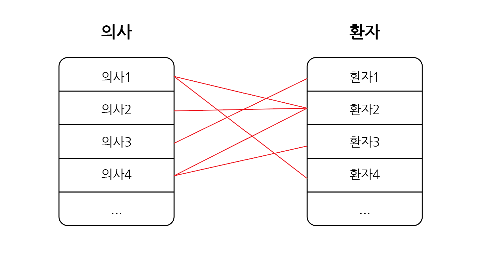
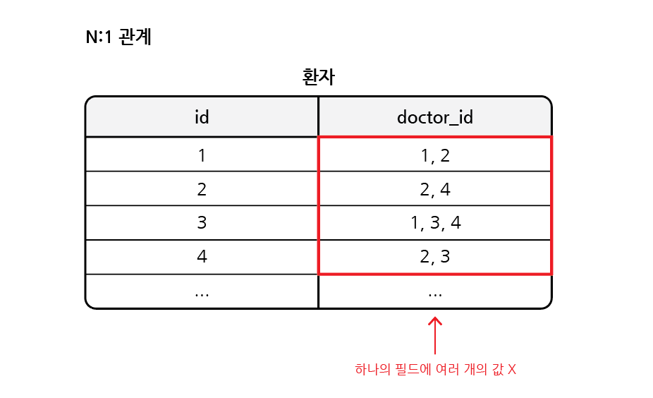
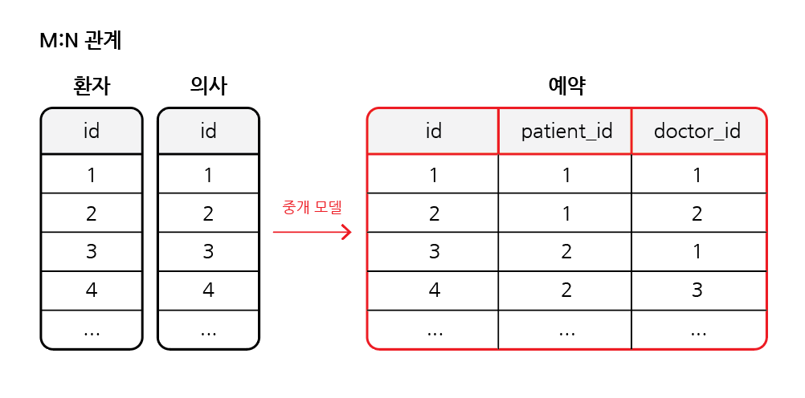
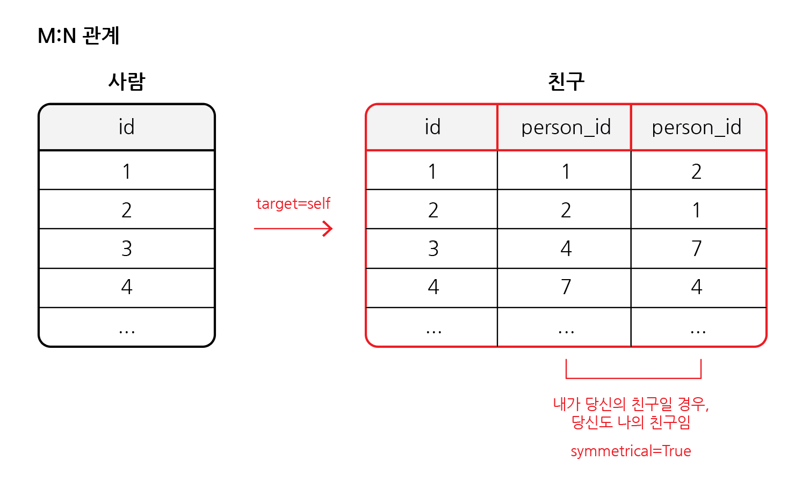
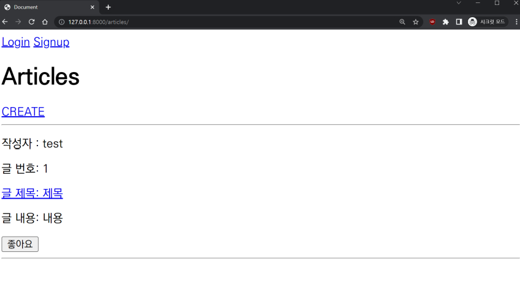

# M:N 관계 (Like 기능)

## 목차

1. [N:1 관계의 한계](#1-n1-관계의-한계)
    1. [N:1 관계 사용 시, 문제점](#1-1-n1-관계-사용-시-문제점)
    2. [M:N 관계 - 중개 모델](#1-2-mn-관계---중개-모델)
2. [ManyToManyField](#2-manytomanyfield)
    1. [ManyToManyField의 Arguments](#2-1-manytomanyfield의-arguments)
        - [related_name](#--related_name)
        - [through](#--through)
        - [symmetrical](#--symmetrical)
3. [Article & User](#3-article--user)
    1. [Many to many relationships](#3-1-many-to-many-relationships)
    2. [게시글 좋아요 기능](#3-2-게시글-좋아요-기능)
        - [모델 관계 설정](#--모델-관계-설정)
        - [related_name 작성](#--related_name-작성)
        - [User와 Article간 사용 가능한 related manager 정리](#--user와-article간-사용-가능한-related-manager-정리)
        - [좋아요 기능 url 설정](#--좋아요-기능-url-설정)
        - [좋아요 기능 view 함수 작성](#--좋아요-기능-view-함수-작성)
        - [템플릿의 각 게시글에 좋아요 버튼 출력](#--템플릿의-각-게시글에-좋아요-버튼-출력)
4. [참고](#4-참고)
    1. [.exists()](#4-1-exists)

<br>
<br>

## 1. N:1 관계의 한계



- 환자와 의사의 관계를 예시로 들면, `한 명의 의사`는 `여러 환자`를 관리할 수 있으며, `한 명의 환자`는 `여러 의사`에게 검진을 받을 수 있음
- 만약 N:1의 관계라면, 동일한 환자이지만 다른 의사에게 예약하기 위해서는 또 다른 객체를 추가로 만들어 예약을 해야함
- 따라서 `예약 테이블(중개 모델)`을 따로 만들어 관리할 수 있음

<br>

### 1-1. N:1 관계 사용 시, 문제점



- 위의 경우, 환자 테이블에서 의사 id를 외래키로 참조할 때, 환자 1명에 N명의 의사가 참조될 수 있음
- 하지만 하나의 필드에 값은 하나가 저장될 수 있으므로 동일한 환자 객체를 더 만들어야 함

<br>

### 1-2. M:N 관계 - 중개 모델



- 위와 같이, 환자 테이블, 의사 테이블과 별도의 예약 테이블이 있다면 문제가 해결될 수 있음
- 예약 모델은 의사와 환자에 각각 N:1의 관계를 가짐
- M:N 관계로 맺어진 기존의 두 테이블에는 변화가 없음

<br>
<br>

## 2. ManyToManyField

```python
ManyToManyField(to, **options)
```

- many-to-many 관계 설정 시 사용하는 모델 필드
- related manager를 사용하여 관련 객체를 추가, 제거, 생성 가능
- ex) `add()`, `remove()`, `create()`, `clear()`, ...

<br>

### 2-1. ManyToManyField의 Arguments

### - related_name

- 역참조 시, 사용하는 manager name을 변경

```python
# models.py

class Patient(models.Model):
    doctor = models.ManyToManyField(Doctor, related_name='patients')
    name = models.TextField()
```

```python
# views.py 또는 html 파일

# 변경 전
doctor.patient_set.all()

# 변경 후
doctor.patients.all()
```

<br>

### - through

- `중개 테이블`을 `직접 작성`하는 경우, through 옵션 사용하여 중개 테이블을 나타내는 Django 모델을 지정
- 일반적으로 중개 테이블에 추가 데이터를 사용하는 다대다 관계와 연결하려는 경우에 사용됨

<br>

### - symmetrical

- ManyToManyField가 동일한 모델을 가리키는 정의(self)에서만 사용
- 기본 값 : True



```python
# models.py

class Person(models.Model):
    friends = models.ManyToManyField('self')
    # friends = models.ManyToManyField('self' symmetrical=False)
```

- True일 경우
  - `_set` 매니저를 추가하지 않음
  - `내가 당신의 친구일 경우, 당신도 내 친구가 됨`
- False일 경우
  - 대칭을 원하지 않음
  - `나는 당신을 친구로 생각하지만, 당신은 나를 친구로 생각 안 함`

<br>
<br>

## 3. Article & User

### 3-1. Many to many relationships

- 한 테이블의 0개 이상의 레코드가 다른 테이블의 0개 이상의 레코드와 관련
- 양쪽에서 모두 N:1의 관계를 가짐

| Article | User |
|:-------:|:----:|
|    M    |  N   |

- 0개 이상의 게시글은 0명 이상의 회원과 관련됨
- 게시글은 회원으로부터 0개 이상의 좋아요를 받을 수 있음
- 회원은 0개 이상의 게시글에 좋아요 누를 수 있음

<br>

### 3-2. 게시글 좋아요 기능

### - 모델 관계 설정

```python
# articles/models.py

class Article(models.Model):
    user = models.ForeignKey(settings.AUTH_USER_MODEL, on_delete=models.CASCADE)
    like_users = models.ManyToManyField(settings.AUTH_USER_MODEL)
    title = models.CharField(max_length=10)
    content = models.TextField()
    created_at = models.DateTimeField(auto_now_add=True)
    updated_at = models.DateTimeField(auto_now=True)
```

- `like_users` 필드 생성 시, 자동으로 역참조에는 `.article_set` 매니저가 생성됨
- 하지만, 이미 외래키(user 필드)에서 해당 매니저를 사용하고 있음
  - `user.article_set.all()` : 해당 유저가 작성한 모든 게시글
- 따라서 user와 관계된 ForeignKey 또는 ManyToManyField 중 하나에서 related_name을 작성해야함

<br>

### - related_name 작성

```python
# articles/models.py

class Article(models.Model):
  user = models.ForeignKey(settings.AUTH_USER_MODEL, on_delete=models.CASCADE)
  like_users = models.ManyToManyField(settings.AUTH_USER_MODEL, related_name='like_articles')
  title = models.CharField(max_length=10)
  content = models.TextField()
  created_at = models.DateTimeField(auto_now_add=True)
  updated_at = models.DateTimeField(auto_now=True)
```

<br>

### - User와 Article간 사용 가능한 related manager 정리

- `article.user` : 해당 게시글을 작성한 유저 (N:1)
- `user.article_set` : 유저가 작성한 게시글 역참조 (N:1)
- `article.like_users` : 해당 게시글을 좋아요한 유저들 (M:N)
- `user.like_articles` : 유저가 좋아요한 게시글 역참조 (M:N)

<br>

### - 좋아요 기능 url 설정

```python
# articles/urls.py

urlpatterns = [
  ...,
  path('<int:article_pk>/likes/', views.likes, name='likes')
]
```

<br>

### - 좋아요 기능 view 함수 작성

```python
# articles/views.py

@login_required
def likes(request, article_pk):
    article = Article.objects.get(pk=article_pk)
    if request.user in article.like_users.all():
        article.like_users.remove(request.user)
    else:
        article.like_users.add(request.user)
    return redirect('articles:index')
```

- 게시글을 좋아하는 사람 목록에 요청한 유저가 있으면, 해당 목록에서 삭제하고, 없으면 추가하고 index 페이지로 리다이렉트 시킴

<br>

### - 템플릿의 각 게시글에 좋아요 버튼 출력

```html
<!--articles/index.html-->


    <form action="" method="POST">
      
      
        <input type="submit" value="좋아요 취소">
      
        <input type="submit" value="좋아요">
      
    </form>

```

<br>



<게시글 좋아요 버튼>

<br>
<br>

## 4. 참고

### 4-1. .exists()

- QuerySet에 결과가 포함되어 있으면 True 반환, 그렇지 않을 경우, False 반환
- 큰 QuerySet에 있는 특정 개체의 존재와 관련된 검색에 유용

```python
# articles/views.py

# 변경 전
@login_required
def likes(request, article_pk):
  article = Article.objects.get(pk=article_pk)
  if request.user in article.like_users.all():
    article.like_users.remove(request.user)
  else:
    article.like_users.add(request.user)
  return redirect('articles:index')


# 변경 후
@login_required
def likes(request, article_pk):
  article = Article.objects.get(pk=article_pk)
  if article.like_users.filter(pk=request.user.pk).exists():
    article.like_users.remove(request.user)
  else:
    article.like_users.add(request.user)
  return redirect('articles:index')
```