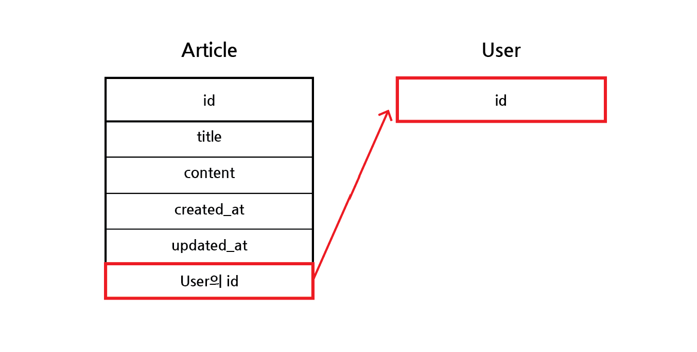
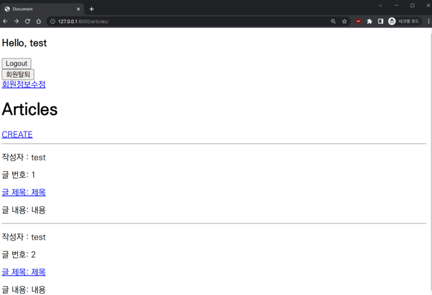
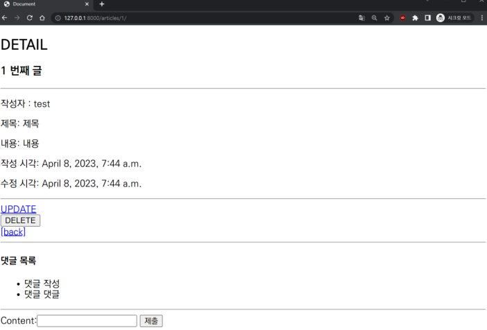
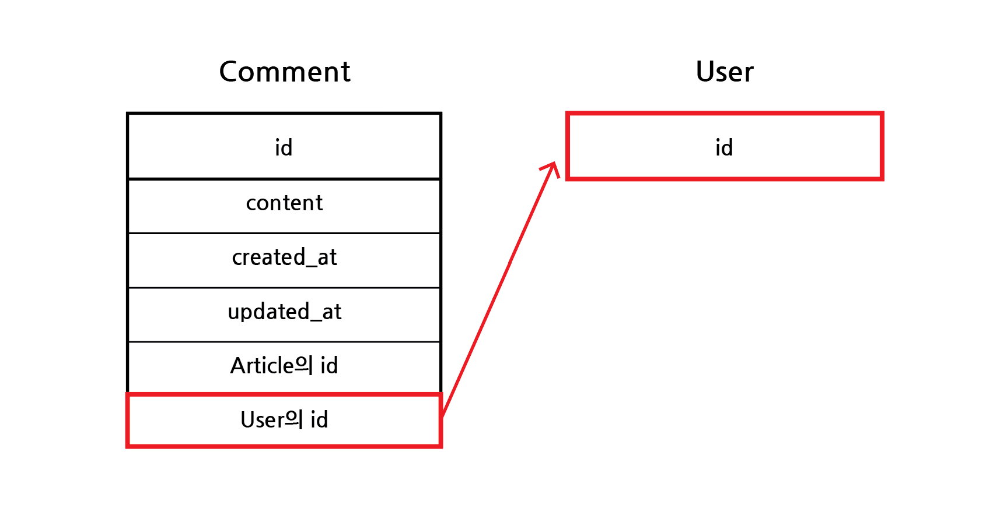

# N:1 관계 (Comment & Article & User)

## 목차

1. [Comment & Article & User](#1-comment--article--user)
    1. [Article & User 관계](#1-1-article--user-관계)
    2. [Comment & User 관계](#1-2-comment--user-관계)
2. [Article & User](#2-article--user)
    1. [Article에서 User 외래키 정의](#2-1-article에서-user-외래키-정의)
        - [Article 모델에 user 외래키 삽입](#--article-모델에-user-외래키-삽입)
        - [User 모델을 참조하는 방법](#--user-모델을-참조하는-방법)
        - [get_user_model()](#--get_user_model)
        - [settings.AUTH_USER_MODEL](#--settingsauth_user_model)
3. [Article 생성](#3-article-생성)
    1. [ArticleForm 출력 필드 수정](#3-1-articleform-출력-필드-수정)
    2. [Article 생성 view 함수 수정](#3-2-article-생성-view-함수-수정)
    3. [index 및 detail 페이지 템플릿](#3-3-index-및-detail-페이지-템플릿)
        - [index 페이지](#--index-페이지)
        - [detail 페이지](#--detail-페이지)
4. [Article 수정 및 삭제](#4-article-수정-및-삭제)
    1. [view 함수 update 수정](#4-1-view-함수-update-수정)
    2. [view 함수 delete 수정](#4-2-view-함수-delete-수정)
    3. [article 수정 및 삭제 버튼 표시](#4-3-article-수정-및-삭제-버튼-표시)
5. [Comment & User](#5-comment--user)
    1. [Comment에서 User 외래키 정의](#5-1-comment에서-user-외래키-정의)
        - [Comment 모델에 user 외래키 삽입](#--comment-모델에-user-외래키-삽입)
6. [Comment 생성](#6-comment-생성)
    1. [Comment 생성 view 함수 수정](#6-1-comment-생성-view-함수-수정)
    2. [detail 페이지 템플릿](#6-2-detail-페이지-템플릿)
7. [Comment 삭제](#7-comment-삭제)
    1. [view 함수 comment_delete 수정](#7-1-view-함수-comment_delete-수정)
    2. [comment 삭제 버튼 표시](#7-2-comment-삭제-버튼-표시)

<br>
<br>

## 1. Comment & Article & User

### 1-1. Article & User 관계

- 0개 이상의 게시글은 1개의 회원에 의해 작성될 수 있음

| Article | User |
|:-------:|:----:|
|    N    |  1   |

<br>

### 1-2. Comment & User 관계

- 0개 이상의 댓글은 1개의 회원에 의해 작성될 수 있음

| Comment | User |
|:-------:|:----:|
|    N    |  1   |

<br>
<br>

## 2. Article & User

### 2-1. Article에서 User 외래키 정의



- Article 객체에서 User 객체의 id 참조

<br>

### - Article 모델에 user 외래키 삽입

```python
# articles/models.py

from django.conf import settings

class Article(models.Model):
    user = models.ForeignKey(settings.AUTH_USER_MODEL, on_delete=models.CASCADE)
    title = models.CharField(max_length=10)
    content = models.TextField()
    created_at = models.DateTimeField(auto_now_add=True)
    updated_at = models.DateTimeField(auto_now=True)
```

<br>

### - User 모델을 참조하는 방법

- `get_user_model()`
- `settings.AUTH_USER_MODEL`

<br>

### - get_user_model()

- 반환 값 : `User Object` (객체)
- models.py가 아닌 다른 모든 곳에서 참조할 경우 사용

<br>

### - settings.AUTH_USER_MODEL

- 반환 값 : `accounts.User` (문자열)
- models.py의 모델 필드에서 참조할 경우 사용

<br>
<br>

## 3. Article 생성

### 3-1. ArticleForm 출력 필드 수정

```python
# articles/forms.py

class ArticleForm(forms.ModelForm):
    class Meta:
        model = Article
        fields = ('title', 'content',)
```

<br>

### 3-2. Article 생성 view 함수 수정

- 게시글 작성 시, user_id 필드 데이터가 누락되어 `에러 발생`
- 게시글 작성 시, 작성자 정보가 함께 저장될 수 있도록 view 함수의 `save의 commit 옵션` 활용

```python
# articles/views.py

@login_required
def create(request):
    if request.method == 'POST':
        form = ArticleForm(request.POST)
        if form.is_valid():
            article = form.save(commit=False)
            article.user = request.user
            article.save()
            return redirect('aricles:detail', article.pk)
    else:
        ...
```

<br>

### 3-3. index 및 detail 페이지 템플릿

### - index 페이지

```html
<!--articles/index.html-->


    <p>작성자: {{ article.user }}</p>
    <p>글 번호: {{ article.pk }}</p>
    <a href="">
        <p>글 제목: {{ article.title }}</p>
    </a>
    <p>글 내용: {{ article.content }}</p>
    <hr>

```

<br>



<index 페이지>

<br>

### - detail 페이지

```html
<!--articles/detail.html-->

<h2>DETAIL</h2>
<h3>{{ article.pk }} 번째 글</h3>
<hr>
<p>작성자: {{ article.user }}</p>
<p>제목: {{ article.title }}</p>
<p>내용: {{ article.content }}</p>
<p>작성 시각: {{ article.created_at }}</p>
<p>수정 시각: {{ article.updated_at }}</p>
```

<br>



<detail 페이지>

<br>
<br>

## 4. Article 수정 및 삭제

### 4-1. view 함수 update 수정

- `수정을 요청하는 사람`과 `게시글을 작성한 사람`을 비교하여 동일한 인물일 경우, 즉 `본인의 게시글만 수정`할 수 있도록 하기
- 다른 사람일 경우, index 페이지로 리다이렉트 시키기

```python
# articles/views.py

@login_required
def update(request, pk):
    article = Article.objects.get(pk=pk)
    if request.user == article.user:
        if request.method == 'POST':
            form = ArticleForm(request.POST, instance=article)
            if form.is_valid():
                form.save()
                return redirect('articles:detail', article.pk)
        else:
            form = ArticleForm(instance=article)
    else:
        return redirect('articles:index')
    ...
```

<br>

### 4-2. view 함수 delete 수정

- 삭제를 요청하는 사람과 게시글을 작성한 사람을 비교하여 `본인 게시글만 삭제`할 수 있도록 함

```python
# articles/views.py

@login_required
def delete(request, pk):
    article = Article.objects.get(pk=pk)
    if request.user == article.user:
        article.delete()
    return redirect('articles:index')
```

<br>

### 4-3. article 수정 및 삭제 버튼 표시

- 해당 게시글의 작성자가 아니라면, 수정/삭제 버튼을 템플릿에서 출력하지 않도록 함
- DTL 문법의 if 구문 사용

```html
<!--articles/detail.html-->


    <a href="">UPDATE</a>
    <form action="" method="POST">
        
        <input type="submit" value="DELETE">
    </form>

```

<br>
<br>

## 5. Comment & User

### 5-1. Comment에서 User 외래키 정의



- Comment 객체에서 User 객체의 id 참조

<br>

### - Comment 모델에 user 외래키 삽입

```python
# articles/models.py

class Comment(models.Model):
    article = models.ForeignKey(Article, on_delete=models.CASCADE)
    user = models.ForeignKey(settings.AUTH_USER_MODEL, on_delete=models.CASCADE)
    content = models.CharField(max_length=200)
    created_at = models.DateTimeField(auth_add_now=True)
    updated_at = models.DateTimeField(auto_add=True)
```

<br>
<br>

## 6. Comment 생성

### 6-1. Comment 생성 view 함수 수정

- comment 작성 시, user_id 필드의 데이터가 누락되어 에러 발생
- comment 작성 시, 작성자의 정보가 함께 저장될 수 있도록 `save의 commit 옵션` 사용

```python
# articles/views.py

@login_required
def comment_create(request, pk):
    article = Article.objects.get(pk=pk)
    comment_form = CommentForm(request.POST)
    if comment_form.is_valid():
        comment = comment_form.save(commit=False)
        comment.article = article
        comment.user = user
        comment_form.save()
        return redirect('articles:detail', article.pk)
    ...
```

<br>

### 6-2. detail 페이지 템플릿

- detail 페이지에서 각 댓글의 작성자 출력

```html
<!--articles/detail.html-->


    <li>
        {{ comment.user }} - {{ comment.content }}
    </li>

```

<br>
<br>

## 7. Comment 삭제

### 7-1. view 함수 comment_delete 수정

- 삭제를 요청한 사람과 comment를 작성한 사람을 비교하여 `본인의 comment만 삭제`할 수 있도록 함

```python
# articles/views.py

@login_required
def comments_delete(request, article_pk, comment_pk):
    comment = Comment.objects.get(pk=pk)
    if request.user == comment.user:
        comment.delete()
    return redirect('articles:detail', article_pk)
```

<br>

### 7-2. comment 삭제 버튼 표시

- 해당 comment의 작성자가 아니면, comment 삭제 버튼을 출력하지 않도록 함
- DTL 문법의 if 구문 사용

```html
<!--articles/detail.html-->

<ul>
    
    <li>
        {{ comment.user }} - {{ comment.content }}
        
            <form action="" method="POST">
                
                <input type="submit" value="DELETE">
            </form>
        
    </li>
    
</ul>
```