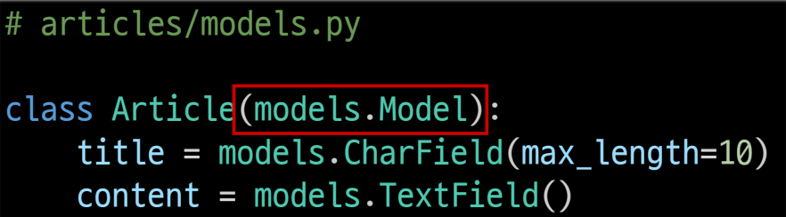
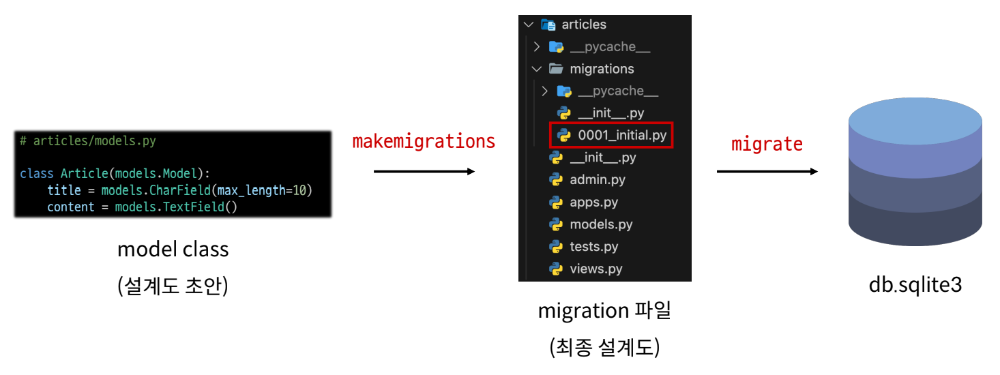
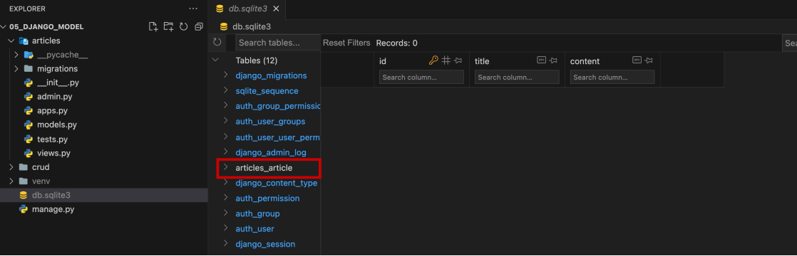
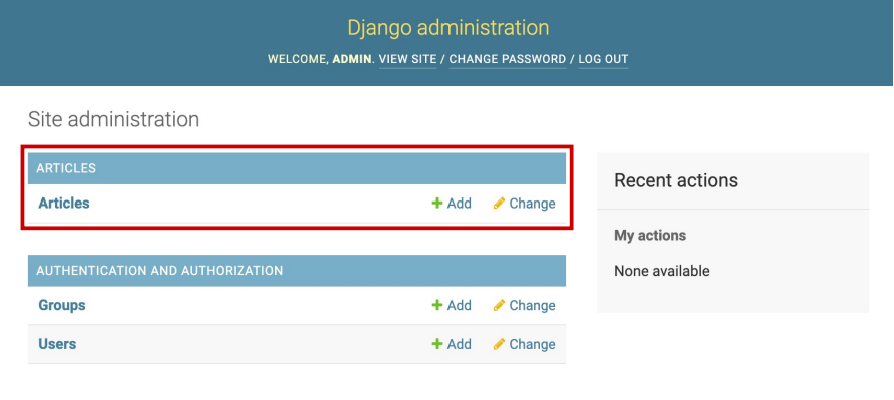
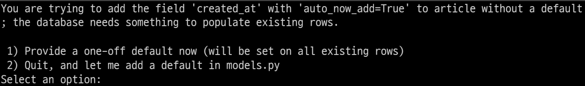
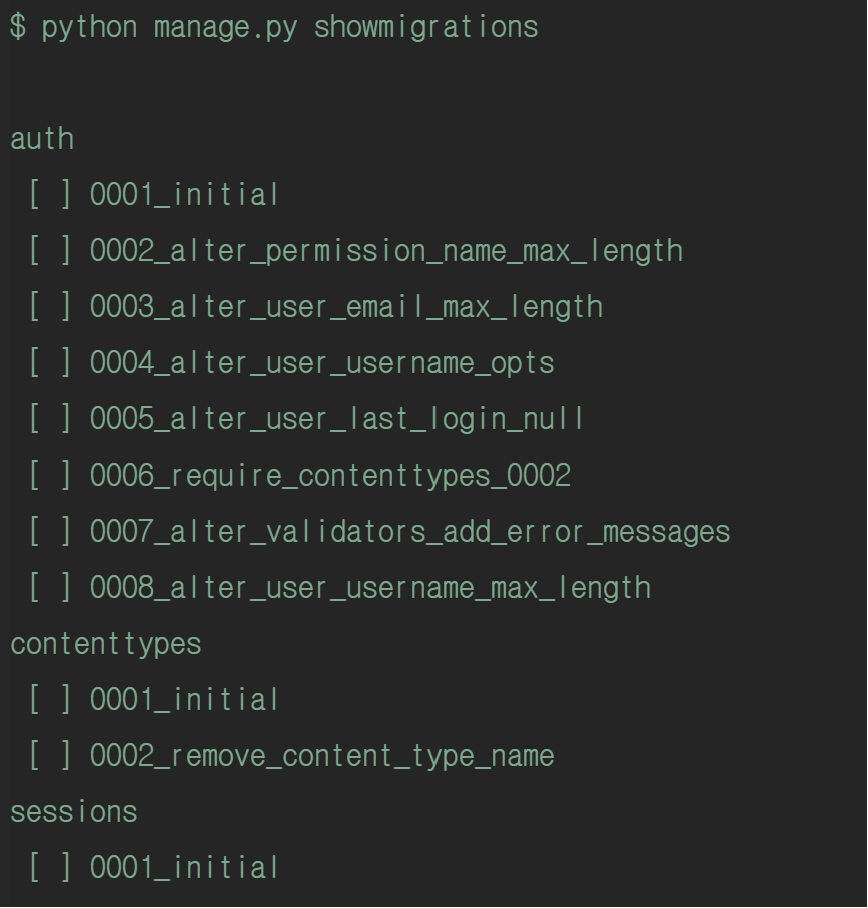
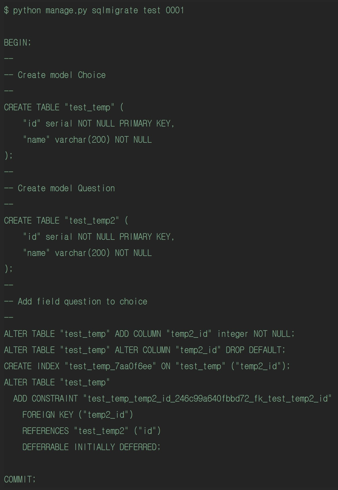
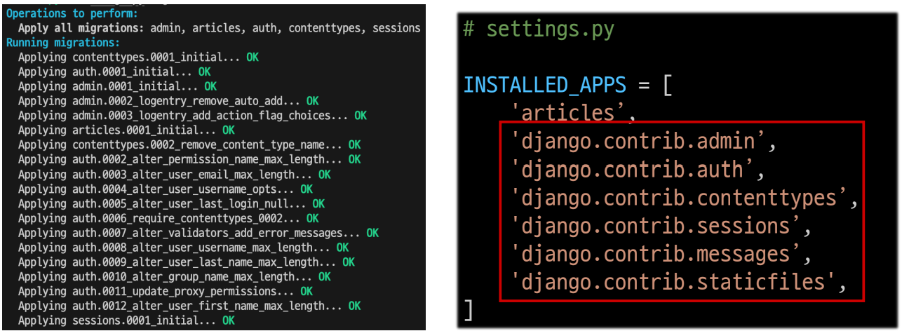

# Model

## 목차

1. [모델](#1-모델)
    1. [model 클래스 생성](#1-1-model-클래스-생성)
        - [Model 부모 클래스 상속](#model-부모-클래스-상속)
        - [필드 타입](#필드-타입)
2. [Migrations](#2-migrations)
3. [Admin site(관리자 사이트)](#3-admin-site관리자-사이트)
    1. [Automatic admin interface](#3-1-automatic-admin-interface)
    2. [admin 계정 생성](#3-2-admin-계정-생성)
    3. [admin에 모델 클래스 등록](#3-3-admin에-모델-클래스-등록)
4. [테이블을 수정할 경우](#4-테이블을-수정할-경우)
    1. [이미 migrations 된 테이블에 필드를 추가하는 경우](#4-1-이미-migrations-된-테이블에-필드를-추가하는-경우)
5. [참고](#5-참고)
    1. [데이터 베이스 초기화](#5-1-데이터-베이스-초기화)
    2. [Migrations 기타 명령어](#5-2-migrations-기타-명령어)
        - [showmigrations](#showmigrations)
        - [sqlmigrate](#sqlmigrate)
    3. [첫 migrate하는 경우, 출력내용이 많은 이유](#5-3-첫-migrate하는-경우-출력내용이-많은-이유)

<br>
<br>

## 1. 모델

-   모델이란 데이터에 대한 `정보소스`, `청사진`
-   저장된 데이터의 필드와 동작을 포함하는 `클래스`
-   각각의 모델은 `하나의 DB 테이블에 매핑(mapping : 서로 연결됨)`됨
-   각각의 모델은 파이썬 클래스로, `django.db.models.Model`에 속함

<br>

### 1-1. model 클래스 생성

-   기존 SQL과 달리 Django 프레임워크에서는 `파이썬의 클래스`를 이용하여, `DB 테이블`을 만듦

```python
# 앱폴더 / models.py
# 예시(Todo 리스트 작성 앱)

from django.db import models


class Todo(models.Model):
    content = models.CharField(max_length=80)
    completed = models.BooleanField(default=False)
    priority = models.IntegerField(default=3)
    created_at = models.DateField(auto_now_add=True)
    deadline = models.DateField(null=True)
```

<모델 클래스 == 테이블 스키마>

-   아래와 같은 테이블을 만들기 위한 설계도
-   id 필드는 자동으로 생성됨

<br>

| id  | content | completed | priority | created_at | deadline |
| --- | ------- | --------- | -------- | ---------- | -------- |
| ... | ...     | ...       | ...      | ...        | ...      |
| ... | ...     | ...       | ...      | ...        | ...      |

-   `테이블명(클래스 명)` : Todo
-   `필드명(클래스 변수명)` : content / complete / priority / created_at / deadline
-   `필드 타입(model Field 클래스)` : CharField / BooleanField / IntegerField / DateField
-   `제약 조건(model Field 클래스 키워드 인자)` : max_length / default / auto_now_add / null

<br>

### - Model 부모 클래스 상속



<Model 부모 클래스 상속>

-   django.db.models 모델의 Model이라는 부모 클래스를 상속받아 작성됨
-   개발자는 테이블 구조를 설계하여 코드를 작성

<br>

### - 필드 타입

-   필드 타입은 무수히 많으므로 모든 필드를 암기하기는 어려우며, 필요한 필드를 찾아서 사용
-   [Django 공식사이트 필드 타입](https://docs.djangoproject.com/en/5.0/ref/models/fields/#field-types)

ex) 필드 타입 예시

1. CharField() : `길이의 제한이 있는 문자열`로 필드 최대길이를 한정하기 위한 `'max_length'`를 필수인자로 가짐
2. TextField() : `글자수가 많은 문자열` 로 최대길이를 지정하지 않음
3. DateTimeField() : `날짜` 및 `시간`을 넣을 때 사용
    - `auto_now` : 데이터가 저장될 때마다 현재 날짜 및 시간을 저장하는 인자
    - `auto_now_add` : 데이터가 처음 생성될 때만 현재 날짜 및 시간을 저장하는 인자

<br>
<br>

## 2. Migrations

-   model 클래스에서 발생한 `변경사항(필드 생성, 추가 등등)`을 DB에 최종적으로 `반영`하기위한 과정
-   마이그레이션 과정은 git을 통해 ① add 한 후, ② commit하는 과정과 같이 `2단계를 통해서 DB에 반영`됨



<migrations 과정>

<br>

-   STEP1 : 모델에 작성된 클래스를 migration 파일로 생성

```bash
$ python manage.py makemigrations
```

<br>

-   STEP2 : 최종적으로 DB 테이블에 적용

```bash
$ python manage.py migrate
```

<br>



<db sqlite3 에 형성된 DB테이블>

-   테이블 이름은 `앱이름_클래스명`으로 이루어짐

<br>
<br>

## 3. Admin site(관리자 사이트)

### 3-1. Automatic admin interface

-   Django의 경우, 관리자 인터페이스를 추가 설치 및 설정없이 `기본적으로 제공`함
-   데이터를 `테스트`하거나 확인하기에 유용

<br>

### 3-2. admin 계정 생성

```bash
$ python manage.py createsuperuser
```

-   명령어를 입력하면, `관리자 이름`, `이메일`, `비밀번호`, `비밀번호 확인`을 입력하게 됨
    -   이메일의 경우, 선택사항
    -   비밀번호는 보안을 위해 터미널에 출력되지 않으므로 무시하고 입력하면 됨
-   최종적으로 계정생성이 완료되면, DB의 `auth_user` 테이블에 `admin 계정`이 추가됨

<br>

### 3-3. admin에 모델 클래스 등록

```bash
# todos / admin.py

from django.contrib import admin
from .models import Todo

admin.site.register(Todo)
# 암기 : '관리자' '사이트'에 '등록'한다.
```

-   `admin.py`에 모델 클래스를 `등록`해야 관리자 사이트에서 확인 가능



-   등록이 완료되면, 관리자 사이트를 통해서 생성, 읽기, 수정, 삭제인 `CRUD 테스트`가 가능
-   변경사항은 `db.sqlite3` 파일에서도 확인 가능

<br>
<br>

## 4. 테이블을 수정할 경우

### 4-1. 이미 migrations 된 테이블에 필드를 추가하는 경우

1. 기존의 models.py에 생성된 클래스에 `필드를 추가`하고, 동일하게 `makemigrations`를 진행
2. 터미널에서 추가하는 필드의 기본값의 설정이 필요하다는 `안내창`이 뜨게 됨



<기본값을 위한 2가지 선택사항>

    1번의 경우, Django를 통해 자동으로 기본값을 입력받는 방법

    2번의 경우, 안내에서 나와서 본인이 직접 기본값을 설정하는 방법

3. 이 후, makemigrations 완료하면, 앱의 migrations 폴더에 파일이 생성됨
4. 최종적으로 `migrate`하면 변경사항이 DB 테이블에 적용됨

<br>
<br>

## 5. 참고

### 5-1. 데이터 베이스 초기화

1. migration 파일 삭제
2. db.sqlite3 파일 삭제

-   migrtions 폴더 지우지 않도록 주의

<br>

### 5-2. Migrations 기타 명령어

### - showmigrations

```bash
$ python manage.py showmigrations <app-name>
```



<showmigrations 명령어 예시 결과>

-   migrations 파일들이 migrate 되었는지 확인하는 명령어
-   `[X] 표시`가 있을 경우, `migrate가 완료됨`을 의미

<br>

### - sqlmigrate

```bash
$ python manage.py sqlmigrate <app-name> <migration-name>
```



<sqlmigrate 명령어 예시 결과>

-   해당 migrations 파일이 SQL문으로 어떻게 해석되어 DB에 전달되는지 확인하는 명령어

참고출처 : https://brownbears.tistory.com/443

<br>

### 5-3. 첫 migrate하는 경우, 출력내용이 많은 이유



-   기본적으로 django 프로젝트가 동작하기위해 작성된 `기본 내장 app들`의 migration 파일이 `함께 migrate` 되기 때문
