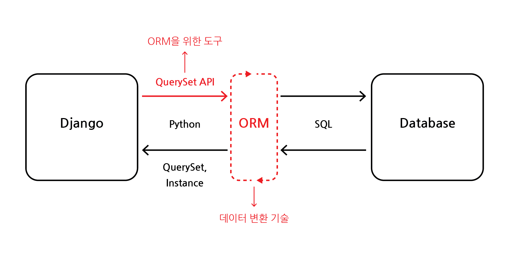

# ORM

## 목차

1. [ORM이란?](#1-orm이란)
    1. [QuerySet API](#1-1-queryset-api)
    2. [Query](#1-2-query)
    3. [QuerySet](#1-3-queryset)
2. [ORM 생성](#2-orm-생성)
    1. [QuerySet API 초기 설정](#2-1-queryset-api-초기-설정)
    2. [Django shell](#2-2-django-shell)
3. [ORM 조회](#3-orm-조회)
    1. [전체 데이터 조회](#3-1-전체-데이터-조회)
    2. [단일 데이터 조회](#3-2-단일-데이터-조회)
    3. [특정 조건 데이터 조회](#3-3-특정-조건-데이터-조회)
4. [ORM 수정](#4-orm-수정)
5. [ORM 삭제](#5-orm-삭제)
6. [참고](#6-참고)
    1. [Field lookups](#6-1-field-lookups)
    2. [ORM, QuerySet API를 왜 사용할까?](#6-2-orm-queryset-api를-왜-사용할까)

<br>
<br>

## 1. ORM이란?

- ORM이란, Object-Relational-Mapping(객체 지향 연결)의 줄임말로 객체지향 프로그래밍 언어(ex. 파이썬, 자바스크립트 등)을 사용하여 이를 지원하지 않는 시스템과의 `호환을 가능하게 하도록 데이터를 변환`해주는 프로그래밍 기술을 말한다.
- Django에서는 Python을 통하여, `SQL언어`를 사용하는 `DB를 조작`할 수 있도록 한다.

<br>
<br>

### 1-1. QuerySet API



<ORM과 QuerySet API 개념도>

- QuerySet API는 ORM에서 데이터를 조작하는데 사용하는 다양한 `도구모음`이다.
- API를 사용하여 SQL이 아닌 Python 코드로 데이터 처리

```python
# QuerySet API 구문

[Model class name].objects.[QuerySet API]

# ex) Article.objects.all()
```

참고 : [Django - QuerySet API](https://docs.djangoproject.com/en/4.1/ref/models/querysets/)

<br>

### 1-2. Query

- `쿼리`란 DB에 보내는 일종의 `요청`으로 SQL에서의 SELECT문을 예로 들 수 있다.
- Django에서는 파이썬으로 작성된 코드가 ORM을 통해 SQL로 변환된 후, DB에 전달
- 데이터 베이스의 응답 데이터를 ORM에서 `QuerySet의 자료 형태로 반환`된다.

<br>

### 1-3. QuerySet

- QuerySet은 DB에서 응답받은 `객체모음`, `데이터모음`이다.
- 이는 리스트의 형태로 `순회가능`한 데이터이다.
- 다만, 단일한 객체를 반환 받을 경우, QuerySet이 아닌 모델 클래스의 `인스턴스`로 반환

<br>
<br>

## 2. ORM 생성

### 2-1. QuerySet API 초기 설정

- ORM을 활용하기 위해서는 초기 세팅이 필요

1. 패키지 설치
```bash
$ pip install ipython
$ pip install django-extensions
```

2. Django 확장프로그램 앱에 등록

```python
# settings.py

INSTALLED_APPS = [
  'django_extensions',
  ...
]
```

3. 패키지 최신화

```bash
$ pip freeze > requirements.txt
```

<br>

### 2-2. Django shell

- Django 환경 안에서 실행되는 Python shell
- 입력하는 QuerySet API 구문이 django 프로젝트에 영향을 미침

<br>

1. Django에서 파이썬 shell 실행

```bash
$ python manage.py shell_plus
```

2. 데이터 객체 생성하기

```bash
# ex) 방법1

$ article = Article() # 클래스(Article)에서 인스턴스(article) 할당
$ article.title = 'first' # 인스턴스 변수(title)에 값 할당
$ article.content = 'Django!' # 인스턴스 변수(content)에 값 할당
$ article.save() # 할당한 값 DB에 저장


# ex) 방법2

$ article = Article(title='first', content='Django!') # 변수를 할당한 클래스를 통해 인스턴스 생성
$ article.save() # 저장 메서드


# ex) 방법3

$ Article.objects.create(title='first', content='Django!') # QuerySet API의 create() 메서드를 통해 DB에 생성 및 저장
```

<br>
<br>

## 3. ORM 조회

### 3-1. 전체 데이터 조회

- `.all()` 메서드 사용

```bash
$ Article.objects.all()
```
<br>

### 3-2. 단일 데이터 조회

- `.get()` 메서드 사용
- get 메서드의 경우, 객체를 찾을 수 없으면, `DoesNotExist` 예외발생
- 둘 이상의 객체를 찾으면 `MultipleObjectsReturned` 예외발생
- 따라서 `primary key`와 같은  메서드 안에 `고유성(uniqueness)`을 보장하는 특징을 삽입해야 함

```bash
$ Article.objects.get(pk=1)
```

<br>

### 3-3. 특정 조건 데이터 조회

- `.filter()` 메서드 사용
- 메서드 안에 `특정 조건`을 삽입

```bash
$ Article.objects.filter(content='Django!')
```

<br>
<br>

## 4. ORM 수정

- 데이터 수정

```bash
# 수정할 인스턴스 조회
$ article = Article.objects.get(pk=1)

# 인스턴스 변수를 변경
$ article.title = 'hello'

# 저장
$ article.save()

# 수정되었는지 확인
$ article.title

# 출력
# 'hello'
```

<br>
<br>

## 5. ORM 삭제

- 데이터 삭제

```bash
# 삭제할 인스턴스 조회
$ article = Article.objects.get(pk=1)

# delete() 메서드 호출 (삭제 된 객체가 반환됨)
$ article.delete()
# (1, { 'articles.Article' : 1})
```

<br>
<br>

## 6. 참고

### 6-1. Field lookups

- 특정 레코드에 대한 `조건을 설정`하는 방법
- QuerySet 메서드 filter(), exclude(), get()에서 `키워드 인자`로 지정됨

```bash
# content 컬럼에 'dj'가 포함된(contains) 모든 데이터 조회
$ Article.object.filter(content__contains='dj')
```

참고 : [Django - Field lookups](https://docs.djangoproject.com/en/5.0/ref/models/querysets/#field-lookups)

<br>

### 6-2. ORM, QuerySet API를 왜 사용할까?

- 데이터 베이스 쿼리를 추상화하여 Django 개발자가 `데이터 베이스를 직접 상호작용하지 않아도 됨`
- 데이터 베이스와의 `결합도(Coupling)을 낮추고` 개발자가 `직관적, 생산적`으로 개발할 수 있도록 해줌