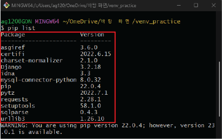
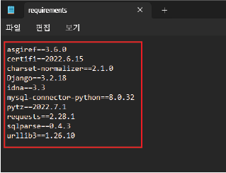
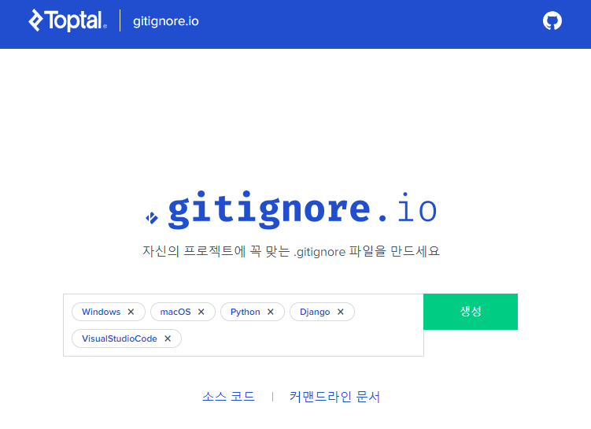
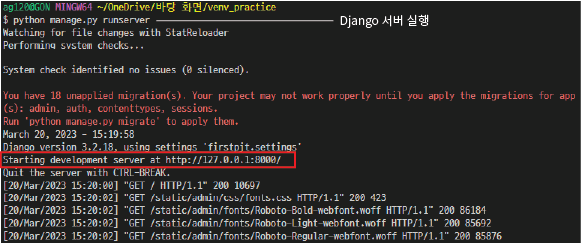
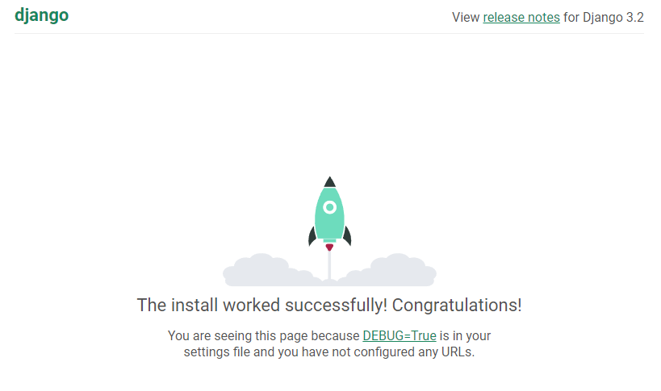
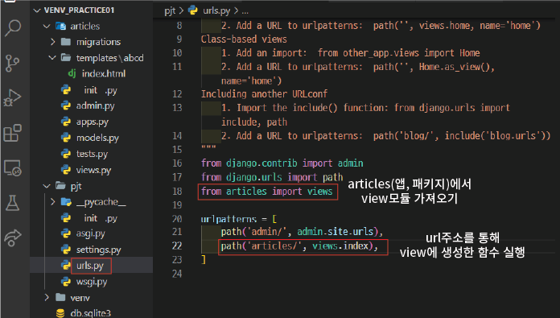
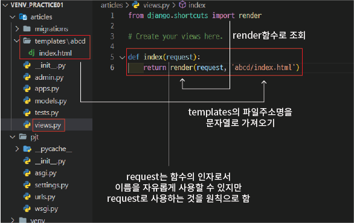
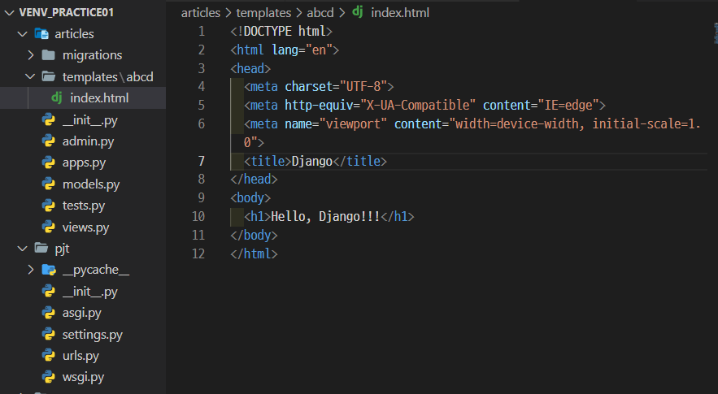

# Django 개발환경 설정

## 목차

1. [가상환경 생성 및 활성화](#1-가상환경-생성-및-활성화)
    1. [가상환경 생성](#1-1-가상환경-생성)
    2. [가상환경 활성화](#1-2-가상환경-활성화)
2. [Django 설치](#2-django-설치)
3. [의존성 파일 생성](#3-의존성-파일-생성)
    1. [의존성 파일](#3-1-의존성-파일)
    2. [의존성 파일 생성](#3-2-의존성-파일-생성)
4. [Git 관련 추가 가이드](#4-git-관련-추가-가이드)
    1. [.gitignore](#4-1-gitignore)
5. [Django 프로젝트 생성](#5-django-프로젝트-생성)
6. [Django 서버 실행](#6-django-서버-실행)
7. [페어 프로젝트 팀원의 경우](#7-페어-프로텍트-팀원의-경우)
    1. [패키지 목록 설치](#7-1-패키지-목록-설치)
8. [앱 생성 및 등록](#8-앱-생성-및-등록)
    1. [앱 생성](#8-1-앱-생성)
    2. [앱 등록](#8-2-앱-등록)
9. [요청과 응답](#9-요청과-응답)
    1. [urls.py](#9-1-urlspy)
    2. [views.py](#9-2-viewspy)
    3. [templates 폴더](#9-3-templates-폴더)
    4. [웹 페이지 응답](#9-4-웹-페이지-응답)

<br>
<br>

## 1. 가상환경 생성 및 활성화

-   페어 프로젝트를 진행함에 있어서 각자의 프로그램의 버전 등의 차이로 `호환이 안되는 문제가 발생`할 수 있음
-   프로젝트 초기에 `독립된 가상환경을 생성`하고 `버전 및 환경을 동일하게 설정`해야 이를 방지 할 수 있음

<br>

### 1-1. 가상환경 생성

```bash
# 1-1. 가상환경(venv) 생성하기

$ python -m venv venv
```

-   python -m venv (명령어) + venv (가상환경 이름)
-   가상환경 이름은 `venv로 설정하는 것을 default`로 함. 변경금지!!
-   `하나의 git bash` 안에는 `하나의 가상환경`만 활성화 할 수 있음

<br>

### 1-2. 가상환경 활성화

```bash
# 1-2. 가상환경 활성화

# 활성화시키기
$ source venv/Scripts/activate (윈도우 기준)
$ source venv/bin/activate (맥 기준)

# 비활성화 시키기
$ deactivate

  or

  bash 창 닫기
```

-   venv/Scripts/ 의 경우, 경로로서 현재 위치에 따라 바뀔 수 있음


-   활성화 시, 상단의 이미지와 같이 `(venv)표시`를 통해 가상환경이 활성화 됨을 확인할 수 있음

<br>
<br>

## 2. Django 설치

-   가상환경에 파이썬을 위한 프레임워크 Django를 설치해주어야 함

```bash
# 2. Django 설치하기

$ pip install django==3.2.18
```

-   django 뒤에 버전을 명시하지 않을 경우, 최신 버전인 4.0 버전의 django가 설치됨
-   `LTS(Long Term Support)버전`은 장기간 지원하는 안정화된 버전으로 `X.2`로 표기됨
-   (23.03 기준) LTS버전인 3.2 버전을 사용하는 것을 지향

<br>

<br>
<br>

## 3. 의존성 파일 생성

### 3-1. 의존성 파일

-   가상환경에 설치된 패키지들의 목록
-   페어 프르젝트를 진행하며 `패키지 파일 자체를 공유하는 것이 아닌, 의존성 파일을 통해서 패키지 목록을 공유`
-   이를 활용하여 팀원들은 패키지 파일을 설치할 수 있음



<pip list를 통해 확인한 패키지 목록>

<br>

### 3-2. 의존성 파일 생성

```bash
# 3. 의존성 파일 생성하기

$ pip freeze > requirements.txt
```

-   pip freeze (패키지 리스트 출력 명령어) > requirements.txt (저장 파일명)
-   저장 파일명은 `requirements로 설정하는 것을 default`로 함. 변경금지!!
-   의존성 파일은 패키지가 설치 및 변경될 경우, 최신화해야 함



<requirements.txt 파일의 패키지 목록>

<br>
<br>

## 4. Git 관련 추가 가이드

### 4-1. .gitignore

-   생성된 프로젝트를 팀원들과 `Github를 통해 관리`할 경우, `.gitignore` 설정을 통해 불필요한 파일이 공유되는 것을 막을 수 있음
-   https://www.toptal.com/developers/gitignore/ 에서 관련 스크립트를 생성하여 사용



<.gitignore.io 홈페이지>

-   사용하는 OS, 프로그래밍 언어, 프레임워크, 개발환경(IDE)를 통해 생성 및 설정
-   이후 git init 진행
-   .gitignore은 `초기에 생성하는 것을 추천`하며, `git add 이전`에 무조건 생성 되어야 함

<br>
<br>

## 5. Django 프로젝트 생성

```bash
# 5. Django 프로젝트 생성하기

$ django-admin startproject firstpjt .
```

-   django-admin startproject (프로젝트 생성 명령어) + [프로젝트 이름] + . (현재위치)

<br>
<br>

## 6. Django 서버 실행

```bash
# 6. Django 서버 실행하기

# 실행시키기
$ python manage.py runserver

# 서버종료하기
$ ^C (ctrl + C)
```

-   python manage.py (Django 명령어 구동) + runserver (서버 실행 명령어)



<Django 서버 실행 시, 터미널>

<br>



<Django 서버 : http://127.0.0.1:8000/ 접속>

<br>
<br>

## 7. 페어 프로텍트 팀원의 경우

-   git clone 및 git pull을 통해 repository를 공유받게 됨
-   저장소 내부의 앞서 생성된 `requirements.txt` 파일을 통해 동일한 환경의 패키지를 설치해주어야 함
-   하지만 패키지를 일일이 설치하는 것이 아닌 명령어를 통해 바로 설치가 가능

<br>

### 7-1. 패키지 목록 설치

```bash
# 7. 패키지 목록 설치하기

$ pip install -r requirements.txt
```

-   pip install (패키지 설치) + -r requirements.txt (requirements 파일을 읽어서)

<br>
<br>

## 8. 앱 생성 및 등록

-   앞서 만들어진 Django 서버 프로젝트는 비어있기 때문에 서비스의 실질적인 기능을 담당하는 앱을 생성하고 등록해 주어야 함


<Django의 프로젝트와 앱의 관계>

-   프로젝트 : 앱의 집합으로 URL설정 및 프로젝트의 `전반적인 설정`을 담당
-   어플리케이션 : 독립적인 `각각의 기능`들을 의미

<br>

### 8-1. 앱 생성

```bash
# 8-1. 앱 생성하기

$ python manage.py startapp articles
```

-   python manage.py startapp (앱생성 명령어) + [앱 폴더이름] (이름은 복수형)


<앱 생성>

<br>

### 8-2. 앱 등록

-   앱을 생성한 후, 앱을 `등록하는 과정이 필요`하며, `등록 -> 생성`과 같이 `역순의 과정은 불가능`함

```bash
# 8-2. 앱 등록하기

프로젝트 폴더 안의 settings.py 파일의 '설치된 앱' 목록에 기입하기
```


<앱 등록>

<br>
<br>

## 9. 요청과 응답

-   클라이언트(프론트엔드)가 Django 서버(백엔드)에 `url형태`로 `요청(request)`을 보냄
-   서버는 요청을 받아 서버 안의 `views 모듈`을 통해 `templates 모듈의 데이터(JSON, html...)`를 가져와 클라이언트에게 `응답(responses)`


<Django에서 클라이언트와 서버의 요청 및 응답>

<br>

### 9-1. urls.py

-   클라이언트로부터 요청받은 `url주소`를 통해 앱패키지의 `views 모듈의 함수 실행`하기



<urls.py>

<br>

### 9-2. views.py

-   `templates을 조회`하는 함수 생성



<views.py>

<br>

### 9-3. templates 폴더

-   view모듈로 반환되는 `데이터가 담긴 폴더`
-   앞선 urls.py와 views.py는 자동 생성 되지만, 서버 프레임워크인 Django의 특성상 templates 폴더는 `자동 생성되지 않음`
-   폴더명은 반드시 `templates`로 해야 함



<templates 폴더>

<br>

### 9-4. 웹 페이지 응답


<url요청에 따른 웹페이지 응답>
