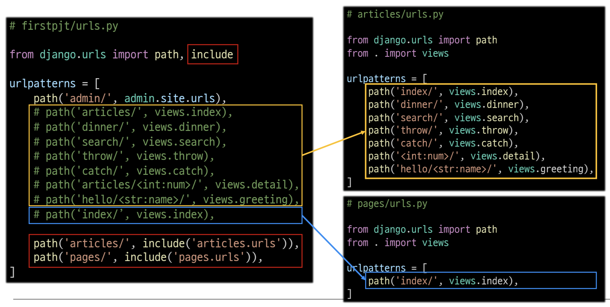

# URLs

## 목차

1. [URL dispatcher](#1-url-dispatcher)
2. [변수와 URL](#2-변수와-url)
    1. [Variable Routing](#2-1-variable-routing)
        - [Path converters](#path-converters)
        - [Variable Routing 예시](#variable-routing-예시)
3. [App의 URL](#3-app의-url)
    1. [App URL mapping](#3-1-app-url-mapping)
        - [프로젝트 하나에서 URL 관리하는 경우](#프로젝트-하나에서-url-관리하는-경우)
        - [프로젝트와 각각의 앱이 URL을 공동으로 관리하는 경우](#프로젝트와-각각의-앱이-url을-공동으로-관리하는-경우)
        - [include()](#include)
4. [URL 이름 지정](#4-url-이름-지정)
    1. [Naming URL patterns](#4-1-naming-url-patterns)
        - ['url' tag](#url-tag)
5. [URL Namespace](#5-url-namespace)
    1. [다른 앱과 name이 중복될 경우](#5-1-다른-앱과-name이-중복될-경우)
        - [app_name 속성 지정](#app_name-속성-지정)
6. [참고](#6-참고)
    1. [Trailing Slashes](#6-1-trailing-slashes)

<br>
<br>

## 1. URL dispatcher

-   URL 분배기
-   URL 패턴을 정의하고 해당 패턴이 일치하는 요청을 처리할 view 함수를 연결(매핑)


<URL을 통해 해당 view 함수 실행>

<br>
<br>

## 2. 변수와 URL

### 2-1. Variable Routing

-   템플릿의 많은 부분이 중복(ex. 게시글1, 게시글2, 게시글3, ...)되고 URL의 일부만 변경되는 상황에서 사용
-   URL 일부에 변수를 포함시킴
-   변수는 view 함수의 인자로 전달 가능
-   `<path_converter:variable_name>` 사용

```python
# Variable Routing 예시

# urls.py

urlpatterns = [
    path('articles/<int:num>/', views.hello),
    path('hello/<str:name>/', views.greeting),
]
```

<br>

### - Path converters

-   URL 변수의 타입 지정
-   str, int, slug, uuid, path 가 있음

<br>

### - Variable Routing 예시

1. 숫자 전달 예시

```python
# urls.py

urlpatterns = [
    path('articles/<int:num>/', views.detail),
]
```

```python
# views.py

def detail(request, num):
    context = {
        'num': num,
    }
    return render(request, 'articles/detail.html', context)
```

```html
<!--articles/detail.html-->

<h1>Detail</h1>
<h3>{{ num }}번 글 입니다.</h3>
```

<br>

2. 문자 전달 예시

```python
# urls.py

urlpatterns = [
    path('hello/<str:name>/', views.greeting),
]
```

```python
# views.py

def greeting(request, name):
    context = {
        'name': name,
    }
    return render(request, 'articles/greeting.html', context)
```

```html
<!--articles/greeting.html-->

<h1>Greeting</h1>
<h3>{{ name }}님 안녕하세요!</h3>
```

<br>
<br>

## 3. App의 URL

### 3-1. App URL mapping

-   각 앱에 URL을 정의하는 것
-   프로젝트와 각각의 앱이 URL을 나누어 관리하여 주소관리를 편하게 함

<br>

### - 프로젝트 하나에서 URL 관리하는 경우

-   모든 앱에서 view 함수들을 import 해와야 함
-   실수로 URL 주소가 겹치는 상황이 발생할 수 있음

```python
# pjt/urls.py

from articles import views as articles_views
from pages import views as pages_views

urlpatterns = [
    ...,
    path('page-index', pages_views.index),
]
```

<br>

### - 프로젝트와 각각의 앱이 URL을 공동으로 관리하는 경우


<프로젝트와 앱이 공동으로 url 관리>

<br>

### - include()

-   다른 URL들을 `참조`할 수 있도록 돕는 함수
-   요청받은 URL에서 일치하는 부분까지 잘라내고 남은 문자열 부분을 후속처리하기 위해 include된 URL로 전달



<include를 사용하여 프로젝트에서 앱으로 URL 전달>

```python
# pjt/urls.py

from django.urls import path, include

urlpatterns = [
    path('admin/', admin.site.urls),
    path('articles/', include('articles.urls')),
    path('pages/', include('pages.urls')),
]
```

<br>
<br>

## 4. URL 이름 지정

### 4-1. Naming URL patterns

-   URL에 이름을 지정하는 것
-   urlpatterns의 path 함수에서 `name 인자`를 정의해서 사용

```python
# articles/urls.py

from django.urls import path
from . import views

urlpatterns = [
    path('index/', views.index, name='index'),
    path('dinner/', views.dinner, name='dinner'),
    path('search/', views.search, name='search'),
    path('throw/', views.throw, name='throw'),
    path('catch/', views.catch, name='catch'),
    path('articles/<int:num>/', views.detail, name='detail'),
]
```

```html
<!--기존 html-->
<h1>Hello, {{ name }}</h1>
<a href="/dinner/">dinner</a>
<a href="/search/">search</a>
<a href="/throw/">throw</a>

<!--name을 사용한 html-->
<h1>Hello, {{ name }}</h1>
<a href="">dinner</a>
<a href="">search</a>
<a href="">throw</a>
```

-   `href 속성 값`, `form의 action 속성` 등, url을 작성하는 모든 위치에서 수정이 필요

<br>

### - 'url' tag

-   주어진 URL 패턴의 이름과 일치하는 절대 경로 주소를 반환

```html
<!--url 태그 구조-->


```

<br>
<br>

## 5. URL Namespace

### 5-1. 다른 앱과 name이 중복될 경우

```python
# articles/urls.py

urlpatterns = [
    path('index/', views.index, name='index'),
]


# pages/urls.py

urlpatterns = [
    path('index/', views.index, name='index'),
]
```

-   articles 앱의 name='index'와 pages 앱의 name='index'간의 이름이 같아 단순히 `이름만으로는 구분이 어려움`

<br>

### - app_name 속성 지정

-   url 이름 + app name 붙여서 구분

```python
# app_name 속성 추가

# articles/urls.py

app_name = 'articles'
urlpatterns = [
    path('index/', views.index, name='index'),
]


# pages/urls.py

app_name = 'pages'
urlpatterns = [
    path('index/', views.index, name='index'),
]
```

-   URL tag는 아래와 같이 수정

```html
<!--기존 url 태그-->



<!--수정된 url 태그-->


<!--articles 앱의 index name의 URL로 해석 할 수 있음-->
```

<br>
<br>

## 6. 참고

### 6-1. Trailing Slashes

-   django는 URL 끝에 `슬래쉬 '/'`가 없다면 `자동으로 붙임`
-   django의 url 설계 철학을 보면 기술적인 측면에서 `foo.com/bar`와 `foo.com/bar/`는 서로 다른 URL임
-   검색 엔진 로봇이나, 웹 트래픽 분석 도구에서는 이 두 주소를 서로 다른 페이지로 인식
-   django에서도 이를 반영하여 검색 엔진이 혼동하지 않도록 하기 위해서 사용
-   모든 프레임 워크가 이렇게 동작하지는 않음
