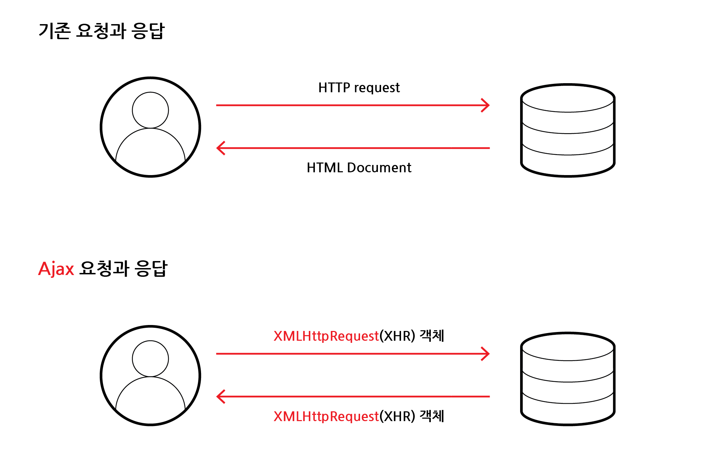
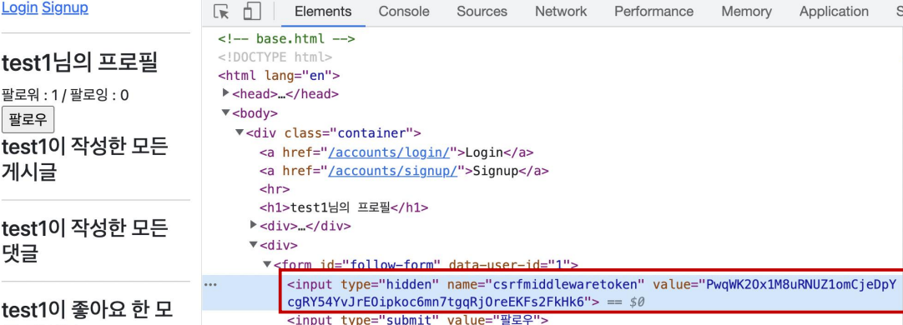

# Ajax를 이용한 비동기 요청

## 목차

1. [비동기(asynchronous)](#1-비동기asynchronous)
    1. [비동기 예시](#1-1-비동기-예시)
2. [Ajax](#2-ajax)
    1. [XMLHttpRequest(XHR)](#2-1-xmlhttprequestxhr)
3. [Axios](#3-axios)
    1. [Axios 기본 문법](#3-1-axios-기본-문법)
    2. [python과 Axios 사용 비교](#3-2-python과-axios-사용-비교)
        - [python 이용하여 사진 api 처리](#--python-이용하여-사진-api-처리)
        - [Axios 이용하여 사진 api 처리](#--axios-이용하여-사진-api-처리)
        - [Axios 이용하여 사진 api 처리 (완성코드)](#--axios-이용하여-사진-api-처리-완성코드)
4. [Ajax를 이용한 Follow](#4-ajax를-이용한-follow)
    1. [Follow 기능 axios CDN 작성](#4-1-follow-기능-axios-cdn-작성)
    2. [form 태그 수정](#4-2-form-태그-수정)
    3. [axios 요청 준비](#4-3-axios-요청-준비)
    4. [user pk 가져오기](#4-4-user-pk-가져오기)
        - ['data-*' attributes](#--data--attributes)
    5. [요청 url 완성](#4-5-요청-url-완성)
    6. [csrf 값](#4-6-csrf-값)
    7. [Ajax로 csrftoken 보내기](#4-7-ajax로-csrftoken-보내기)
    8. [Follow 정보 JSON 데이터로 view 함수에서 보내기](#4-8-follow-정보-json-데이터로-view-함수에서-보내기)
    9. [Follow 버튼 토글하기](#4-9-follow--버튼-토글하기)
    10. [Following & Follower 수 비동기 적용](#4-10-following--follower-수-비동기-적용)
    11. [span 태그 선택](#4-11-span-태그-선택)
    12. [Following, Follower 수 view 함수에서 응답](#4-12-following-follower-수-view-함수에서-응답)
    13. [view 함수에서 받은 Following, Follower 수를 응답에서 찾아 적용](#4-13-view-함수에서-받은-following-follower-수를-응답에서-찾아-적용)
    14. [Follow 최종 HTML 코드](#4-14-follow-최종-html-코드)
    15. [Follow 최종 view 함수 코드](#4-15-follow-최종-view-함수-코드)
    16. [Follow 최종 JS 코드](#4-16-follow-최종-js-코드)
5. [Ajax를 이용한 좋아요 기능](#5-ajax를-이용한-좋아요-기능)
    1. [좋아요 기능 최종 HTML 코드](#5-1-좋아요-기능-최종-html-코드)
    2. [좋아요 기능 최종 view 함수 코드](#5-2-좋아요-기능-최종-view-함수-코드)
    3. [좋아요 기능 최종 JS 코드](#5-3-좋아요-기능-최종-js-코드)

<br>
<br>

## 1. 비동기(asynchronous)

- 작업을 시작한 후, 결과를 기다리지 않고 다음 작업을 처리하는 것
- 병렬적 수행
- 시간이 필요한 작업은 요청을 보낸 뒤, 응답이 빨리 오는 작업부터 처리함
- ex) Google의 Gmail에서 메일 전송 버튼 클릭 시, 메일 목록 화면으로 전환되지만 실제로 메일 보내는 작업은 병렬적으로 뒤에서 처리되고 있음

<br>

### 1-1. 비동기 예시

```javascript
// 비동기 JavaScript 예시 코드

function slowRequest(callback) {
  console.log('1. 오래 걸리는 작업 시작');
  setTimeout(function() {
    callback()
  }, 3000)
}

function myCallback() {
  console.log('2. 콜백함수 실행됨');
}

slowRequest(myCallback);
console.log('3. 다른 작업 실행됨');

// 출력
// '1. 오래걸리는 작업 시작'
// '3. 다른 작업 실행됨'
// '2. 콜백함수 실행됨'
```

<br>
<br>

## 2. Ajax

- `Asynchronous JavaScript And XML`의 약자
- 비동기적 웹 애플리케이션 개발을 위한 프로그래밍 `기술` (라이브러리, 프레임워크 아님)
- 사용자의 요청에 `즉각적 반응을 제공`함과 동시에 페이지를 새로고침하지 않고, `필요한 부분만 업데이트`

<br>



<Ajax를 이용한 통신의 변화>

<br>

### 2-1. XMLHttpRequest(XHR)

- JavaScript 객체로, 클라이언트와 서버 간에 `데이터를 비동기적`으로 주고받을 수 있도록 해주는 객체
- JavaScript 코드로 서버에 요청을 보내고, 서버로부터 응답을 받음

<br>
<br>

## 3. Axios

- JavaScript에서 `HTTP 요청`을 보내는 `라이브러리`
- 주로 프론트엔드 프레임워크에서 사용

<br>

### 3-1. Axios 기본 문법

```html
<script src="https://cdn.jsdelivr.net/npm/axios/dist/axios.minjs"></script>
<script>
    axios({
      method: 'HTTP 메서드',
      url: '요청 URL',
    })
      .then(성공하면 수행할 콜백함수)
      .catch(실패하면 수행할 콜백함수)
</script>
```

- `get`, `post` 등의 여러 method 사용가능
- then을 이용하여 성공 시, 수행할 로직 작성
- catch를 이용하여 실패 시, 수행할 로직 작성

<br>

### 3-2. python과 Axios 사용 비교

### - python 이용하여 사진 api 처리

```python
# 사진 가져오기

import requests

print('사진 가져오기')

image_search_url = 'https://api.thecatapi.com/v1/images/search'
response = requests.get(image_search_url)

if response.status_code == 200:
    print(response.json())
else:
    print('실패')

print('작업 끝')

# 출력
# '사진가져오기'
# [{'id': '...', 'url': 'https://...', 'width': 500, 'height': 667}]
# '작업 끝'
```

- python은 동기식 코드로서 위에서부터 순차적으로 처리
- 첫 번째 print문 출력, 이미지 가져오는 처리 기다린 후, 다음 print문이 출력

<br>

### - Axios 이용하여 사진 api 처리

```html
<!--사진 가져오기-->

<script src="https://cdn.jsdelivr.net/npm/axios/dist/axios.minjs"></script>
<script>
    console.log('사진 가져오기');
    const ImageSearchURL = 'https://api.thecatapi.com/v1/images/search';
    
    axios({
        method: 'get',
        url: ImageSearchURL,
    }).then((res) => {
      console.log(res.data);
    }).catch((error) => {
      console.log('실패');
    })
    
    console.log('작업 끝');
    
    // 출력
    // '사진 가져오기'
    // '작업 끝'
    // [{'id': '...', 'url': 'https://...', 'width': 500, 'height': 667}]
</script>
```

- JavaScript는 비동기식 코드로 즉각적인 처리가 가능한 콘솔출력 작업은 바로 처리하고, 오래 걸리는 이미지 요청 및 응답 받는 작업은 작업을 요청 후, 기다리지 않고 다음 콘솔을 출력하고 응답이 완료된 후, 결과를 출력

<br>

### - Axios 이용하여 사진 api 처리 (완성코드)

```html
<!--사진 가져오기-->

<button>버튼</button>

<script src="https://cdn.jsdelivr.net/npm/axios/dist/axios.minjs"></script>
<script>
    const ImageSearchURL = 'https://api.thecatapi.com/v1/images/search';
    const btn = document.querySelector('button');
    
    btn.addEventListener('click', function() {
      axios({
          method: 'get',
          url: ImageSearchURL,
      }).then((res) => {
        imgElem = document.createElement('img');
        imgElem.setAttribute('src', res.data[0].url);
        document.body.appendChild(imgElem);
      }).catch((error) => {
        console.log('사진 가져오기 실패');
      })
    })
</script>
```

<br>
<br>

## 4. Ajax를 이용한 Follow

### 4-1. Follow 기능 axios CDN 작성

```html
<!--accounts/profile.html-->

<script src="https://cdn.jsdelivr.net/npm/axios/dist/axios.minjs"></script>
<script>
</script>
```

<br>

### 4-2. form 태그 수정

```html
<!--accounts/profile.html-->

<form id="follow-form">
    ...
</form>
<script>
    const form = document.querySelector('#follow-form');
</script>
```

- form 요소 DOM 선택을 위해 id 속성 지정 및 선택
- 불필요해진 action과 method 속성 삭제
- 해당 요청은 axios로 대체됨

<br>

### 4-3. axios 요청 준비

```html
<!--accounts/profile.html-->

<script>
    const form = document.querySelector('#follow-form');
    form.addEventListener('click', function (event) {
      event.preventDefault()
        axios({
            method: 'post',
            url: `/accounts/${???}/follow`,
        })
    })
</script>
```

- axios로 POST 요청을 위해서는 `user의 pk`, `csrf_token`이 필요

<br>

### 4-4. user pk 가져오기

```html
<!--accounts/profile.html-->

<form id="follow-form" data-user-id="{{ person.pk }}">
    ...
</form>
<script>
    const form = document.querySelector('#follow-form');
    form.addEventListener('click', function (event) {
        event.preventDefault()
        
        const userId = event.target.dataset.userId;
        
        axios({
            method: 'post',
            url: `/accounts/${???}/follow`,
        })
    })
</script>
```

- url에 작성할 user pk를 HTML에서 JavaScript로 가져오기

<br>

### - 'data-*' attributes

- 사용자 지정 데이터 특성을 만들어 임의의 데이터를 HTML과 DOM 사이에서 교환할 수 있도록 하는 방법

```html
<!--data attributes 예시-->

<div data-my-id="my-data"></div>

<script>
    const myId = event.target.dataset.myId
</script>
```

- 만약, `data-test-value`라는 이름의 특성으로 HTML에서 지정했다면, JavaScript에서는 `element.dataset.testValue`로 접근 가능
- [data-* mdn 공식문서](https://developer.mozilla.org/ko/docs/Web/HTML/Global_attributes/data-*)

<br>

### 4-5. 요청 url 완성

```html
<!--accounts/profile.html-->

<script>
    const form = document.querySelector('#follow-form');
    form.addEventListener('click', function (event) {
        event.preventDefault()
        const userId = event.target.dataset.userId;
        axios({
            method: 'post',
            url: `/accounts/${userId}/follow`,
        })
    })
</script>
```

<br>

### 4-6. csrf 값



- form 태그 내부에는 hidden 타입으로 숨어있는 csrf 값을 가진 input 태그가 있음
- 해당 태그를 이용
- [Django-csrf ref 공식문서](https://docs.djangoproject.com/en/3.2/ref/csrf/#acquiring-the-token-if-csrf-use-sessions-or-csrf-cookie-httponly-is-true)

```html
<!--accounts/profile.html-->

<script>
    const form = document.querySelector('#follow-form');
    const csrftoken = document.querySelector('[name=csrfmiddlewaretoken]').value;
</script>
```

<br>

### 4-7. Ajax로 csrftoken 보내기

- [Django-ajax csrf 공식문서](https://docs.djangoproject.com/en/3.2/ref/csrf/#setting-the-token-on-the-ajax-request)

```html
<!--accounts/profile.html-->

<script>
    const form = document.querySelector('#follow-form');
    const csrftoken = document.querySelector('[name=csrfmiddlewaretoken]').value;
    form.addEventListener('click', function (event) {
        event.preventDefault()
        const userId = event.target.dataset.userId;
        axios({
            method: 'post',
            url: `/accounts/${userId}/follow`,
            
            headers: {'X-CSRFToken': csrftoken},
            
        })
    })
</script>
```

<br>

### 4-8. Follow 정보 JSON 데이터로 view 함수에서 보내기

- 현재 팔로우가 된 상태인지, 아닌지 확인할 필요가 있음
- axios 요청을 통해 받는 response 객체를 활용하여 view 함수에서 팔로우 관계 여부를 파악할 수 있는 변수를 담아 JSON 타입으로 응답하기

```python
# accounts/views.py

from django.http import JsonResponse

@login_required
def follow(request, user_pk):
    User = get_user_model()
    you = User.objects.get(pk=user_pk)
    me = request.user
    
    if you != me:
        if me in you.followers.all():
            is_followed = False
        else:
            you.followers.add(me)
            is_followed = True
        context = {
            'is_followed': is_followed,
        }
        return JsonResponse(context)
    return redirect('accounts:profile', you.username, context)
```

<br>

### 4-9. Follow  버튼 토글하기

- view 함수에서 보낸 JSON 데이터를 통해 버튼 value 속성 바꾸기

```html
<!--accounts/profile.html-->

<script>
    ...
    axios({
        method: 'post',
        url : `/accounts/${userId}/follow/`,
        header: {'X-CSRFToken': csrftoken,},
    }).then((res) => {
      const isFollowed = res.data.is_followed
      const followBtn = document.querySelector('#follow-form > input[type=submit]');
      if (isFollowed === true) {
        followBtn.value = '언팔로우';
      } else {
        followBtn.value = '팔로우';
      }
    })
</script>
```

<br>

### 4-10. Following & Follower 수 비동기 적용

- 해당 요소 선택할 수 있도록 태그 작성

```html
<!--accounts/profile.html-->

<div>
    팔로잉 : <span id="followings-count">{{ person.followings.all|length }}</span> / 
    팔로워 : <span id="followers-count">{{ person.followers.all|length }}</span>
</div>
```

<br>

### 4-11. span 태그 선택

```html
<!--accounts/profile.html-->

<script>
    ...
    if (isFollowed === true) {
      followBtn.value = '언팔로우';
    } else {
      followBtn.value = '팔로우';
    }
    
    const followingsCountTag = document.querySelector('#followings-count');
    const followersCountTag = document.querySelector('#follwers-count');
</script>
```

<br>

### 4-12. Following, Follower 수 view 함수에서 응답

```python
# accounts/views.py

@login_required
def follow(request, user_pk):
    ...
        context = {
            'is_followed': is_followed,
            'followings_count': you.followings.count(),
            'followers_count': you.followers.count(),        
        }
        return JsonResponse(context)
    return redirect('accounts:profile', you.username)
```

<br>

### 4-13. view 함수에서 받은 Following, Follower 수를 응답에서 찾아 적용

```html
<!--accounts/profile.html-->

<script>
    ...
        .then((res) => {
          ...
        const followingsCountTag = document.querySelector('#followings-count');
        const followersCountTag = document.querySelector('#follwers-count');
        
        
        const followingsCountData = res.data.followings_count;
        const followersCountData = res.data.follwers_count;
        followingsCountTag.textContent = followingsCountData;
        followersCountTag.textContent = followersCountData;
    })
</script>
```

<br>

### 4-14. Follow 최종 HTML 코드

```html
<!--accounts/profile.html-->

<div>
    팔로잉 : <span id="followings-count">{{ person.followings.all|length }}</span> /
    팔로워 : <span id="followers-count">{{ person.followers.all|length }}</span>
</div>


<div>
    <form id="follow-form" data-user-id="{{ person.pk }}">
        
        
            <input type="submit" value="언팔로우">
        
            <input type="submit" value="팔로우">
        
    </form>
</div>

```

<br>

### 4-15. Follow 최종 view 함수 코드

```python
# accounts/views.py

from django.http import JsonResponse

@login_required
def follow(request, user_pk):
    User = get_user_model()
    you = User.objects.get(pk=user_pk)
    me = request.user
    
    if you != me:
        if me in you.followers.all():
            you.followers.remove(me)
            is_followed = False
        else:
            you.followers.add(me)
            is_followed = True
        context = {
            'is_followed': is_followed,
            'followings_count': you.followings.count(),
            'followers_count': you.followers.count(),
        }
        return JsonResponse(context)
    return redirect('accounts:profile', you.username)
```

<br>

### 4-16. Follow 최종 JS 코드

```javascript
// accounts/profile.html

const form = document.querySelector('#follow-form');
const csrftoken = document.querySelector('[name=csrfmiddlewaretoken]').value;
form.addEventListener('submit', function (event) {
  event.preventDefault();
  const userId = event.target.dataset.userId;
  axios({
    method: 'post',
    url: `/account/${userId}/follow/`,
    header: {'X-CSRFToken': csrftoken},
  }).then((res) => {
    const isFollowed = response.data.is_followed;
    const followBtn = document.querySelector('#follow-form > input[type=submit');
    if (isFollowed === true) {
      followBtn.value = '언팔로우';
    } else {
      followBtn.value = '팔로우';
    }
    const followingsCountTag = document.querySelector('#followings-count');
    const followersCountTag = document.querySelector('#follwers-count');
    const followingsCountData = response.data.followings_count;
    const followersCountData = response.data.followers_count;
    followingsCountTag.textContent = followingsCountData;
    followersCountTag.textContent = followersCountData;
  })
})
```

<br>
<br>

## 5. Ajax를 이용한 좋아요 기능

- 좋아요 비동기 적용은 `Follow 흐름 + forEach() + querySelectorAll()`로 구현 가능
- index 페이지 각 게시글에 각각 좋아요 버튼이 있고, 모든 게시글 목록을 선택해야 하기 때문

<br>

### 5-1. 좋아요 기능 최종 HTML 코드

```html
<!--articles/index.html-->

<form class="like-forms" data-article-id="{{ article.pk }}">
    
    
        <input type="submit" value="좋아요 취소" id="like-{{ article.pk }}">
    
        <input type="submit" value="좋아요" id="like-{{ article.pk }}">
    
</form>
```

<br>

### 5-2. 좋아요 기능 최종 view 함수 코드

```python
# articles/views.py

from django.http import JsonResponse

@login_required
def likes(request, article_pk):
    article = Article.objects.get(pk=article_pk)
    
    if request.user in article.like_users.all():
        article.like_users.remove(request.user)
        is_liked = False
    else:
        article.like_users.add(request.user)
        is_liked = True
    context = {
        'is_liked': is_liked,
    }
    return JsonResponse(context)
```

<br>

### 5-3. 좋아요 기능 최종 JS 코드

```javascript
// articles/index.html

const forms = document.querySelectorAll('#like-forms');
const csrftoken = document.querySelector('[name=csrfmiddlewaretoken]').value;

forms.forEach((form) => {
  form.addEventListener('click', function (event) {
    event.preventDefault();
    const articleId = event.target.dataset.articleId;
    axios({
      method: 'post',
      url: `/articles/${articleId}/likes/`,
      header: {'X-CSRFToken': csrftoken},
    }).then((res) => {
      const isLiked = res.data.is_liked;
      const likeBtn = document.querySelector(`#like-${articleId}`);
      if (isLiked === true) {
        likeBtn.value = '좋아요 취소';
      } else {
        likeBtn.value = '좋아요'
      }
    }).catch((error) => {
      console.log(error.response);
    })
  })
})

```