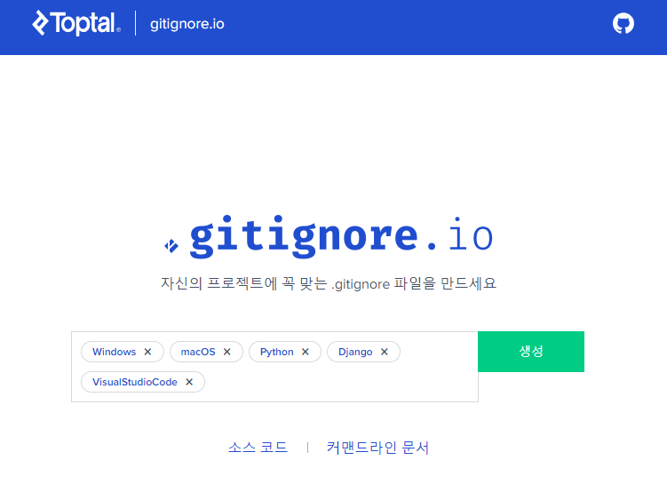
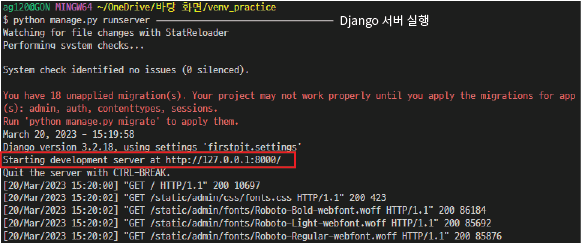

# Django 개발 환경 설정 가이드

## 1. 가상환경 생성 및 활성화

페어 프로젝트를 진행함에 있어서 각자의 프로그램의 버전 등의 차이로 호환이 안되는 문제가 발생할 수 있다. 따라서 프로젝트 초기에 독립된 가상환경을 생성하고 버전 및 환경을 동일하게 설정해야 이를 방지 할 수 있기에 가상환경이 필요하다.

```bash
# 1-1. 가상환경(venv) 생성하기

$ python -m venv venv
```
- python -m venv (명령어) + venv (가상환경 이름)
- 가상환경 이름은 `venv로 설정하는 것을 default`로 한다. 변경금지!!
- `하나의 git bash` 안에는 `하나의 가상환경`만 활성화 할 수 있다.

```bash
# 1-2. 가상환경 활성화

# 활성화시키기
$ source venv/Scripts/activate (윈도우 기준)

# 비활성화 시키기
$ deactivate

  또는

  bash 창 닫기
```

- venv/Scripts/ 의 경우, 경로로서 현재 위치에 따라 바뀔 수 있음 
- `MacOS` 경우, `$ source venv/bin/activate` 로 OS 및 터미널별로 활성화 방법에 차이가 있음


- 활성화시 상단의 이미지와 같이 `(venv)표시`를 통해 가상환경이 활성화 됨을 확인할 수 있음
---
## 2. Django 설치

가상환경에 파이썬을 위한 프레임워크 Django를 설치해주어야 한다.

```bash
# 2. Django 설치하기

$ pip install django==3.2.18
```
- django 뒤에 버전을 명시하지 않을 경우, 최신 버전인 4.0 버전의 django가 설치된다.
- `LTS(Long Term Support)버전`은 장기간 지원하는 안정화된 버전으로 `X.2`로 표기된다. 따라서 (23.03 기준) LTS버전인 3.2 버전을 사용하는 것을 지향한다.
---
## 3. 의존성 파일 : requirement.txt 생성

의존성 파일이란 가상환경에 설치된 패키지들의 목록으로 페어 프르젝트를 진행하며, 팀원들에게 `패키지 파일 자체를 공유하는 것이 아니라, 의존성 파일을 통해서 패키지 목록을 공유`하게 된다. 이를 활용하여 팀원들은 패키지 파일을 설치할 수 있다.


<pip list를 통해 확인한 패키지 목록>

```bash
# 3. 의존성 파일 생성하기

$ pip freeze > requirements.txt
```

- pip freeze (패키지 리스트 출력 명령어) > requirements.txt (저장 파일명)
- 저장파일명은 `requirements로 설정하는 것을 default`로 한다. 변경금지!!
- 의존성 파일은 패키지가 설치 및 변경될 경우, 최신화한다.


<requirements.txt 파일의 패키지 목록>

---
## 4. Git 관련 추가 가이드

생성된 프로젝트를 팀원들과 `Github를 통해 관리`할 경우, .gitignore 설정을 통해 불필요한 파일이 공유되는 것을 막을 수 있다.

- https://www.toptal.com/developers/gitignore/ 에서 관련 스크립트를 생성하여 사용할 수 있다.



- 사용하는 OS, 프로그래밍 언어, 프레임워크, 개발환경(IDE)를 통해 생성 및 설정
- 이후 git init 진행한다.
- .gitignore은 `초기에 생성하는 것을 추천`하며, `git add 이전`에 무조건 생성되어야한다.

---
## 5. Django 프로젝트 생성

```bash
# 5. Django 프로젝트 생성하기

$ django-admin startproject firstpjt .
```

- django-admin startproject (프로젝트 생성 명령어) + [프로젝트 이름] + . (현재위치)

---
## 6. Django 서버 실행

```bash
# 6. Django 서버 실행하기

# 실행시키기
$ python manage.py runserver

# 서버종료하기
$ ^C (ctrl + C)
```

- python manage.py (Django 명령어 구동) + runserver (서버 실행 명령어)



<Django 서버 실행 시, 터미널>


<Django 서버 : http://127.0.0.1:8000/ 접속>

---
## 7. 페어 프로텍트 팀원의 경우

git clone 및 git pull을 통해 repository를 공유받게 되며, 저장소 내부의 앞서 생성된 `requirements.txt` 파일을 통해 동일한 환경의 패키지를 설치해주어야 한다.
하지만 패키지를 일일이 설치하는 것이 아닌 명령어를 통해 바로 설치가 가능하다.

```bash
# 7. 패키지 목록 설치하기

$ pip install -r requirements.txt
```
- pip install (패키지 설치) + -r requirements.txt (requirements 파일을 읽어서)