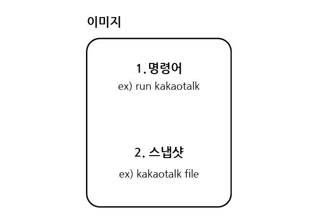
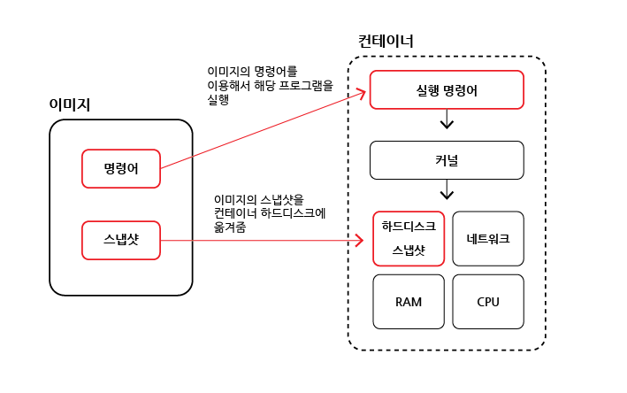

# 이미지로 컨테이너 생성

## 목차

1. [이미지](#1-이미지)
    1. [이미지가 필요로 하는 것](#1-1-이미지가-필요로-하는-것)
    2. [이미지로 컨테이너 만드는 과정](#1-2-이미지로-컨테이너-만드는-과정)

<br/>
<br/>

## 1. 이미지

- 이미지는 응용 프로그램을 실행하는데 `필요한 모든 것`을 포함함

<br/>

### 1-1. 이미지가 필요로 하는 것

1. 컨테이너 시작될 때, 실행되는 `명령어`
2. 실행할 파일 및 해당 파일을 실행하는데 필요한 파일들의 `스냅샷`
   - 스냅샷 : 디렉토리, 파일을 카피한 것



<도커 이미지 요소>

<br/>

### 1-2. 이미지로 컨테이너 만드는 과정

1. 도커 클라이언트에 해당 명령어 입력

```bash
$ docker run <이미지>
```

2. 도커 이미지에 있는 `파일 스냅샷`을 컨테이너 `하드 디스크`에 옮기기
3. 이미지에서 가지고 있는 명령어(컨테이너가 실행될 때, 사용될 명령어)를 이용해서 프로그램 실행
4. 컨테이너의 내부에는 네트워크, RAM, CPU가 있고 응용 프로그램을 실행하는데 필요한 양, 데이터만큼 배분해서 줄 수 있음



- 이러한 과정으로 이미지를 이용해서 컨테이너를 만들고 컨테이너 안에서 응용 프로그램을 실행하게 되는게 도커임