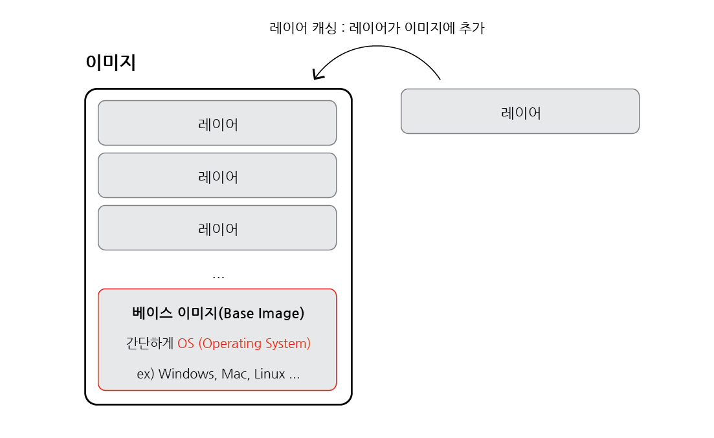

# Dockerfile 만들기

## 목차

1. [도커 파일(Docker file)](#1-도커-파일docker-file)
    1. [도커 파일 만드는 순서](#1-1-도커-파일-만드는-순서)
        - [베이스 이미지](#--베이스-이미지)
    2. [실제로 도커 파일 만들기](#1-2-실제로-도커-파일-만들기)
        - [순서](#--순서)

<br/>
<br/>

## 1. 도커 파일(Docker file)

- 도커 이미지를 만들기 위한 설정 파일로 컨테이너가 어떻게 행동해야 하는지에 대한 설정들을 정의해 주는 곳

<br/>

### 1-1. 도커 파일 만드는 순서

- 도커 이미지가 `필요한 것이 무엇인지 고려`해야 함

1. `베이스 이미지`를 명시해주기 (파일 스냅샷에 해당)
2. 추가적으로 필요한 파일을 다운받기 위한 몇 가지 `명령어 명시`해주기 (파일 스냅샷에 해당)
3. 컨테이너 시작 시, 실행될 `명령어를 명시`해주기 (시작 시 실행될 명령어에 해당)

<br/>

### - 베이스 이미지

- 도커 이미지는 `여러 개의 레이어`로 구성
- 베이스 이미지 : 그 중 이미지의 `기반이 되는 부분`
- 레이어 : 중간 단계의 이미지



<이미지, 베이스 이미지, 레이어 관계>

<br/>

### 1-2. 실제로 도커 파일 만들기

- "hello" 출력하는 도커 이미지 만들기

<br/>

### - 순서

1. 도커 파일을 만들 `폴더 생성` ex) dockerfile-folder
2. IDE를 이용하여 도커 파일 폴더 열기
3. `파일 생성` ex) dockerfile
4. 어떻게 진행할지 파일 안에 기본적인 토대 명시

```dockerfile
# Docker file 구성

# 베이스 이미지를 명시
FROM baseImage

# 추가적으로 필요한 파일들을 다운로드 받기
RUN command

# 컨테이너 시작 시, 실행 될 명령어를 명시
CMD [ "executable" ]
```

- `FROM` : 이미지 생성 시, 기반이 되는 이미지 레이어

    ```
    <이미지 이름> : <태그> 형식으로 작성
    ex) ubuntu:14.04
    
    태그 안 붙일 경우, 자동으로 최신 것으로 다운 받음
    ```

- `RUN` : 도커 이미지가 생성되기 전에 수행할 쉘 명령어
- `CMD` : 컨테이너 시작 시, 실행할 실행 파일 또는 셀 스크립트로 Dockerfile 내 `1회만` 쓸 수 있음

5. 베이스 이미지로부터 실제 값으로 추가해주기
6. 베이스 이미지는 `ubuntu`를 써도 되고 `centos` 등을 써도 되지만 사이즈 작은 `alpine` 베이스 이미지를 사용 (단순한 hello 출력 기능을 구현할 경우)
7. hello 문자를 출력하기 위해 echo를 사용하여야 하는데 이미 alpine 안에 echo를 사용 파일 내장되어있기에 RUN 부분 생략
8. 마지막으로 컨테이너 시작 시 실행 될 명령어 echo hello를 적어줌

```dockerfile
# dockerfile-folder/Dockerfile

# 베이스 이미지를 명시해준다.
FROM alpine

# 추가적으로 필요한 파일들을 다운로드 받는다.
# RUN command

# 컨테이너 시작 시 실행 될 명령어를 명시해준다.
CMD ["echo", "hello"]
```
