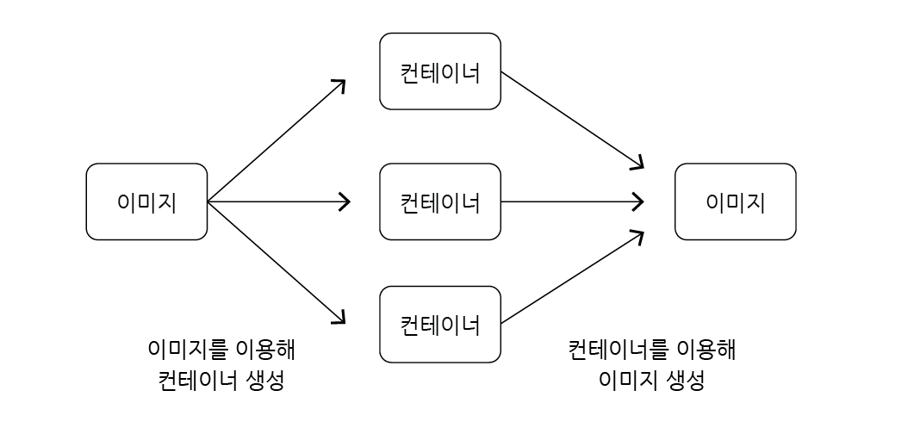

# 도커 이미지 생성하는 순서

## 목차

1. [직접 도커 이미지 생성](#1-직접-도커-이미지-생성)
    1. [docker create <이미지 이름>](#1-1-docker-create-이미지-이름)
        - [이미지와 컨테이너 전환](#--이미지와-컨테이너-전환)
        - [도커 이미지 생성하는 순서](#--도커-이미지-생성하는-순서)

<br/>
<br/>

## 1. 직접 도커 이미지 생성

- 현재까진 도커 허브에 이미 존재하던 도커 이미지를 가져와 사용했었음
- 직접 도커 이미지를 `만들어 사용`할 수 있으며, 직접 만든 도커 이미지를 도커 허브에 업로드하여 `공유 가능함`

<br/>

### 1-1. docker create <이미지 이름>

- 도커 이미지 생성하는 명령어

```bash
$ docker create <이미지 이름>
```
<br/>

### - 이미지와 컨테이너 전환

- 이미지를 이용하여 컨테이너를 생성하는 것이 가능하며 컨테이너를 이용하여 이미지를 생성하는 것이 가능함



<도커 이미지와 컨테이너 전환>

<br/>

### - 도커 이미지 생성하는 순서

```
도커 파일 작성 --> 도커 클라이언트 --> 도커 서버 --> 이미지 생성
```

- `도커 파일(Dockerfile)` : 도커 이미지를 만들기 위한 설정 파일로 컨테이너 행동 설정 정의
- `도커 클라이언트` : 도커 파일에 입력된 명령들이 도커 클라이언트에 전달되어야 됨
- `도커 서버` : 도커 클라이언트에 전달된 모든 중요한 작업들을 하는 곳