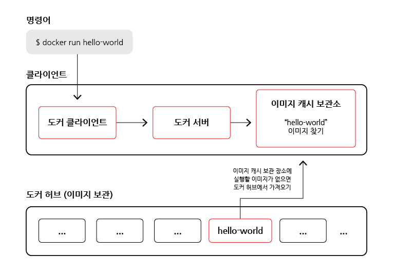

# Docker 사용 흐름

## 목차

1. [도커 사용하는 경우](#1-도커-사용하는-경우)
2. [커맨드](#2-커맨드)
    1. [docker run hello-world](#2-1-docker-run-hello-world)
        - [초기 이미지 호출](#--초기-이미지-호출)
        - [로컬에 Cache된 이미지 요청](#--로컬에-cache된-이미지-요청)

<br/>
<br/>

## 1. 도커 사용하는 경우

1. 도커 CLI에 커맨드를 입력
2. 도커 서버(도커 Daemon)이 입력한 커맨드를 전달받아 그것에 따라 `이미지를 생성` 또는 `컨테이너를 실행`하는 등의 작업을 하게 됨

```
도커 클라이언트 --> 도커 서버(데몬)
```

<br/>

## 2. 커맨드

### 2-1. docker run hello-world

- 명령어 터미널에 입력

```bash
$ docker run hello-world
```

<br/>

### - 초기 이미지 호출

```
- 명령어 입력 시, 표시되는 출력

Unable to find image 'hello-world:latest' locally
latest: Pulling from library/hello-world
c1ec31eb5944: Pull complete
Digest: sha256:d000bc569937abbe195e20322a0bde6b2922d805332fd6d8a68b19f524b7d21d
Status: Downloaded newer image for hello-world:latest

Hello from Docker!
This message shows that your installation appears to be working correctly.

To generate this message, Docker took the following steps:
 1. The Docker client contacted the Docker daemon.
 2. The Docker daemon pulled the "hello-world" image from the Docker Hub.
    (amd64)
 3. The Docker daemon created a new container from that image which runs the
    executable that produces the output you are currently reading.
 4. The Docker daemon streamed that output to the Docker client, which sent it
    to your terminal.

To try something more ambitious, you can run an Ubuntu container with:
 $ docker run -it ubuntu bash

Share images, automate workflows, and more with a free Docker ID:
 https://hub.docker.com/

For more examples and ideas, visit:
 https://docs.docker.com/get-started/
```

1. 도커 클라이언트에 커맨드를 입력 --> 클라이언트에서 도커 서버로 요청을 보냄
2. 서버에서 `hello-world`라는 `이미지`가 로컬에 `cache` 되어 있는지 확인함
3. 현재 없기에 `Unable to find image ~`라는 문구를 표시
4. `Docker Hub`라는 이미지 저장소에서 그 이미지를 가져오고 로컬에 `cache로 보관`
5. 이제 이미지가 있기에 그 이미지를 이용하여 `컨테이너를 생성`
6. 이미지로 생성된 컨테이너는 이미지에서 받은 설정, 조건에 따라 `프로그램을 실행`

<br/>

### - 로컬에 Cache된 이미지 요청

- 다시 docker run hello-world 명령어 실행

```
- 명령어 입력 시, 표시되는 출력

Hello from Docker!
This message shows that your installation appears to be working correctly.

To generate this message, Docker took the following steps:
 1. The Docker client contacted the Docker daemon.
 2. The Docker daemon pulled the "hello-world" image from the Docker Hub.
    (amd64)
 3. The Docker daemon created a new container from that image which runs the
    executable that produces the output you are currently reading.
 4. The Docker daemon streamed that output to the Docker client, which sent it
    to your terminal.

To try something more ambitious, you can run an Ubuntu container with:
 $ docker run -it ubuntu bash

Share images, automate workflows, and more with a free Docker ID:
 https://hub.docker.com/

For more examples and ideas, visit:
 https://docs.docker.com/get-started/
```

1. `Unable to find image ~`라는 문구가 표시되지 않음
2. cache된 이미지를 이용해 컨테이너를 생성하고, 프로그램을 실행

<br/>



<도커 이미지 요청 도식화>