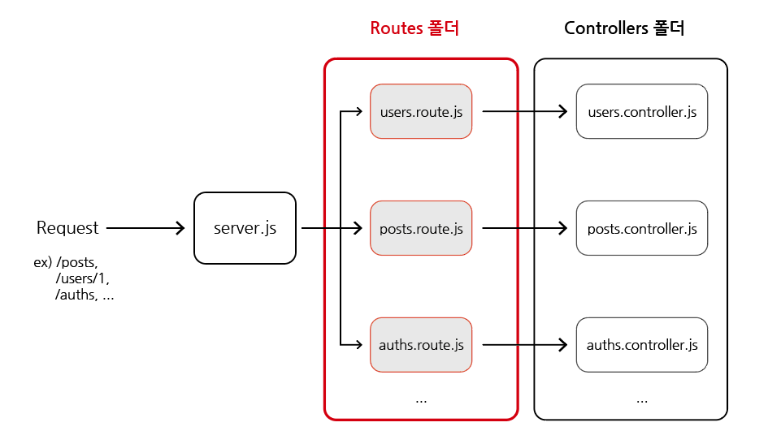

# Router

## 목차

1. [Router](#1-router)
    1. [Router의 필요성](#1-1-router의-필요성)
    2. [Router란?](#1-2-router란)
    3. [Router 생성하기](#1-3-router-생성하기)
        - [폴더 생성](#--폴더-생성)
        - [Router 파일 생성](#--router-파일-생성)
        - [Router 객체 생성 - Router()](#--router-객체-생성---router)
        - [server.js에서 router 등록하기](#--serverjs에서-router-등록하기)
    4. [Router와 middleware](#1-4-router와-middleware)
        - [url이 제대로 출력 안 되는 문제](#--url이-제대로-출력-안-되는-문제)
        - [baseUrl로 해결](#--baseurl로-해결)

<br/>
<br/>

## 1. Router

### 1-1. Router의 필요성

- server.js 하나의 파일에 app을 라우팅하는 API가 많아질수록 복잡해질 수 있음
- 이를 해결하기 위해 router가 필요함

```js
// 복잡한 server.js 예시

// 유저 관련 라우팅
app.get('/users/xxx', usersController.xxx);
app.get('/users/xxx', usersController.xxx);
app.get('/users/xxx', usersController.xxx);
app.post('/users/xxx', usersController.xxx);
app.post('/users/xxx', usersController.xxx);
app.post('/users/xxx', usersController.xxx);
// ...

// 포스트 관련 라우팅
app.get('/posts/xxx', postsController.xxx);
app.get('/posts/xxx', postsController.xxx);
app.get('/posts/xxx', postsController.xxx);
app.post('/posts/xxx', postsController.xxx);
app.post('/posts/xxx', postsController.xxx);
app.post('/posts/xxx', postsController.xxx);
// ...
```

<br/>

### 1-2. Router란?

- 클라이언트의 요청 경로(path)에 따라서 `해당 요청을 처리할 수 있는 곳으로 기능을 전달`해주는 것

<br/>

### 1-3. Router 생성하기

### - 폴더 생성

- 라우터들을 관리할 폴더 routes 생성

<br/>

### - Router 파일 생성

- routes/users.route.js
- routes/posts.route.js

<p align="center">
    <br/>
    <span>라우팅 과정</span>
</p>

<br/>

### - Router 객체 생성 - Router()

- router 파일에서 Express의 Router() 클래스를 이용해서 라우터 객체 생성하고 내보내기
- server.js 파일에서 controller 함수들 가져오기

```js
// routes/users.route.js

const express = require('express');

// 컨트롤러 가져오기
const usersController = require('../controllers/users.controller');

// 라우터 객체 생성
const usersRouter = express.Router();

// 라우터 객체에 미들웨어 함수 등록
usersRouter.get('/', usersController.getUsers);
usersRouter.get('/:userId', usersController.getUser);
usersRouter.post('/', usersController.postUser);

module.exports = usersRouter;
```

<br/>

### - server.js에서 router 등록하기

- 해당 라우터를 server.js로 가져와서 use()를 이용하여 라우터 등록하기

```js
// server.js

const usersRouter = require('./routes/users.route');

// server.js 파일에 경로에 따른 라우터 등록하기
app.use('/users', usersRouter);

// "/users"로 시작하는 요청이 오면 users.route 파일로 보내기
```

<br/>

### 1-4. Router와 middleware

### - url이 제대로 출력 안 되는 문제

- 미들웨어는 한 번 통과 후, 응답하기 전 한 번씩 미들웨어를 다시 통과함
- 따라서 메서드, url, 걸린 시간 로그를 확인하는 미들웨어를 생성했었음
- 문제는 `Router 사용 시`, 로그 측정 미들웨어를 `처음 통과할 때는 url이 제대로 출력`되지만, `다시 통과하게 되면 url이 제대로 출력되지 않음`

```js
// server.js

const express = require('express');
const usersRouter = require('./routes/users.route');

const PORT = 4000;

app.use(express.json());

// 메서드, url, 걸린 시간 로그 측정 미들웨어
app.use((req, res, next) => {
  const start = Date.now(); // 현재 시간 start
  console.log(`start : ${req.method} ${req.url}`);
  next(); // 미들웨어 통과함

  // 아래는 다시 한번 더 통과할 때 수행됨
  const diffTime = Date.now() - start; // 최초 통과에서 다시 통과할 때까지 걸린 시간
  console.log(`end : ${req.method} ${req.url} ${diffTime}ms`);
});

app.use('/users', usersRouter);

// 출력
// start : GET /users
// end : GET / 7ms --> url이 제대로 출력이 안 됨
```

<br/>

### - baseUrl로 해결

- `req.url`이 아닌 `req.baseUrl(라우터 인스턴스가 마운트된 URL 경로)`을 함께 사용해야 함

```js
// server.js

// ...
app.use((req, res, next) => {
  const start = Date.now();
  console.log(`start : ${req.method} ${req.url}`);
  next();
  const diffTime = Date.now() - start;
  console.log(`end : ${req.method} ${req.baseUrl}${req.url} ${diffTime}ms`);
});

//...

// 출력
// start : GET /users
// end : GET /users 7ms --> 다시 제대로 출력 됨
```