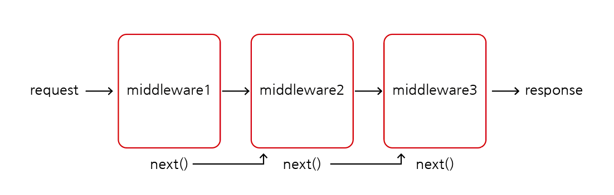
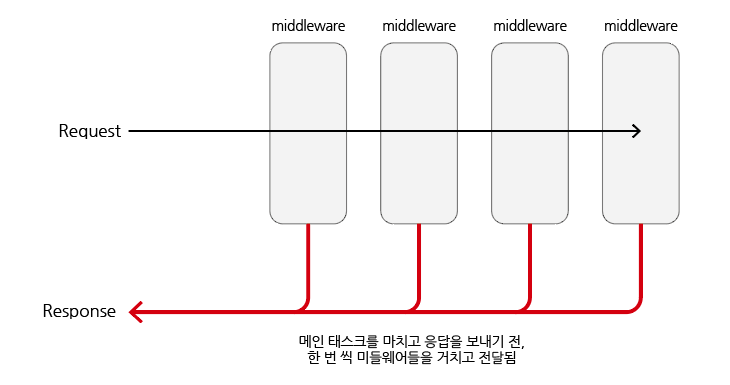

# middleware

## 목차

1. [middleware란?](#1-middleware란)
    1. [use()](#1-1-use)
    2. [next()](#1-2-next)
2. [middleware 생성하기](#2-middleware-생성하기)
3. [middleware와 응답](#3-middleware와-응답)

<br/>
<br/>

## 1. middleware란?

<p align="center">
    <br/>
    <span>middleware</span>
</p>

- Express는 자체 기능이 최소화된 라우팅 및 미들웨어 웹 프레임워크로 Express 애플리케이션은 본질적으로 `일련의 미들웨어 기능 호출임`
- 미들웨어 기능은 애플리케이션의 요청, 응답 주기에서 요청 객체(req), 응답 객체(res), next 미들웨어 함수에 접근할 수 있는 기능
- `next 미들웨어 기능`은 일반적으로 `next`라는 변수로 표시함

```js
// middleware 사용 예시

const express = require('express');
const app = express();

app.use((req, res, next) => { // use() : 미들웨어 등록
  console.log('Time:', Date.now());
  next(); // next() : 다음 미들웨어로 이동
})
```

<br/>

### 1-1. use()

- 미들웨어를 등록할 때 사용하는 메서드

<br/>

### 1-2. next()

- 다음 미들웨어로 이동할 때 사용하는 함수

<br/>
<br/>

## 2. middleware 생성하기

- 요청에 대한 로그를 남기는 미들웨어 생성하기

```js
const app = express();

app.use((req, res, next) => {
  console.log(`${req.method} ${req.url}`);
  next();
})
```

<br/>
<br/>

## 3. middleware와 응답

- 실제로는 요청을 받고 미들웨어를 거친 뒤, 다시 미들웨어를 `한 번 씩 거치고` 응답이 전달됨

<p align="center">
    <br/>
    <span>middleware와 응답 과정</span>
</p>

<br/>

- 실제로 요청부터 응답까지 `걸린 시간 로그`를 찍는 미들웨어를 생성해보기
- 약간의 시간이 소요됨을 확인할 수 있음

```js
// server.js

app.use((req, res, next) => {
  const start = Date.now(); // 현재 시간 start
  console.log(`start : ${req.method} ${req.url}`);
  next(); // 미들웨어 통과함

  // 아래는 다시 한번 더 통과할 때 수행됨
  const diffTime = Date.now() - start; // 최초 통과에서 다시 통과할 때까지 걸린 시간
  console.log(`end : ${req.method} ${req.url} ${diffTime}ms`);
});

// 출력
// start : GET /users
// end : GET /users 7ms
```

- 위의 로그 시간은 전체 미들웨어를 통과하고 응답까지 걸린 시간을 측정한 것이 아닌 해당 단일 미들웨어를 1차 통과 후, 2차 통과하는데 걸리는 시간임을 주의