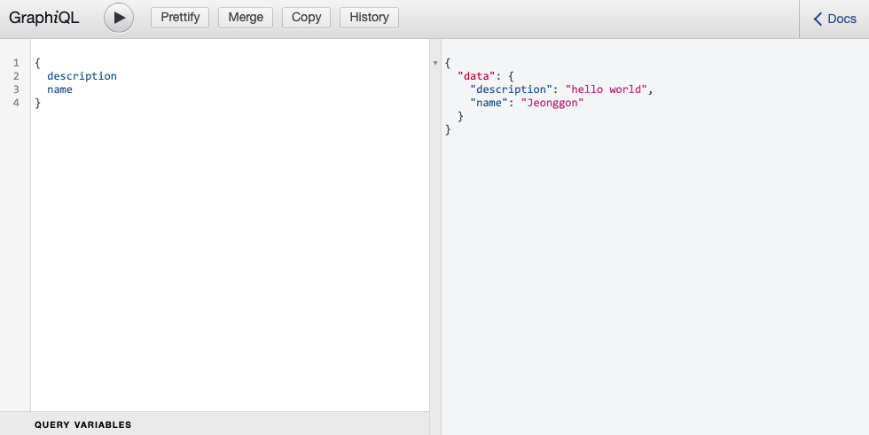

# GraphiQL

## 목차

1. [GraphiQL이란?](#1-graphiql이란)
    1. [GraphiQL 사용](#1-1-graphiql-사용)
        - [설정추가](#--설정추가)
        - [브라우저로 접근](#--브라우저로-접근)

<br/>
<br/>

## 1. GraphiQL이란?

- `GraphQL을 테스트` 할 수 있는 IDE로서 로컬에서 개발할 때도 사용할 수 있으며 효율적인 개발이 가능함
- 따로 추가적인 설치없이 `express-graphql 패키지 안에 내장`되어 있음

<br/>

### 1-1. GraphiQL 사용

### - 설정추가

- graphqlHTTP 속성에 `graphiql:true` 를 추가하기

```js
// server.js

// ...
app.use(
  "/graphql",
  graphqlHTTP({
    schema: schema,
    rootValue: root,
    graphiql: true, // 추가하기
  })
);
// ...
```

<br/>

### - 브라우저로 접근

- graphql URL로 접근

```
http://localhost:4000/graphql
```

<p align="center">
    <br/>
    <span>브라우저에서 URL을 통해 GraphiQL 실행</span>
</p>