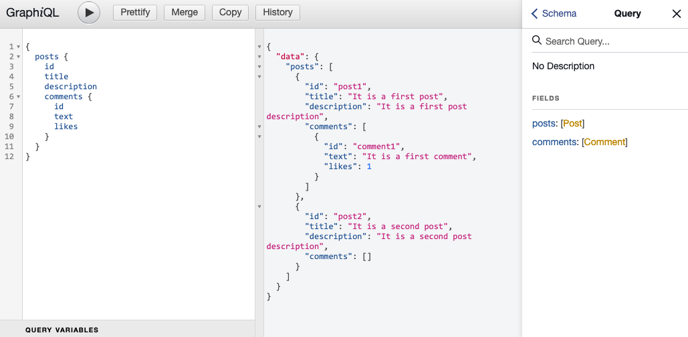

# Schema

## 목차

1. [Schema](#1-schema)
    1. [Schema 작성하기](#1-1-schema-작성하기)
        - [Scalar types](#--scalar-types)
    2. [rootValue 생성](#1-2-rootvalue-생성)
    3. [GraphiQL로 데이터 가져오기](#1-3-graphiql로-데이터-가져오기)

<br/>
<br/>

## 1. Schema

### 1-1. Schema 작성하기

- 포스트(게시물)이 있고 포스트 안에 코멘트(댓글)이 있는 구조의 스키마 작성
- Type 뒤에 `느낌표('!')`를 붙이면 해당 키는 `무조건 존재`해야 함을 의미

```js
// server.js
// 스키마 작성

// ...
const schema = buildSchema(`
    type Query {
        posts: [Post]
        comments: [Comment]
    }

    type Post {
        id: ID!
        title: String!
        description: String!
        comments: [Comment]
    }

    type Comment {
        id: ID!
        text: String!
        likes: Int

    }
`);
// ...
```

<br/>

### - Scalar types

- 프로그래밍 언어의 원시 타입과 유사
- [apollo 공식 사이트 - Scalar types](https://www.apollographql.com/docs/apollo-server/schema/schema/#scalar-types)
- ex) Int, Float, String, Boolean, `ID(캐싱을 위한 key로 사용, 객체를 다시 가져오는데 사용)`

<br/>

### 1-2. rootValue 생성

- 하드코딩 된 데이터 rootValue 작성하기

```js
// server.js

// ...
const root = {
  posts: [
    {
      id: "post1",
      title: "It is a first post",
      description: "It is a first post description",
      comments: [
        {
          id: "comment1",
          text: "It is a first comment",
          likes: 1,
        },
      ],
    },
    {
      id: "post2",
      title: "It is a second post",
      description: "It is a second post description",
      comments: [],
    },
  ],
  comments: [
    {
      id: "comment1",
      text: "It is a first comment",
      likes: 1,
    },
  ],
};
// ...
```

<br/>

### 1-3. GraphiQL로 데이터 가져오기

```graphql
# GraphiQL에서 실행

{
    posts {
        id
        title
        description
        comments {
            id
            text
            likes
        }
    }
}
```

<br/>

<p align="center">
    <br/>
    <span>GraphiQL로 데이터 가져오기</span>
</p>