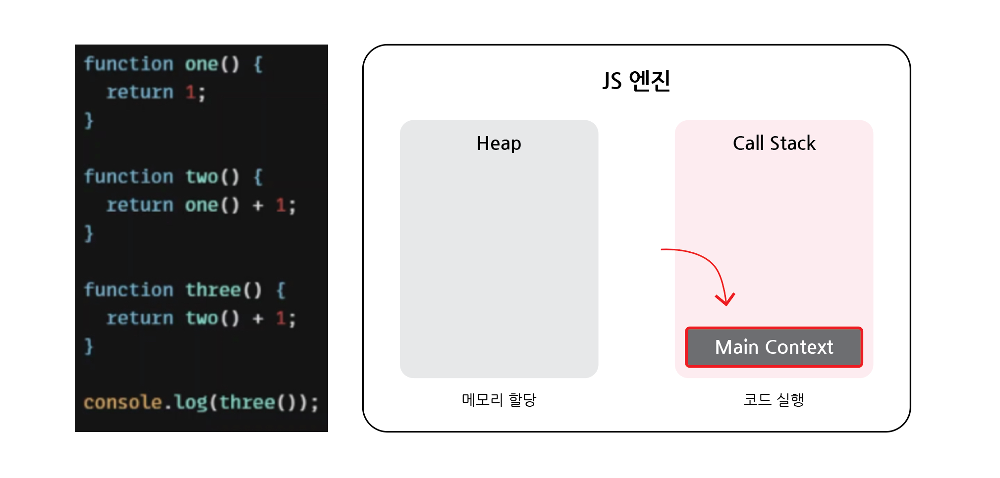

# 동기 & 비동기

## 목차

1. [동기 방식](#1-동기-방식)
    1. [동기 작동원리](#1-1-동기-작동원리)
        - [멀티 스레드(Multi Thread)](#멀티-스레드multi-thread)
        - [JavaScript 스레드](#javascript-스레드)
    2. [동기 방식 코드](#1-2-동기-방식-코드)
2. [비동기 방식](#2-비동기-방식)
    1. [비동기 작동원리](#2-1-비동기-작동원리)
    2. [비동기 방식 코드](#2-2-비동기-방식-코드)
3. [JavaScript의 동기, 비동기 구분](#3-javascript의-동기-비동기-구분)
    1. [JavaScript 엔진은 어떻게 동기와 비동기를 구분하여 수행하는가?](#3-1-javascript-엔진은-어떻게-동기와-비동기를-구분하여-수행하는가)
        - [동기 작동](#동기-작동)
        - [비동기 작동](#비동기-작동)

<br>
<br>

## 1. 동기 방식

-   동기 및 비동기는 JavaScript의 동작과 매우 큰 관련이 있다.

<br>

### 1-1. 동기 작동원리


-   블로킹 방식 : JavaScript는 순서대로 코드를 처리하며, 이전 작업들이 처리가 완료될 때까지 다음 작업들은 기다리게 됨
-   `순차적 작업방식`을 `동기 방식`이라고 함
-   각각의 작업처리 시간이 길어질수록 전체 작업 처리시간에 영향을 주는 문제점이 발생

<br>

### - 멀티 스레드(Multi Thread)


-   이런 문제를 해결할 수 있는 아이디어로 멀티 스레드를 활용하는 방식을 생각해 볼 수 있음
-   멀티 스레드는 `작업을 분할`하여 처리하므로 전체 처리시간을 줄일 수 있음

<br>

### - JavaScript 스레드

-   하지만 `JavaScript`는 `싱글 스레드`로 동작하기에 멀티 스레드 방식을 사용하는 것이 불가능함

<br>

### 1-2. 동기 방식 코드

```javascript
// ex) 동기 방식

function taskA() {
    console.log("A작업끝");
}

function taskB() {
    console.log("B작업끝");
}

function taskC() {
    console.log("C작업끝");
}

taskA();
taskB();
taskC();
console.log("코드끝");

// 출력
// 'A작업끝'
// 'B작업끝'
// 'C작업끝'
// '코드끝'
```

-   동기 : `순차적`으로 코드 실행

<br>
<br>

## 2. 비동기 방식

### 2-1. 비동기 작동원리


-   싱글 스레드를 이용하면서, 동기 작업 방식의 문제점을 극복하기 위해 `논블로킹 방식` 적용
-   `논블로킹 방식` : 하나의 스레드에서 이전 작업이 처리완료될 때까지 기다리지 않고 `동시에` 실행시킴

<br>

### 2-2. 비동기 방식 코드

```javascript
// ex) 비동기 방식

function taskA() {
    setTimeout(() => {
        console.log("A작업끝");
    }, 2000);
}

taskA();
console.log("코드끝");

// 출력
// '코드끝'
// 'A작업끝'
```

-   비동기 : `먼저 완료`된 작업이 `먼저 실행`됨
-   `setTimeout()` : 시간 지연 메서드로 `콜백함수`와 `지연시간(delay)`를 파라미터로 받음
    -   지연시간의 경우 단위는 `ms` (1000ms == 1s)

<br>

```javascript
// ex) 비동기 방식(+ 콜백함수)

function taskA(a, b, cb) {
    setTimeout(() => {
        const res = a + b;
        cb(res); // 콜백함수의 콜백함수
    }, 3000);
}

taskA(3, 4, (res) => {
    console.log("A작업결과: ", res);
});

console.log("코드끝");

// 출력
// '코드끝'
// A작업결과: 7

// ----------------------------------------------------

// ex)

function taskA(a, b, cb) {
    setTimeout(() => {
        const res = a + b;
        cb(res);
    }, 3000);
}

function taskB(a, cb) {
    setTimeout(() => {
        const res = a * 2;
        cb(res);
    }, 1000);
}

taskA(3, 4, (res) => {
    console.log("A작업결과: ", res);
});

taskB(7, (res) => {
    console.log("B작업결과: ", res);
});

console.log("코드끝");

// 출력
// '코드끝'
// B작업결과: 14
// A작업결과: 7
```

-   비동기 방식으로 시간이 덜 걸리는 순서로 출력됨

<br>
<br>

## 3. JavaScript의 동기, 비동기 구분

### 3-1. JavaScript 엔진은 어떻게 동기와 비동기를 구분하여 수행하는가?

### - 동기 작동


-   JavaScript 엔진은 `Heap`과 `Call Stack` 두 가지로 구성됨
-   `Heap` : 변수, 상수의 메모리를 저장하는 영역 (동기, 비동기와 크게 상관 없음)
-   `Call Stack` : 작성한 코드의 실행에 따라서 호출 스택을 쌓는 영역

<br>

1. Main Context



-   Main Context가 프로그램이 시작될 때, Call Stack에 들어가게 되고 프로그램이 종료될 때, Call Stack에서 나오게 됨

<br>

2. 선언 및 호출


-   함수 one(), two(), three()는 선언만 됨
-   `console.log(three());`가 실행 이를 위해 `three()` 함수가 호출되어 Call Stack에 추가

<br>

3. 순차적 실행


-   함수 three() 에서 리턴 값에 `two() 함수`가 있기에 two() 를 호출하고 Call Stack에 추가

<br>


-   동일한 구조로 함수 two()에서 `one()`을 이용하기에 one()을 호출하고 Call Stack에 추가

<br>

4. 작업완료


-   one() 함수를 실행하여 1을 리턴하고 종료
-   Call Stack에서 one() 함수 빠짐 (pop)

<br>


-   two() 함수 실행하여 2를 리턴하고 종료
-   Call Stack에서 two() 함수 빠짐

<br>


-   동일하게 three() 함수 실행 후, Call Stack에서 three() 함수 제거

<br>


-   console.log(three());의 결과 값인 3을 콘솔에 출력

<br>


-   모든 코드가 실행되고 완료되어 Call Stack에서 Main Context가 빠짐 (= 프로그램 종료)
-   즉, JavaScript는 `Call Stack이 1개`인 `싱글 스레드`

<br>

### - 비동기 작동


-   기존의 JS엔진 (Heap + Call Stack)과 더불어 `Web APIs`, `Callback Queue`, `Event Loop`란 새로운 구성요소들이 포함됨
-   `Web APIs` : 비동기 처리 코드 보관 및 실행
-   `Callback Queue` : 콜백함수 보관
-   `Event Loop` : Call Stack에 더 이상 호출 코드가 없을 경우, 콜백함수를 Call Stack에 전달

<br>

1. Main Context 실행, 함수 호출


-   ayncAdd 함수가 호출되어 Call Stack에 asyncAdd()를 넣기

<br>

2. 비동기 함수 호출


-   asyncAdd() 함수를 실행하려고 하니, 내부에 setTimeout()의 비동기 함수 호출
-   setTimeout()를 Call Stack에 추가
-   setTimeout()은 cb()라는 콜백함수가 포함됨

<br>

3. Web APIs


-   JS엔진은 비동기로 수행되는 `setTimeout()` 함수를 `Web APIs`로 넘겨버림
-   그곳에서 지연시간 3초를 기다리게 됨

<br>

4. 다음 코드 실행


-   setTimeout() 함수가 Call Stack에 머무르지 않게 되어, 다음 코드인 asyncAdd()를 실행함

<br>

5. Callback Queue


-   setTimeout() 함수는 3초가 지난 후, Web APIs에서 제거되고 콜백함수인 `cb()` 함수는 `Callback Queue`로 옮겨짐

<br>

6. Event Loop


-   Callback Queue에 있던 cb() 콜백함수는 `Event Loop`에 의해 다시 `Call Stack`으로 넘겨짐
-   Event Loop는 Call Stack에 Main Context를 제외한 다른 함수가 남아있는지를 계속 확인하고, 만약 아무것도 남아있지 않다면 콜백함수를 실행할 수 있겠다고 판단하여 콜백함수를 넘겨줌

<br>

7. 작업완료


-   콘솔에 결과가 출력되고 Main Context가 Call Stack에서 제거되고 프로그램이 종료됨
