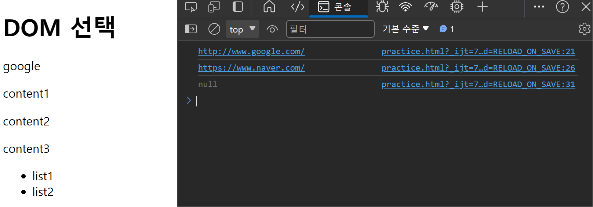

# DOM

## 목차

1. [JavaScript 실행 환경](#1-javascript-실행-환경)
2. [DOM 기본 개념](#2-dom-기본-개념)
    1. [DOM](#2-1-dom)
    2. [브라우저가 웹 페이지를 불러오는 과정](#2-2-브라우저가-웹-페이지를-불러오는-과정)
    3. ['document' object](#2-3-document-object)
        - ['document' 객체 접근 예시](#document-객체-접근-예시)
3. [DOM Query(선택)](#3-dom-query선택)
    1. [요소 선택](#3-1-요소-선택)
        - [DOM 선택 예시](#dom-선택-예시)
4. [DOM Manipulation(조작)](#4-dom-manipulation조작)
    1. [속성(attribute) 조작](#4-1-속성attribute-조작)
        - ['classList' property 예시](#classlist-property-예시)
    2. [일반 속성 조작](#4-2-일반-속성-조작)
        - [일반 속성 조작 예시](#일반-속성-조작-예시)
    3. ['textContent' property 조작](#4-3-textcontent-property-조작)
        - ['textContent' property 조작 예시](#textcontent-property-조작-예시)
    4. [DOM 조작(생성/추가/삭제)](#4-4-dom-조작생성추가삭제)
        - [DOM 조작 예시](#dom-조작-예시)
    5. ['style' property 조작](#4-5-style-property-조작)
        - ['style' property 조작 예시](#style-property-조작-예시)
    6. [정리](#4-6-정리)
5. [참고](#5-참고)
    1. [요소별 DOM property 확인 Tip](#5-1-요소별-dom-property-확인-tip)
    2. [appendChild()의 특성](#5-2-appendchild의-특성)
    3. [Parsing(파싱)](#5-3-parsing파싱)

<br>
<br>

## 1. JavaScript 실행 환경

1. HTML Script 태그
2. js 확장자 파일
3. 브라우저 콘솔

<br>
<br>

## 2. DOM 기본 개념

### 2-1. DOM

-   웹 페이지(Document)를 구조화된 객체로 제공하며, `프로그래밍 언어가 웹 페이지를 사용할 수 있게` 연결시킴

<br>

### 2-2. 브라우저가 웹 페이지를 불러오는 과정


<DOM 트리>

-   문서(Document)는 웹 브라우저를 통해 해석되어 화면에 나타남
-   `DOM`은 이러한 `문서를 조작하는 방법을 제공하는 API`임
-   브라우저는 HTML 문서를 해석하여 `DOM tree`라는 객체의 트리로 구조화함
-   DOM에서 모든 요소, 속성, 텍스트는 하나의 객체이며, 모두 document 객체의 자식임
-   웹 페이지를 동적으로 만드는 것은 웹 페이지를 조작(CRUD)하는 것과 같음
    -   조작하는 순서는 다음과 같음
    -   조작하고자 하는 요소를 `선택` 또는 `탐색`
    -   선택된 요소의 컨텐츠 또는 속성을 `조작`

<br>

### 2-3. 'document' object

-   웹 페이지 객체
-   DOM tree의 진입점
-   페이지를 구성하는 모든 객체 요소를 포함

<br>

### - 'document' 객체 접근 예시

-   HTML의 `<title>`값 변경하기


-   `document.title`의 점 표기법으로 document 객체의 title 값에 접근하여 수정

<br>
<br>

## 3. DOM Query(선택)

### 3-1. 요소 선택

-   요소 하나 선택 : `document.querySelector(selector)`

    -   제공한 선택자와 일치하는 element 한 개를 선택
    -   제공한 CSS selector를 만족하는 첫 번째 element 객체를 반환함(없을 경우, null 반환)

-   요소 여러 개 선택 : `document.querySelectorAll(selector)`
    -   제공한 선택자와 일치하는 여러 element를 선택
    -   매칭할 하나 이상의 선택자를 포함하는 유효한 CSS selector를 인자(문자열)로 받음
    -   제공한 CSS selector를 만족하는 NodeList를 반환

<br>

### - DOM 선택 예시

```html
<body>
    <h1 class="title heading">DOM 선택</h1>
    <a href="http://www.google.com/">google</a>
    <p class="text">content1</p>
    <p class="text">content2</p>
    <p class="text">content3</p>
    <ul>
        <li>list1</li>
        <li>list2</li>
    </ul>
    <script>
        console.log(document.querySelector(".title"));
        console.log(document.querySelector(".text"));
        console.log(document.querySelectorAll(".text"));
        console.log(document.querySelectorall("ul > li"));
    </script>
</body>
```


<DOM 선택 예시 결과>

<br>
<br>

## 4. DOM Manipulation(조작)

### 4-1. 속성(attribute) 조작

-   클래스 속성 조작('classList' property) : 요소의 클래스 목록을 `DOMTokenList(유사 배열)` 형태로 반환
-   `add()`와 `remove()` 메서드를 사용해 지정한 클래스 값을 `추가` 혹은 `제거`
    -   `element.classList.add()` : 지정한 클래스 값을 추가
    -   `element.classList.remove()` : 지정한 클래스 값을 제거

<br>

### - 'classList' property 예시

```html
<body>
    <h1 class="title heading">DOM 선택</h1>
    <a href="http://www.google.com/">google</a>
    <p class="text">content1</p>
    <p class="text">content2</p>
    <p class="text">content3</p>
    <ul>
        <li>list1</li>
        <li>list2</li>
    </ul>
    <script>
        // .heading의 클래스를 가진 요소를 선택하여 h1Tag 변수로 할당
        let h1Tag = document.querySelector(".heading");
        console.log(h1Tag.classList);

        // 해당 변수의 클래스 리스트에 test 값 추가
        h1Tag.classList.add("test");
        console.log(h1Tag.classList);

        // 해당 변수의 클래스 리스트에서 test 값 제거
        h1Tag.classList.remove("test");
        console.log(h1Tag.classList);
    </script>
</body>
```


<클래스 리스트 예시 결과>

<br>

### 4-2. 일반 속성 조작

-   조회하기 : `Element.getAttribute(selector)`

    -   해당 요소에 지정된 값을 반환

-   설정(수정)하기 : `Element.setAttribute(selector, 수정할 값)`

    -   지정된 요소의 속성 값을 설정
    -   속성이 이미 있으면 값이 업데이트 / 없으면 지정된 이름과 값으로 새로운 속성 추가

-   삭제하기 : `Element.removeAttribute(selector)`
    -   요소에서 지정된 이름을 가진 속성 제거

<br>

### - 일반 속성 조작 예시

```html
<body>
    <h1 class="title heading">DOM 선택</h1>
    <a href="http://www.google.com/">google</a>
    <p class="text">content1</p>
    <p class="text">content2</p>
    <p class="text">content3</p>
    <ul>
        <li>list1</li>
        <li>list2</li>
    </ul>
    <script>
        // a태그의 요소를 찾아 변수 aTag로 할당
        // 변수 aTag의 href 속성의 값 조회
        let aTag = document.querySelector("a");
        console.log(aTag.getAttribute("href"));

        // 변수 aTag의 href 속성의 값을 'https://www.naver.com/'으로 설정
        // 수정된 변수 aTag의 href 속성 값 조회
        aTag.setAttribute("href", "https://www.naver.com/");
        console.log(aTag.getAttribute("href"));

        // 변수 aTag의 href 속성의 값을 삭제
        // 수정된 변수 aTag의 href 속성 값 조회
        aTag.removeAttribute("href");
        console.log(aTag.getAttribute("href"));
    </script>
</body>
```



<일반 속성 조작 예시 결과>

<br>

### 4-3. 'textContent' property 조작

-   HTML 컨텐츠 조작
-   요소의 텍스트 컨텐츠를 표현
    -   ex) `<h1>Heading</h1>`에서 `Heading`에 해당하는 부분

<br>

### - 'textContent' property 조작 예시

```html
<body>
    <h1 class="title heading">DOM 선택</h1>
    <a href="http://www.google.com/">google</a>
    <p class="text">content1</p>
    <p class="text">content2</p>
    <p class="text">content3</p>
    <ul>
        <li>list1</li>
        <li>list2</li>
    </ul>
    <script>
        const h1Tag = document.querySelector(".heading");
        console.log(h1Tag.textContent);

        h1Tag.textContent = "컨텐츠 수정";
        console.log(h1Tag.textContent);
    </script>
</body>
```


<텍스트 컨텐츠 예시 결과>

<br>

### 4-4. DOM 조작(생성/추가/삭제)

-   생성하기 : `.createElement()`
-   추가하기 : `.appendChild()`
-   삭제하기 : `.removeChild()`

<br>

### - DOM 조작 예시

```html
<body>
    <div></div>

    <script>
        // 생성
        const h1Tag = document.createElement("h1");
        h1Tag.textContent = "제목";

        // 추가
        const divTag = document.querySelector("div");
        divTag.appendChild(h1Tag);

        // 삭제
        divTag.removeChild(h1Tag);
    </script>
</body>
```

<br>

### 4-5. 'style' property 조작

-   해당 요소의 모든 `스타일 속성 목록`을 포함하는 속성
-   `.style.(스타일)`로 접근 가능

<br>

### - 'style' property 조작 예시

```html
<body>
    <p>Heading</p>

    <script>
        // p태그 요소를 상수 pTag에 할당하고
        // 상수 pTag의 스타일 속성 중 color는 'crimson'으로
        // fontSize는 '3rem'으로 설정
        const pTag = document.querySelector("p");
        pTag.style.color = "crimson";
        pTag.style.fontSize = "3rem";
    </script>
</body>
```


<스타일 속성 예시 결과>

<br>

### 4-6. 정리

1. 속성(attribute) 조작
    - 클래스 속성 조작 : classList & add() & remove()
    - 일반 속성 조작 : getAttribute() & setAttribute() & removeAttribute()
2. HTML 컨텐츠 조작
    - textContent
3. DOM 조작
    - createElement() & appendChild() & removeChild()
4. style 조작
    - style.(스타일)

<br>
<br>

## 5. 참고

### 5-1. 요소별 DOM property 확인 Tip


-   `개발자 도구 - Elements - Properties`에서 해당 요소의 모든 DOM property 확인 가능

<br>

### 5-2. appendChild()의 특성


-   이미 문서에 `존재하는 요소`를 다른 요소의 자식으로 삽입하는 경우, 복사되는 것이 아닌 `위치를 이동시킴`

<br>

### 5-3. Parsing(파싱)

-   브라우저가 문자열을 읽고 해석하여 DOM tree를 생성하는 과정을 `파싱`이라고 함
