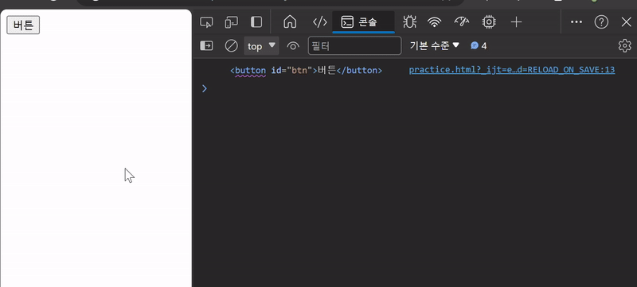
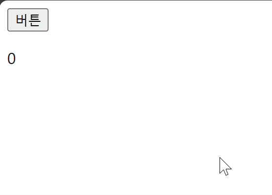
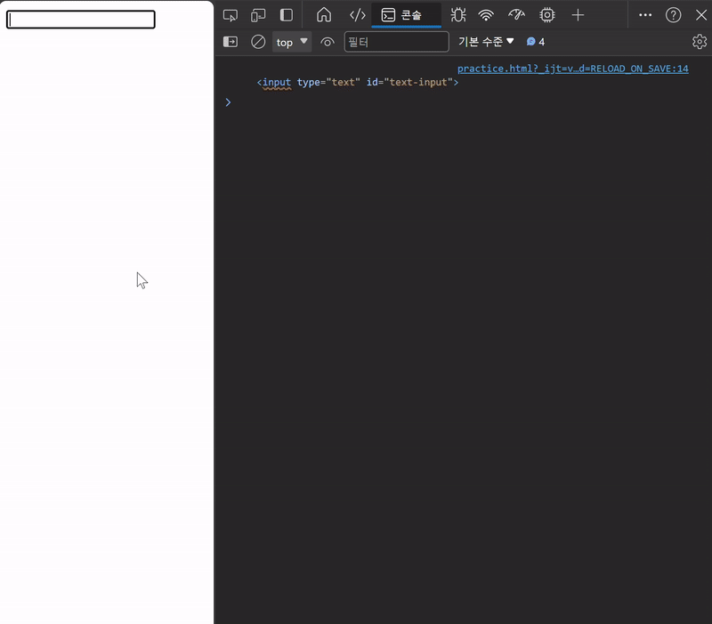
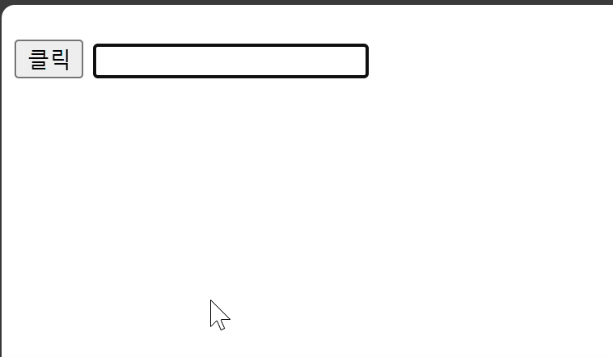
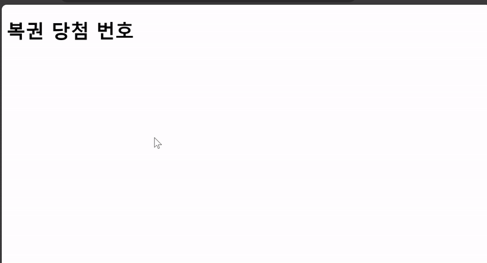
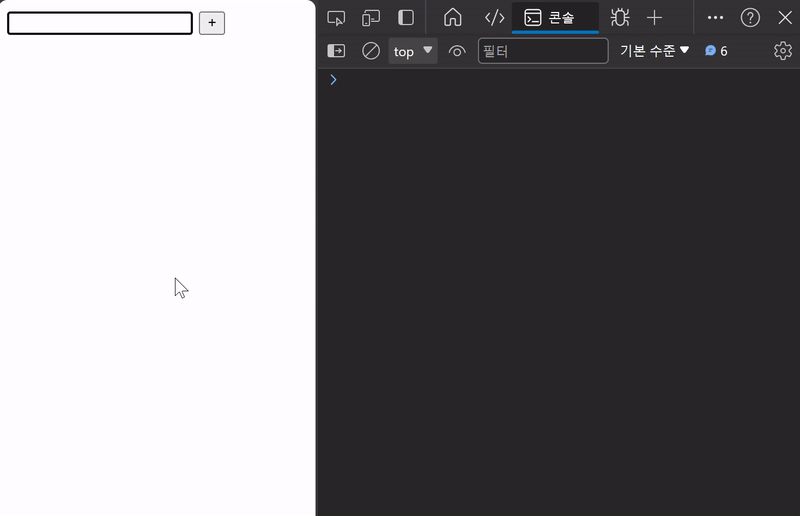
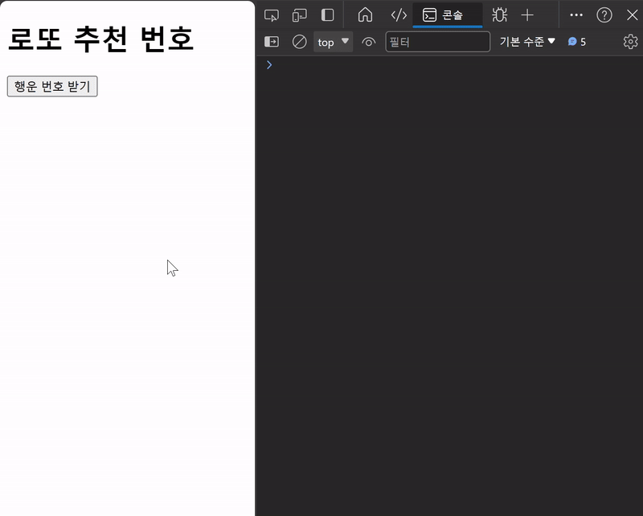

# 이벤트 조작하기

## 목차

1. [이벤트](#1-이벤트)
    1. [event](#1-1-event)
    2. [event 종류](#1-2-event-종류)
    3. [event handler](#1-3-event-handler)
        - [.addEventListener()](#addeventlistener)
        - [event handler 예시](#event-handler-예시)
2. [이벤트 핸들러 활용](#2-이벤트-핸들러-활용)
    1. [click 이벤트](#2-1-click-이벤트)
    2. [input 이벤트](#2-2-input-이벤트)
    3. [click & input 이벤트](#2-3-click--input-이벤트)
    4. [이벤트 취소하기](#2-4-이벤트-취소하기)
        - [.preventDefault()](#preventdefault)
    5. [간단한 To do 만들기](#2-5-간단한-to-do-만들기)
    6. [로또 번호 생성기 예시](#2-6-로또-번호-생성기-예시)
        - [lodash](#lodash)
3. [참고](#3-참고)
    1. [addEventListener와 this](#3-1-addeventlistener와-this)

<br>
<br>

## 1. 이벤트

### 1-1. event

-   무언가 일어났다는 신호, 사건(모든 DOM요소는 이러한 신호를 만들어 냄)
-   웹에서의 이벤트
    -   버튼 클릭 시 나타나는 반응
    -   마우스 커서의 위치에 따라 드래그 앤 드롭
    -   입력 값에 따른 요소 생성 등...

<br>

### 1-2. event 종류

-   마우스, 인풋, 키보드, 터치 등...
-   DOM 요소는 event를 받고 받은 event를 `처리`할 수 있음

<br>

### 1-3. event handler

-   이벤트가 발생했을 때 실행되는 `함수`
-   사용자의 행동에 어떻게 반응할 지를 JavaScript 코드로 표현한 것

<br>

### - .addEventListener()

-   대표적인 이벤트 핸들러 중 하나
-   특정 이벤트를 DOM 요소가 수신할 때마다 콜백함수를 호출

```javascript
// 기본적인 구성
EventTarget.addEventListener(type, handler);
```

-   `EventTarget` : DOM 요소

-   `type` : 특정 이벤트

    -   이벤트 이름(ex. 'click')

-   `handler` : 콜백함수

    -   발생한 이벤트 객체를 수신하는 콜백함수
    -   콜백함수는 발생한 Event object를 유일한 매개변수로 받음

-   `대상(EventTarget)`에 `특정 이벤트(type)`가 발생하면 `할 일(handler)`을 등록함

<br>

### - event handler 예시

```html
<body>
    <button id="btn">버튼</button>

    <script>
        // 1. 버튼 선택
        const btn = document.querySelector("#btn");
        console.log(btn);

        // 2. 버튼에 이벤트 핸들러 부착
        btn.addEventListener("click", (event) => {
            // 이벤트 객체
            console.log(event);

            // 이벤트가 발생한 대상
            // console.log(this) // 화살표 함수에서는 window
            console.log(event.target);
        });
    </script>
</body>
```



<event handler 예시 결과>

<br>
<br>

## 2. 이벤트 핸들러 활용

### 2-1. click 이벤트

-   버튼을 클릭하면 숫자를 1씩 증가

```html
<body>
    <button id="btn">버튼</button>
    <p id="counter">0</p>

    <script>
        // 1. 초기 값 할당 (0)
        let counterNumber = 0;

        // 2. 버튼 요소 선택
        const btn = document.querySelector("#btn");

        // 3. 버튼에 이벤트 핸들러 부착 (클릭 이벤트)
        btn.addEventListener("click", () => {
            // 3.1 버튼에 클릭 이벤트가 발생할 때마다 실행할 코드를 작성
            // 3.2 초기 값 += 1
            counterNumber += 1;

            // 3.3 p요소를 선택
            const pTag = document.querySelector("#counter");

            // 3.4 p요소의 컨텐츠를 1 증가한 초기 값으로 설정
            pTag.textContent = counterNumber;
        });
    </script>
</body>
```



<click 이벤트 예시 결과>

<br>

### 2-2. input 이벤트

-   사용자의 입력 값을 실시간으로 출력하기

```html
<body>
    <input type="text" id="text-input" />
    <p></p>

    <script>
        // 1. input요소 선택
        const inputTag = document.querySelector("#text-input");
        console.log(inputTag);

        // 2. p요소 선택
        const pTag = document.querySelector("p");

        // 3. input요소에 이벤트 핸들러 부착 (input 이벤트)
        inputTag.addEventListener("input", (event) => {
            // 3.1 작성하는 데이터가 어디에 누적되고 있는지 찾기
            console.log(event);
            console.log(event.target.value);

            // 3.2 p요소의 컨텐츠에 작성하는 데이터를 추가
            pTag.textContent = event.target.value;
        });
    </script>
</body>
```



<input 이벤트 예시 결과>

<br>

### 2-3. click & input 이벤트

-   사용자의 입력 값을 실시간으로 출력하기
-   버튼을 클릭하면 출력한 값의 스타일을 변경하기

```html
<head>
    <style>
        .blue {
            color: blue;
        }
    </style>
</head>

<body>
    <h1></h1>
    <button id="btn">클릭</button>
    <input type="text" id="text-input" />

    <script>
        // input
        const inputTag = document.querySelector("#text-input");
        const h1Tag = document.querySelector("h1");

        inputTag.addEventListener("input", (event) => {
            h1Tag.textContent = event.target.value;
        });

        // button
        const btn = document.querySelector("#btn");

        btn.addEventListener("click", () => {
            h1Tag.classList.toggle("blue");
            // toggle메서드 : 클래스가 존재하면 삭제, 없으면 추가
        });
    </script>
</body>
```



<click & input 이벤트 예시 결과>

<br>

### 2-4. 이벤트 취소하기

-   텍스트를 복사하려고 하면 알림창을 띄우면서 복사 중단하기

```html
<body>
    <h1>복권 당첨 번호</h1>

    <script>
        const h1Tag = document.querySelector("h1");

        h1Tag.addEventListener("copy", (event) => {
            console.log(event);
            event.preventDefault();
            alert("복사 할 수 없어요!!");
        });
    </script>
</body>
```



<이벤트 취소 예시 결과>

<br>

### - .preventDefault()

-   현재 Event의 기본 동작을 중단

<br>

### 2-5. 간단한 To do 만들기

-   할 일을 입력하고 버튼을 클릭하면 할 일 요소를 생성
-   input 컨텐츠를 작성하지 않고 버튼 클릭 시, 경고 알림 출력

```html
<body>
    <input type="text" class="input-text" />
    <button id="btn">+</button>
    <ul></ul>

    <script>
        // 1. 필요한 요소 모두 선택
        const inputTag = document.querySelector(".input-text");
        const btn = document.querySelector("#btn");
        const ulTag = document.querySelector("ul");

        const addTodo = (event) => {
            // 2.1 사용자 입력 데이터 저장
            const inputData = inputTag.value;
            console.log(inputData);

            // 2.2 사용자 입력 데이터 공백 제거 후 확인
            if (inputData.trim()) {
                // 2.3 데이터를 지정할 li 요소 생성
                const liTag = document.createElement("li");

                // 2.4 li요소 컨텐츠에 데이터 입력
                liTag.textContent = inputData;
                console.log(liTag);

                // 2.5 li요소를 부모 ul요소의 자식 요소로 추가
                ulTag.appendChild(liTag);

                // 2.6 할 일 추가 후 input의 입력 데이터는 초기화
                inputTag.value = "";
            } else {
                // 2.7 사용자 입력 데이터가 없을 경우
                alert("할 일을 입력해주세요!");
            }
        };

        // 2. 버튼에 이벤트 핸들러 부착
        btn.addEventListener("click", addTodo);
    </script>
</body>
```



<간단한 To do 만들기 결과>

<br>

### 2-6. 로또 번호 생성기 예시

-   버튼 클릭 시, 랜덤한 로또 번호 생성

```html
<body>
    <h1>로또 추천 번호</h1>
    <button id="btn">행운 번호 받기</button>
    <div></div>

    <script src="https://cdn.jsdelivr.net/npm/lodash@4.17.21/lodash.min.js"></script>
    <script>
        // 1. 필요한 모든 요소 선택
        const h1Tag = document.querySelector("h1");
        const btn = document.querySelector("#btn");
        const divTag = document.querySelector("div");

        // 2. 버튼 요소에 이벤트 핸들러 부착
        btn.addEventListener("click", (event) => {
            // 2.1 1부터 45까지의 값이 필요
            const numbers = _.range(1, 46);
            console.log(numbers);

            // 2.2 45개의 요소가 있는 배열에서 6개 번호 추출
            const sixNumbers = _.sampleSize(numbers, 6);
            console.log(sixNumbers);

            // 2.3 6개의 요소를 담을 ul요소 생성
            const ulTag = document.createElement("ul");

            // 2.4 추출한 번호 배열을 '반복'하면서 li요소 생성
            sixNumbers.forEach((number) => {
                // 2.5 번호 담을 li요소 생성 후 입력
                const liTag = document.createElement("li");
                liTag.textContent = number;
                console.log(liTag);

                // 2.6 만들어진 li요소를 ul요소에 추가
                ulTag.appendChild(liTag);
            });
            console.log(ulTag);

            // 2.7 완성된 ul요소를 div요소에 추가
            divTag.appendChild(ulTag);
        });
    </script>
</body>
```



<로또 번호 생성기 예시 결과>

<br>

### - lodash

-   모듈성, 성능 및 추가 기능을 제공하는 JavaScript 유틸리티 라이브러리
-   array, object등 자료구조를 다룰 때, 사용하는 유용하고 간편한 함수들을 제공
-   https://lodash.com/

<br>
<br>

## 3. 참고

### 3-1. addEventListener와 this

-   addEventListener에서의 콜백함수는 특별하게 function 키워드의 경우, addEventListener를 호출한 대상(event.target)을 뜻함

```html
<!--function 함수와 화살표 함수 이벤트 핸들러의 콜백함수에서 this 사용 비교-->

<body>
    <button id="function">function</button>
    <button id="arrow">arrow function</button>

    <script>
        const functionButton = document.querySelector("#function");
        const arrowButton = document.querySelector("#arrow");

        functionButton.addEventListener("click", function () {
            console.log(this); // <button id="function">function</button>
            // 호출한 버튼 자체를 this로 받음
        });

        arrowButton.addEventListener("click", () => {
            console.log(this); // window
            // 최상위 전역 객체 window 받음
        });
    </script>
</body>
```
