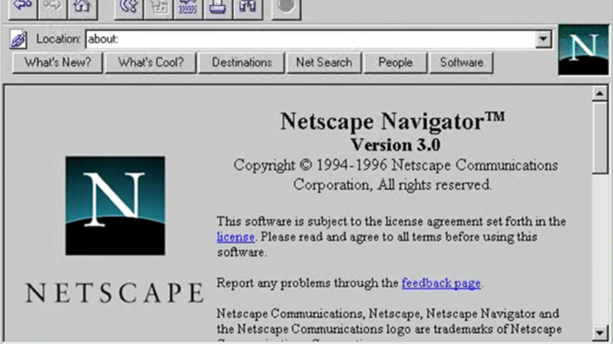
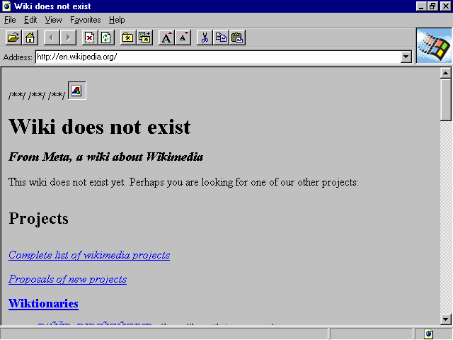
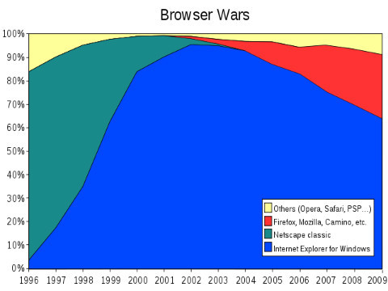

# JavaScript 역사

## - 목차
1. [웹 브라우저와 JavaScript](#1-웹-브라우저와-javascript)
    - [웹 브라우저의 상용화](#1-웹-브라우저의-상용화)
    - [웹 브라우저 경쟁](#2-웹-브라우저-경쟁)
    - [JavaScript의 탄생](#3-javascript의-탄생)
    - [JavaScript의 파편화](#4-javascript의-파편화)
    - [1차 브라우저 전쟁](#5-1차-브라우저-전쟁)
    - [2차 브라우저 전쟁](#6-2차-브라우저-전쟁)
    - [JavaScript 현황](#7-javascript-현황)
2. [JavaSript의 표준화](#2-javascript의-표준화)
    - [ECMA Script](#1-ecma-script)

---

## (1) 웹 브라우저와 JavaScript

### **1) 웹 브라우저의 상용화**

<Netscape Navigator 브라우저>

- 1994년, Netscape사의 최초 상용 웹 브라우저인 Netscape Navigator 출시
- 당시 약 90% 이상의 시장 점유율을 가졌을 것이라 추정

 

### **2) 웹 브라우저 경쟁**

<초창기 Internet Explorer (IE 1)>

- 1995년, Microsoft의 Internet Explorer(IE)가 출시됨
- Netscape는 IE와 경쟁할 차기 웹 브라우저 개발을 착수
- 당시에는 웹 페이지에 `동적인 기능`이 없었기 때문에 Netscape는 웹 페이지에 동적인 기능을 제공하기 위해 `새로운 언어`를 개발하기 시작

 

### **3) JavaScript의 탄생**

<브렌던 아이크>

- 당시, Netscape 소속 개발자 Brendan Eich(브렌던 아이크)는 회사의 요구사항을 넘어 `Mocha`라는 언어를 개발
- 이후, `LiveScript`로 이름을 변경했지만, 당시 인기 프로그래밍 언어인 JAVA의 명성에 기대보고자 `JavaScript`로 이름 변경
- JavaScript는 Netscape Navigator 2.0에 탑재되어 큰 인기를 누림

 

### **4) JavaScript의 파편화**

- `Microsoft`는 JavaScript의 파생버전인 `JScript`를 IE 3.0에 채택
- 이 과정에서 Netscape와 Microsoft 그리고 많은 회사들이 `자체적으로 JavaScript를 탑재`하여 독자적으로 업데이트함
- 이로 인해 동일한 코드임에도 불구하고 `브라우저마다 다르게 동작`하는 문제가 발생
  - 이러한 문제가 추후 JavaScript 표준화의 배경이 됨

### **5) 1차 브라우저 전쟁**

<당시 IE의 시장 점유율>

- Microsoft는 IE를 자사 윈도우 OS에 내장하여 `무료`로 배포
- 빌 게이츠를 필두로 한 Microsoft의 공격적인 마케팅, 자본 그리고 막강한 윈도우 OS의 점유율로 인해 Netscape는 빠르게 몰락
- 결국, IE의 시장 점유율은 2002년 약 96%에 달하며, Microsoft가 승리함
- 추후, 브렌던 아이크는 Netscape에서 핵심 개발진들과 나와 `모질라 재단`을 설립하고 `Firefox 브라우저` 출시(2003)

 

### **6) 2차 브라우저 전쟁**

<크롬 브라우저의 시장 점유율>

- 2008년 `구글`에서 `Chrome 브라우저` 출시
- 출시 3년 만에 10년간 쌓아온 Firefox의 점유율을 넘었고, 반년 뒤, IE의 점유율도 넘음
- 빠른 속도, 압도적 성능, 엄격한 웹 표준 준수, 강력한 개발자 도구를 제공
- 웹 표준의 발전과 웹 애플리케이션의 대중화에 큰 역할을 함

 

### **7) JavaScript 현황**

- 현재는 Chrome,Firefox, Safari, Microsoft Edge, Opera등 다양한 웹 브라우저가 출시되어 있음
- 기존 JavaScript는 브라우저에서만 웹 페이지의 동적인 기능을 구현하는데 사용
- 이후 브라우저를 벗어나 Node.js와 같은 서버 사이드 분야뿐만 아니라, 다양한 프레임워크와 라이브러리들이 개발되면서 웹 개발 분야에서는 필수적인 언어로 자리매김함

---

## (2) JavaScript의 표준화

### **1) ECMA Script**

- Ecma International(정보통신시스템 국제 표준화 기구)이 정의하는 `표준화된 스크립트 프로그래밍 언어`
- JavaScript의 파편화를 막기위해 1997년 ECMA에서 ECMA Script라는 표준 언어를 정의
- 이후, ECMA Script는 독자적으로 발전하며 JavaScript보다 더 많은 기능을 제공
- 2009년 ECMA Script 5(ES5)로 안정성, 생산성 향상
- 2015년 ECMA Script 2015(ES5)에서 객체지향 프로그래밍 언어로서 많은 발전을 이루어, 가장 중요한 버전으로 평가됨
- JavaScript는 ECMA Script의 구현 언어 중 하나임