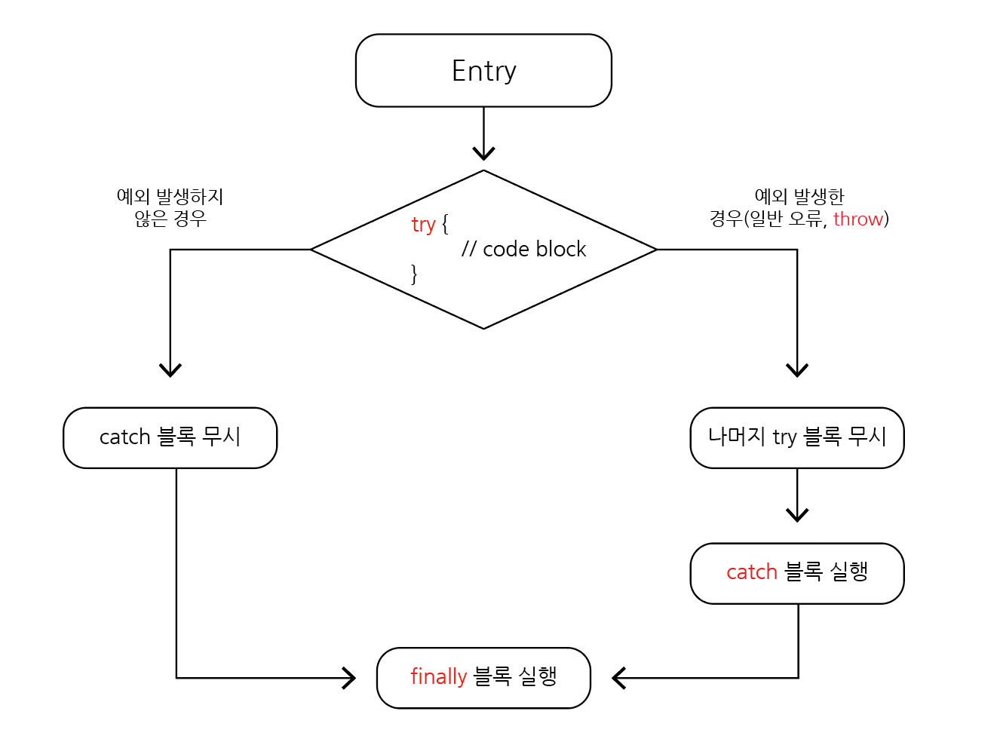

# try & catch

## 목차

1. [try와 catch란?](#1-try와-catch란)
    1. [try 블록](#1-1-try-블록)
    2. [catch 블록](#1-2-catch-블록)
    3. [finally 블록](#1-3-finally-블록)
    4. [throw](#1-4-throw)
    5. [예외 처리의 흐름](#1-5-예외-처리의-흐름)
    6. [예외 처리 예시](#1-6-예외-처리-예시)
        - [0으로 나누기](#--0으로-나누기)
        - [사용자 정의 예외](#--사용자-정의-예외)
        - [파일처리 예외](#--파일처리-예외)
2. [참고](#2-참고)
    1. [예외처리 장점](#2-1-예외처리-장점)
        - [안정성 향상](#--안정성-향상)
        - [유지보수 용이성](#--유지보수-용이성)
        - [사용자 경험 향상](#--사용자-경험-향상)
    2. [예외처리 단점](#2-2-예외처리-단점)
        - [성능 영향](#--성능-영향)
        - [코드 복잡성](#--코드-복잡성)
        - [불필요한 예외처리](#--불필요한-예외처리)

<br>
<br>

## 1. try와 catch란?

- JavaScript의 `try` 및 `catch` 구문은 `예외처리`를 위한 중요한 기능 제공
- `예외`는 코드 실행 중에 예상치 못한 문제 발생 시, 나타나며 예외처리를 통해 적절하게 처리할 수 있도록 도와줌

<br>

### 1-1. try 블록

- try 블록은 `예외가 발생할 수 있는 코드`를 감싸는데 사용
- 이 블록 내에서 `예외가 발생`하면 프로그램의 제어는 try 블록 다음의 `catch 블록`으로 이동

```javascript
// try & catch 구문 기본 구조

try {
    // 예외가 발생할 수 있는 코드
    // ex) 잘못된 변수 접근, 0으로 나누기 등...
} catch (error) {
    // 예외 발생 시, 실행되는 블록
    // 'error'라는 예외정보를 담고 있는 변수를 받음
    console.error('에러가 발생했습니다: ', error); // 에러메시지 출력
}
```

<br>

### 1-2. catch 블록

- catch 블록은 `예외 발생 시`, 실행되는 부분
- try 블록 내에서 발생한 `예외를 받아 처리`함
- catch 블록은 캐치한 예외에 관한 정보를 담고있는 `error를 인자`로 받음

<br>

### 1-3. finally 블록

- finally 블록은 예외 발생 여부와 상관없이 `항상 실행`됨

<br>

### 1-4. throw

- 예외를 `강제로 발생`시키기 위해 사용되는 키워드
- 예외는 일반적으로 예기치 못한 상황 또는 오류 발생 시, 발생하지만 이러한 예외를 명시적으로 발생시키려면 `throw` 키워드 사용
- throw 키워드를 사용하여 예외를 발생시키면 예외 객체가 생성되고, 해당 예외 객체는 프로그램의 실행흐름을 변경함
- 일반적으로 `Error` 클래스의 인스턴스를 생성하여 예외 객체를 만들지만, 어떠한 객체도 throw 키워드를 통해 예외 객체로 사용 될 수 있음

```javascript
// throw 키워드를 포함한 예외처리 예시

function divide(a, b) {
    if (b === 0) {
        throw new Error('나누는 수는 0이 될 수 없습니다.');
    }
    return a / b;
}

try {
    let result = divide(10, 0);
} catch (error) {
    console.error('에러가 발생했습니다: ', error); // '에러가 발생했습니다: 나누는 수는 0이 될 수 없습니다.'
}
```

<br>

### 1-5. 예외 처리의 흐름



- try 블록에서 예외가 발생하는 그 즉시, 프로그램의 제어는 try 블록을 빠져나와 catch로 이동
- catch 블록이 실행되면 예외처리 로직을 수행하고 try-catch 구문 다음으로 이동함

<br>

### 1-6. 예외 처리 예시

### - 0으로 나누기

```javascript
try {
    let result = 10 / 0 // 0으로 나누기를 수행하므로 예외발생
} catch (error) {
    console.error('에러가 발생했습니다: ', error); // '에러가 발생했습니다 : Infinity'
} finally {
    console.log('코드 실행 완료'); // '코드 실행 완료'
}
```

<br>

### - 사용자 정의 예외

```javascript
class CustomError extends Error {
  constructor(message) {
    super(message);
    this.name = 'CustomError';
  }
}

try {
  throw new CustomError('사용자 정의 예외 발생');
} catch (error) {
  console.error('에러가 발생했습니다:', error.message);
} finally {
  console.log('예외 처리 완료');
}
```

<br>

### - 파일처리 예외

```javascript
function readDataFromFile() {
  // 파일에서 데이터 읽기 시도
  // 파일이 없다면 예외 발생
  throw new Error('파일이 없습니다.');
}

try {
  readDataFromFile();
} catch (error) {
  console.error('에러가 발생했습니다:', error.message);
} finally {
  console.log('파일 처리 완료');
}
```

<br>
<br>

## 2. 참고

### 2-1. 예외처리 장점

### - 안정성 향상

- 예외처리를 통해 예상치 못한 상황의 오류에 대응 가능
- 프로그램이 강력하고 안정적으로 동작할 수 있도록 보장해줌

<br>

### - 유지보수 용이성

- 오류가 발생한 경우, 어떤 부분에서 오류가 발생했는지 파악하기 쉬움

<br>

### - 사용자 경험 향상

- 예외처리는 사용자의 UX적인 측면에서도 중요함
- 명확한 에러메시지를 통해 사용자를 이해시키도 올바른 동작으로 유도할 수 있어 사용자 경험을 향상 시킬 수 있음

<br>

### 2-2. 예외처리 단점

### - 성능 영향

- 일부 예외 처리 매커니즘은 프로그램의 성능에 영향을 줄 수 있음
- 예외처리 역시 추가적인 실행 시간과 자원을 필요로 하기에 과도한 예외처리는 성능을 저하 시킬 수 있음

<br>

### - 코드 복잡성

- 많은 예외처리 코드가 작성되어있을 경우, 코드가 복잡해지고, 가독성이 떨어져 오히려 유지보수를 어렵게 할 수 있음

<br>

### - 불필요한 예외처리

- 모든 예외가 예외처리를 필요로 하지 않을 수 있음
- 필요한 경우에만 예외처리를 하는 것을 추천함