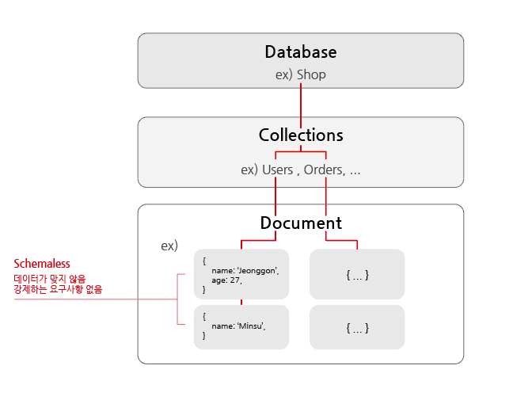
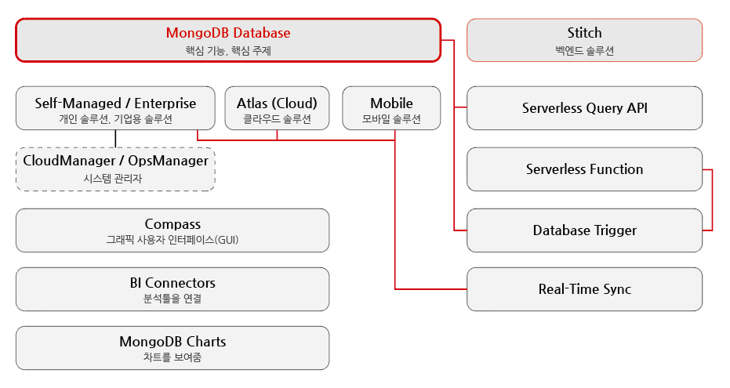

# MongoDB 소개

## - 목차
1. [MongoDB](#1-mongodb)
    - [MongoDB란?](#1-mongodb란)
    - [기존 데이터 베이스 솔루션과의 차이](#2-기존-데이터-베이스-솔루션과의-차이)
        - [NoSQL 개념](#--nosql-개념)
2. [MongoDB Ecosystem](#2-mongodb-ecosystem)

---

## (1) MongoDB

### **1) MongoDB란?**

- MongoDB : 데이터 베이스 솔루션
- `많은 양`의 데이터를 효율적으로 저장할 수 있음 (Humongous)

<br>

### **2) 기존 데이터 베이스 솔루션과의 차이**

- 데이터 베이스 솔루션은 `mySQL`, `postgreSQL`과 같이 수많은 방법이 있음
- 데이터 베이스 서버로 서로 다른 데이터 베이스를 실행할 수 있게 해줌
- `Database(ex. Shop)` -> `Collections(ex. Users, Menus, Orders)` -> `Documents(ex. {name:'Jeonggon'})` 로 구성
- Documents는 JavaScript의 객체(Object)와 유사하게 생김, 정확히는 `JSON 형식`을 사용
- SQL 기반 데이터 베이스는 스키마(데이터 요구사항)를 통해 저장할 데이터를 엄격하게 관리하지만, MongoDB는 스키마가 없어서 `유연함` (Schemaless)
  - 전혀 다른 데이터를 하나의 동일한 Collection에 저장할 수 있음
  - 즉, 서버를 복잡하게 재구성하지 않고도 필요한 형식으로 데이터를 쿼리할 수 있음
  - 반면, 지저분한 데이터가 될 수 있기에 주의해야 함



<MongoDB 구조와 Schemaless>

```mongodb-json
// JSON(BSON) 데이터 형식
// 키(key)-값(value)

{
    "name": "Jeonggon",
    "age": 27,
    "address": 
        {
            "Nation": "Korea"
        },
    "hobbies": [
        { "name": "Cooking" },
        { "name": "Sports" }
    ]
}
```

- 값으로 숫자, 문자, 참-거짓, `중첩 데이터`, 배열 등을 가질 수 있음
  - 중첩 데이터를 통해 데이터 사이의 `복잡한 관계`를 `하나의 동일한 문서`에 저장할 수 있음
  - SQL에서는 A테이블과 B테이블의 데이터를 찾기 위해서는 복합적인 JOIN을 작성해야하는데 MongoDB는 문서 하나에 가져올 수 있어서 효율적임
  - 데이터를 논리적으로 저장할 수 있음
- 데이터 형식을 `BSON`이라고도 하는데 이는 MongoDB가 JSON 데이터를 `바이너리 버전`으로 변환하기 때문

<br>

### - NoSQL 개념

- MongoDB는 `NoSQL` 솔루션임
- SQL 기반 데이터 베이스와 정반대의 개념, 철학을 따르기 때문
  - SQL : 데이터를 `정규화(normalization)`해서 저장하고 모든 테이블이 `스키마`를 가지고 있으며 여러 테이블에 데이터를 배포하고 `관계를 사용`
  - MongoDB : 데이터를 문서(Document)로 함께 저장하며 스키마를 강제하지 않음
- `관계(relations)`도 존재
- MongoDB는 컬랙션(테이블)이 적음
  - 대신 데이터를 함께 저장
  - 응용 프로그램이 데이터를 가져올 경우, 컬랙션1과 컬랙션2를 병합할 필요가 없음
  

---

## (2) MongoDB Ecosystem

- MongoDB를 만든 회사 명도 MongoDB임



<MongoDB에서 제공하는 서비스>

1) `MongoDB 데이터 베이스` : 핵심 기능인 동시에 핵심 주제
2) `Self-Managed / Enterprise` : 개인용 / 기업용 솔루션
  - `CloudManager / OpsManager` : 데이터 베이스 관리 도구
3) `Atlas(Cloud)` : 클라우드 솔루션
4) `Mobile` : 모바일 솔루션으로 모바일에 MongoDB를 직접 설치해 데이터를 저장하고 인터넷 없이 작업가능
5) `Compass` : 그래픽 사용자 인터페이스(GUI)인 컴패스를 통해 데이터 베이스에 연결해 사용자 인터페이스로 데이터를 볼 수 있음
6) `BI Connectors`, `MongoDB Charts` : 데이터 사이언스를 위해 다양한 분석 툴을 연결해주는 도구
7) `Stitch`
   - 벡엔드 솔루션으로 서버 없는 쿼리 API를 제공
   - 클라이언트의 앱(ex.리액트) 안에서 데이터 베이스를 효율적으로 쿼리할 수 있게 해줌
   - 서버 없는 함수로 클라우드에서 명령형으로 코드 실행 가능
   - 데이터 베이스 트리거로 데이터 베이스에서 이벤트를 발생할 수 있게 해줌(ex.이메일 보내기)
   - 실시간 동기화(ex.클라우드 내 데이터 베이스-모바일 데이터 베이스 동기화)