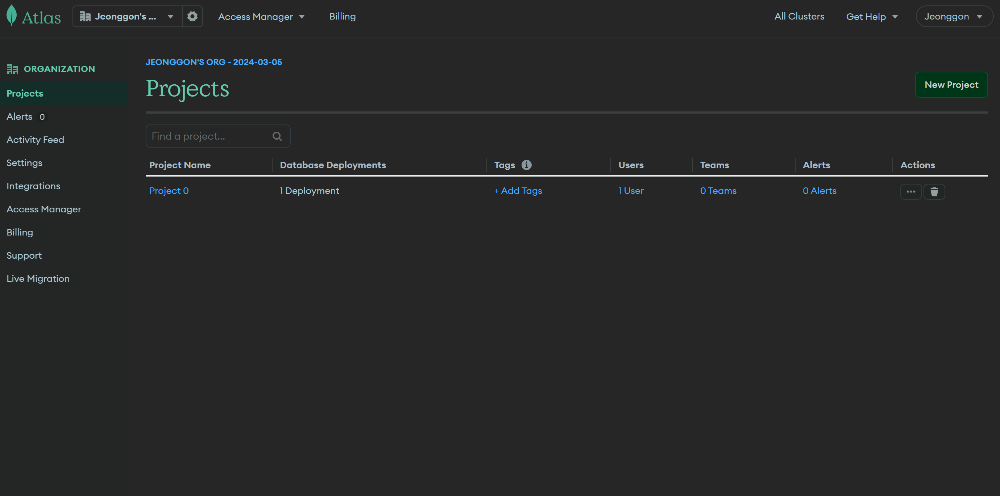
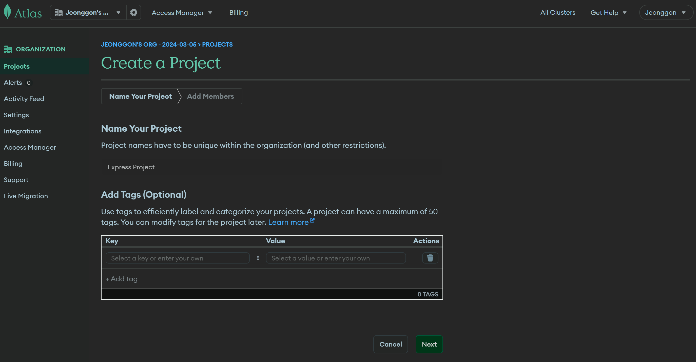
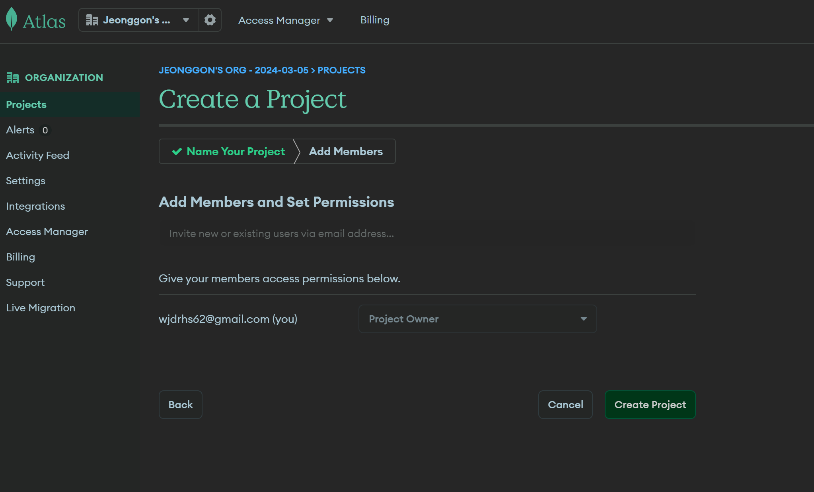
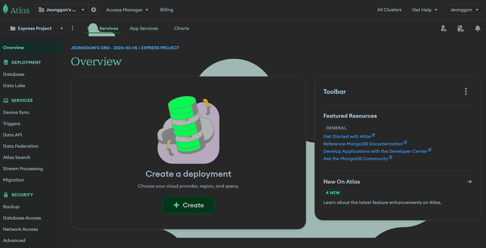
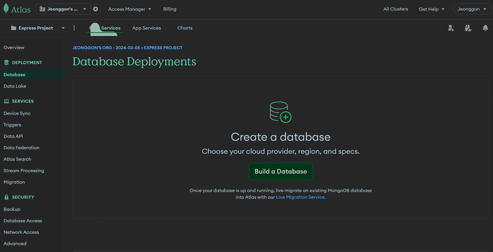
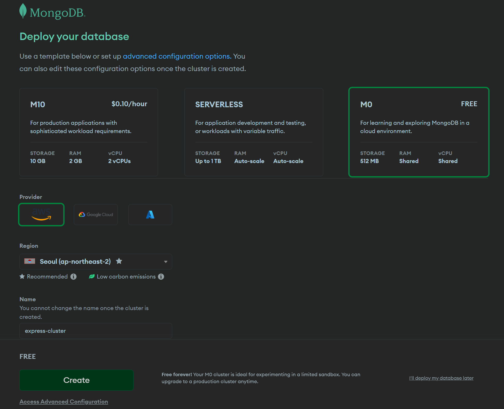
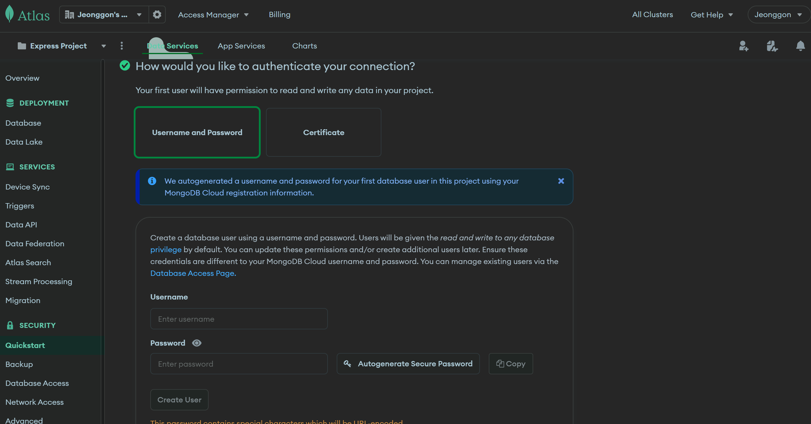
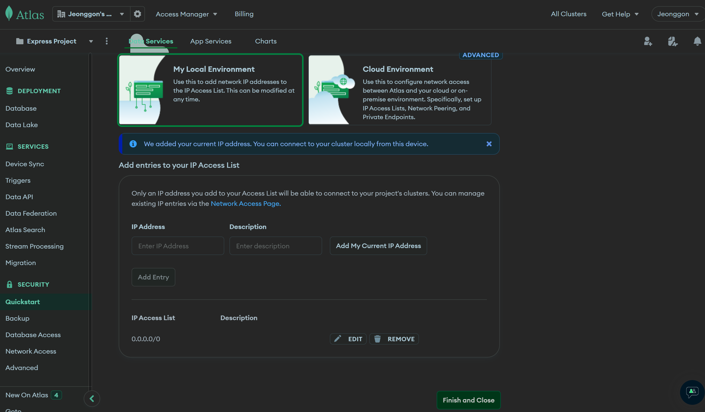
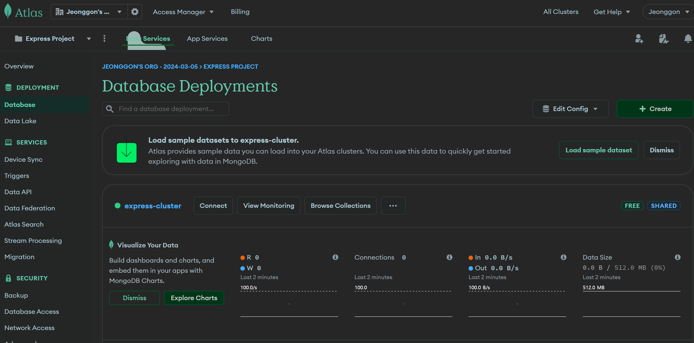

# MongoDB 사용하기

## 목차

1. [MongoDB 사용 방법](#1-mongodb-사용-방법)
    1. [로컬 설치](#1-1-로컬-설치)
    2. [클라우드 서비스 이용](#1-2-클라우드-서비스-이용)

 
 

## 1. MongoDB 사용 방법

- `로컬에 설치`와 `클라우드 서비스 이용`으로 크게 두 가지로 나누어짐

 

### 1-1. 로컬 설치

1. [MongoDB 공식 사이트 접속](https://www.mongodb.com/ko-kr)
2. 제품(Product) --> 커뮤니티 에디션 --> [MongoDB 커뮤니티 서버 다운로드 페이지](https://www.mongodb.com/try/download/community)

 

### 1-2. 클라우드 서비스 이용

1. 회원가입, 로그인 후, New Project 클릭

 

2. 프로젝트 이름 짓기

 

3. 멤버를 추가하거나 멤버가 없을 경우, Create Project 클릭

 

4. 프로젝트 생성 완료

 

5. 좌측 메뉴에서 Database 클릭, Build a Database 클릭

 

6. 무료 데이터 베이스인 M0 선택, 공급자는 AWS로 지역은 서울로 설정, 클러스터 이름 짓고 Create 클릭

 

7. 해당 데이터 베이스에 접근 할 유저네임과 비밀번호 설정 후, Create User 클릭
   - 유저네임과 비밀번호는 이후에도 사용되기에 기억해야 함

 

8. 로컬 환경 선택, 접근 IP로 현재 IP(Current IP Address) 또는 어떤 IP에서든(0.0.0.0/0) 접근 추가 후, finish 클릭

 

9. 데이터 베이스가 생성 된 것을 확인할 수 있음

