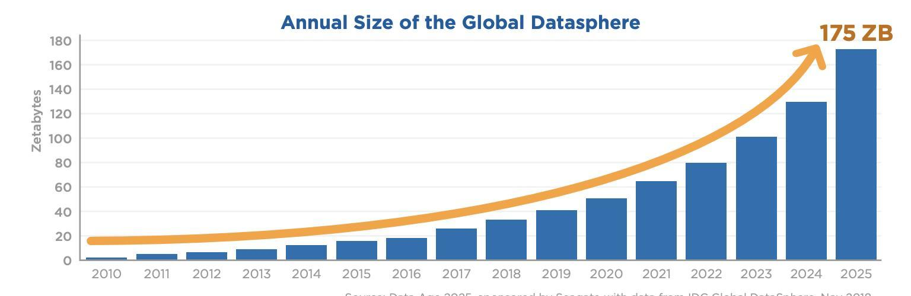
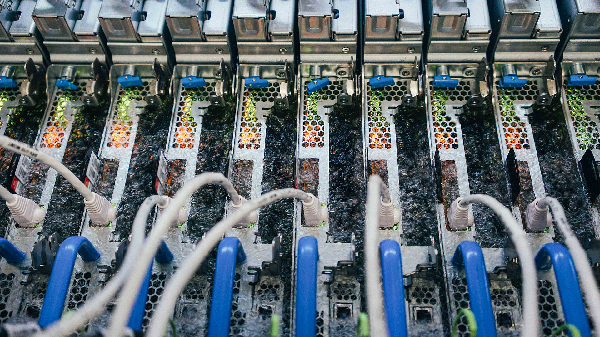
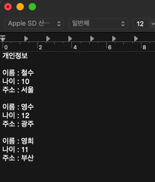
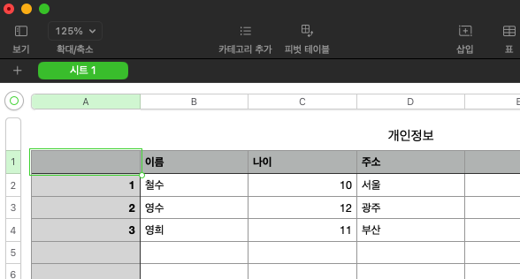
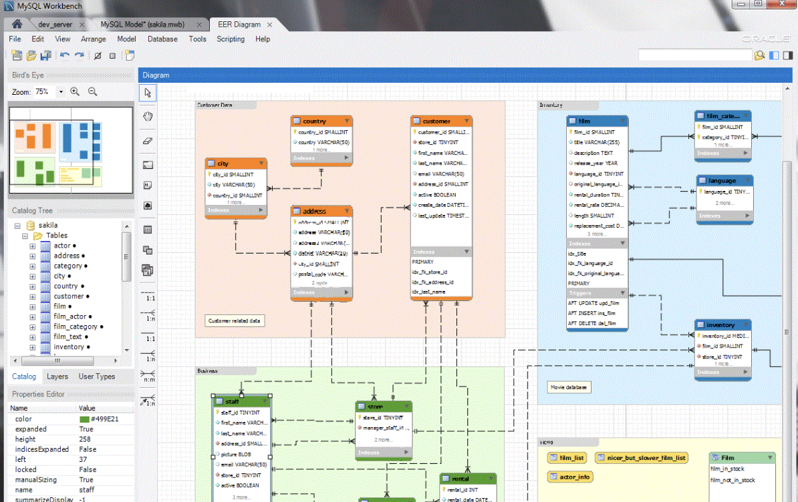

# 데이터 베이스

## - 목차
1. [데이터(Data)](#1-데이터data)
    - [무한히 증가하는 데이터](#1-무한히-증가하는-데이터)
    - [데이터 센터](#2-데이터-센터)
        - [바다 이용](#--바다-이용)
        - [냉각수 이용](#--냉각수-이용)
    - [데이터 저장](#3-데이터-저장)
    - [과거 데이터 저장방식](#4-과거-데이터-저장방식)
        - [파일(File)을 이용한 데이터 관리](#--파일file을-이용한-데이터-관리)
        - [스프레드 시트(Spread Sheet)를 이용한 데이터 관리](#--스프레드-시트spread-sheet를-이용한-데이터-관리)
2. [데이터 베이스(Database)](#2-데이터-베이스database)
    - [데이터 베이스](#1-데이터-베이스)
    - [데이터 베이스 역할](#2-데이터-베이스-역할)

---

## (1) 데이터(Data)

: `저장`이나 `처리`에 효율적인 형태로 변환된 정보(information)

### **1) 무한히 증가하는 데이터**

- 매일 초당 2억개의 메일이 전송되며 3만명이 넷플릭스를 시청
- 배달의 민족 월평균 주문 약 6천만건(2020)
- 전 세계 모든 데이터의 약 90%는 2015년 이후 생산된 것(IBM)
- 2025년 전 세계 데이터 생성량 175ZB에 이를 것(Seagate, 2017)

> 175ZB
> - DVD로 나누어 담아 연결시, 달을 23번 방문하거나 지구를 22번 회전가능
> - 평균 25mb/s로 다운로드 할 경우, 18억년 소요

<데이터 증가 예상치, IDC, 2018>

### **2) 데이터 센터**

- 카카오 4000억, 네이버 6500억 데이터 센터 구축 투자(2020)
- 전 세계 데이터 센터 시장 2022년부터 2026년까지 연 평균 20% 이상 성장 예상
- 2022 전 세계 데이터 센터 전력 소비량 250TWh로 남아공의 국가 소비전력 추월(남아공: 세계 16위 전력 소비국)
- 데이터 센터는 데이터를 저장하고 처리하는데 많은 전력을 사용하지만, 렉(Rack)에서 발생하는 발열을 해소하기 위해 전력을 사용함
- 따라서 많은 기업들이 열을 해소하기 위해 친환경적인 공법 또는 효율적인 공법을 도입하고 있음
- 북극에 가까운 스웨덴 지역에 데이터 센터 설립 추진(페이스북)
- 미국 댈러스시에서 사용하는 물의 30% 냉각수에 사용(구글 댈러스 데이터 센터)

### - 바다 이용

<마이크로소프트_나틱프로젝트>

### - 냉각수 이용

<마이크로소프트_Liquid_Immersion_Cooling_System>

### **3) 데이터 저장**

- 무한히 증가하고 있는 데이터를 저장하고 잘 관리하여 활용할 수 있는 기술이 필요

### **4) 과거 데이터 저장방식**

### - 파일(File)을 이용한 데이터 관리

- 어디에서나 쉽게 사용 가능
- 데이터를 구조적으로 관리하기 어려움

<파일을 이용한 데이터 관리>

### - 스프레드 시트(Spread Sheet)를 이용한 데이터 관리

- 테이블을 열과 행을 사용해 데이터를 구조적으로 관리 가능
- 방대한 데이터를 관리하기에는 무리
- 크기(Size) : 스프레드 시트는 일반적으로 약 100만 행까지만 저장가능
- 보안(Security) : 스프레드 시트는 단순히 파일이나 링크 소유 여부에 따라 접근 권한을 설정, 다양한 권한 설정 불가능
- 정확성(Accuracy) : 데이터가 변경될 경우, 여러 위치에서 해당 값을 업데이트 해야하는데 데이터가 여러 시트에 분산되어 있다면 누락, 추가문제가 발생할 수 있음

<스프레드 시트를 이용한 데이터 관리>

---

## (2) 데이터 베이스(Database)

### **1) 데이터 베이스**

: 체계적인 데이터 모음(Organized Collection of Data)

### **2) 데이터 베이스 역할**

- 데이터를 저장하고 조작(CRUD)

> CRUD
> - C(Create) : 저장
> - R(Read) : 조회
> - U(Update) : 갱신
> - D(Delete) : 삭제

- 데이터 베이스는 거대하고 복잡한 데이터를 다루기 위해 고안된 도구이기 때문에 매우 많은 기능을 제공
  - 다양한 기능 : 데이터 관련해 할 수 있는 일이 많음
  - 데이터 베이스의 기초적인 부분에 집중
- 데이터 베이스의 모든 기능을 보는 것이 아닌 데이터 베이스에서 데이터를 CRUD하는 과정이 중요

<MySQL을 이용한 데이터 베이스 다이어그램>