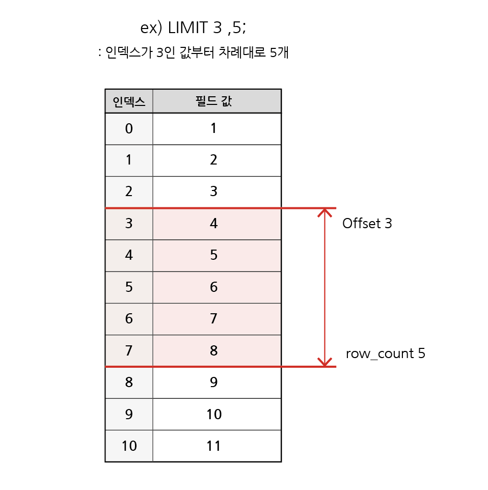
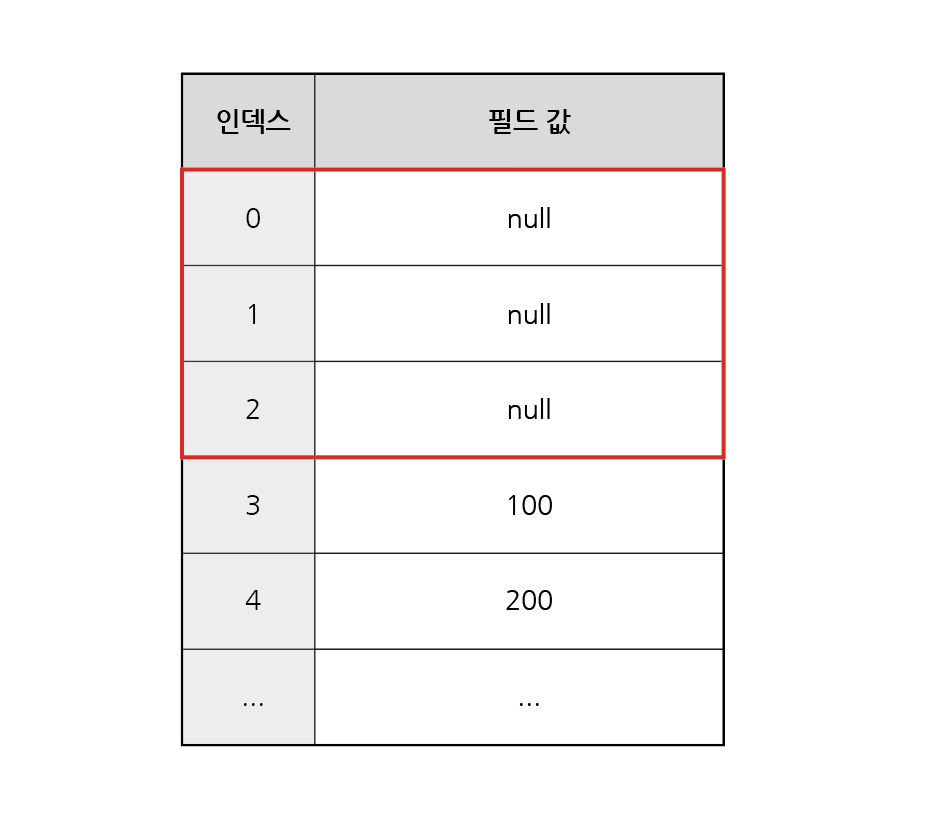

# 단일 테이블 쿼리

## 목차

1. [Querying data](#1-querying-data)
    1. [SELECT](#1-1-select)
        - [SELECT syntax](#select-syntax)
        - [ex1) 특정 단일 필드의 모든 데이터 조회](#ex1-특정-단일-필드의-모든-데이터-조회)
        - [ex2) 다수 필드의 모든 데이터 조회](#ex2-다수-필드의-모든-데이터-조회)
        - [ex3) 모든 필드의 모든 데이터 조회](#ex3-모든-필드의-모든-데이터-조회)
        - [ex4) 필드에 별칭을 사용하여 데이터 조회](#ex4-필드에-별칭-사용하여-데이터-조회)
        - [ex5) 연산을 하여 데이터 조회](#ex5-연산을-하여-데이터-조회)
        - [정리](#정리)
2. [Sorting data](#2-sorting-data)
    1. [ORDER BY](#2-1-order-by)
        - [ORDER BY syntax](#order-by-syntax)
        - [ex1) 기본 정렬](#ex1-기본-정렬)
        - [ex2) 내림차순으로 정렬](#ex2-내림차순으로-정렬)
        - [ex3) 이중 정렬](#ex3-이중-정렬)
        - [ex4) 연산과 정렬](#ex4-연산과-정렬)
        - [SELECT Statements 실행순서](#select-statements-실행순서)
3. [Filtering data](#3-filtering-data)
    1. [Filtering data 관련 키워드](#3-1-filtering-data-관련-키워드)
    2. [DISTINCT](#3-2-distinct)
        - [ex1) 기본적인 DISTINCT 활용](#ex1-기본적인-distinct-활용)
    3. [WHERE](#3-3-where)
        - [ex1) 필드가 특정 값을 갖는 레코드 조회](#ex1-필드가-특정-값을-갖는-레코드-조회)
        - [ex2) 필드가 특정 값이 아닌 레코드 조회](#ex2-필드가-특정-값이-아닌-레코드-조회)
        - [ex3) 다중 조건 지정1 (AND)](#ex3-다중-조건-지정1-and)
        - [ex4) 다중 조건 지정2 (OR)](#ex4-다중-조건-지정2-or)
        - [ex5) 필드 값 범위 지정 (BETWEEN a AND b)](#ex5-필드-값-범위-지정-between-a-and-b)
        - [ex6) 조건과 정렬](#ex6-조건과-정렬)
        - [ex7) 다중 조건 지정3 (IN)](#ex7-다중-조건-지정3-in)
        - [ex8) 다중 조건 지정4 (NOT IN)](#ex8-다중-조건-지정4-not-in)
        - [ex9) 와일드 카드 조건1 (LIKE)](#ex9-와일드-카드-조건1-like)
        - [ex10) 와일드 카드 조건2](#ex10-와일드-카드-조건2)
    4. [Comparison Operators](#3-4-comparison-operators)
    5. [Logical Operator](#3-5-logical-operator)
    6. [IN Operator](#3-6-in-operator)
    7. [LIKE Operator](#3-7-like-operator)
    8. [Wildcard Characters](#3-8-wildcard-characters)
    9. [LIMIT Clause](#3-9-limit-clause)
        - [LIMIT syntax](#limit-syntax)
        - [LIMIT & OFFSET 예시](#limit--offset-예시)
        - [ex1) 정렬과 LIMIT1](#ex1-정렬과-limit1)
        - [ex2) 정렬과 LIMIT2](#ex2-정렬과-limit2)
4. [Grouping data](#4-grouping-data)
    1. [GROUP BY clause](#4-1-group-by-clause)
        - [Aggregation Functions](#aggregation-functions)
        - [GROUP BY syntax](#group-by-syntax)
        - [GROUP BY 예시](#group-by-예시)
        - [ex1) 그룹과 평균, 정렬](#ex1-그룹과-평균-정렬)
        - [ex2) 그룹과 조건](#ex2-그룹과-조건)
    2. [HAVING clause](#4-2-having-clause)
5. [SELECT statement 실행 순서](#5-select-statement-실행-순서)
6. [참고](#6-참고)
    1. [정렬에서의 NULL](#6-1-정렬에서의-null)

<br>
<br>

## 1. Querying data

### 1-1. SELECT

-   테이블에서 데이터를 `조회`

<br>

### - SELECT syntax

```sql
SELECT
    select_list
FROM
    table_name;
```

-   `SELECT` 키워드 다음에 데이터를 선택하려는 `필드`를 하나 이상 지정
-   `FROM` 키워드 다음에 데이터를 선택하려는 `테이블`의 이름을 지정

<br>

### ex1) 특정 단일 필드의 모든 데이터 조회

-   다음의 테이블 employees에서 lastName 필드의 모든 데이터 조회

정답)

| lastName  |
| :-------: |
|  Murphy   |
| Patterson |
| Firrelli  |
|    ...    |
|   Nishi   |
|   Kato    |
|  Gerard   |

```sql
SELECT
    lastName
FROM
    employees;
```

<br>

### ex2) 다수 필드의 모든 데이터 조회

-   다음의 테이블 employees에서 lastName, firstName 필드의 모든 데이터 조회

정답)

| lastName  | firstName |
| :-------: | :-------: |
|  Murphy   |   Diane   |
| Patterson |   Mary    |
| Firrelli  |   Jeff    |
|    ...    |    ...    |
|   Nishi   |   Mami    |
|   Kato    |  Yoshimi  |
|  Gerard   |  Martin   |

```sql
SELECT
    lastName, firstName
FROM
    employees;
```

<br>

### ex3) 모든 필드의 모든 데이터 조회

-   다음 테이블 employees에서 모든 필드의 데이터 조회

정답)

| employNumber | lastName  | firstName | extension |       email        | officeCode | reportsTo |   jobTitle   |
| :----------: | :-------: | :-------: | :-------: | :----------------: | :--------: | :-------: | :----------: |
|     1002     |  Murphy   |   Diane   |   x5800   |  aa123@naver.com   |     1      |   null    |  President   |
|     1056     | Patterson |   Mary    |   x4611   |  aa456@naver.com   |     1      |   1002    |   VP Sales   |
|     1076     | Firrelli  |   Jeff    |   x9273   |  aa789@naver.com   |     1      |   1002    | VP Marketing |
|     ...      |    ...    |    ...    |    ...    |        ...         |    ...     |    ...    |     ...      |
|     1625     |   Kato    |  Yoshimi  |   x102    | aa101112@naver.com |     5      |   1621    |  Sales Rep   |
|     1702     |  Gerard   |  Martin   |   x2312   | aa131415@naver.com |     4      |   1102    |  Sales Rep   |

```sql
SELECT
    *
FROM
    employees;
```

<br>

### ex4) 필드에 별칭 사용하여 데이터 조회

-   다음 테이블 employees에서 firstName 필드의 모든 데이터 조회
    -   단, 조회 시 firstName이 아닌 '이름'으로 출력 될 수 있도록 출력명 변경)

정답)

|  이름   |
| :-----: |
|  Diane  |
|  Mary   |
|  Jeff   |
|   ...   |
|  Mami   |
| Yoshimi |
| Martin  |

```sql
SELECT
    firstName AS '이름'
FROM
    employees;

-- AS 를 사용하여 새로운 별칭을 지정할 수 있다.
```

<br>

### ex5) 연산을 하여 데이터 조회

-   다음 테이블 orderdetails에서 productCode, 주문 총액 필드의 모든 데이터를 조회
    -   단, 주문 총액 필드는 quantityOrdered와 priceEach 필드를 곱한 결과값

정답)

| productCode | 주문 총액 |
| :---------: | :-------: |
|  S18_1749   |   4080    |
|  S18_2248   |  2754.5   |
|  S18_4409   |  1660.12  |
|  S24_3969   |  1729.21  |
|     ...     |    ...    |
|  S18_1129   |  3898.1   |
|  S18_1889   |  2681.91  |
|  S18_1984   |  3527.8   |

```sql
SELECT
    ProductCode,
    quantityOrdered * priceEach AS '주문 총액'
FROM
    orderdetails;

-- Arithmetic Operators : 기본적인 사칙연산 사용 가능
```

<br>

### - 정리

-   SELECT문을 사용하여 테이블의 데이터 조회 및 반환
-   SELECT \* (asterisk)를 사용하여 테이블의 모든 필드 선택

<br>
<br>

## 2. Sorting data

### 2-1. ORDER BY

-   조회 결과의 레코드를 정렬

<br>

### - ORDER BY syntax

```sql
SELECT
    select_list
FROM
    table_name
ORDER BY
    column1 [ASC|DESC],
    column2 [ASC]DESC],
    ...;
```

-   FROM clause 뒤에 위치
-   하나 이상의 컬럼을 기준으로 결과를 오름차순, 내림차순으로 정렬할 수 있음
    -   ASC : 오름차순(기본값)
    -   DESC : 내림차순

<br>

### ex1) 기본 정렬

-   테이블 employees에서 firstName 필드의 모든 데이터를 오름차순으로 조회

정답)

| firstName |
| :-------: |
|   Andy    |
|  Anthony  |
|   Barry   |
|    ...    |
|    Tom    |
|  William  |
|  Yoshimi  |

```sql
SELECT
    firstName
FROM
    employees
ORDER BY
    firstName;
```

<br>

### ex2) 내림차순으로 정렬

-   테이블 employees에서 firstName 필드의 모든 데이터를 내림차순으로 조회

정답)

| firstName |
| :-------: |
|  Yoshimi  |
|  William  |
|    Tom    |
|    ...    |
|   Barry   |
|  Anthony  |
|   Andy    |

```sql
SELECT
    firstName
FROM
    employees
ORDER BY
    firstName DESC;
```

<br>

### ex3) 이중 정렬

-   테이블 employees에서 lastName 필드를 기준으로 내림차순 정렬한 후, firstName 필드 기준으로 오름차순 정렬하여 조회

정답)

| lastName  | firstName |
| :-------: | :-------: |
|  Vanauf   |  George   |
|   Tseng   | Foon Yue  |
| Thompson  |  Leslie   |
| Patterson |   Mary    |
| Patterson |   Steve   |
| Patterson |  William  |
|    ...    |    ...    |

```sql
SELECT
    lastName, firstName
FROM
    employees
ORDER BY
    lastName DESC,
    firstName;
```

<br>

### ex4) 연산과 정렬

-   테이블 orderdetails에서 totalSales 필드를 기준으로 내림차순으로 정렬한 다음 productCode, totalSales 필드의 모든 데이터를 조회
    -   단, totalSales 필드는 quantityOrdered와 priceEach 필드를 곱한 결과값

정답)

| productCode | totalSales |
| :---------: | :--------: |
|  S10_4698   |  11503.14  |
|  S12_4675   |  11170.52  |
|  S18_1749   |  10723.6   |
|  S12_1099   |  10460.16  |
|  S10_1949   |  10286.4   |
|  S10_1949   |   10072    |
|     ...     |    ...     |

```sql
SELECT
    productCode,
    quantityOrdered * priceEach AS totalSales
FROM
    orderdetails
ORDER BY
    totalSales DESC;
```

<br>

### - SELECT Statements 실행순서

1. 테이블에서 (FROM)
2. 조회하여 (SELECT)
3. 정렬 (ORDER BY)

<br>
<br>

## 3. Filtering data

### 3-1. Filtering data 관련 키워드

-   Clause

    -   DISTINCT
    -   WHERE
    -   LIMIT

-   Operator
    -   BETWEEN
    -   IN
    -   LIKE
    -   Comparison
    -   Logical

<br>

### 3-2. DISTINCT

-   조회 결과에서 중복된 레코드 제거

```sql
SELECT DISTINCT
    select_list
FROM
    table_name;
```

-   SELECT 키워드 바로 뒤에 작성해야 함
-   SELECT DISTINCT 키워드 다음에 고유한 값을 선택하려는 하나 이상의 필드를 지정

<br>

### ex1) 기본적인 DISTINCT 활용

-   테이블 employees에서 lastName 필드의 모든 데이터를 중복없이 오름차순으로 조회

정답)

| lastName |
| :------: |
|  Bondur  |
|   Bott   |
|   Bow    |
|   ...    |
| Thompson |
|  Tseng   |
|  Vanauf  |

```sql
SELECT DISTINCT
    lastName
FROM
    employees
ORDER BY
    lastName;
```

<br>

### 3-3. WHERE

-   조회 시 특정 검색 조건을 지정

```sql
SELECT
    select_list
FROM
    table_name
WHERE
    search_condition;
```

-   FROM clause 뒤에 위치
-   search_condition은 비교연산자 및 논리연산자(AND, OR, NOT 등)를 사용하는 구문이 적용

<br>

### ex1) 필드가 특정 값을 갖는 레코드 조회

-   테이블 employees에서 officeCode 필드 값이 1인 데이터의 lastName, firstName, officeCode 조회

정답)

| lastName  | firstName | officeCode |
| :-------: | :-------: | :--------: |
|  Murphy   |   Diane   |     1      |
| Patterson |   Mary    |     1      |
| Firrelli  |   Jeff    |     1      |
|    Bow    |  Anthony  |     1      |
| Jennings  |  Leslie   |     1      |
| Thompson  |  Leslie   |     1      |

```sql
SELECT
    lastName, firstName, officeCode
FROM
    employees
WHERE
    officeCode = 1;
```

<br>

### ex2) 필드가 특정 값이 아닌 레코드 조회

-   테이블 employees에서 jobTitle 필드 값이 'Sales Rep'이 아닌 데이터의 lastName, firstName, jobTitle 조회

정답)

| lastName  | firstName |      jobTitle       |
| :-------: | :-------: | :-----------------: |
|  Murphy   |   Diane   |      President      |
| Patterson |   Mary    |      VP Sales       |
| Firrelli  |   Jeff    |    VP Marketing     |
| Patterson |  William  | Sales Manager(APAC) |
|  Bondur   |  Gerard   | Sale Manager(EMEA)  |
|    Bow    |  Anthony  |  Sales Manager(NA)  |

```sql
SELECT
    lastName, firstName, jobTitle
FROM
    employees
WHERE
    jobTitle != 'Sales Rep';
```

<br>

### ex3) 다중 조건 지정1 (AND)

-   테이블 employees에서 officeCode 필드 값이 3이상이고 jobTitle 필드 값이 'Sales Rep'인 데이터의 lastName, firstName, officeCode, jobTitle 조회

정답)

| lastName | firstName | officeCode | jobTitle  |
| :------: | :-------: | :--------: | :-------: |
|  Tseng   | Foon Yue  |     3      | Sales Rep |
|  Vanauf  |  George   |     3      | Sales Rep |
|  Bondur  |   Loui    |     4      | Sales Rep |
|   ...    |    ...    |    ...     |    ...    |
|  Nishi   |   Mami    |     5      | Sales Rep |
|   Kato   |  Yoshimi  |     5      | Sales Rep |
|  Gerard  |  Martin   |     4      | Sales Rep |

```sql
SELECT
    lastName, firstName, officeCode, jobTitle
FROM
    employees
WHERE
    officeCode >= 3
    AND jobTitle = 'Sales Rep';
```

<br>

### ex4) 다중 조건 지정2 (OR)

-   테이블 employees에서 officeCode 필드 값이 5미만이거나 jobTitle 필드 값이 'Sales Rep'이 아닌 데이터의 lastName, firstName, officeCode, jobTitle 조회

정답)

| lastName  | firstName | officeCode |   jobTitle   |
| :-------: | :-------: | :--------: | :----------: |
|  Murphy   |   Diane   |     1      |  President   |
| Patterson |   Mary    |     1      |   VP Sales   |
| Firrelli  |   Jeff    |     1      | VP Marketing |
|    ...    |    ...    |    ...     |     ...      |
| Hernandez |  Gerard   |     4      |  Sales Rep   |
| Castillo  |  Pamela   |     4      |  Sales Rep   |
|  Gerard   |  Martin   |     4      |  Sales Rep   |

```sql
SELECT
    lastName, firstName, officeCode, jobTitle
FROM
    employees
WHERE
    officeCode < 5
    OR jobTitle != 'Sales Rep';
```

<br>

### ex5) 필드 값 범위 지정 (BETWEEN a AND b)

-   테이블 employees에서 officeCode 필드 값이 1에서 4 사이인 값인 데이터의 lastName, firstName, officeCode를 조회(1, 4 포함)

정답)

| lastName  | firstName | officeCode |
| :-------: | :-------: | :--------: |
|  Murphy   |   Diane   |     1      |
| Patterson |   Mary    |     1      |
| Firrelli  |   Jeff    |     1      |
|  Bondur   |  Gerard   |     4      |
|    ...    |    ...    |    ...     |
| Castillo  |  Pamela   |     4      |
|  Gerard   |  Martin   |     4      |

```sql
SELECT
    lastName, firstName, officeCode
FROM
    employees
WHERE
    officeCode BETWEEN 1 AND 4;

-- 동일한 코드

WHERE
    officeCode >= 1
    AND officeCode <= 4;
```

<br>

### ex6) 조건과 정렬

-   테이블 employees에서 officeCode 필드 값이 1에서 4 사이인 값의 데이터의 lastName, firstName, officeCode를 오름차순으로 조회(1, 4 포함)

정답)

| lastName  | firstName | officeCode |
| :-------: | :-------: | :--------: |
|  Murphy   |   Diane   |     1      |
| Patterson |   Mary    |     1      |
| Firrelli  |   Jeff    |     1      |
|    ...    |    ...    |    ...     |
| Hernandez |  Gerard   |     4      |
| Castillo  |  Pamela   |     4      |
|  Gerard   |  Martin   |     4      |

```sql
SELECT
    lastName, firstName, officeCode
FROM
    employees
WHERE
    officeCode BETWEEN 1 AND 4
ORDER BY
    officeCode;
```

<br>

### ex7) 다중 조건 지정3 (IN)

-   테이블 employees에서 officeCode 필드 값이 1 또는 3 또는 4인 데이터의 lastName, firstName, officeCode 조회

정답)

| lastName  | firstName | officeCode |
| :-------: | :-------: | :--------: |
|  Murphy   |   Diane   |     1      |
| Patterson |   Mary    |     1      |
| Firrelli  |   Jeff    |     1      |
|    ...    |    ...    |    ...     |
|  Vanauf   |  George   |     3      |
|  Bondur   |   Loui    |     4      |
| Hernandez |  Gerard   |     4      |
| Castillo  |  Pamela   |     4      |
|  Gerard   |  Martin   |     4      |

```sql
SELECT
    lastName, firstName, officeCode
FROM
    employees
WHERE
    officeCode IN (1, 3, 4);

-- 동일한 코드

WHERE
    officeCode = 1
    OR officeCode = 3
    OR officeCode = 4;
```

<br>

### ex8) 다중 조건 지정4 (NOT IN)

-   테이블 employees에서 officeCode 필드 값이 1과 3, 4가 아닌 데이터의 lastName, firstName, officeCode 조회

정답)

| lastName  | firstName | officeCode |
| :-------: | :-------: | :--------: |
| Patterson |  William  |     6      |
| Firrelli  |   Julie   |     2      |
| Patterson |   Steve   |     2      |
|    ...    |    ...    |    ...     |
|   King    |    Tom    |     6      |
|   Nishi   |   Mami    |     5      |
|   Kato    |  Yoshimi  |     5      |

```sql
SELECT
    lastName, firstName, officeCode
FROM
    employees
WHERE
    officeCode NOT IN (1, 3, 4);
```

<br>

### ex9) 와일드 카드 조건1 (LIKE)

-   테이블 employees에서 lastName 필드 값이 'son'으로 끝나는 데이터의 lastName, firstName 조회

정답)

| lastName  | firstName |
| :-------: | :-------: |
| Patterson |   Mary    |
| Patterson |  William  |
| Thompson  |  Leslie   |
| Patterson |   Steve   |

```sql
SELECT
    lastName, firstName
FROM
    employees
WHERE
    lastName LIKE '%son';
```

<br>

### ex10) 와일드 카드 조건2

-   테이블 employees에서 firstName 필드 값이 4자리이면서 'y'로 끝나는 데이터의 lastName, firstName 조회

정답)

| lastName  | firstName |
| :-------: | :-------: |
| Patterson |   Mary    |
|  Fixter   |   Andy    |

```sql
SELECT
    lastName, firstName
FROM
    employees
WHERE
    firstName LIKE '___y';
```

<br>

### 3-4. Comparison Operators

-   비교 연산자
-   ex) =, >=, <=, !=, IS, LIKE, BETWEEN, ... , AND

<br>

### 3-5. Logical Operator

-   논리 연산자
-   AND(&&), OR(||), NOT(!)

<br>

### 3-6. IN Operator

-   값이 특정 목록 안에 있는지 확인

<br>

### 3-7. LIKE Operator

-   값이 특정 패턴에 일치하는지 확인(와일드 카드와 함께 사용)

<br>

### 3-8. Wildcard Characters

-   '%' : 0개 이상의 문자열과 일치하는지 확인
-   '\_' : 단일문자와 일치하는지 확인

<br>

### 3-9. LIMIT Clause

-   조회하는 레코드의 수를 제한

<br>

### - LIMIT syntax

```sql
SELECT
    select_list
FROM
    table_name
LIMIT [offset,] row_count;
```

-   LIMIT clause는 하나 또는 두 개의 인자를 사용 (0 또는 양의 정수)
-   row_count는 조회할 최대 레코드 수를 지정

<br>

### - LIMIT & OFFSET 예시

```sql
SELECT
    ..
FROM
    ..
LIMIT 3, 5;
```



<LIMIT & OFFSET 예시>

<br>

### ex1) 정렬과 LIMIT1

-   테이블 customers에서 contactFirstName, creditLimit 필드 데이터를 creditLimit 기준 내림차순으로 7개만 조회

정답)

| contactFirstName | creditLimit |
| :--------------: | :---------: |
|      Diego       |  227600.00  |
|      Susan       |  210500.00  |
|      Miheal      |  141300.00  |
|       Jeff       |  138500.00  |
|      Rachel      |  136800.00  |
|       Mary       |  123900.00  |
|      Marta       |  123700.00  |

```sql
SELECT
    contactFirstName, creditLimit
FROM
    customers
ORDER BY
    creditLimit DESC
LIMIT 7;
```

<br>

### ex2) 정렬과 LIMIT2

-   테이블 customers에서 contactFirstName, creditLimit 필드 데이터를 creditLimit기준 내림차순으로 4번째부터 7번째 데이터만 조회

정답)

| contactFirstName | creditLimit |
| :--------------: | :---------: |
|       Jeff       |  138500.00  |
|      Rachel      |  136800.00  |
|       Mary       |  123900.00  |
|      Marta       |  123700.00  |

```sql
SELECT
    contactFirstName, creditLimit
FROM
    customers
ORDER BY
    creditLimit DESC
LIMIT 3, 4;

-- 동일한 코드

LIMIT 4 OFFSET 3;
```

<br>
<br>

## 4. Grouping data

### 4-1. GROUP BY clause

-   레코드를 그룹화하여 요약본 생생(집계 함수(Aggregation Functions)와 함께)

<br>

### - Aggregation Functions

-   값에 대한 계산을 수행하고 단일한 값을 반환하는 함수
-   ex) SUM, AVG, MAX, MIN, COUNT

<br>

### - GROUP BY syntax

```sql
SELECT
    c1, c2, ..., aggregation_function(ci)
FROM
    table_name
GROUP BY
    c1, c2, ..., cn;
```

-   FROM 및 WHERE절 뒤에 배치
-   GROUP BY 절 뒤에 그룹화할 필드 목록 작성

<br>

### - GROUP BY 예시

```sql
SELECT
    jobTitle, COUNT(*)
FROM
    employees
GROUP BY
    jobTitle;
```

-   COUNT() 집계 함수 이용

|      jobTitle       | COUNT(\*) |
| :-----------------: | :-------: |
|      President      |     1     |
|      VP Sales       |     1     |
|    VP Marketing     |     1     |
| Sales Manager(APAC) |     1     |
| Sales Manager(EMEA) |     1     |
|  Sales Manager(NA)  |     1     |
|      Sales Rep      |    17     |

<br>

### ex1) 그룹과 평균, 정렬

-   테이블 customers에서 country필드를 그룹화하여 각 그룹에 대한 creditLimit의 평균 값을 내림차순 조회

정답)

|   country    | avgOfCreditLimit |
| :----------: | :--------------: |
|   Denmark    |      102100      |
|    Italy     |      97200       |
|   Finland    |      95267       |
|     ...      |       ...        |
| South Africa |        0         |
|    Russia    |        0         |
|    Israel    |        0         |

```sql
SELECT
    country
    AVG(creditLimit) AS avgOfCreditLimit
FROM
    customers
GROUP BY
    country
ORDER BY
    AVG(creditLimit) DESC;

-- 동일한 코드

ORDERBY
    avgCreditLimit DESC;
```

<br>

### ex2) 그룹과 조건

-   테이블 customers에서 country 필드를 그룹화하여 각 그룹에 대한 creditLmit의 평균 값이 8000을 초과하는 데이터만 조회

정답)

|   country   | AVG(creditLimit) |
| :---------: | :--------------: |
|  Australia  |      86060       |
|   Norway    |      91200       |
|   Sweden    |      84750       |
|     ...     |       ...        |
|    Itary    |      97200       |
| New Zealand |      90625       |
| Philippines |      81500       |

```sql
SELECT
    country,
    AND(creditLimit)
FROM
    customers
WHERE
    AVG(creditLimit) > 80000
GROUP BY
    country;

-- 에러 발생 : Invalid use of group function


SELECT
    country,
    AVG(creditLimit)
FROM
    customers
GROUP BY
    country
HAVING
    AVG(creditLimit) > 80000;
```

<br>

### 4-2. HAVING clause

-   집계 항목에 대한 세부조건을 지정
-   주로 GROUP BY와 함께 사용되며 GROUP BY가 없다면 WHERE처럼 동작

<br>
<br>

## 5. SELECT statement 실행 순서

FROM -> WHERE -> GROUP BY -> HAVING -> SELECT -> ORDER BY -> LIMIT

1. 테이블에서 (FROM)
2. 특정 조건에 맞춰 (WHERE)
3. 그룹화 하고 (GROUP BY)
4. 만약 그룹중 조건이 있다면 맞추고 (HAVING)
5. 조회하여 (SELECT)
6. 정렬하고 (ORDER BY)
7. 특정 위치 값을 가져온다 (LIMIT)

<br>
<br>

## 6. 참고

### 6-1. 정렬에서의 NULL

-   MySQL에서 NULL은 NULL이 아닌 값 앞에 위치
    -   NULL값이 존재할 경우, 오름차순 정렬 시, 결과에 NULL이 먼저 출력



<NULL 정렬 예시>
