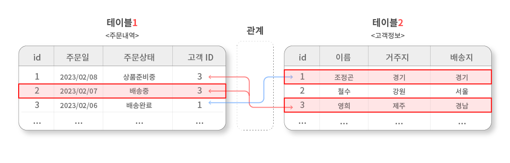
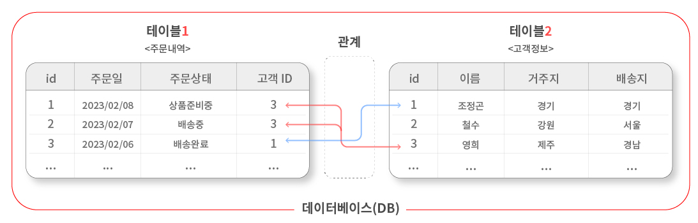

# 관계형 데이터 베이스

## - 목차
1. [Relational Database(RDB, 관계형 데이터 베이스) 의미](#1-relational-databaserdb-관계형-데이터-베이스-의미)
2. [관계형 데이터 용어](#2-관계형-데이터-용어)
    - [Table (= Relation)](#1-table--relation)
    - [Field (= Column, Attribute)](#2-field--column-attribute)
    - [Record (= Row, Tuple)](#3-record--row-tuple)
    - [Database (= Schema)](#4-database--schema)
    - [Primary Key (= PK)](#5-primary-key--pk)
    - [Foreign Key (= FK)](#6-foreign-key--fk)
3. [관계형 데이터 활용 예시](#3-관계형-데이터-활용-예시)
4. [RDBMS](#4-rdbms)
    - [DBMS(Database Management System)](#1-dbmsdatabase-management-system)
    - [RDBMS(Relational Database Management System)](#2-rdbmsrelational-database-management-system)
        - [대표적인 RDBMS](#--대표적인-rdbms)
    - [MySQL](#3-mysql)
   
---

## (1) Relational Database(RDB, 관계형 데이터 베이스) 의미
- 관계형 데이터 베이스는 데이터가 하나 이상의 열과 행의 테이블(또는 `관계`)에 저장되어 서로 다른 데이터 `구조`가 어떻게 관련되어 있는지 `쉽게 파악하고 이해`할 수 있도록 사전 정의된 관계로 데이터를 구성하는 정보의 모음이다.

> 관계 : 여러 테이블 간의 (논리적) 연결이다.
---

## (2) 관계형 데이터 용어

### **1) Table (= Relation)**

- 테이블은 세로줄과 가로줄의 구조를 활용하여 기록된 `데이터 값의 집합`

<테이블>

### **2) Field (= Column, Attribute)**

- 필드는 테이블에서 `컬럼`으로 정수형, 문자형 등의 `고유의 형식(속성값)`을 표시

<필드>

### **3) Record (= Row, Tuple)**
- 레코드는 `가로행`으로 나타난 `구체적인 데이터값`

<레코드>

### **4) Database (= Schema)**

- 데이터 베이스는 여러 개의 `테이블들의 집합`

<데이터 베이스>

### **5) Primary Key (= PK)**

- 기본키는 각각의 레코드에 `고유하게 부여된 숫자값`
- 관계형 데이터 베이스에서 레코드 간의 `식별자` 즉, 테이블간 관계화의 수단으로 활용

<기본키>

### **6) Foreign Key (= FK)**

- 외래키는 테이블의 필드 중 다른 테이블의 레코드를 `식별할 수 있는 키`
- 각 레코드에서 서로 다른 테이블 간의 관계를 만드는데 활용

<외래키>

---

## (3) 관계형 데이터 활용 예시

- 관계형 데이터는 여러 테이블 간의 논리적인 연결을 특징으로 하기에 분리되어있는 `다중 테이블들을 관계를 통하여 조회`할 수 있는 장점이 있다.

<관계형 데이터 예시 : 주문처리과정>

- 예시로 상단 이미지와 같은 `주문처리과정`과 같이 하나의 테이블은 `주문내역`을 관리하는 테이블이며, 다른 테이블은 `고객정보`를 보관하는 테이블이다.
- 두 개의 테이블은 `분리`되어 있으나, 주문내역테이블의 '고객ID'와 고객정보테이블의 'ID'를 `매칭`하여 서로 관계를 맺고 있다.

ex)
- 특정 날짜에 구매한 고객들 명단
- 아직 배송이 완료되지 않은 고객들 명단
- 지난 달 배송이 많이 된 배송지 목록

---

## (4) RDBMS

### **1) DBMS(Database Management System)**

: 데이터 베이스를 관리하는 소프트웨어 시스템

### **2) RDBMS(Relational Database Management System)**

: `관계형` 데이터 베이스를 관리하는 소프트웨어 프로그램

- 데이터 저장 및 관리를 용이하게 하는 시스템
- 데이터 베이스와 사용자 간의 인터페이스 역할
  - 사용자가 데이터 구성, 업데이트, 모니터링, 백업, 복구 등을 할 수 있도록 도움

### - 대표적인 RDBMS

- MySQL
- PostgreSQL
- Oracle Database
- MS SQL Server
- ...

### **3) MySQL**

: 가장 널리 사용되는 오픈소스 RDBMS

- 다양한 운영체제에서 실행 가능
- 여러 프로그래밍 언어를 위한 다양한 API 제공
- MySQL Workbench Tool을 통해 그래픽 인터페이스를 제공(GUI)

<MySQL 구조>

- Table은 데이터를 기록하는 최종 위치
- 모든 Table에는 행에서 고유하게 식별 가능한 기본키(Primary Key)라는 속성이 있으며, 외래키(Foreign Key)를 사용하여 각 행에서 서로 다른 테이블 간의 관계를 만들 수 있음
- 데이터는 기본키, 외래키를 통해 결합(join) 될 수 있는 여러 테이블에 걸쳐 구조화 됨
- 각 Table은 Database로 그룹핑 됨
- MySQL은 이러한 Database들을 그룹핑하여 관련된 작업을 수행하는 Database Server