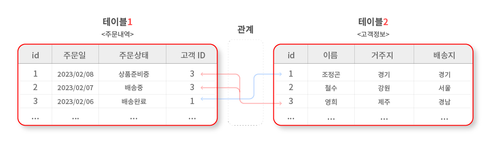

# Relational Database

## (1) Relational Database(RDB, 관계형 데이터베이스) 의미
> 관계형 데이터베이스는 데이터가 하나 이상의 열과 행의 테이블(또는 `관계`)에 저장되어 서로 다른 데이터 `구조`가 어떻게 관련되어 있는지 `쉽게 파악하고 이해`할 수 있도록 사전 정의된 관계로 데이터를 구성하는 정보의 모음이다.

- 관계 : 여러 테이블 간의 (논리적) 연결이다.
---

## (2) 관계형 데이터 용어

### **1) Table (= Relation)**

```bash
테이블은 세로줄과 가로줄의 구조를 활용하여 기록된 '데이터 값의 집합'이다.
```

### **2) Field (= Column, Attribute)**

```bash
필드는 테이블에서 '세로열'에 표시한 컬럼으로 정수형, 문자형 등의 '고유의 형식(속성값)'을 표시한다.
```

### **3) Record (= Row, Tuple)**

```bash
레코드는 '가로행'으로 나타난 '구체적인 데이터값'이다.
```

### **4) Database (= Schema)**

```bash
데이터베이스는 여러 개의 '테이블들의 집합'을 가리킨다.
```

### **5) Primary Key (= PK)**

```bash
기본키는 각각의 레코드에 '고유하게 부여된 숫자값'으로 관계형 데이터베이스에서 레코드 간의 '식별자' 즉, 테이블간 관계화의 수단으로 활용된다.
```

### **6) Foreign Key (= FK)**

```bash
외래키는 테이블의 필드 중 다른 테이블의 레코드를 '식별할 수 있는 키'로 각 레코드에서 서로 다른 테이블 간의 관계를 만드는데 활용된다.
```

---
## (3) 관계형 데이터 활용 예시

```bash
관계형 데이터는 여러 테이블 간의 논리적인 연결을 특징으로 하기에 분리되어있는 '다중 테이블들을 관계를 통하여 조회'할 수 있는 장점이 있다.
```


```bash
이를 이용한 예시로 상단 이미지와 같은 '주문처리과정'과 같이 하나의 테이블은 주문내역을 관리하는 테이블이며, 다른 테이블은 고객정보를 보관하는 테이블이다. 이처럼 두 개의 테이블은 분리되어 있으나, 주문내역테이블의 '고객ID'와 고객정보테이블의 'ID'를 매칭하여 서로 관계를 맺고 있다.
```
이를 이용하여
- 특정 날짜에 구매한 고객들 명단
- 아직 배송이 완료되지 않은 고객들 명단
- 지난 달 배송이 많이 된 배송지 목록

등등 다양한 정보를 조회하는 것이 가능하다.