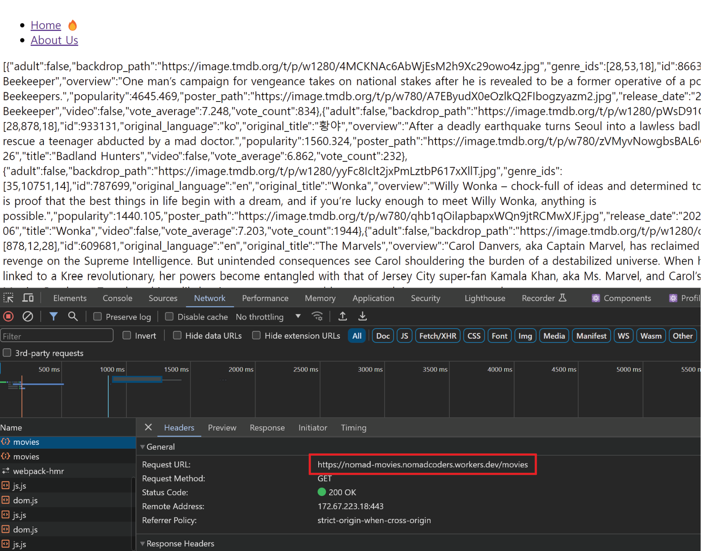

# Data Fetching

## 목차

1. [Data Fetching 해볼 내용](#1-data-fetching-해볼-내용)
2. [Data Fetching](#2-data-fetching)
    1. [Client Component에서 Data Fetching](#2-1-client-component에서-data-fetching)
    2. [Server Component에서 Data Fetching](#2-2-server-component에서-data-fetching)

<br>
<br>

## 1. Data Fetching 해볼 내용

- 유저가 홈페이지로 가면 영화 목록을 볼 수 있도록 하기 (API 필요)
- 유저가 영화를 클릭하면 해당 영화의 상세정보를 볼 수 있도록 하기

<br>
<br>

## 2. Data Fetching

### 2-1. Client Component에서 Data Fetching

- 외부 라이브러리, 서드파티 없이 data를 fetch하기
- React의 `useEffect`와 `useState`를 같이 사용하여 구현해보기

```tsx
// app/(home)/page.tsx

// useState로 상태변화가 생기므로 "use client"
"use client";

import { useEffect, useState } from "react";

export default function Page() {
    // 현재 로딩 상태인지 파악하는 isLoading
    const [isLoading, setIsLoading] = useState(true);
    
    // 영화 정보 상태를 담는 movies
    const [movies, setMovies] = useState();
    
    // getMovies 함수 설정
    const getMovies = async () => {
        const responses = await fetch("https://nomad-movies.nomadcoders.workers.dev/movies");
        const json = await responses.json();
        setMovies(json);
        setIsLoading(false);
    };
    
    // useEffect를 통해 life cycle을 관리
    useEffect(() => {
        getMovies();
    }, []);
    
    return <div>{isLoading ? "Loading..." : JSON.stringify(movies)}</div>;
}
```

- `client component`에서는 `metadata를 사용할 수 없음`
- IsLoading 초기 값으로 true
- movies 초기 값 없음
- `getMovies 함수`는 영화정보 url을 fetch하여 response에 담고, 이를 json() 메서드로 변환 해당 데이터를 setMovies 상태 함수에 호출하고, setIsLoading 함수를 false로 전달
- 이 getMovies 함수는 의존성 배열이 없는 `useEffect`의 콜백함수에서 호출되어, mount 단계에서 실행됨

<br>


<Mount시, Data Fetch하는 예시>

<br>



- 이러한 Data Fetch의 경우, `url이 보호되지 않음`

<br>
<br>

### 2-2. Server Component에서 Data Fetching

- 클라이언트 컴포넌트에서 API를 통해 Data fetch할 때, 중요한 내용이 클라이언트에 유출될 수 있으나, 서버 단에서 Data fetch하면, 서버에 fetch된 데이터가 캐싱되어 중요한 내용을 보호할 수 있음
- metadata를 사용할 수 있음
- `async/await` 사용

```tsx
// app/(home)/page.tsx

// 메타데이터
export const metadata = {
   title: "Home",
};

// 요청할 URL
const URL = "https://nomad-movies.nomadcoders.workers.dev/movies";

// 비동기로 URL을 요청하는 함수 페이지 컴포넌트 밖에서 정의
async function getMovies() {
    // 서버 컴포넌트이므로 콘솔 출력 안됨
   console.log("im fetching!");
   
   // fetch 시, next.js는 fetch 정보를 기억함
   const response = await fetch(URL);
   const json = await response.json();
   return json;
}

// 페이지 컴포넌트 앞에 async넣고 URL 요청 함수를 동기적으로 호출
export default async function HomePage() {
   const movies = await getMovies();
   return <div>{JSON.stringify(movies)}</div>;
}
```

- 하지만 서버에서 Data Fetch이 오래 걸리면 그만큼 클라이언트 단에서 로딩 시간이 길어짐
- 이는 사용자 경험적으로 좋지 않음
- 로딩 시, UI 처리 방법이 필요