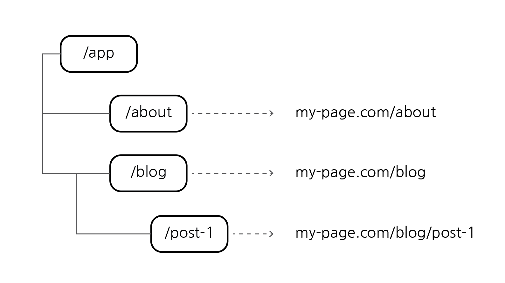
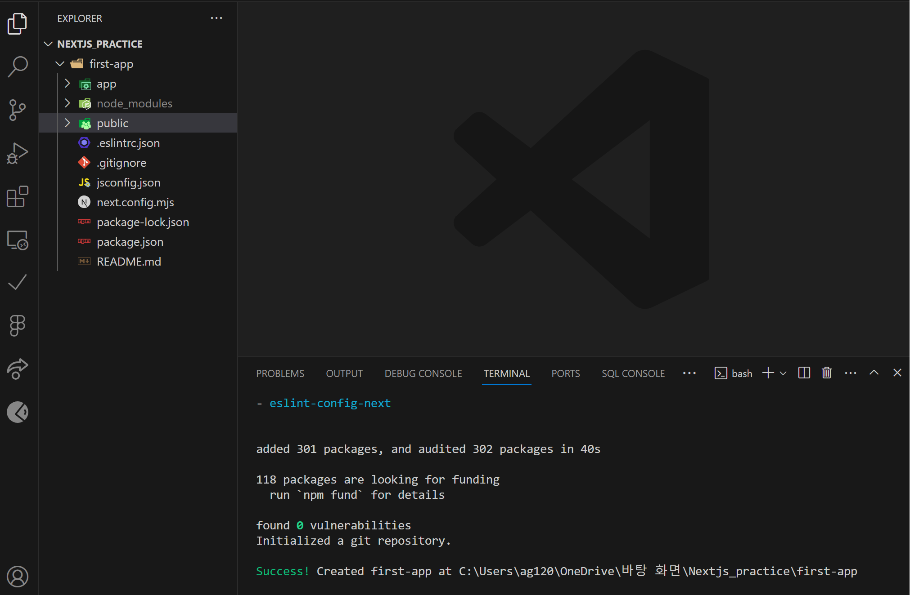
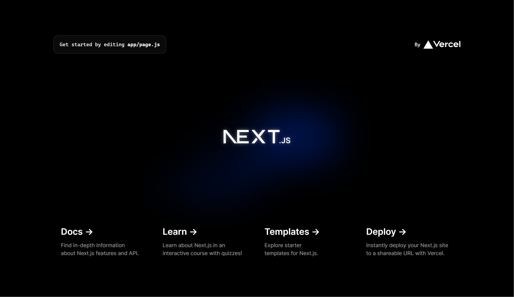
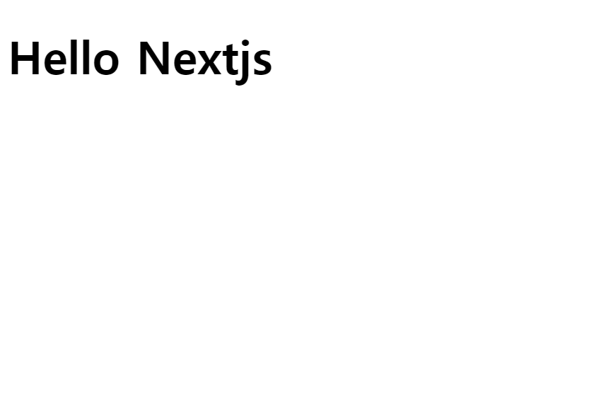

# Next.js 소개 및 프로젝트 생성

## 목차

1. [Next.js는 무엇이고 왜 사용하는가?](#1-nextjs는-무엇이고-왜-사용하는가)
2. [Next.js의 주요기능 및 장점](#2-nextjs의-주요기능-및-장점)
    1. [React를 활용한 풀스택 애플리케이션 구축가능(Fullstack Apps)](#2-1-react를-활용한-풀스택-애플리케이션-구축가능fullstack-apps)
    2. [파일 시스템을 사용하여 경로를 설정 가능(Filesystem-based Routing)](#2-2-파일-시스템을-사용하여-경로를-설정-가능filesystem-based-routing)
    3. [Next.js가 페이지에 보이는 모든 내용을 서버에서 렌더링(Sever-side Rendering)](#2-3-nextjs가-페이지에-보이는-모든-내용을-서버에서-렌더링sever-side-rendering)
3. [Next.js 프로젝트 만들기 (자동)](#3-nextjs-프로젝트-만들기-자동)
    1. [프로젝트 생성 명령어](#3-1-프로젝트-생성-명령어)
        - [프로젝트 명 기입](#--프로젝트-명-기입)
        - [TypeScript 사용 여부](#--typescript-사용-여부)
        - [ESLint 사용 여부](#--eslint-사용-여부)
        - [Tailwind 사용 여부](#--tailwind-사용-여부)
        - [src 디렉토리 사용 여부](#--src-디렉토리-사용-여부)
        - [App Router 사용 여부](#--app-router-사용-여부)
        - [사용자 정의 명령어 설정 여부](#--사용자-정의-명령어-설정-여부)
        - [프로젝트 생성 완료](#--프로젝트-생성-완료)
    2. [프로젝트 실행](#3-2-프로젝트-실행)
        - [프로젝트 폴더로 이동](#--프로젝트-폴더로-이동)
        - [개발 서버 시작하기](#--개발-서버-시작하기)
        - [localhost](#--localhost)
4. [Next.js 프로젝트 만들기 (수동)](#4-nextjs-프로젝트-만들기-수동)
    1. [node package manager 설치](#4-1-node-package-manager-설치)
        - [package.json license 수정](#--packagejson-license-수정)
    2. [package 설치](#4-2-package-설치)
    3. [package.json scripts 수정](#4-3-packagejson-scripts-수정)
    4. [폴더 및 파일 생성](#4-4-폴더-및-파일-생성)
    5. [기본 모듈 export](#4-5-기본-모듈-export)
    6. [프로젝트 실행](#4-6-프로젝트-실행)
        - [layout.tsx](#--layouttsx)
        - [localhost](#--localhost-1)

<br>
<br>

## 1. Next.js는 무엇이고 왜 사용하는가?

-   `React 프레임워크`로서 React에 빌드된다.
-   그렇다면 React 자체도 라이브러리인데 `왜 Next.js를 사용`할까?
-   `풀스택 리액트 프레임워크`이며 풀스택 구축과정을 `단순화`할 수 있도록 도와준다.
-   최근 클라이언트(프론트엔드) 단의 SPA(단일 페이지 애플리케이션)이 아닌 `풀스택 애플리케이션`을 구축하는 추세이다.
-   서버 단의 기능을 추가하고 업데이트하고 있으며, `서버 단에서 컴포넌트를 렌더링(SSR)`을 할 수 있게 업데이트하고 있다.
-   하지만, 풀스택 애플리케이션을 구축하기 위해서는 많은 기능이 필요하다.
    -   Route Setup & Handling
    -   Form Submission
    -   Data Fetching
    -   Authentication...
-   이러한 많은 기능을 Next.js가 제공한다.
-   하지만 React를 기반으로 하기 때문에 React에 대한 기초가 탄탄해야함

<br>

## 2. Next.js의 주요기능 및 장점

### 2-1. React를 활용한 풀스택 애플리케이션 구축가능(Fullstack Apps)

-   프론트엔드와 벡엔드를 혼합하여 `하나의 프로젝트`에서 `하나의 프로그래밍 언어`인 JavaScript를 사용하고 하나의 프레임워크, 라이브러리인 Next.js로 향상된 React에서 복잡한 어플 개발 가능

<br>

### 2-2. 파일 시스템을 사용하여 경로를 설정 가능(Filesystem-based Routing)



-   코드를 사용하여 환경설정하는 React Router, 바닐라 자바스크립트와 달리 Next.js에서는 `파일 시스템(폴더 + 파일)`을 경로로 매핑하여 환경설정함
-   따라서 `코드 기반` 환경설정 또는 `패키지`가 추가로 `필요하지 않음` (Next.js에 내장되어 있음)

<br>

### 2-3. Next.js가 페이지에 보이는 모든 내용을 서버에서 렌더링(Sever-side Rendering)

-   HTML 문서에 화면에 표시되어야 할 모든 컨텐츠가 `포함되어 전달`됨
-   검색 엔진 크롤러도 완성된 컨텐츠를 보는 것이 가능
-   `SEO`(검색 엔진 최적화)에 도움이 됨

<br>
<br>

## 3. Next.js 프로젝트 만들기 (자동)

-   Node.js 기반이므로 Node.js가 설치되어있어야 함
-   [Node.js 공식 사이트](https://nodejs.org/en)

### 3-1. 프로젝트 생성 명령어

```bash
$ npx create-next-app@latest
```

<br>

### - 프로젝트 명 기입

```bash
$ What is your project named? # 원하는 프로젝트명 기입 ex) first-app
```

<br>

### - TypeScript 사용 여부

```bash
$ Would you like to use TypeScript? » No / Yes # 사용 여부에 따라서 선택
```

<br>

### - ESLint 사용 여부

-   ESLint는 자바스크립트 코드에서 발견되는 `문제시되는 패턴들을 식별`하기 위한 정적 코드 분석 도구

```bash
$ Would you like to use ESLint? » No / Yes # 사용 여부에 따라서 선택
```

<br>

### - Tailwind 사용 여부

-   CSS 라이브러리 중 하나

```bash
$ Would you like to use Tailwind CSS? » No / Yes # 사용 여부에 따라서 선택
```

<br>

### - src 디렉토리 사용 여부

```bash
$ Would you like to use `src/` directory? » No / Yes # 사용 여부에 따라서 선택
```

<br>

### - App Router 사용 여부

-   이는 Next.js 앱을 구축하는 두 가지 방식을 의미함
    -   Pages Router
    -   App Router

```bash
$ Would you like to use App Router? (recommended) » No / Yes # 사용 여부에 따라서 선택
```

<br>

### - 사용자 정의 명령어 설정 여부

```bash
$ Would you like to customize the default import alias (@/*)? » No / Yes # 사용 여부에 따라서 선택
```

<br>

### - 프로젝트 생성 완료



<프로젝트 생성 시 기본폴더 구성>

<br>

### 3-2. 프로젝트 실행

### - 프로젝트 폴더로 이동

```bash
$ cd <프로젝트 명>
```

<br>

### - 개발 서버 시작하기

```bash
$ npm run dev
```

### - localhost



<자동 서치한 Next.js 시작 시 첫화면>

<br>
<br>

## 4. Next.js 프로젝트 만들기 (수동)

### 4-1. node package manager 설치

```bash
$ npm init -y
```

<br>

### - package.json license 수정

- license를 MIT로 수정

```json
{
  "license": "MIT",
}
```

<br>

### 4-2. package 설치

```bash
$ npm install react@latest next@latest react-dom@latest
```

<br>

### 4-3. package.json scripts 수정

```json
{
  "scripts": {
    "dev": "next dev",
  }
}
```

- `next dev(dev)` : Next.js를 실행

<br>

### 4-4. 폴더 및 파일 생성

- `app` 폴더 생성
- app 폴더 안에 `page.jsx` 또는 `page.tsx` 파일 생성
- 파일이름 중요하기에 대소문자, 확장자 주의
- 프레임워크가 해당 경로와 파일을 찾기 때문

<br>

### 4-5. 기본 모듈 export

```typescript
// app/page.tsx

export default function Page() {
    return <h1>Hello Nextjs</h1>
}
```

- 모듈의 이름은 상관없음
- TypeScript를 사용하려고 하지만 설치되지 않아 오류가 표시됨 (문제없음)

<br>

### 4-6. 프로젝트 실행

```bash
$ npm run dev
```

- 자체적으로 TypeScript 및 필요한 것들을 설치하고 package를 생성해줌
- Next.js 서버가 만들어지고 `localhost:3000`의 주소에서 실행됨

<br>

### - layout.tsx

```bash
Your page app/page.tsx did not have a root layout. We created app\layout.tsx for you.
```

- 해당 문구와 함께 app 폴더에 자동으로 layout.tsx 파일을 만들어줌

<br>

### - localhost



<수동으로 설치한 Next.js 시작 시 첫화면>