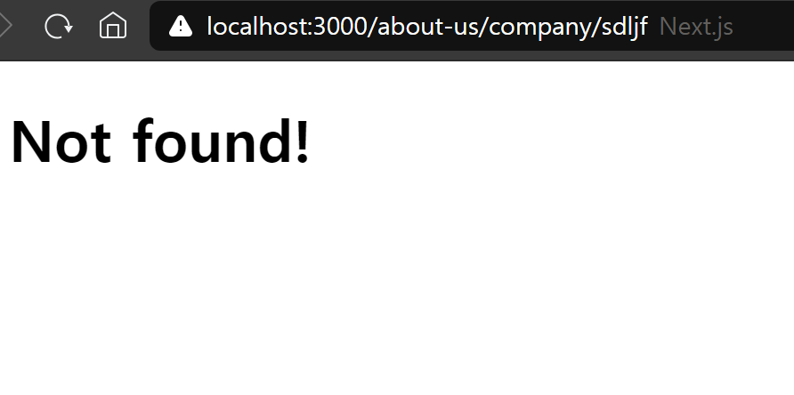
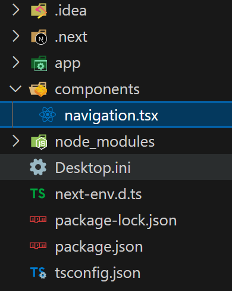

# not-found, usePathname

## 목차

1. [not-fount page](#1-not-fount-page)
2. [네비게이션 바 생성](#2-네비게이션-바-생성)
    1. [components 폴더 생성](#2-1-components-폴더-생성)
    2. [Navigation 컴포넌트 생성](#2-2-navigation-컴포넌트-생성)
        - [Navigation 컴포넌트 모든 페이지에서 가져오기](#--navigation-컴포넌트-모든-페이지에서-가져오기)
    3. [usePathname() 커스텀 Hooks 사용](#2-3-usepathname-커스텀-hooks-사용)
        - [현재 어느 페이지에 있는지 표시하기](#--현재-어느-페이지에-있는지-표시하기)

<br>
<br>

## 1. not-fount page

- app 폴더에 `not-found.tsx` 파일 생성

```typescript
// app/not-found.tsx

export default function NotFount() {
    return <h1>Not found!</h1>;
}
```

- 잘못된 url로 접근할 경우, 기존에는 404 에러 페이지를 보여주었음
- 하지만 not-found.tsx 파일이 있으면 not-found 페이지를 출력

<br>



<잘못된 url 접근 시, not-found 페이지 출력>

<br>
<br>

## 2. 네비게이션 바 생성

### 2-1. components 폴더 생성

- app 폴더와 같은 계층에 components 폴더를 생성함

<br>

### 2-2. Navigation 컴포넌트 생성

- components 폴더에 Navigation 컴포넌트를 생성함

```typescript
// components/Navigation.tsx

import Link from "next/link";

export default function Navigation() {
    return (
        <nav>
            <ul>
                <li>
                    <Link href="/">Home</Link>
                </li>
                <li>
                    <Link href="/about-us">About Us</Link>
                </li>
            </ul>
        </nav>
    );
}
```

- 버튼의 경우, Next.js에서 제공하는 `Link` 컴포넌트를 사용
- `href` 속성을 통해 `url`을 이동

<br>



<components 폴더와 Navigation.tsx 파일 계층>

<br>

### - Navigation 컴포넌트 모든 페이지에서 가져오기

```typescript
// app/page.tsx, app/about-us/page.tsx, app/not-found.tsx

import Navigation from "../components/navigation";

export default function Page() {
    return (
        <div>
            <Navigation />
            <h1>Hello!</h1>
        </div>
    );
}
```

- 해당 컴포넌트를 불러와서 사용
- 모든 페이지에 `수동으로 불러오는 반복작업`을 필요로 하기에 매우 `비효율적임`

<br>

### 2-3. usePathname() 커스텀 Hooks 사용

- `usePathname()` : 사용자가 어디 페이지에 있는지 알려줌

```typescript
// components/Navigation.tsx

import Link from "next/link";
import { usePathname } from "next/navigation";

export default function Navigation() {
    const path = usePathname();
    console.log(path);
    return (
        <nav>
            <ul>
                <li>
                    <Link href="/">Home</Link>
                </li>
                <li>
                    <Link href="/about-us">About Us</Link>
                </li>
            </ul>
        </nav>
    );
}
```

- Next.js에서 제공하는 uesPathname 가져오기
- 위와 같이 작성 후, `에러 발생`

<br>

```
에러 메시지

usePathname only works in Client Components. Add the "use client" directive at the top of the file to use it.
= usePathname은 오직 Client 컴포넌트에서만 작동한다. 파일 상단에 "use client"을 추가해라.
```

<br>

```typescript
// components/Navigation.tsx

"use client"
import Link from "next/link";
import { usePathname } from "next/navigation";
...
```

- Navigation.tsx 파일 상단에 "use client" 추가
- 에러 발생하지 않음

<br>

### - 현재 어느 페이지에 있는지 표시하기

```typescript
// components/Navigation.tsx

...
<li>
    <Link href="/">Home</Link> {path === "/" ? "🔥" : ""}
</li>
<li>
    <Link href="/about-us">About Us</Link> {path === "/about-us" ? "🔥" : ""}
</li>
```

- 삼항 연산자를 통해 현재있는 경로이면 "🔥"을 뒤에 표시하고 아닐 경우, 빈문자열을 뒤에 표시