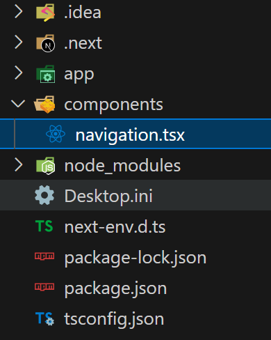

# not-found, usePathname, Rendering

## 목차

1. [not-fount page](#1-not-fount-page)
2. [네비게이션 바 생성](#2-네비게이션-바-생성)
    1. [components 폴더 생성](#2-1-components-폴더-생성)
    2. [Navigation 컴포넌트 생성](#2-2-navigation-컴포넌트-생성)
        - [Navigation 컴포넌트 모든 페이지에서 가져오기](#--navigation-컴포넌트-모든-페이지에서-가져오기)
    3. [usePathname() 커스텀 Hooks 사용](#2-3-usepathname-커스텀-hooks-사용)
        - [현재 어느 페이지에 있는지 표시하기](#--현재-어느-페이지에-있는지-표시하기)
    4. [Next.js가 애플리케이션을 렌더링하는 방식](#2-4-nextjs가-애플리케이션을-렌더링하는-방식)
        - [React 렌더링](#--react-렌더링)
        - [Next.js 렌더링](#--nextjs-렌더링)
        - ["use client"](#--use-client)

<br>
<br>

## 1. not-fount page

- app 폴더에 `not-found.tsx` 파일 생성

```typescript
// app/not-found.tsx

export default function NotFount() {
    return <h1>Not found!</h1>;
}
```

- 잘못된 url로 접근할 경우, 기존에는 404 에러 페이지를 보여주었음
- 하지만 not-found.tsx 파일이 있으면 not-found 페이지를 출력

<br>


<잘못된 url 접근 시, not-found 페이지 출력>

<br>
<br>

## 2. 네비게이션 바 생성

### 2-1. components 폴더 생성

- app 폴더와 같은 계층에 components 폴더를 생성함

<br>

### 2-2. Navigation 컴포넌트 생성

- components 폴더에 Navigation 컴포넌트를 생성함

```typescript
// components/Navigation.tsx

import Link from "next/link";

export default function Navigation() {
    return (
        <nav>
            <ul>
                <li>
                    <Link href="/">Home</Link>
                </li>
                <li>
                    <Link href="/about-us">About Us</Link>
                </li>
            </ul>
        </nav>
    );
}
```

- 버튼의 경우, Next.js에서 제공하는 `Link` 컴포넌트를 사용
- `href` 속성을 통해 `url`을 이동

<br>



<components 폴더와 Navigation.tsx 파일 계층>

<br>

### - Navigation 컴포넌트 모든 페이지에서 가져오기

```typescript
// app/page.tsx, app/about-us/page.tsx, app/not-found.tsx

import Navigation from "../components/navigation";

export default function Page() {
    return (
        <div>
            <Navigation />
            <h1>Hello!</h1>
        </div>
    );
}
```

- 해당 컴포넌트를 불러와서 사용
- 모든 페이지에 `수동으로 불러오는 반복작업`을 필요로 하기에 매우 `비효율적임`

<br>

### 2-3. usePathname() 커스텀 Hooks 사용

- `usePathname()` : 사용자가 어디 페이지에 있는지 알려줌

```typescript
// components/Navigation.tsx

import Link from "next/link";
import { usePathname } from "next/navigation";

export default function Navigation() {
    const path = usePathname();
    console.log(path);
    return (
        <nav>
            <ul>
                <li>
                    <Link href="/">Home</Link>
                </li>
                <li>
                    <Link href="/about-us">About Us</Link>
                </li>
            </ul>
        </nav>
    );
}
```

- Next.js에서 제공하는 uesPathname 가져오기
- 위와 같이 작성 후, `에러 발생`

<br>

```
에러 메시지

usePathname only works in Client Components. Add the "use client" directive at the top of the file to use it.
= usePathname은 오직 Client 컴포넌트에서만 작동한다. 파일 상단에 "use client"을 추가해라.
```

<br>

```typescript
// components/Navigation.tsx

"use client"
import Link from "next/link";
import { usePathname } from "next/navigation";
...
```

- Navigation.tsx 파일 상단에 "use client" 추가
- 에러 발생하지 않음

<br>

### - 현재 어느 페이지에 있는지 표시하기

```typescript
// components/Navigation.tsx

...
<li>
    <Link href="/">Home</Link> {path === "/" ? "🔥" : ""}
</li>
<li>
    <Link href="/about-us">About Us</Link> {path === "/about-us" ? "🔥" : ""}
</li>
```

- 삼항 연산자를 통해 현재있는 경로이면 "🔥"을 뒤에 표시하고 아닐 경우, 빈문자열을 뒤에 표시

<br>

### 2-4. Next.js가 애플리케이션을 렌더링하는 방식

- `렌더링` : react 코드를 브라우저가 이해할 수 있는 html로 변환하는 것

<br>

### - React 렌더링

- 프레임워크 없이 순수 Create-React-app을 사용하여 생성한 `React 앱`이 렌더링되는 방식은 `client-side rendering`임
- 브라우저가 렌더링 작업을 한다는 것을 의미하며 JavaScript 엔진이 파일을 화면에 출력함
- 유저가 페이지를 실행한 시점에는 빈화면으로 존재하며 새로고침 시, 빈화면을 볼 수 있는데 JavaScript를 다운로드하고 실행하는 `로딩 시간`임
- JavaScript를 브라우저에서 비활성화 시킨 유저는 화면을 볼 수 없으며 네트워크 속도가 느리면 화면이 늦게 출력되어 UX적으로 좋지 않음
- 페이지의 html을 통해 판단하는 `SEO의 최적화`를 하기위해서는 Google에 빈 페이지를 보여주지 않는 것이 좋음

<br>

### - Next.js 렌더링

- Next.js로 프로그램을 빌드할 경우, 기본적으로 `server-side rendering`임
- 서버에서 화면에 표시할 html 파일을 생성하여 브라우저로 전달함
- 이미 화면에 표시할 `html 파일을 브라우저가 가지고 있기` 때문에 JavaScript가 로드될 때까지 `기다릴 필요가 없음`
- JavaScript가 브라우저에서 비활성화 되어있더라도 화면을 잘 출력해줌

<br>

### - "use client"

- server-side에서 렌더링된 요소에 Hydration(전달받은 HTML 페이지에 React application을 초기화하여 동적인 페이지로 만드는 과정)이 필요하다는 것을 컴포넌트에 명시해주는 것
- "use client"를 상단에 명시하지 않은 컴포넌트는 정적인 컴포넌트이며, 서버에서 전달받은 후, Hydration 과정이 진행되지 않음
- 즉, Hydration이 필요한 컴포넌트와 필요하지 않은 정적 컴포넌트를 `구분하는 역할`을 함
- "use client"를 명시하지 않은 컴포넌트에서 동적인 요소를 사용할 경우, Next.js에서 에러를 통해 "use client"를 사용해야 함을 알려줌
- 사용자가 JavaScript를 필요한 부분만 다운로드 받을 수 있어 `성능 최적화에 도움이 됨`