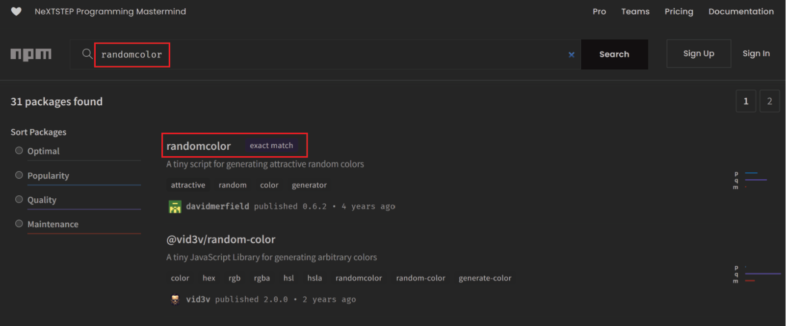
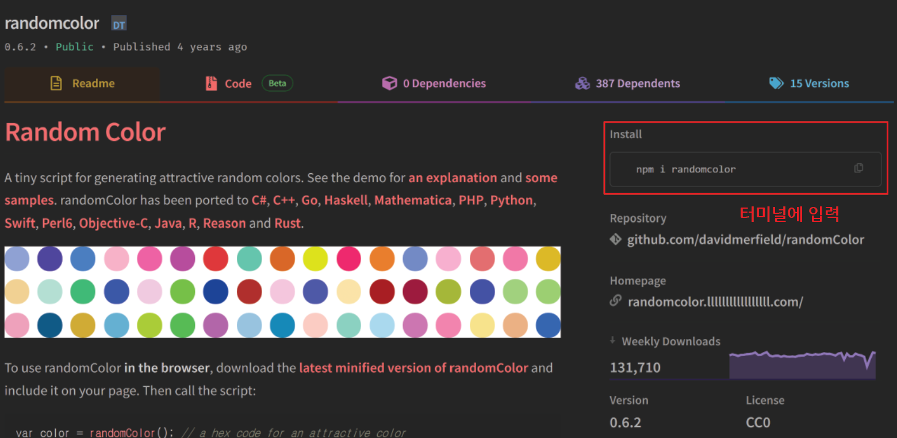
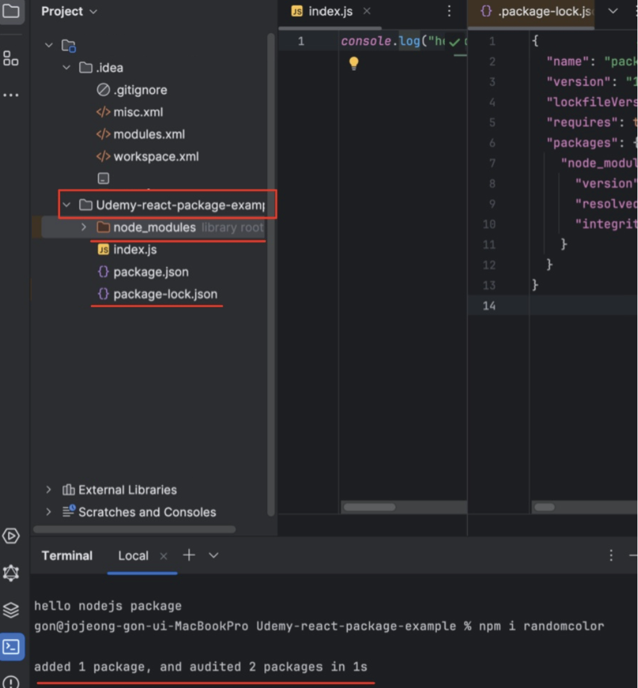
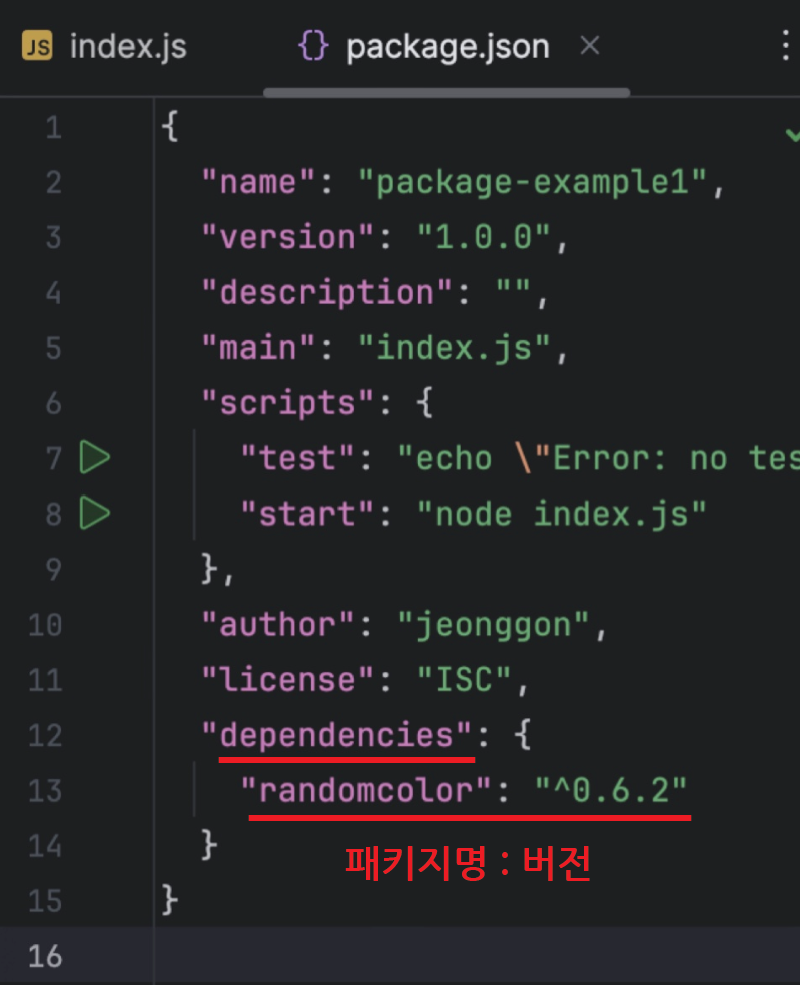
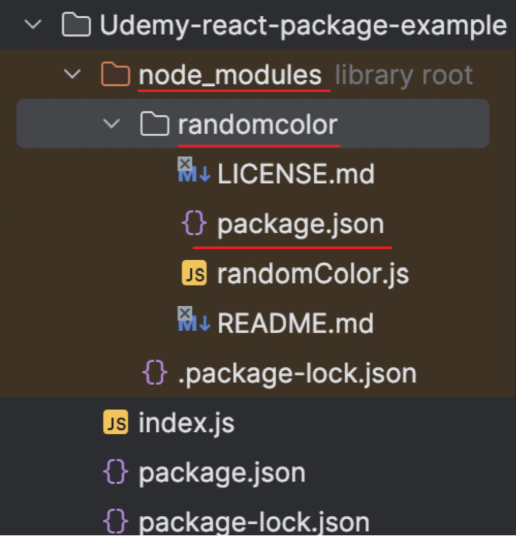
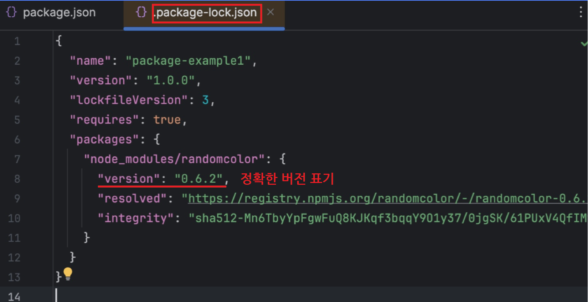
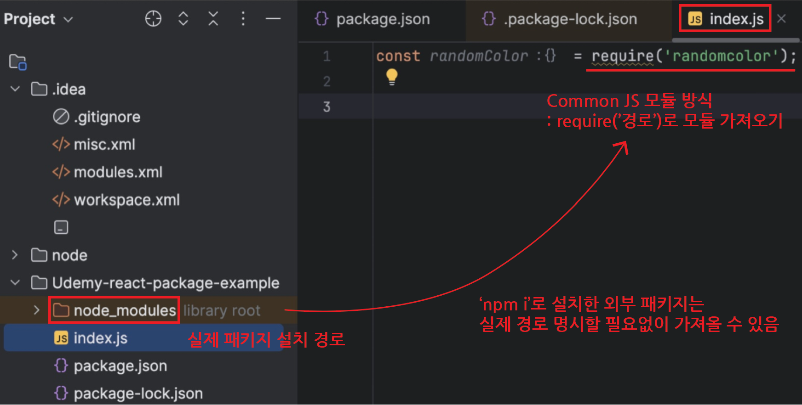
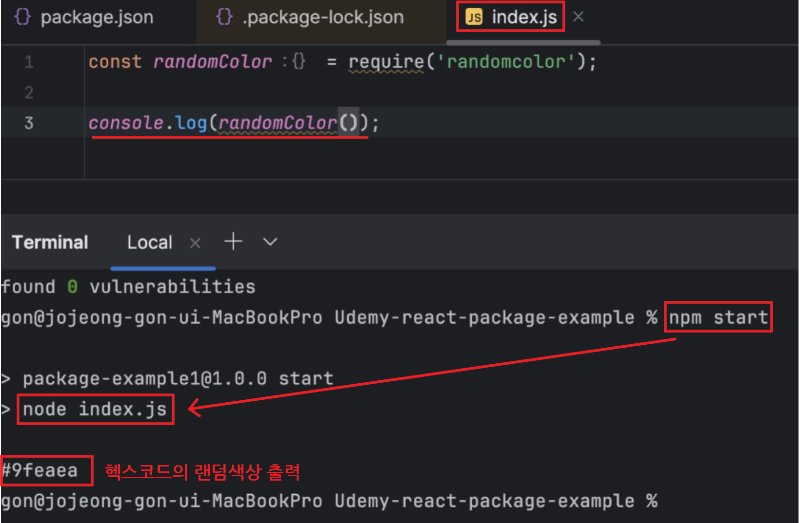

# 패키지

## 목차

1. [패키지](#1-패키지)
    1. [npm(Node Package Manager)](#1-1-npmnode-package-manager)
    2. [npm을 이용하여 Node.js 패키지 만들기](#1-2-npm을-이용하여-nodejs-패키지-만들기)
    3. [npm을 이용하여 다른 사람이 만든 패키지 설치 및 사용하는 예시](#1-3-npm을-이용하여-다른-사람이-만든-패키지-설치-및-사용하는-예시)

<br/>
<br/>

## 1. 패키지

### 1-1. npm(Node Package Manager)

- Node.js의 패키지 관리 도구
- 다른 사람이 만들어 놓은 `Node.js 모듈`
    - ex) 로그인 모듈(패키지), 전화인증 모듈(패키지), 메일 발송 모듈(패키지) 등...

<br>

### 1-2. npm을 이용하여 Node.js 패키지 만들기

1. 패키지 파일들을 효율적으로 관리하기 위해 하나의 최상위 부모인 `루트폴더`를 정하고 그 아래에 모뎀 패키지 파일들을 생성

<br>

2. 루트폴더로 이동

```bash
# 루트폴더 이동
$ cd '루트폴더 명'
```

<br>

3. 패키지 생성

```bash
# 패키지 생성 명령어 입력
$ npm init
```

<br>

4. 패키지 이름 지정

```bash
# 패키지 이름 물어보면 지정
# ex)
$ 'package-example1'
```

<br>

5. 버전 지정

```bash
# 버전 물어봄
# 첫 버전이면 그냥 'enter' 입력


# 이후 패키지를 개발하면서 버전 관리하기

# 1. 패치 버전 업데이트 (Patch Version Update)
# : 패치 버전을 1 증가 (예: 1.0.0 -> 1.0.1).
$ npm version patch


# 2. 마이너 버전 업데이트 (Minor Version Update)
# : 마이너 버전을 1 증가 (예: 1.0.0 -> 1.1.0)
$ npm version minor


# 3. 메이저 버전 업데이트 (Major Version Update)
# : 메이저 버전을 1 증가 (예: 1.0.0 -> 2.0.0)
$ npm version major


# 4. 특정 버전으로 업데이트
$ npm version 1.2.3

# 버전 변경 후, add, commit, push 진행

# npm에 패키지 업데이트 푸시
$ npm publish
```

<br>

6. Description

    - 패키지에 대한 설명을 입력 (안 입력 해도 상관없음)

<br>

7. entry point 지정

    - 기본적으로 `index.js`이며 enter로 넘어감
    - 여러 개의 파일 중 실행해야하는 파일을 명시하는 것

<br>

8. test command

    - 패키지의 테스트를 실행하기 위해 package.json 파일에 "test" 스크립트를 설정할 수 있음
    - 이 스크립트는 개발자들이 패키지를 테스트하고 검증하는 데 사용됨
    - enter로 넘어가도 됨

    ```json
    // package.json

    {
        "scripts": {
            "test": "mocha tests/**/*.js",
            "start": "node index.js"
        }
    }
    ```

    - `scripts` : 패키지를 개발하면서, 자주 실행해야하는 명령어를 사전에 정의해 두는 곳

    ```bash
    # 테스트 코드 실행 시
    $ npm test

    # 패키지 실행 시
    $ npm start
    ```

<br>

9. git repository

    - 패키지를 관리할 레포지토리 설정
    - enter로 넘어가도 됨

    ```json
    // package.json

    {
        "repository": {
            "type": "git",
            "url": "https://github.com/your-username/your-repo.git"
        }
    }
    ```

<br>

10. keywords

    - package.json 파일에 정의된 속성 중 하나로, 패키지를 설명하고 검색하기 위한 키워드나 태그를 나타냄
    - enter로 넘어가도 됨

    ```json
    // package.json
    {
        "keywords": ["keyword1", "keyword2"]
    }
    ```

<br>

11. author

    - 본인 닉네임을 입력하거나 enter로 넘어가도 됨

    ```json
    // package.json

    {
        "author": "Your Name"
    }
    ```

<br>

12. license

    - 패키지가 사용되는 조건과 제약을 설명하는 데 사용됨
    - enter로 넘어가도 됨

    ```json
    // package.json

    {
        "license": "MIT"
    }
    ```

<br>

13. 작성된 내용 최종확인

    - 'yes' 선택
    - 최종적으로 루트폴더 안에 `package.json`이라는 파일이 생성되고 패키지가 초기화 됨
    - `package.json` : 만드는 패키지의 `정보`를 기록하는 환경설정 파일

<br>

14. 패키지 실행

    - package.json의 scripts에 `"start": "node index.js"` 추가하고 터미널에 `npm start` 입력
    - 처음에 `에러` 발생하는데 이는 `당연한 것`
        - `node index.js`를 실행하는데 폴더 안에 `index.js` 파일이 없기 때문임
        - 루트폴더에는 현재 `package.json`만 존재함
    - 따라서, 루트폴더 안에 `index.js`를 만들기
        - 이제 에러 발생하지 않음

<br>

### 1-3. npm을 이용하여 다른 사람이 만든 패키지 설치 및 사용하는 예시

1. 패키지(=모듈) 공유 사이트 이용

    - 사이트 [npmjs.com](https://www.npmjs.com/)에는 방대한 Node 모듈들이 있으며, 대부분 `오픈 소스 패키지`임
    - 예시로 'randomcolor' 검색하여 선택

   

<br>

2. 설치하기

   

    ```bash
    # 터미널에서 설치 명령어 입력

    $ npm i randomcolor
    ```

    - i는 install(설치)을 의미하며 `npm i`, `npm install` 중 아무 명령어나 사용해도 괜찮음

    <br>

   

    - 1개의 패키지 추가, 2개의 패키지가 조정되었다는 메시지 확인

<br>

3. Dependency 의존성

   

    - 이전과 달리 `dependecies`가 생기고 안에 `randomcolor 패키지`가 설치되어있는 것을 확인 할 수 있음
    - 버전이 명시되어있는데 버전의 `'^'` 문자의 의미는 `이 이상의 버전으로 설치`됨을 의미함

<br>

4. node_modules

   

    - `node_modules`라는 `라이브러리 루트폴더`가 생성됨
    - 내부에 현재 설치된 외부 패키지들의 폴더가 위치함
    - 외부 패키지들도 마찬가지로 각각 package.json을 가짐

<br>

5. package-lock.json

   

    - 기존의 package.json과 유사하나 설치된 외부 패키지들의 정보를 `정확하게 명시`해놓음
    - 예를들어 `package.json`에서는 randomcolor 패키지의 버전을 `"^0.6.2"`(0.6.2 이상)로 범위적으로 명시해놓았으나, `package-lock.json`에는 `"0.6.2"`로
      정확한 버전을 표기함

<br>

6. 외부 패키지 가져오기

   

    - `Common JS` 방식을 사용하여 `require('경로');`로 entry point인 `index.js`로 모듈 가져오기
    - `npm i`를 통해 설치한 외부 패키지는 `실제 경로를 명시할 필요없이` 가져올 수 있음

<br>

7. 외부 패키지 실행하기

   

    - `npm start` 실행
    - randomcolor의 기능인 랜덤의 색상을 헥스코드로 추천해주는 것을 볼 수 있음
    - 이처럼 다양한 외부 패키지를 설치하여 개발에 적용할 수 있음
