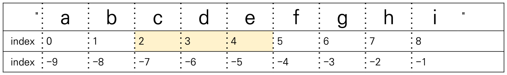

# Python 기초

## - 목차
1. [Programming](#1-programming)
    - [프로그래밍](#1-프로그래밍)
    - [프로그래밍 언어](#2-프로그래밍-언어)
    - [명령적 지식(Imperative knowledge)](#3-명령적-지식imperative-knowledge)
2. [Python](#2-python)
3. [객체와 변수](#3-객체와-변수)
    - [객체(Object)](#1-객체object)
    - [변수(Variable)](#2-변수variable)
    - [할당(Assignment)](#3-할당assignment)
4. [식별자(Identifiers)](#4-식별자identifiers)
5. [자료형(Data Type)](#5-자료형data-type)
6. [연산자(Operator)](#6-연산자operator)
    - [산술연산자](#1-산술연산자)
    - [복합연산자](#2-복합연산자)
    - [비교연산자](#3-비교연산자)
    - [논리연산자](#4-논리연산자)
7. [컨테이너(Container)](#7-컨테이너container)
    - [시퀀스](#1-시퀀스)
8. [파이썬 시작하기](#8-파이썬-시작하기)
    - [주석](#1-주석)
    - [입출력](#2-입출력)

---

## (1) Programming

### **1) 프로그래밍**


: `명령어의 모음`(집합)이다.

### **2) 프로그래밍 언어**


: 자신의 생각을 나타내고 전달하기 위한 `체계` 또는 컴퓨터에게 명령을 하기 위한 `약속`이다.

### **3) 명령적 지식(Imperative knowledge)**


: 방법에 대해서 전혀 `모르는` 사람에게 정보를 알려주듯 매우 `디테일한 설명`이 필요하다.

---

## (2) Python

> 파이썬은 네덜란드 개발자 *`귀도 반 로섬(Guido van Rossum)`* 이 1990년 만든 언어로 새로운 분산환경 시스템에 맞으면서 C와 셀에서 부족한 부분을 채워줄 새로운 언어를 필요로 하여 개발하게 되었다. 현재 글로벌 대기업부터 스타트업까지 다양하게 파이썬을 이용하고 있다.

**<파이썬 특징>**

1. 문법이 매우 `간단`하여 단 기간에 익히기 가능하다.
2. `직관적`이고 `간결`하다.
3. 윈도우, 맥, 리눅스, 유닉스 등 `다양한 OS`를 지원한다.
4. `Interpreter`로서 작성된 코드를 컴파일 과정 없이 바로 실행가능하다.
5. 구성하는 모든 요소가 객체(Object)로 이루어진 `객체 지향 프로그램 언어`이다.

---

## (3) 객체와 변수

### **1) 객체(Object)**


: 객체는 변수에 담을 수 있는 `모든 것`을 의미한다.

### **2) 변수(Variable)**


: 객체를 참조하여 `데이터를 담을 수 있는 공간`으로 `변할 수 있는 것`을 의미한다.

### **3) 할당(Assignment)**


: 객체를 변수에 입력하는 과정으로 `연산자(=)`를 사용하여 표현하며, 수학에서 의미하는 '같다'의 의미로 사용되지 않는다.

```bash
<같은 값을 동시에 할당>

x = y = 2023

<다른 값을 동시에 할당>

x, y = 20, 23
```

```bash
ex)

x = 10 , y = 20일 때, 서로 값 바꾸기

sol.1)
x, y = 10, 20
x, y = y, x

sol.2)
변수를 하나 더 추가한다.
tmp = x
x = y
y = tmp
```

---

## (4) 식별자(Identifiers)


: 프로그래밍 언어에서 객체를 식별하는데 사용하는 `이름`이다.

**<식별자 규칙>**

  1. `알파벳`, `언더스코어(_)`, `숫자`로 구성된다.
  2. 첫 글자로 숫자가 사용될 수 없다.
  3. 길이제한은 없으며, 대소문자를 구분한다.
  4. 공백을 포함 할 수 없다.
  5. 키워드(Keyword : 파이썬에서 미리 지정된 이름)는 사용할 수 없다.

  ```
  <키워드>

  'False', 'None', 'True', 'and', 'as', 'assert', 'break', 'class', 'continue',   'def', 'del', 'elif', 'else', 'except', 'finally', 'for', 'from', 'global', 'if', 'import', 'in', 'is', 'lambda', 'nonlocal', 'not', 'or', 'pass', 'raise', 'return', 'try', 'while', 'with', 'yield'
  ```

  

```bash
<파이썬 식별자 형태>

파이썬에서는 식별자의 형태로 'snake_case(: 언더바를 이용하여 단어구분)'를 주로 사용하며, 자바의 경우, 'CamelCase(: 대문자를 이용하여 단어구분)'를 사용한다.
```

---

## (5) 자료형(Data Type)


: 객체(Object)의 `종류`를 의미한다.

- **수치형(Numeric Type)**
  - **정수(int)** : 모든 `정수` 타입은 `int`로 표현된다. 값이 커져도 오버플로우가 발생하지 않는다.
  - **실수(float)** : 정수가 아닌 모든 `실수`는 `float`로 표현된다. 지수표기법을 활용하여 값이 길어질 경우, e를 사용하여 표시된다.


- **불린형(Boolean Type)**

   : `True(참)`와 `False(거짓)`을 나타내며, 참은 '1'로 거짓은 '0', '0.0', '()', '[]', '{}', '"', 'None'으로 표현된다. 주로 비교 및 논리연산을 수행함에 있어 활용된다.

---

## (6) 연산자(Operator)

### **1) 산술연산자**


: 기본적인 사칙연산 및 수식계산

| 연산자 |   내   |
|:------:|:--------:|
|    +   |   덧셈   |
|    -   |   뺄셈   |
|    *   |   곱셈   |
|    %   |  나머지  |
|    /   |  나눗셈  |
|   //   |    몫    |
|   **   | 거듭제곱 |

### **2) 복합연산자**


: 연산과 할당이 동시에 이루어짐

|  연산자  |    내용    |
|:--------:|:----------:|
|  a + = b |  a = a + b |
|  a - = b |  a = a - b |
|  a * = b |  a = a * b |
|  a % = b |  a = a % b |
|  a / = b |  a = a / b |
| a // = b | a = a // b |
| a ** = b | a = a ** b |

### **3) 비교연산자**


: 값을 비교하며, True / False 값을 리턴함

|  연산자  |    내용    |
|:--------:|:----------:|
|     <    |    미만    |
|    < =   |    이하    |
|     >    |    초과    |
|    > =   |    이상    |
|    = =   |    같음    |
|    ! =   |    다름    |

```
<주의!> '이하'와 '이상'은 기호를 반대로 작성하지 않도록 주의한다.

이하 : < = (O), = < (X) / 이상 : > = (O), = > (X)
```

### **4) 논리연산자**


: 논리식을 판단하여 참(True)과 거짓(False)을 반환함

|  연산자 |              내용              |
|:-------:|:------------------------------:|
| A and B |     A, B 모두 True시, True     |
|  A or B |    A, B 모두 False시, False    |
|   not   | True를 False로, False를 True로 |
---

## (7) 컨테이너(Container)


: 여러 개의 값(객체)을 담을 수 있는 것

|    연산    |                           결과                          |
|:----------:|:-------------------------------------------------------:|
|    s[i]    |                      s의 i번째 항목                     |
|   s[i:j]   |                 s의 i에서 j까지 슬라이스                |
|  s[i:j:k]  |              s에서 j까지 스텝 k의 슬라이스              |
|    s + t   |                     s와 t 이어붙이기                    |
|    s * n   |                      s를 n번 붙이기                     |
|   x in s   | s의 항목 중 하나가 x와 같으면 True, 그렇지 않으면 False |
| x not in s | s의 항목 중 하나가 x와 같으면 False, 그렇지 않으면 True |
|   len(s)   |                         s의 길이                        |
|   min(s)   |                    s의 가장 작은 항목                   |
|   max(s)   |                     s의 가장 큰 항목                    |


### **1) 시퀀스**

- **문자열(immutable, String Type)** : 문자들의 나열로 모든 문자는 `str타입`이며, `작은따옴표(')`나 `큰따옴표(")`를 활용하여 표기한다.

 - 인덱싱 : 인덱싱을 통하여 특정 값에 접근할 수 있음

  ```
  <주의!> 순서는 '0' 부터 시작함을 명시, 음수를 사용하여 거꾸로 인덱싱이 가능하며, 이 경우에는 '-1' 부터 시작한다.
  
  s[1] == 'b'
  ```
  

  - 슬라이싱 : 문자열 일부에 접근할 수 있음

  ```
  <주의!> [a:b]의 경우, a인덱스 이상 b인덱스 미만을 의미한다.

  s[2:5] == 'cde'
  ```
  

  ```
  문자열 일부에서 특정 간격만큼 띄어 접근할 수 있다.

  s[2:5:2] == 'ce'
  ```
  

  - Escape sequence : 문자열 내에서 특정문자나 조작을 위해서 `역슬래시(\)`를 활용하여 구분

| 문자 |       내용      |
|:----:|:---------------:|
|  \n  |     줄 바꿈     |
|  \t  |        탭       |
|  \r  |    캐리지리턴   |
|  \O  |     널(null)    |
|  \\  |        \        |
|  \'  | 단일인용부호(') |
|  \"  | 이중인용부호(") |

- **리스트(mutable, list)** : `변경 가능한 값들의 나열`로 순서를 가지며, 서로 다른 타입의 요소를 가질 수 있다. 대괄호([])의 형태로 정의하며, 요소는 콤마(,)로 구분한다.

  ```
  문자열과 같이 인덱스를 통해 접근 가능하다.

  list[i]에서 i는 0부터 시작, 음수는 -1부터 시작

  <값을 추가하는 방법>
  .append(value)를 활용

  ls = [2, 4, 6]
  ls .append(8)
  ls => [2, 4, 6, 8]

  <값을 삭제하는 방법>
  .pop(index)를 활용

  ls = [2, 4, 6]
  ls .pop(1)
  ls => [2, 6]
  ```

---

## (8) 파이썬 시작하기

### **1) 주석**


: 코드에 대한 설명 또는 중요한 내용을 표시하는 것으로 컴퓨터가 인식하지 못한다. 주석처리내용 앞에 `(#)`을 입력하거나 `단축키(Ctrl + /)` 활용한다.

### **2) 입출력**


: `input([prompt])`를 사용하여 사용자로부터 입력을 받을 수 있다. `print()`를 활용해 값을 출력할 수 있다.

#### **- 팁! 간단한 출력을 위한 f-string / .format() 사용**
```bash
# 예를 들어 이름 및 나이를 한문장으로 출력할 경우,
name = '철수'
age = 20

# 1. 형변환을 통한 출력
print(name + '는 ' + str(age) + '살입니다.')
> 철수는 20살입니다.

# 2. f-string을 사용한 출력
# 괄호 안의 변수를 모두 문자열로 변환하여 출력해줌
print(f'{name}은 {age}살입니다.')
> 철수는 20살입니다.

# 3. .format()을 사용한 출력
# 괄호로 위치를 선정하고 이후 함수를 통해 문자열로 출력
print('{}는 {}살입니다.'.format(name, age))
> 철수는 20살입니다.
```