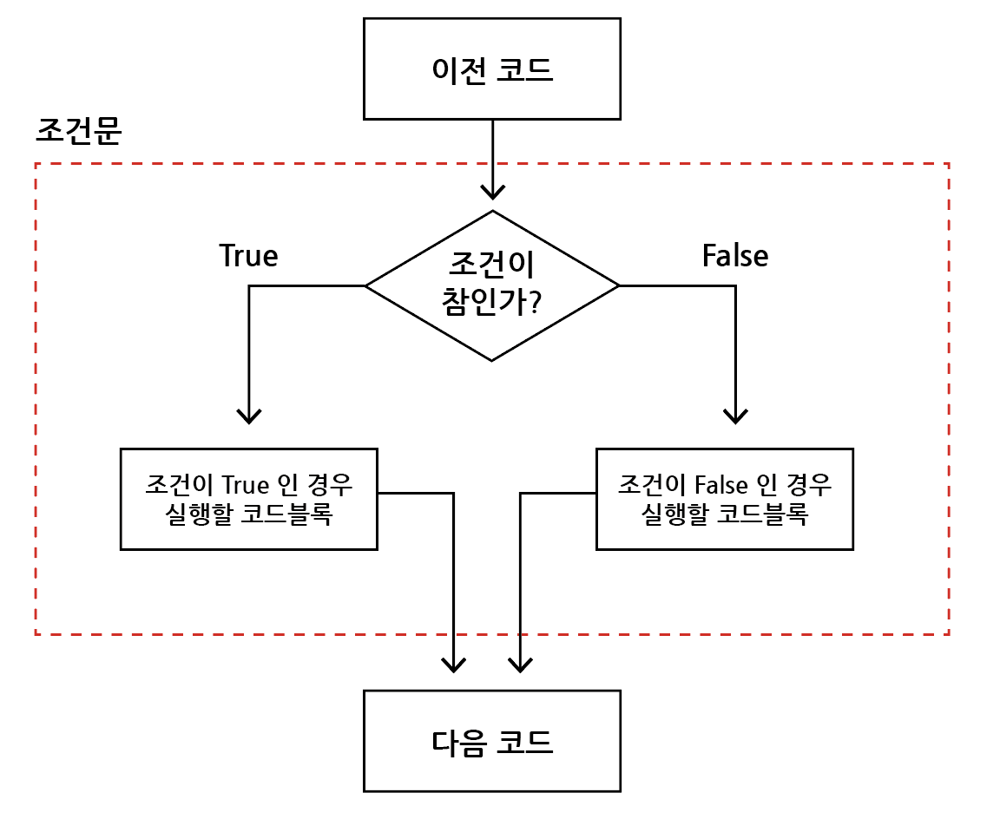
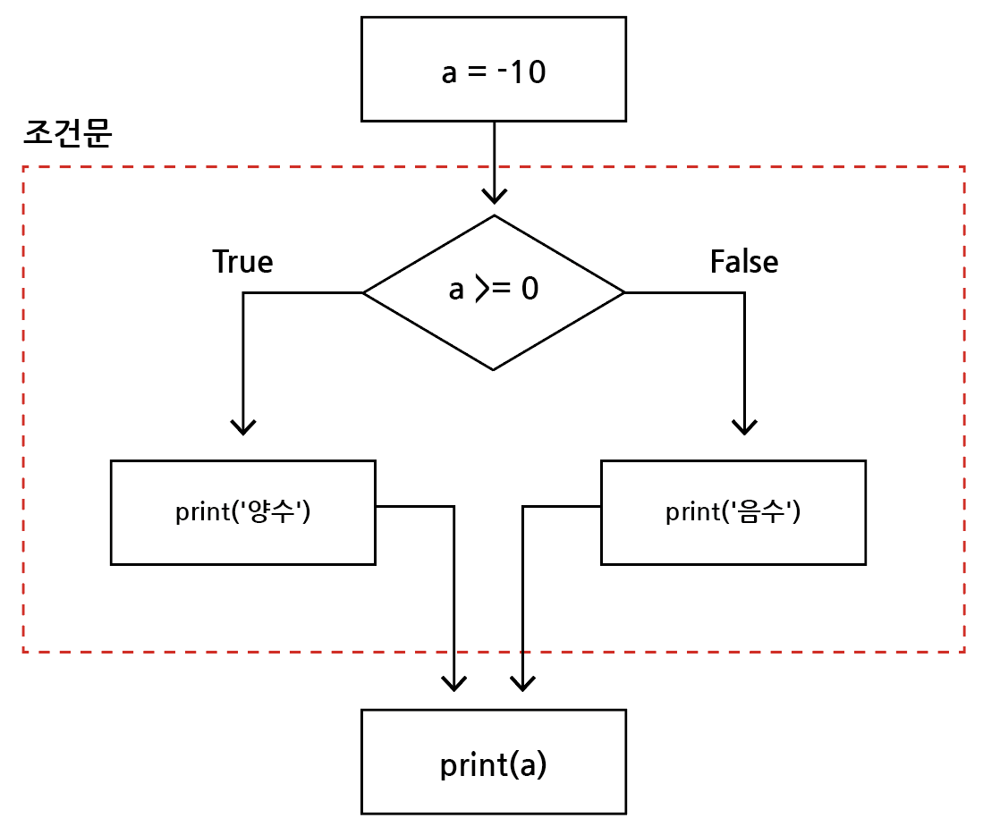
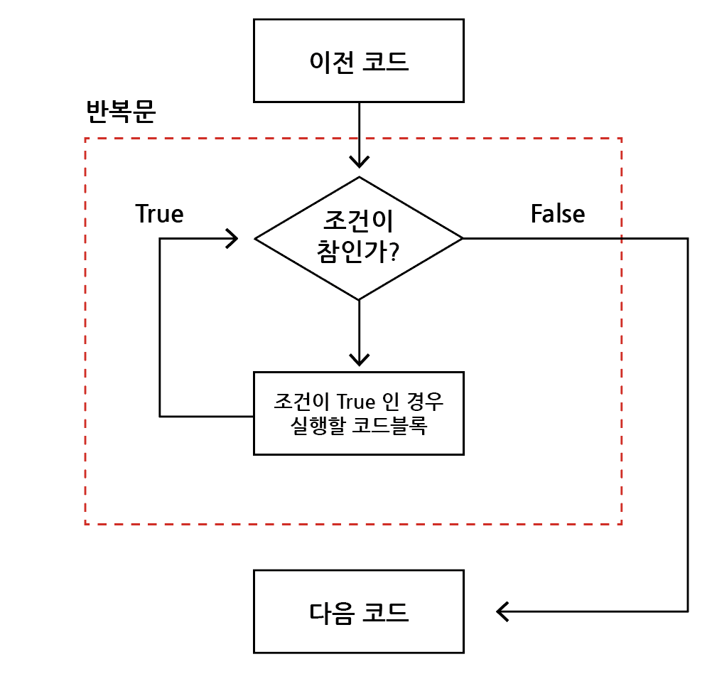
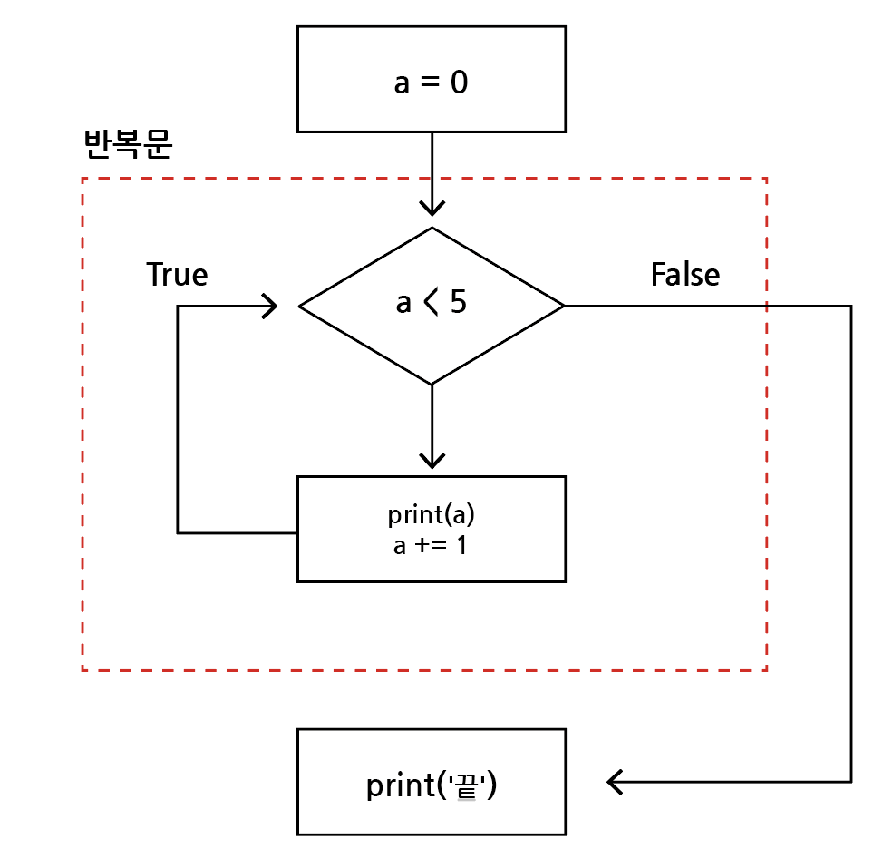
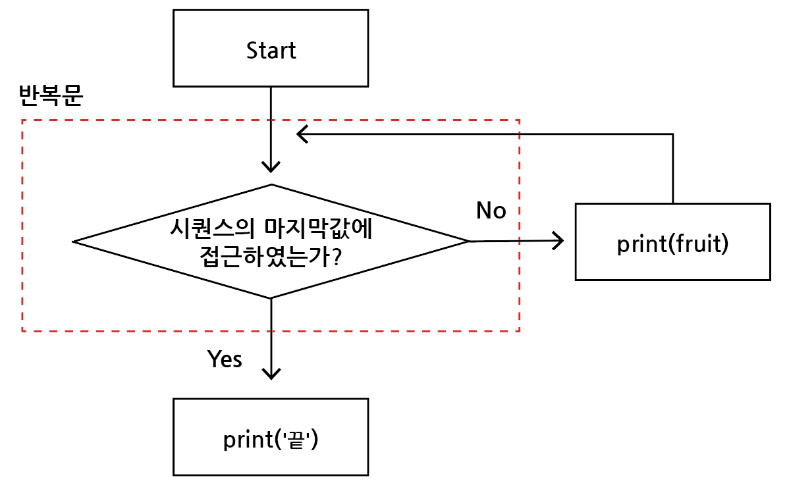

# 제어문

## - 목차
1. [제어문(Control Statement)](#1-제어문control-statement)
2. [조건문(Conditional Statement)](#2-조건문conditional-statement)
    - [조건문](#1-조건문)
    - [복수 조건문](#2-복수-조건문)
    - [중첩 조건문](#3-중첩-조건문)
    - [레인지(Range)](#4-레인지range)
3. [반복문(Loop Statement)](#3-반복문loop-statement)
    - [반복문](#1-반복문)
    - [While문](#2-while문)
    - [for문](#3-for문)
    - [반복문 제어](#4-반복문-제어)

---

## (1) 제어문(Control Statement)


- 파이썬은 기본적으로 위에서 아래로 `순차적`으로 명령을 수행
- 특정 상황에 따라 코드를 `선택적`으로 실행(분기/조건)하거나 `계속`하여 실행(반복)하는 제어가 필요함
- 제어문은 `순서도(flow chart)`로 표현이 가능

---

## (2) 조건문(Conditional Statement)

### **1) 조건문**


: 조건무은 `참/거짓`을 판단할 수 있는 조건식과 함께 사용



- expression에 참/거짓에 대한 조건식
  - 조건이 참인 경우, 다음 들여쓰기 되어있는 코드 블럭 실행
  - 이외의 경우, else 다음 들여쓰기 되어있는 코드 블럭 실행
    - else가 필수는 아니며 선택적으로 활용가능

```bash
if <expression>:
    # expression이 참인 경우, 실행할 Code Block
else:
    # 그 외의 경우, 실행할 Code Block
```

Q) 아래의 순서도를 코드로 나타내기



```bash
답)

a = -10

if a >= 0:
    print('양수')
else:
    print('음수')
    
print(a)
```

Q) 조건문을 통해 입력받는 변수 num의 값의 홀수/짝수 여부를 출력

```bash
답)

num = int(input())

if num % 2 == 0:
    print('짝수')
else:
    print('홀수')
```


### **2) 복수 조건문**


: 복수의 조건식을 활용할 경우, `elif를 활용`하여 표현함

```bash
if <expression1>:
    # Code block
elif <expression2>:
    # Code block
elif <expression3>:
    # Code block
else:
    # Code block
```

Q) 다음 미세먼지 농도에 따른 등급표를 보고 dust(미세먼지 농도) 값에 따라 등급을 출력하는 조건식을 작성


```bash
답)

dust = int(input())

if dust > 150:
    print('매우나쁨')
elif dust > 80:
    print('나쁨')
elif dust > 30:
    print('보통')
else:
    print('좋음')
print('미세먼지 확인완료')
```


### **3) 중첩 조건문**


: 조건문은 다른 조건문에 중첩되어 사용될 수 있음, `들여쓰기를 유의`하여 작성해야 함

```bash
if <expression1>:
    # Code block
    if <expression2>: # 들여쓰기 주의
        # Code block
else:
    # Code block
```

Q) 위의 미세먼지 문제 답안코드에서 중첩조건문을 활용하여 dust값이 300이 넘는 경우,
'실외활동을 자제하세요'를 추가적으로 출력하고 음수인 경우 '값이 잘못되었습니다'를 출력

```bash
답)

dust = int(input())

if dust > 150:
    print('매우나쁨')
    if dust > 300:
        print('실외활동을 자제하세요')
elif dust > 80:
    print('나쁨')
elif dust > 30:
    print('보통')
else:
    if dust >= 0:
        print('좋음')
    else:
        print('값이 잘못되었습니다')
print('미세먼지 확인완료')
```


### **4) 레인지(Range)**


: 숫자의 `시퀀스`를 나타내기 위해 사용, 변경 불가능하며(immutable), 반복 가능함(iterable)
> 구조 : range(n=0, m, s=1)

- 기본형 : range(n)
  - 0부터 n-1까지의 숫자의 시퀀스
- 범위 지정 : range(n, m)
  - n부터 m-1까지의 숫자의 시퀀스
- 범위 및 스텝 지정 : range(n, m, s)
  - n부터 m-1까지 s만큼 증가시키며 형성된 숫자의 시퀀스

```bash
ex) # 0부터 특정 숫자까지

list(range(3))

출력
>> [0, 1, 2]


ex) # 숫자의 범위

list(range(1, 5))

출력
>> [1, 2, 3, 4]


ex) # step의 활용

list(range(1, 5, 2))

출력
>> [1, 3]


ex) # 역순

list(range(6, 1, -1))

출력
>> [6, 5, 4, 3, 2]


ex) # 큰 수에서 작은 수로 역순임에도 step이 양수인 경우

list(range(6, 1, 1))

출력
>> []
```

---

## (3) 반복문(Loop Statement)

### **1) 반복문**


: `특정 조건이 도달`할 때까지, 계속 `반복`되는 일련의 문장



- while문
  - 종료조건에 해당하는 코드를 통해 반복문을 종료시켜야 함
- for문
  - 반복가능한 객체를 모두 순회하면 종료 (별도의 종료조건이 필요 없음)
- 반복 제어
  - break, continue, for-else

### **2) While문**


: while문은 조건식이 참인 경우, 반복적으로 코드를 실행

- 조건이 참인 경우, 들여쓰기 되어있는 코드 블록이 실행됨
- 코드 블록이 모두 실행되고, 다시 조건식을 검사하며 반복적으로 실행됨
- while문은 무한 루프를 하지 않도록 종료조건이 반드시 필요

```bash
while <expression>:
    # Code block
```

Q) 아래의 순서도를 코드로 나타내기



```bash
답)
  
a = 0

while a < 5:
    print(a)
    a += 1
    
print('끝')
```

Q) 1부터 사용자가 입력한 양의 정수까지의 총합을 구하는 코드를 작성

```bash
답1)

num = int(input())
total = 0

while num != 0:
    total += num
    num -= 1

print(total)

----------------------------
답2)
  
n = 0
total = 0
user_input = int(input())

while n <= user_input:
    total += n
    n += 1

print(total)
```


### **3) for문**


: for문은 시퀀스(string, tuple, list, range)를 포함한 `순회 가능한 객체(iterable)요소`를 모두 `순회`함

- 처음부터 끝까지 모두 순회하므로 별도의 종료조건이 필요하지 않음
- 순회 가능한 객체 : 컨테이너형(문자열, 리스트, 튜플, range, set, dictionary) 등

```bash
for <변수명> in <iterable>:
    # Code block
```

Q) 아래 순서도를 코드로 나타내기



```bash
답)
  
for fruit in ['apple', 'mango', 'banana']:
    print(fruit)

print('끝')

출력
>> 'apple'
>> 'mango'
>> 'banana'
>> '끝'
```

Q) 사용자가 입력한 문자열을 한글자씩 세로로 출력하기

```bash
답)

chars = input()

for char in chars:
    print(char)
    
-----------------------
답) # range 활용
  
chars = input()

for i in range(len(chars)):
    print(chars[i])
```


### **4) 반복문 제어**

- break
  - 반복문 종료하기

```bash
ex)

n = 0

while True:
    if n == 3:
        break
    print(n)
    n += 1

출력
>> 0
>> 1
>> 2


ex)

for i in range(10):
    if i > 1:
        print('0과 1만 필요해!')
        break
    print(i)

출력
>> 0
>> 1
>> '0과 1만 필요해!'
```

- continue
  - continue 이후의 코드 블록은 수행하지 않고 다음 반복을 수행

```bash
ex)
  
for i in range(6):
    if i % 2 == 0:
        continue 
    print(i)
    
출력
>> 1
>> 3
>> 5
```

- for-else
  - 끝까지 반복문을 실행한 후, else문 실행
  - break를 통해 중간에 종료되는 경우에는 else문 실행 안됨

```bash
ex)
  
for char in 'apple':
    if char == 'b':
        print('b!')
        break
else:
    print('b가 없습니다.')
    
출력
>> 'b가 없습니다.'


ex)
  
for char in 'banana':
    if char == 'b':
        print('b!')
        break
else:
    print('b가 없습니다.')
    
출력
>> 'b!'
```