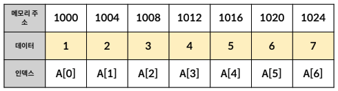
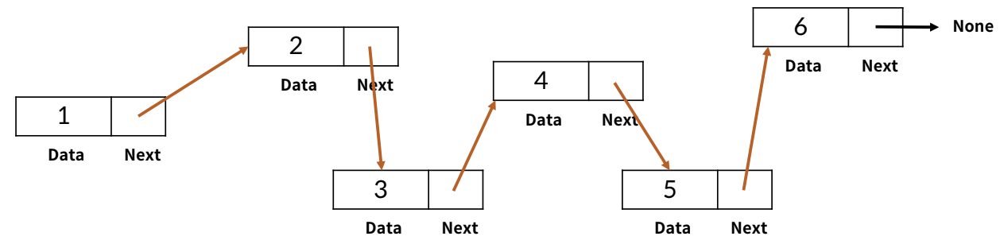

# 리스트(List)

## - 목차
1. [배열 vs 연결 리스트](#1-배열-vs-연결-리스트)
   - [배열(Array)](#1-배열array)
   - [연결 리스트(Linked List)](#2-연결-리스트linked-list)
   - [파이썬 리스트(Python List)](#3-파이썬-리스트python-list)
2. [파이썬의 리스트](#2-파이썬의-리스트)
   - [파이썬 리스트의 메서드](#1-파이썬-리스트의-메서드)
     - [append(원소)](#--append원소)
     - [pop(인덱스)](#--pop인덱스)
     - [count(원소)](#--count원소)
     - [index(원소)](#--index원소)
     - [sort(원소)](#--sort원소)
     - [reverse(원소)](#--reverse원소)
   - [리스트 관련 내장함수](#2-리스트-관련-내장함수)
     - [len(iterable)](#--leniterable)
     - [sum(iterable)](#--sumiterable)
     - [max(iterable)](#--maxiterable)
     - [min(iterable)](#--miniterable)
     - [sorted(iterable)](#--sortediterable)
     - [reversed(iterable)](#--reversediterable)
3. [리스트 컴프리헨션(List Comprehension)](#3-리스트-컴프리헨션list-comprehension)

---

## (1) 배열 vs 연결 리스트

### **1) 배열(Array)**


: 여러 데이터들이 `연속된 메모리 공간`에 저장되어 있는 자료구조


- 인덱스(index)를 통해 데이터에 빠르게 접근


- `정적 배열` : 일반적으로 배열은 정적인 크기를 가지며 길이를 변경하는 것은 불가능 ex) C언어, Java
→ 길이를 변경하고 싶으면 새로 생성

  `동적 배열` : 몇몇 프로그래밍 언어는 가변 크기 배열을 제공한다. 동적 배열은 실행 중에 크기를 동적으로 조정할 수 있음 ex) 파이썬


- `고정 타입 배열` : 일반적으로 배열은 하나의 데이터 타입으로 이루어져 있다. 배열을 선언 시, 배열의 요소들은 모두 동일한 데이터 타입이여야 한다. ex) C언어, Java

    `동적 타입 배열` : 몇몇 동적 배열이나 리스트 구조를 제공하는 언어에서는 배열이 여러 데이터 타입을 포함 할 수 있다. ex) 파이썬



### **2) 연결 리스트(Linked List)**


: 데이터가 담긴 `여러 노드(Node)`들이 순차적으로 `연결`된 형태의 자료구조로 각 노드는 데이터 필드와 다음 노드를 가리키는 링크(또는 포인터)로 구성된다.


- 맨 처음 노드부터 순차적으로 탐색


- 연결리스트의 길이를 자유롭게 변경 가능하다. → 삽입, 삭제가 편리


- 다양한 데이터 타입 저장


- 데이터가 메모리에 연속적으로 저장되지 않음




### **3) 파이썬 리스트(Python List)**

> 파이썬 리스트 = 배열 + 연결리스트


: 파이썬의 리스트는 `배열`과 `연결리스트`의 특징을 `혼합한 자료 구조`로 볼 수 있다. 따라서 기본적으로 배열처럼 인덱스를 통해 원소에 접근할 수 있으며, 동시에 가변 길이를 가질 수 있다.
그렇기 때문에 특정 위치의 원소에 빠르게 접근할 수 있으며, 크기가 변경되더라도 기존의 데이터를 복사할 필요가 없어 다른 원소들을 이동시키지 않고도 삽입과 삭제 연산을 효율적으로 처리할 수 있다.

---

## (2) 파이썬의 리스트

### **1) 파이썬 리스트의 메서드**


### - append(원소)


: 리스트의 맨끝에 새로운 원소 `삽입`

```bash
ex)
  
li = ['a', 'b', 'c']
li.append('d')

print(li)

>> 출력 ['a', 'b', 'c', 'd']
```

### - pop(인덱스)


: 특정 인덱스에 있는 원소를 `삭제 및 반환`

```bash
ex)
  
li = ['a', 'b', 'c']
char = li.pop()

print(li)
print(char)

출력
>> ['a', 'b']
>> 'c'


ex)
li = [1, 2, 3]
num = li.pop(1)

print(li)
print(num)

출력
>> [1, 3]
>> 2
```

### - count(원소)


: 리스트에서 해당 원소의 `개수`를 반환

```bash
ex)

li = [1, 2, 2, 2, 5, 5]

print(li.count(2))
print(li.count(5))

출력
>> 3
>> 2
```

### - index(원소)


: 리스트에서 `처음`으로 원소가 등장하는 `인덱스` 반환

```bash
ex)
  
li = [1, 2, 3, 1, 3]

print(li.index(3))
print(li.index(7))

출력
>> 2
>> valueError : 7 is not in li # 없는 원소 조회시 에러 발생
```

### - sort(원소)


: 리스트를 오름차순으로 `정렬`하며 `reverse=True`옵션을 통해 내림차순으로 정렬가능

```bash
ex)
  
li = [2, 4, 1, -3, 5]

li.sort() # 오름차순 정렬

print(li)

li.sort(reverse=True) # 내림차순 정렬

print(li)

출력
>> [-3, 1, 2, 4, 5]
>> [5, 4, 2, 1, -3]
```

### - reverse(원소)


: 리스트의 원소들의 순서를 거꾸로 `뒤집기`

```bash
ex)
  
li = ['a', 'k', 'd', '*']

li.reverse()

print(li)

출력
>> ['*', 'd', 'k', 'a']
```


### **2) 리스트 관련 내장함수**

### - len(iterable)


: 리스트의 `길이(원소의 개수)`를 반환

```bash
ex)

li = [1, 3, 5, 3, 6]

print(len(li))

출력
>> 5
```

### - sum(iterable)


: 리스트의 모든 원소의 `합`을 반환

```bash
ex)
  
li = [1, 1, 2, 2, 4]

print(sum(li))

출력
>> 10
```

### - max(iterable)


: 리스트의 원소 중 `최대값`을 반환

```bash
ex)
  
li = [2, 5, 6, 3, 4]

print(max(li))

출력
>> 6
```

### - min(iterable)


: 리스트의 원소 중 `최소값`을 반환

```bash
ex)
  
li = [2, 6, -1, 4, -8]

print(min(li))

출력
>> -8
```

### - sorted(iterable)


: 오름차순으로 `정렬`된 새로운 리스트 반환 reverse=True옵션으로 내림차순 가능, `원본 리스트는 변화 없음`

```bash
ex)
  
li = [4, 2, -3, 6, 6, -2]

a = sorted(li) # 오름차순 정렬
b = sorted(li, reverse=True) # 내림차순 정렬

print(li)
print(a)
print(b)

출력
>> [4, 2, -3, 6, 6, -2]
>> [-3, -2, 2, 4, 6, 6]
>> [6, 6, 4, 2, -2, -3]
```

### - reversed(iterable)


: 리스트의 순서를 거꾸로 `뒤집은` 새로운 객체 반환, `원본 리스트는 변화 없음`

```bash
ex)
  
li = [1, 4, 6, 2]

a = reversed(li)
b = list(reversed(li))

print(li)
print(a)
print(b)

출력
>> [1, 4, 6, 2]

# 단순 reversed() 함수를 출력하면, 아래와 같이 반복자의 객체의 주소(메모리 위치)를 나타낸다.
>> <list_reverseiterator object at 0x0000....>

# 따라서 실제 원소에 접근하려면 리스트로 변환하여 사용해야 한다.
>> [2, 6, 4, 1]
```

---

## (3) 리스트 컴프리헨션(List Comprehension)


: 리스트를 생성하는 `간단한 방법`

> 리스트 내부에 반복문 또는 조건문을 명시 → ex) li = [원소, 반복문, 조건문]

```bash
ex) # 0부터 4까지의 정수가 담긴 리스트 만들기

li = []
for i in range(5):
  li.append(i)
print(li)

출력
>> [0, 1, 2, 3, 4]

# 리스트 컴프리헨션을 이용하여 간단하게 만들기

li = [i for i in range(5)]
print(li)

출력
>> [0, 1, 2, 3, 4]


ex) # if문을 통한 필터링

li = [i for i in range(10) if i % 2 == 1]
print(li)

출력
>> [1, 3, 5, 7, 9]
```