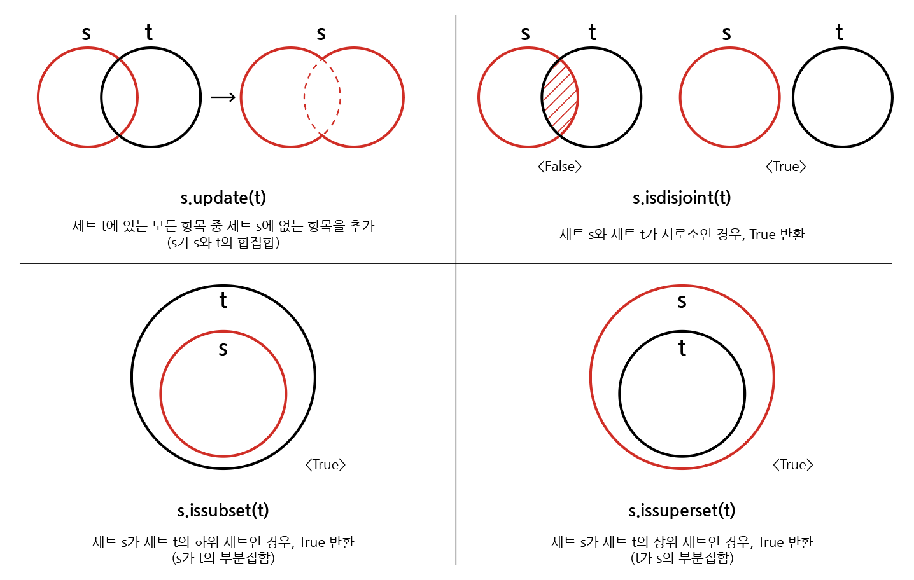

# 메서드

## - 목차
1. [메서드(Method)](#1-메서드method)
   - [메서드](#1-메서드)
   - [메서드와 함수의 차이](#2-메서드와-함수의-차이)
2. [문자열(String Type) 메서드](#2-문자열string-type-메서드)
   - [문자열 탐색/검증](#1-문자열-탐색검증)
   - [문자열 변경](#2-문자열-변경)
3. [리스트(List) 메서드](#3-리스트list-메서드)
   - [리스트 값 추가 및 삭제](#1-리스트-값-추가-및-삭제)
4. [세트(Set) 메서드](#4-세트set-메서드)
5. [딕셔너리(Dictionary) 메서드](#5-딕셔너리dictionary-메서드)
6. [매직 메서드](#6-매직-메서드)

---

## (1) 메서드(Method)

### **1) 메서드**

- 역할: 객체에 속한 함수
  - 객체란 어떤 것(데이터와 그 데이터를 다루는 함수)을 포함하는 것

```bash
ex) # 예시: 계산기 객체의 덧셈 메서드
  
class Calculator:
    def __init__(self):
        self.result = 0
        
    def add(self, a, b):
        self.result = a + b
```

- 호출: 객체를 만든 후에 객체와 메서드 이름을 점('.')으로 연결하여 호출한다.
> calc.add(3, 4)


### **2) 메서드와 함수의 차이**

- 함수의 역할: 특정한 작업을 수행하는 코드 블록

```bash
ex) # 덧셈 함수
  
def add(a, b):
    return a + b
```

- 호출: 이름 뒤에 괄호를 붙여서 호출
> add(2, 5)


### - 차이점 정리


: 간단히 말해 `함수`는 `독립적인 작업`을 하는 코드이고, `메서드`는 `특정한 객체에 종속된 작업`을 하는 코드이다.
`함수`는 `그냥 호출` 할 수 있지만, `메서드`는 특정한 `객체를 통해서` 호출을 해야한다.

---

## (2) 문자열(String Type) 메서드

### **1) 문자열 탐색/검증**

| 문법          | 설명                                                |
|-------------|---------------------------------------------------|
| s.find(x)   | x의 첫 번째 위치를 반환. 없으면, -1을 반환                       |
| s.index(x)  | x의 첫 번째 위치를 반환. 없으면, 오류 발생                        |
| s.isalpha() | 알파벳 문자 여부<br/>* 단순 알파벳이 아닌 유니코드 상 Letter(한국어도 포함) |
| s.isupper() | 모든 문자가 대문자인지 확인                                   |
| s.islower() | 모든 문자가 소문자인지 확인                                   |
| s.istitle() | 타이틀 형식 여부                                         |


```bash
ex)
 
# .find(x)
print('apple'.find('p'))
print('apple'.find('k'))

출력
>> 1
>> -1

---------------------------------------------------------

# .index(x)
print('apple'.index('p'))
print('apple'.index('k'))

출력
>> 1
>> ValueError: substring not found

---------------------------------------------------------

# .isalpha()
print('abc'.isalpha())
print('안녕'.isalpha())
print('123abc'.isalpha())

출력
>> True
>> True
>> False

---------------------------------------------------------

# .isupper()
print('ABC'.isupper())
print('aBc'.isupper())
print('123'.isupper())

출력
>> True
>> False
>> False

---------------------------------------------------------

# .islower()
print('abc'.islower())
print('Abc'.islower())

출력
>> True
>> False

---------------------------------------------------------

# .istitle(): 단어의 시작이 소문자가 아니면 됨
print('Hello Hello'.istitle())
print('hellO hellO'.istitle())
print('!hello 123hello'.istitle())

출력
>> True
>> False
>> True
```

### **2) 문자열 변경**

| 문법                             | 설명                       |
|--------------------------------|--------------------------|
| s.replace(old, new[,count])    | 바꿀 대상 글자를 새로운 글자로 바꿔서 반환 |
| s.strip([chars])               | 공백이나 특정 문자를 제거           |
| s.split(sep=None, maxsplit=-1) | 공백이나 특정 문자를 기준으로 분리      |
| 'separator'.join([literable])  | 구분자로 iterable을 합침        |
| s.capitalize()                 | 가장 첫 번째 글자를 대문자로 변경      |
| s.title()                      | 단어의 첫 글자 들을 대문자로 변경      |
| s.upper()                      | 모두 대문자로 변경               |
| s.lower()                      | 모두 소문자로 변경               |
| s.swapcase()                   | 대문자는 소문자로 소문자는 대문자로 변경   |


```bash
ex)

# .replace(old, new[,count])
    # 바꿀 대상 글자를 새로운 글자로 바꿔서 반환
    # count를 지정하면, 해당 개수만큼만 시행

print('coone'.replace('o', 'a'))

출력
>> 'caane'

print('wooooowoo'.replace('o', '!', 2))

출력
>> 'w!!ooowoo'

------------------------------------------------------------------------

# .strip([chars])
    # 특정한 문자들을 지정하면
    # 양쪽을 제거하거나(strip), 왼쪽을 제거하거나(lstrip), 오른쪽을 제거(rstrip)
    # 문자열을 지정하지 않으면, 공백을 제거함

print('    와우!\n'.strip())

출력
>> '와우!'

print('    와우!\n'.lstrip())

출력
>>'와우!\n'

print('    와우!\n'.rstrip())

출력
>> '    와우!'

print('안녕하세요!!!'.strip('!'))

출력
>> '안녕하세요'


------------------------------------------------------------------------

# .split(seq=None, maxsplit=-1)
    # 문자열을 특정한 단위로 나눠 리스트로 반환
        # sep이 None이거나 지정되지 않으면 연속된 공백문자를 단일한 공백문자로 간주하고,
        # 선행/후행 공백은 빈문자열에 포함시키지 않음
        # maxsplit()이 -1인 경우에는 제한 없음

print('a,b,c'.split('_'))

출력
>> ['a, b, c']

print('a b c'.split())

출력
>> ['a', 'b', 'c']

------------------------------------------------------------------------

# 'separator'.join([iterable])
    # 반복가능한(iterable) 컨테이너 요소들을 separator(구분자)로 합쳐 문자열 반환
        # iterable에 문자열이 아닌 값이 있으면 TypeError 발생

print(''.join['3', '5'])

출력
>> 35

------------------------------------------------------------------------

# 기타 변경

s = 'hI! Everyone.'

print(s)
print(s.capitalize())
print(s.title())
print(s.upper())
print(s.lower)
print(s.swapcase())

출력
>> 'hI! Everyone.'
>> 'Hi! everyone.'
>> 'Hi! Everyone'
>> 'HI! EVERYONE.'
>> 'hi! everyone.'
>> 'Hi! eVERYONE.'
```

---

## (3) 리스트(List) 메서드

### **1) 리스트 값 추가 및 삭제**

| 문법                     | 설명                                                           |
|------------------------|--------------------------------------------------------------|
| L.append(x)            | 리스트 마지막에 항목 x를 추가                                            |
| L.insert(i, x)         | 리스트 인덱스 i에 항목 x를 삽입                                          |
| L.remove(x)            | 리스트 가장 왼쪽에 있는 항목(= 첫번째) x를 제거<br/>항목이 존재하지 않을 경우, ValueError |
| L.pop()                | 리스트 가장 오른쪽에 있는 항목(= 마지막)을 반환 후 해당 항목을 리스트에서 제거               |
| L.pop(i)               | 리스트의 인덱스 i에 있는 항목을 반환 후 해당 항목을 리스트에서 제거                      |
| L.extend(m)            | 순회형 m의 모든 항목들의 리스트 끝에 추가(+=과 같은 기능)                          |
| L.index(x, start, end) | 리스트에 있는 항목 중 가장 왼쪽에 있는 항목 x의 인덱스를 반환                         |
| L.reverse()            | 리스트를 역순으로 뒤집음                                                |
| L.sort()               | 리스트를 정렬(매개변수 이용가능)                                           |
| L.count()              | 리스트에서 항목 x가 몇 개 존재하는지 개수를 반환                                 |
| L.clear()              | 리스트의 모든 항목 제거                                                |


```bash
ex)
  
# L.append(x)

cafe = ['starbucks', 'tomntoms', 'hollys']

cafe.append('banapresso')

print(cafe)

출력
>> ['starbucks', 'tomntoms', 'hollys', 'banapresso']

------------------------------------------------------------------------

# L.extend(iterable)

cafe = ['starbucks', 'tomntoms', 'hollys']

cafe.extend(['cafe', 'test'])

print(cafe)

출력
>> ['starbucks', 'tomntoms', 'hollys', 'cafe', 'test']

------------------------------------------------------------------------

# L.insert(i, x)

cafe = ['starbucks', 'tomntoms']

cafe.insert(0, 'start')

print(cafe)

출력
>> ['start', 'starbucks', 'tomntoms']


# i가 리스트의 길이 보다 큰 경우

cafe = ['starbucks', 'tomntoms']

cafe.insert(10000, 'end')

print(cafe)

출력
>> ['starbucks', 'tomntoms', 'end'] # 가장 뒤에 삽입된다.

------------------------------------------------------------------------

# L.remove(x)

numbers = [1, 2, 3, 'hi']

numbers.remove('hi')

print(numbers)

출력
>> [1, 2, 3]


# 없는 요소 제거시

numbers = [1, 2, 3]

numbers.remove(7)

출력
>> ValueError: list.remove(x): x not in list # 값 에러 발생

------------------------------------------------------------------------

# L.pop()

numbers = ['hi', 1, 2, 3]

pop_number = numbers.pop()

print(pop_number)
print(numbers)

출력
>> 3
>> ['hi', 1, 2]


# L.pop(i)

numbers = ['hi', 1, 2, 3]

pop_number = numbers.pop(0)

print(pop_number)
print(numbers)

출력
>> 'hi'
>> [1, 2, 3]

------------------------------------------------------------------------

# L.clear()

numbers = [1, 2, 3]

numbers.clear()

print(numbers)

출력
>> []

------------------------------------------------------------------------

# L.index(x)

numbers = [1, 2, 3, 4]

print(numbers.index(3))
print(numbers.index(100))

출력
>> 2
>> ValueError: 100 in not in list # 없는 요소의 인덱스 조회 시, 값 에러 발생

------------------------------------------------------------------------

# L.count(x)

numbers = [1, 1, 2, 3, 1]

print(numbers.count(1))
print(numbers.count(100))

출력
>> 3
>> 0

------------------------------------------------------------------------

# L.sort()
    # 원본 리스트를 정렬함, None 반환

numbers = [3, 2, 5, 1]

result = numbers.sort()

print(numbers, result)

출력
>> [1, 2, 3, 5] None


# sorted() 함수와 비교

numbers = [3, 2, 5, 1]

result = sorted(numbers)

print(numbers, result)

출력
>> [3, 2, 5, 1] [1, 2, 3, 5]

------------------------------------------------------------------------

# L.reverse()
    # 순서를 반대로 뒤집음(정렬하는 것 아님), None 반환
    
numbers = [3, 2, 5, 1]

result = numbers.reverse()

print(numbers, result)

출력
>> [1, 5, 2, 3] None

```

---

## (4) 세트(Set) 메서드

| 문법              | 설명                                                         |
|-----------------|------------------------------------------------------------|
| s.copy()        | 세트의 얕은 복사본을 반환                                             |
| s.add(x)        | 항목 x가 세트 s에 없다면 추가                                         |
| s.pop()         | 세트 s에서 랜덤하게 항목을 반환하고, 해당 항목을 제거<br/>세트가 비어 있을 경우, KeyError |
| s.remove(x)     | 항목 x를 세트 s에서 삭제<br/>항목이 존재하지 않을 경우, KeyError               |
| s.discard(x)    | 항목 x가 세트 s에 있는 경우, 항목 x를 세트 s에서 삭제                         |
| s.update(t)     | 세트 t에 있는 모든 항목 중 세트 s에 없는 항목을 추가                           |
| s.clear()       | 세트의 모든 항목을 제거                                              |
| s.isdisjoint(t) | 세트 s가 세트 t의 서로 같은 항목을 하나라도 갖고 있지 않은 경우, True 반환            |
| s.issubset(t)   | 세트 s가 세트 t의 하위 세트인 경우, True 반환                             |
| s.issuperset(t) | 세트 s가 세트 t의 상위 세트인 경우, True 반환                             |


```bash
ex)
  
# s.copy() : 세트의 얕은 복사본을 반환

original_set = {1, 2, 3}
copied_set = original_set.copy()
print(copied_set)

출력
>> {1, 2, 3}

-----------------------------------------------------

# s.add(x) : 항목 x가 세트 s에 없다면 추가

my_set = {1, 2, 3}
my_set.add(4)
print(my_set)

출력
>> {1, 2, 3, 4}

-----------------------------------------------------

# s.pop() : 세트 s에서 랜덤하게 항목을 반환하고, 해당 항목을 제거

my_set = {1, 2, 3, 4}
popped_item = my_set.pop()
print(popped_item)
print(my_set)

출력
>> (랜덤한 값)
>> 나머지 세트

-----------------------------------------------------

# s.remove(x) : 항목 x를 세트 s에서 삭제

my_set = {1, 2, 3, 4}
my_set.remove(3)
print(my_set)

출력
>> {1, 2, 4}

-----------------------------------------------------

# s.discard(x) : 항목 x가 세트 s에 있는 경우, 항목 x를 세트 s에서 삭제

my_set = {1, 2, 3, 4}
my_set.discard(3)
print(my_set)

출력
>> {1, 2, 4}

-----------------------------------------------------

# s.update(t) : 세트 t에 있는 모든 항목 중 세트 s에 없는 항목을 추가

set1 = {1, 2, 3}
set2 = {3, 4, 5}
set1.update(set2)
print(set1)

출력
>> {1, 2, 3, 4, 5}

-----------------------------------------------------

# s.clear() : 세트의 모든 항목을 제거

my_set = {1, 2, 3, 4}
my_set.clear()
print(my_set)

출력
>> set()

-----------------------------------------------------

# s.isdisjoint(t) : 세트 s가 세트 t의 서로 같은 항목을 하나라도 갖고 있지 않은 경우, True 반환

set1 = {1, 2, 3}
set2 = {4, 5, 6}
is_disjoint = set1.isdisjoint(set2)
print(is_disjoint)

출력
>> True

-----------------------------------------------------

# s.issubset(t) : 세트 s가 세트 t의 하위 세트인 경우, True 반환

set1 = {1, 2}
set2 = {1, 2, 3, 4}
is_subset = set1.issubset(set2)
print(is_subset)

출력
>> True

-----------------------------------------------------

# s.issuperset(t) : 세트 s가 세트 t의 상위 세트인 경우, True 반환

set1 = {1, 2, 3, 4}
set2 = {1, 2}
is_superset = set1.issuperset(set2)
print(is_superset)

출력
>> True

```


<세트 메서드 다이어그램>

---

## (5) 딕셔너리(Dictionary) 메서드

| 문법                | 설명                                                                         |
|-------------------|----------------------------------------------------------------------------|
| d.clear()         | 딕셔너리의 모든 항목 제거                                                             |
| d.keys()          | 딕셔너리 d의 모든 키를 담은 뷰를 반환                                                     |
| d.values()        | 딕셔너리 d의 모든 값을 담은 뷰를 반환                                                     |
| d.items()         | 딕셔너리 d의 모든 키-값 쌍을 담은 뷰를 반환                                                 |
| d.get(k)          | 키 k의 값을 반환하는데 키 k가 딕셔너리 d에 없을 경우, None을 반환                                 |
| d.get(k, v)       | 키 k의 값을 반환하는데 키 k가 딕셔너리 d에 없을 경우, v를 반환                                    |
| d.pop(k)          | 키 k의 값을 반환하고 키 k인 항목을 딕셔너리 d에서 삭제하는데,<br/>키 k가 딕셔너리 d에 없을 경우, KeyError를 발생 |
| d.pop(k, v)       | 키 k의 값을 반환하고 키 k인 항목을 딕셔너리 d에서 삭제하는데,<br/>키 k가 딕셔너리 d에 없을 경우, v를 반환        |
| d.update([other]) | 딕셔너리 d의 값을 매핑하여 업데이트                                                       |


```bash
ex)
  
# d.get(key[,default])

dict = {
  'apple': '사과',
  'banana': '바나나'
  }
  
dict['pineapple']

출력
>> KeyError: 'pineapple'


# 기본값 지정

dict = {
  'apple': '사과',
  'banana': '바나나'
  }
  
print(dict.get('pineapple'))
print(dict.get('apple'))
print(dict.get('pineapple', 0))

출력
>> None
>> '사과'
>> 0

----------------------------------------------------

# d.pop(key[,default])

dict = {
  'apple': '사과',
  'banana': '바나나'
  }

data = dict.pop('apple')

print(data, dict)

출력
>> '사과' {'banana': '바나나'}


# 없는 키를 pop()할 경우

dict = {
  'apple': '사과',
  'banana': '바나나'
  }

data = dict.pop('pineapple')

print(data, dict)

출력
>> KeyError: 'pineapple' # 키 에러 발생

----------------------------------------------------

# d.update([other])
    # 값을 제공하는 key, value로 덮어쓴다.
    
dict = {
  'apple': '사과',
  'banana': '바나나'
  }
  
dict.update(apple='포도')

print(dict)

출력
>> {'apple': '포도', 'banana': '바나나'}
```

---

## (6) 매직 메서드


: '매직 메서드'는 `특정한 이름`을 가진 메서드로, 객체의 특정 상황에서 자동으로 호출되는 메서드를 말한다.
이러한 메서드들은 `언더바('__')`로 시작하고 끝나는데, 파이썬에서는 이러한 메서드들을 이용하여 객체의 `행동을
커스터마이징`하거나 `특정 연산을 지원`하도록 할 수 있다.


| 문법                              | 설명                                                                           |
|---------------------------------|------------------------------------------------------------------------------|
| \__init\__(self, ...)           | 객체가 생성될 때, 호출되는 메서드로, `초기화 작업`을 수행한다.                                        |
| \__str\__(self)                 | str() 함수가 호출될 때 객체를 `문자열로 변환`하는 메서드로 주로 `print() 함수`에 사용된다.                  |
| \__len\__(self)                 | len() 함수가 호출될 때, 객체의 `길이를 반환`하는 메서드이다.                                       |
| \__getitem\__(self, key)        | 인덱스로 `객체에 접근할 때`, 호출되는 메서드이다.                                                |
| \__setitem\__(self, key, value) | 인덱스에 `값을 할당할 때`, 호출되는 메서드이다.                                                 |
| \__delitem\__(self, key)        | 인덱스로 객체의 `요소를 삭제할 때`, 호출되는 메서드이다.                                            |
| \__call\__(self, ...)           | 객체를 `함수처럼 호출할 때`, 호출되는 메서드이다.                                                |
| \__eq\__(self, other)           | 두 객체가 `동등한지 비교`하는 메서드로, '==' 연산자에 사용된다.                                      |
| \__lt\__(self, other)           | "less than"의 약어로, `작다(<)`를 나타낸다. 따라서 '<' 연산자 호출시 사용되는 메서드이다.                 |
| \__le\__(self, other)           | "less than or equal"의 약어로, `작거나 같다(<=)`를 나타낸다. 따라서 '<=' 연산자 호출시 사용되는 메서드이다.  |
| \__gt\__(self, other)           | "greater than"의 약어로, `크다(>)`를 나타낸다. 따라서 '>' 연산자 호출시 사용되는 메서드이다.              |
| \__ge\__(self, other)           | "greater than or equal"의 약어로, `크거나 같다(>=)`를 나타낸다. 따라서 '>=' 연산자 호출시 사용되는 메서드이다. |


```bash
ex)

# __init__ : 객체 생성

class MyClass:
    def __init__(self, name):
        self.name = name
        
obj = MyClass("Example")

--------------------------------------------------------

# __str__ : 객체를 문자열로 변환

class MyClass:
    def __init__(self, name):
        self.name = name
        
    def __str__(self):
        return f"MyClass instance with name: {self.name}"
        
obj = MyClass("Example")
print(str(obj))

출력
>> "MyClass instance with name: Example"

--------------------------------------------------------

# __len__ : 객체의 길이 확인

class MyList:
    def __init__(self, items):
        self.items = items
    
    def __len__(self):
        return len(self.items)
        
my_list = MyList([1, 2, 3, 4, 5])
print(len(my_list))

출력
>> 5

--------------------------------------------------------

# __getitem__ 및 __setitem__ : 인덱스로 객체에 접근 및 할당

class MyList:
    def __init__(self, items):
        self.items = items
        
    def __getitem__(self, index):
        return self.items[index]
        
    def __setitem__(self, index, value):
        self.items[index] = value
        
my_list = MyList([1, 2, 3, 4, 5])
print(my_list[2])

my_list[2] = 10
print(my_list[2])

출력
>> 3
>> 10

--------------------------------------------------------

# __call__ : 객체를 함수처럼 호출

class CallableClass:
    def __call__(self, x, y):
        return x + y
        
obj = CallableClass()
result = obj(3, 5)
print(result)

출력
>> 8

--------------------------------------------------------

# __eq__ : 두 객체의 동등성 비교

class Point:
    def __init__(self, x, y):
        self.x = x
        self.y = y
        
    def __eq__(self, other):
        return self.x == other.x and self.y == other.y
        
point1 = Point(1, 2)
point2 = Point(1, 2)
print(point1 == point2)

출력
>> True

--------------------------------------------------------

# __lt__ : 작은지 비교

class Point:
    def __init__(self, x, y):
        self.x = x
        self.y = y

    def __lt__(self, other):
        return self.x < other.x and self.y < other.y

point1 = Point(1, 2)
point2 = Point(3, 4)
print(point1 < point2)

출력
>> True

--------------------------------------------------------

# __le__ : 작거나 같은지 비교

class Point:
    def __init__(self, x, y):
        self.x = x
        self.y = y

    def __le__(self, other):
        return self.x <= other.x and self.y <= other.y

point1 = Point(1, 2)
point2 = Point(3, 4)
print(point1 <= point2)

출력
>> True

--------------------------------------------------------

# __gt__ : 큰 지 비교

class Point:
    def __init__(self, x, y):
        self.x = x
        self.y = y

    def __gt__(self, other):
        return self.x > other.x and self.y > other.y

point1 = Point(3, 4)
point2 = Point(1, 2)
print(point1 > point2)

출력
>> True

--------------------------------------------------------

# __ge__ : 크거나 같은지 비교

class Point:
    def __init__(self, x, y):
        self.x = x
        self.y = y

    def __ge__(self, other):
        return self.x >= other.x and self.y >= other.y

point1 = Point(3, 4)
point2 = Point(1, 2)
print(point1 >= point2)

출력
>> True
```