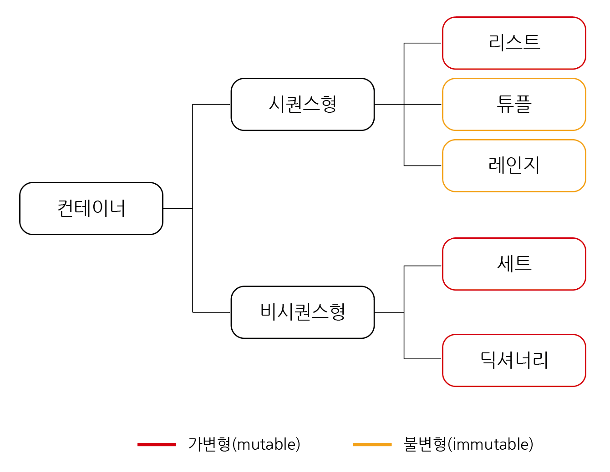
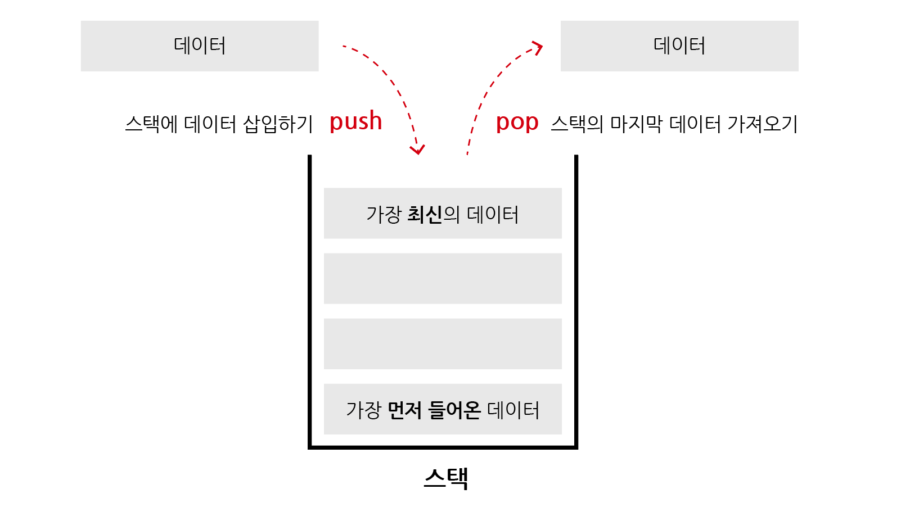
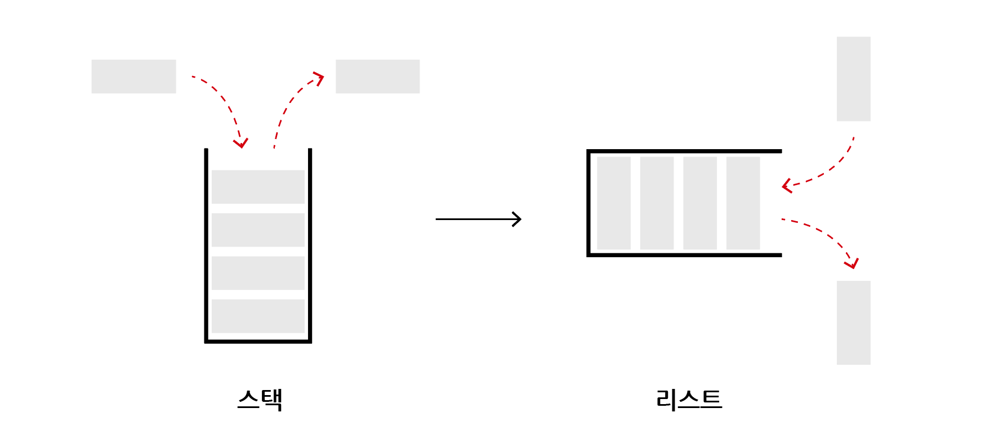
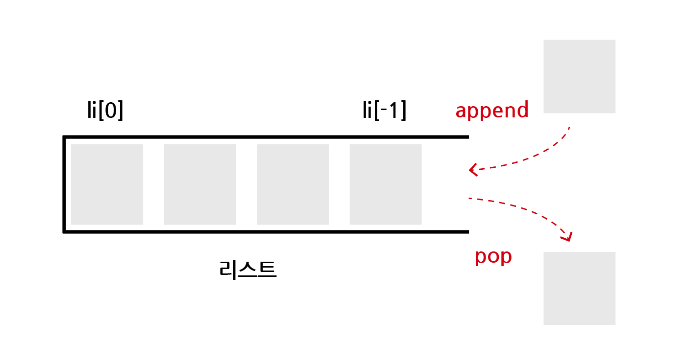

# 스택, 큐 (Stack, Queue)

## - 목차
1. [데이터 구조 & 알고리즘](#1-데이터-구조--알고리즘)
   - [데이터 구조(Data Structure)](#1-데이터-구조data-structure)
   - [알고리즘(Algorithm)](#2-알고리즘algorithm)
2. [스택(Stack)](#2-스택stack)
   - [스택](#1-스택)
3. [큐(Queue)](#3-큐queue)

---

## (1) 데이터 구조 & 알고리즘

> 프로그램 = 데이터 구조 + 알고리즘

### **1) 데이터 구조(Data Structure)**

: 데이터를 다양한 방식으로 `저장`하고 조회, 삽입, 변경, 삭제와 같은 `조작` 기능을 제공한다.

Q) 데이터 구조가 왜 중요한가?

A) 문제 상황에 따라 적합한 구조, 방법이 필요하다.

- 파이썬 기본 데이터 구조

### **2) 알고리즘(Algorithm)**

- 기본
  - 완전탐색, 재귀, 시뮬레이션, 그리디
- 심화
  - DFS, BFS, 백트래킹, 이진탐색, DP, 다익스트라, 크루스칼, 프림

---

## (2) 스택(Stack)

### **1) 스택**

- Stack은 쌓는다는 의미로서, 마치 접시를 쌓고 빼듯이 `데이터를 한 쪽에서만 넣고 빼는 자료구조`
- 가장 마지막에 들어온 데이터가 가장 먼저 나가므로 `LIFO(Last-in First-out, 후입선출, 선입후출)` 방식

Q) 왜 / 언제 Stack을 사용하는가?

A) 이전 작업의 기억(뒤집기, 되돌리기, 되돌아가기)

ex) 브라우저 히스토리(뒤로가기), 프로그램 작업실행 취소(Ctrl + z), 단어 뒤집기

- 파이썬은 `리스트(List)`로 스택을 간편하게 사용

- 스택을 이용하는 알고리즘
  - 괄호 매칭
  - 함수 호출(재귀 호출)
  - 백트래킹
  - DFS(깊이 우선 탐색)
  
---

## (3) 큐(Queue)

- Queue는 `한 쪽 끝에서 데이터를 넣고`, `다른 한 쪽에서만 데이터를 뺄 수 있는` 자료구조
- 가장 먼저 들어온 데이터가 가장 먼저 나가므로 `FIFO(First-in First-out, 선입선출, 후입후출)` 방식

Q) 왜 / 언제 Queue를 사용하는가?

A) 순서와 대기

ex) 프로세스 관리(데이터 버퍼), 클라이언트/서버(Message Queue)

- 큐를 이용하는 알고리즘
  - BFS(너비 우선 탐색)
  - 다익스트라-우선순위 큐

- 큐 자료구조도 파이썬의 `리스트(List)`로 간편하게 사용할 수 있다.

- 리스트를 이용한 큐 자료구조의 단점

: 맨 앞의 데이터가 빠지면서, 리스트의 `인덱스가 하나씩 앞으로 당겨지며` 재조정이 일어난다. 큐 안에 있는 `데이터가 많을 경우, 비효율적`이다.

- 이를 해결하기 위해 `덱(Deque, Double-Ended Queue)` 자료구조를 이용한다.

- 덱(Deque)
  - 양 방향으로 삽입과 삭제가 자유로운 큐

- 덱은 양 방향으로 삽입, 추출이 모두 큐보다 훨씬 `빠르다.` 따라서 데이터 삽입, 추출이 많은 경우, `시간 크게 단축가능`
