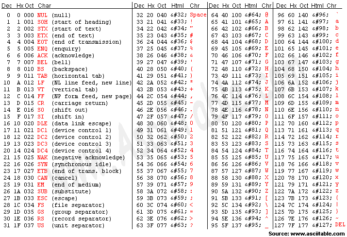

# 문자열

## 목차

1. [문자열(String)](#1-문자열string)
    1. [문자열 메서드](#1-1-문자열-메서드)
        - [split(기준 문자)](#split기준-문자)
        - [strip(제거할 문자)](#strip제거할-문자)
        - [find(찾는 문자)](#find찾는-문자)
        - [index(찾는 문자)](#index찾는-문자)
        - [count(개수를 셀 문자)](#count개수를-셀-문자)
        - [replace(기존 문자, 새로운 문자)](#replace기존-문자-새로운-문자)
        - [삽입할 문자.join(iterable)](#삽입할-문자joiniterable)
    2. [아스키(ASCII)코드](#1-2-아스키ascii-코드)
        - [아스키 코드](#아스키-코드)
            - [그렇다면 문자는 어떻게 저장될까?](#q-그렇다면-문자는-어떻게-저장될까)
        - [ord(문자)](#ord문자)
        - [chr(아스키 코드)](#chr아스키-코드)

<br>
<br>

## 1. 문자열(String)

-   문자열은 immutable(변경 불가능한) 자료형

<br>

```python
# ex) 문자열의 메모리 주소가 달라짐

word = 'apple'
print(word)
print(id(word))

# 출력
# 'apple'
# 1352749370800

word += ' banana'
print(word)
print(id(word))

# 출력
# 'apple banana'
# 1352749417520

# 연산을 진행한 후 word 변수의 id가 달라진 것을 볼 수 있는데
# 이는 문자열이 immutable(변경 불가능)한 자료형이기 때문이며,
# 처음에 생성된 'apple' 문자열과 나중에 생성된 'apple banana' 문자열은
# 서로 다른 메모리 주소에 저장되어 있음을 나타냅니다.
```

<br>

### 1-1. 문자열 메서드

### - split(기준 문자)

-   문자열을 `일정 기준`으로 나누어 `리스트로 반환`, 괄호 안에 아무것도 넣지 않으면 자동으로 공백을 기준으로 설정

```python
# ex)

word = 'I play the guitar'
print(word.split())

# 출력
# ['I', 'play', 'the', 'guitar']

----------------------------------------------------
# ex)

word = 'apple,banana,orange,grape'
print(word.split(","))

# 출력
# ['apple', 'banana', 'orange', 'grape']

----------------------------------------------------
# ex)

word = 'This_is_snake_case'
print(word.split("_"))

# 출력
# ['This', 'is', 'snake', 'case']
```

<br>

### - strip(제거할 문자)

-   문자열의 `양쪽 끝`에 있는 특정 문자를 모두 `제거`한 새로운 문자열을 반환
-   괄호 안에 아무것도 넣지 않으면, 자동으로 공백을 제거 문자로 설정
-   제거할 문자를 여러 개 넣으면 해당하는 모든 문자들을 제거

```python
# ex)

word = ' hello world '
print(word.strip())

# 출력
# 'hello world'

----------------------------------------------------
# ex)

word = 'ahello worlda'
prind(word.strip('a'))

# 출력
# 'hello world'

----------------------------------------------------
# ex)

word = 'hello world'
print(word.strip('hd'))

# 출력
# 'ello worl'

----------------------------------------------------
# ex)

word = 'hello worlddddd'
print(word.strip('d'))

# 출력
# 'hello worl'
```

<br>

### - find(찾는 문자)

-   특정 문자가 처음으로 나타나는 `위치(인덱스)`를 반환하며 찾는 문자가 없다면 `-1`을 반환

```python
# ex)

word = 'apple'
print(word.find('p'))

# 출력
# 1

----------------------------------------------------
# ex)

word = 'apple'
print(word.find('k'))

# 출력
# -1
```

<br>

### - index(찾는 문자)

-   특정 문자가 처음으로 나타나는 `위치(인덱스)`를 반환하며, 찾는 문자가 없다면 `오류` 발생

```python
# ex)

word = 'apple'
print(word.index('p'))

# 출력
# 1

----------------------------------------------------
# ex)

word = 'apple'
print(word.index('k'))

# 출력
# ValueError : substring not
```

<br>

### - count(개수를 셀 문자)

-   문자열에서 특정 문자가 `몇 개`인지 반환하며, `문자`뿐만 아니라 `문자열의 개수`도 확인 가능

```python
# ex)

word = 'banana'
print(word.count('a'))

# 출력
# 3

----------------------------------------------------
# ex)

word = 'banana'
print(word.count('na'))

# 출력
# 2

----------------------------------------------------
# ex)

word = 'banana'
print(word.count('ana'))

# 출력
# 1
```

<br>

### - replace(기존 문자, 새로운 문자)

-   문자열에서 기존 문자를 새로운 문자로 수정한 새로운 문자열을 반환
-   특정 문자를 빈 문자열("")로 수정하여 마치 해당 문자를 삭제한 것 같은 효과 가능

```python
# ex)

word = 'happyhacking'
print(word.replace('happy', 'angry'))

# 출력
# 'angryhacking'

----------------------------------------------------
# ex)

word = 'happyhacking'
print(word.replace('h', 'H'))

# 출력
# 'HappyHacking'

----------------------------------------------------
# ex)

word = 'happyhacking'
print(word.replace('happy', ''))

# 출력
# 'hacking'
```

<br>

### - 삽입할 문자.join(iterable)

-   iterable의 `각각 원소 사이에 특정한 문자를 삽입`한 새로운 문자열 반환
-   공백 출력, 콤마 출력 등 원하는 출력 형태를 위해 사용

```python
# ex)

word = 'happyhacking'
print(" ".join(word))

# 출력
# 'h a p p y h a c k i n g'

----------------------------------------------------
# ex)

word = 'happyhacking'
print(",".join(word))

# 출력
# 'h,a,p,p,y,h,a,c,k,i,n,g'

----------------------------------------------------
# ex)

word = ['edu', 'cation']
print("@".join(word))

# 출력
# 'edu@cation'

----------------------------------------------------
# ex)

words = ['h', 'a', 'p', 'p', 'y']
print("".join(words))

# 출력
# 'happy'
```

<br>

### 1-2. 아스키(ASCII) 코드

-   컴퓨터는 숫자(0,1)만 이해할 수 있다.

| 비트(bit)                 | 바이트(byte)                              |
| ------------------------- | ----------------------------------------- |
| 0과 1 두 가지 정보만 표현 | 데이터를 저장하는 기본단위 1byte == 8bits |

<br>

### Q) 그렇다면 문자는 어떻게 저장될까?

-   ASCII(American Standard Code for Information Interchange) - 미국 정보교환 표준부호

<br>

### - 아스키 코드

-   알파벳을 표현하는 대표 인코딩 방식
-   각 문자를 표현하는데 1byte(8bits) 사용



<br>

### - ord(문자)

-   `문자 → 아스키 코드`로 변환하는 내장함수

```python
# ex)

print(ord('A'))

# 출력
# 65

----------------------------------------------------
# ex)

print(ord('a'))

# 출력
# 97
```

<br>

### - chr(아스키 코드)

-   `아스키 코드 → 문자`로 변환하는 내장함수

```python
# ex)

print(chr(65))

# 출력
# 'A'

----------------------------------------------------
# ex)

print(chr(97))

# 출력
# 'a'
```
