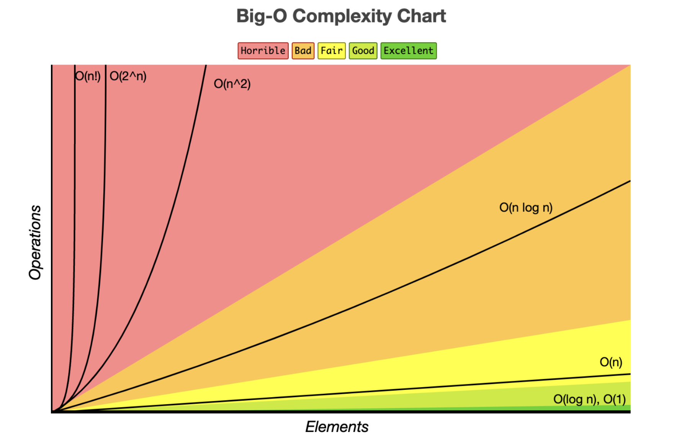

# 시간 복잡도 & 빅오 표기법

## - 목차
1. [알고리즘의 시간 복잡도](#1-알고리즘의-시간-복잡도)
    - [시간 복잡도(Time Complexity)](#1-시간-복잡도time-complexity)
        - [Sequence of statement](#--sequence-of-statement)
        - [조건문](#--조건문)
        - [반복문](#--반복문)
        - [시간 복잡도에 따른 알고리즘 성능 비교](#--시간-복잡도에-따른-알고리즘-성능-비교)
2. [빅오(Big-O) 표기법](#2-빅오big-o-표기법)

---

## (1) 알고리즘의 시간 복잡도


: 알고리즘을 비교하려면 특정한 기준이 필요하며, 컴퓨터를 실행시키는데 드는 리소스인 `CPU(시간)`, `메모리`, `디스크`... 중 **CPU(시간)** 을 기준으로 알고리즘을 비교할 수 있다.

- 같은 알고리즘이라도 개개인의 `컴퓨팅 환경의 차이`에 따라 측정 시간이 다르다. → 환경에 영향을 받지 않는 `객관적 기준`이 필요
- 객관적 측정을 위해 알고리즘 내부에서 `연산이 몇 번 일어났는지 측정`한다.

```bash
ex) # 알고리즘 소요시간 측정하기
    # 아래와 같은 상황에서 몇 번의 기본연산이 일어날까?(= 알고리즘의 소요시간은?)

def count(word, char):
    total = 0
    
    for i in word: # for를 통한 반복문
        if i == char:
            total += 1
    
    return total
    
>> 가장 기본연산이 많이 일어나는 입력 "n개"가 들어온다고 가정한다.
```

### **1) 시간 복잡도(Time Complexity)**


: 계산 복잡도 이론에서 시간 복잡도는 문제를 해결하는데 걸리는 시간과 입력의 함수 관계를 가리킨다. 즉, 알고리즘이 입력 크기에 대해 `얼마나 빠르게 실행`되는지를 나타내는 척도이다.

```
시간복잡도가 높다 → 느린 알고리즘
시간복잡도가 낮다 → 빠른 알고리즘
```

### - Sequence of statement


: 단순 코드 구문으로 구성된 경우

ex) 사칙연산, 읽고 쓰기, 검증

```bash
ex)
  
statement 1;
statement 2;
statement 3;
...
statement k;

>> 총 시간 = 시간(statement 1) + ... + 시간(statement k)
```

### - 조건문


: 조건문으로 구성된 경우

```bash
ex)

if (조건):
    code block 1;
else:
    code block 2;

# Sequence of statement로 구성된 코드 블록 중 하나가 실행됨
>> 총 시간 = max(시간(code block 1), 시간(code block 2))
```

### - 반복문


: 단일반복문으로 구성된 경우

```bash
ex)

for i in range(N):
        code block 1;

>> 반복이 N번되므로 코드 블록도 N번 실행
```

: 중첩반복문으로 실행되는 경우

```bash
ex)

for i in range(N):
    for j in range(M):
        code block 1;

>> 외부 반복은 N번 실행되고 내부 반복은 M번 실행되므로 총 N * M번 실행
```

: 여러 반복문이 병렬로 구성된 경우

```bash
ex)

for i in range(N):
    code block 1;

for j in range(M):
    code block 2;

>> 첫번째 반복문 N번, 두번째 반복문 M번 따라서 N + M번 실행
```

: 여러 반복문이 복합적으로 구성된 경우

```bash
ex)

for i in range(N):
    for j in range(N):
        code block 1;
for k in range(N):
    code block 2;

>> 첫번째 반복문 N * N번, 두번째 반복문 N번 따라서 N ** 2 + N번 실행
```

: 증감하는 반복문의 시간복잡도

```bash
ex)

for i in range(N):
    for j in range(i, N):
        code block 1;

>> 0일 때 : N번
   1일 때 : N - 1번
   2일 때 : N - 2번
   ...
   따라서 N + (N - 1) + ... + 1 번 실행
```

### - 시간 복잡도에 따른 알고리즘 성능 비교

```
ex)

A 개발자 : 6N + 4의 시간 복잡도 (선형 증가)
B 개발자 : 3N + 2의 시간 복잡도 (선형 증가)
C 개발자 : 3N^2 + 6N + 1의 시간 복잡도 (제곱으로 증가)
```

Q) 위의 경우 A 개발자와 B 개발자의 알고리즘 성능은 2배 차이일까?


: N이 `무한대`라면, 선형 증가로서 비슷한 성능으로 수렴할 것이다.

---

## (2) 빅오(Big-O) 표기법


: 입력 N이 `무한대`로 커진다고 가정하고 시간 복잡도를 간단하게 표시하는 것으로 `최고차항만 남기고` 계수와 상수를 제거

```
ex)

A 개발자 : 6N + 4의 시간 복잡도 → O(n)
B 개발자 : 3N + 2의 시간 복잡도 → O(n)
C 개발자 : 3N^2 + 6N + 1의 시간 복잡도 → O(n^2)
```

> 매 입력에 따라 정확한 수식을 구하는 것은 불필요하며, 정확한 수치보다는 **증가율**에 초점을 맞춘다.

- A 개발자와 B 개발자의 소요시간은 2배 차이가 났지만 점근적 표기법에 의해 동일한 시간 복잡도를 나타낸다.


<시간복잡도 그래프>


- (일반적인 상황에서) 1초가 걸리는 입력의 크기

| 점근적 표기법   | 초당 입력 크기 |
|-----------|----------|
| O(N)      | 1억 (기존)  |
| O(N*logN) | 500만     |
| O(N^2)    | 1만       |
| O(N^3)    | 500      |
| O(2^N)    | 20       |
| O(N!)     | 10       |

- 표기법에 따른 연산 및 알고리즘

| 점근적 표기법  | 연산                        |
|----------|---------------------------|
| O(1)     | 단순 산술 계산(덧셈, 뺄셈, 곱셈, 나눗셈) |
| O(logN)  | 크기 N인 리스트를 반절씩 순회/탐색      |
| O(N)     | 크기 N인 리스트를 순회             |
| O(NlogN) | 크기 N인 리스트를 반절씩 탐색*순회      |
| O(N^2)   | 크기 M, N인 2중 리스트를 순회       |
| O(N^3)   | 3중 리스트를 순회                |
| O(2^N)   | 크기 N집합의 부분 집합             |
| O(N!)    | 크기 N 리스트의 순열              |

| 점근적 표기법  | 알고리즘                                      |
|----------|-------------------------------------------|
| O(1)     | 단순계산 → a+b, 100*200                       |
| O(logN)  | 이진탐색(Binary Search), 분할정복(Divide&Conquer) |
| O(N)     | 리스트 순회, 1중 for문                           |
| O(NlogN) | 높은 성능의 정렬(Merge/Quick/Heap Sort)          |
| O(N^2)   | 2중 리스트 순회, 2중 for문                        |
| O(N^3)   | 3중 리스트 순회, 3중 for문                        |
| O(2^N)   | 크기가 N인 집합의 부분 집합                          |
| O(N!)    | 크기가 N인 순열                                 |


Q) 사전에서 단어를 찾기 위해 어떻게 해볼 수 있을까?

```
방법1) 처음부터 끝까지 찾아보기
: 만약 가장 마지막에 있다면 N번

방법2) 절반 페이지를 나눠서 왼쪽인지 오른쪽인지 보고 잘라내기
: 총 N쪽이라고 하면, x번을 했을때, 1이 된다면(= 찾는다면)
N, N/2, N/4, ... , N/(2^X)
```

Q) 내장함수와 메서드와 시간복잡도

```bash
ex) # 두 코드의 시간 복잡도 차이는?
  
1)
for i in range(N):
    tmp = 0
    for number in numbers:
        if tmp < number:
            tmp = number

2)
for i in range(N):
    max_value = max(numbers)
    
# 2번 코드의 경우 시간초과가 발생하였다.
# for문을 1번만 사용하였는데 왜 시간초과가 발생할까?
# : for문을 1번 사용하였다고 해서 무조건 O(n)인 것은 아니다.
#   for문 안에 O(n)의 내장함수를 사용하였다면, 중첩 for문과 같다.
#   즉, 내장함수와 메서드의 시간 복잡도를 확인해야 할 필요가 있다.
```