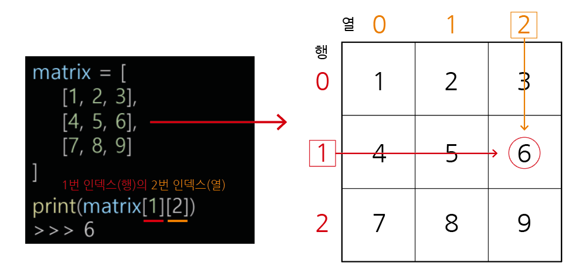

# 이차원 리스트

---

## (1) 이차원 리스트

### **1) 이차원 리스트 정의**


: 이차원 리스트는 `리스트를 원소로 가지는` 리스트이다.

```bash
ex)
  
matrix = [
    [1, 2, 3],
    [4, 5, 6],
    [7, 8, 9]
  ]

print(matrix[0])
print(matrix[1])
print(matrix[2])

print(matrix[0][0])
print(matrix[1][2])
print(matrix[2][1])

출력
>> [1, 2, 3]
>> [4, 5, 6]
>> [7, 8, 9]
>> 1
>> 6
>> 8
```

- 이차원 리스트는 `행렬(matrix)`이다.




### **2) 특정 값으로 초기화 된 이차원 리스트 만들기**

### - 직접 작성

```bash
ex) # 4 x 3 행렬
  
matrix1 = [[0, 0, 0], [0, 0, 0], [0, 0, 0], [0, 0, 0]]

matrix2 = [
    [0, 0, 0],
    [0, 0, 0],
    [0, 0, 0],
    [0, 0, 0]
]
```

### - 반복문으로 작성(100 x 100 행렬)

```bash
ex) # 100 x 100 행렬
  
matrix = []

for i in range(100):
    matrix.append([0] * 100)
```

### - 반복문으로 작성(n x m 행렬)

```bash
ex) # n x m 행렬
  
n = 4 # 행
m = 3 # 열
matrix = []

for i in range(n):
    matrix.append([0] * m)
```

### - 리스트 컴프리헨션으로 작성(n x m 행렬)

```bash
ex) # n x m 행렬
  
n = 4 # 행
m = 3 # 열

matrix = [[0] * m for i in range(n)]
```

### - 리스트 컴프리헨션 vs 리스트 곱셈 연산(주의)

```bash
ex) # n x m 행렬
  
n = 4 # 행
m = 3 # 열

matrix1 = [[0] * m for i in range(n)] # 리스트 컴프리헨션
matrix2 = [[0] * m] * n # 리스트 곱셈 연산

print(matrix1)
print(matrix2)

출력
>> [[0, 0, 0], [0, 0, 0], [0, 0, 0], [0, 0, 0]]
>> [[0, 0, 0], [0, 0, 0], [0, 0, 0], [0, 0, 0]]

# 같아 보일 수 있다.

--------------------------------------------------------------

# 원소 값을 수정하는 경우

n = 4 # 행
m = 3 # 열

matrix1 = [[0] * m for i in range(n)] # 리스트 컴프리헨션
matrix2 = [[0] * m] * n # 리스트 곱셈 연산

# 둘 다 0번 행의 0번 열의 원소를 1로 수정
matrix1[0][0] = 1
matrix2[0][0] = 1

print(matrix1)
print(matrix2)

출력
>> [[1, 0, 0], [0, 0, 0], [0, 0, 0], [0, 0, 0]]
>> [[1, 0, 0], [1, 0, 0], [1, 0, 0], [1, 0, 0]]

# 리스트 컴프리헨션의 경우, 원하는 위치의 값이 1로 수정
# 리스트 곱셈 연산의 경우, 모든 행의 0번 인덱스 값이 1로 수정되었다.
```


: `리스트 컴프리헨션`의 경우, 각 행은 `서로 다른 리스트 객체`이기 때문에 각 행을 수정하더라도 다른 행에 영향을 미치지 않는다.

반면, `리스트 곱셈 연산`의 경우, 같은 리스트 객체를 복사하는 것이 아니라 `같은 참조`를 가지게 된다. 따라서 하위 리스트 중 하나를 수정하게
되면, 다른 하위 리스트도 동일한 변경을 반영한다.

그러므로 리스트 곱셈 연산을 이용할 경우, 주의가 필요하며 원소의 `개별적인 수정`이 필요한 경우, `리스트 컴프리헨션`을 이용해야 한다.

---

## (2) 입력 받기

### - 행렬의 크기가 미리 주어지는 경우
### - 행렬의 크기가 입력으로 주어지는 경우

---

## (3) 순회

### - 이중 for문을 이용한 행 우선 순회
### - 이중 for문을 이용한 열 우선 순회
### - 행 우선 순회 vs 열 우선 순회

---

## (4) 전치

---

## (5) 회전

### - 왼쪽으로 90도 회전하기
### - 오른쪽으로 90도 회전하기