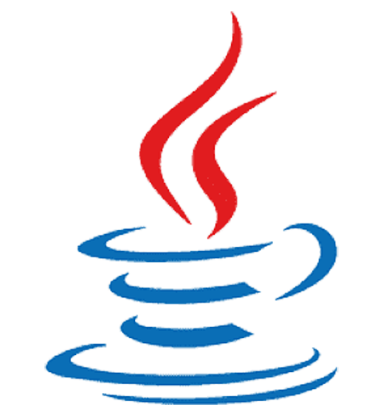

# 📝 배운 지식 정리

 

[//]: # "마크다운"

 Markdown

-   [Markdown](Markdown/Markdown.md)

 

[//]: # "GIT"

 GIT

-   [Git](Git/Git.md)
-   [GitHub](Git/GitHub.md)
-   [Branch](Git/Branch.md)
-   [GitHub Flow](Git/GitHub%20Flow.md)

 

[//]: # "파이썬"

 Python

-   [기초](Python/Python_Basics.md)
-   [리스트](Python/Python_List.md)
-   [String Formatting](Python/Python_String_Formatting.md)
-   [형 변환](Python/Python_Typecasting.md)
-   [제어문](Python/Python_Control_Statement.md)
-   [문자열](Python/Python_String.md)
-   [함수](Python/Python_Function.md)
-   [딕셔너리](Python/Python_Dictionary.md)
-   [모듈, 패키지, 라이브러리](Python/Python_Module.md)
-   [에러, 예외처리](Python/Python_Error.md)
-   [스택, 큐](Python/Python_Stack_Queue.md)
-   [파일 입출력](Python/Python_File.md)
-   [튜플, 세트](Python/Python_Tuple_Set.md)
-   [메서드](Python/Python_Method.md)
-   [힙](Python/Python_Heap.md)
-   [사용자 정의 함수](Python/Python_User_Function.md)
-   [이차원 리스트](Python/Python_matrix.md)
-   [클래스](Python/Python_Class.md)
-   [응용 및 심화](Python/Python_Deepen.md)
-   [가상환경](Python/Python_Virtual_environments.md)
-   [API](Python/Python_API.md)

 

[//]: # "mysql"

 MySQL

-   [데이터 베이스](MySQL/Database.md)
-   [관계형 데이터 베이스](MySQL/Relational_Database.md)
-   [MySQL Workbench](MySQL/MySQL_Workbench.md)
-   [SQL 기초](MySQL/MySQL_Basics.md)
-   [단일 테이블 쿼리](MySQL/MySQL_Single_Table_Queries.md)
-   [테이블 관리하기](MySQL/MySQL_Managing_Tables.md)
-   [테이블 조작하기](MySQL/MySQL_Modifying_Data.md)
-   [다중 테이블 쿼리](MySQL/MySQL_Multi_Table_Queries.md)
-   [중첩 쿼리]()
-   [트랜잭션, 트리거]()
-   [정규화, 데이터 모델링]()

 

[//]: # "postgresql"
[//]: # "
"
[//]: # '
 PostgreSQL
'
[//]: # '
'
[//]: # "
"
[//]: # "
"
[//]: # " "
[//]: # "mongodb"

 MongoDB

-   [MongoDB 소개](MongoDB/MongoDB_Intro.md)
-   [설치하기](MongoDB/MongoDB_Setup.md)

 

[//]: # "html"

 HTML

-   [웹 소개](HTML/Web_intro.md)
-   [HTML 소개](HTML/HTML_intro.md)

 

[//]: # "css"

 CSS

-   [CSS 소개](CSS/CSS_intro.md)
-   [Box Model](CSS/CSS_Box_model.md)
-   [포지션](CSS/CSS_Positioning.md)
-   [Float](CSS/CSS_Floating.md)
-   [Flexbox](CSS/CSS_Flexbox.md)
-   [Semantic](CSS/CSS_Semantic.md)

 

[//]: # "sass"
[//]: # "
"
[//]: # '
 Sass
'
[//]: # '
'
[//]: # "
"
[//]: # "
"
[//]: # " "
[//]: # "javascript"

 JavaScript

-   [자바스크립트 역사](JavaScript/JS_History.md)
-   [DOM](JavaScript/JS_DOM.md)
-   [기초 문법](JavaScript/JS_Basic_syntax.md)
-   [함수](JavaScript/JS_Function.md)
-   [객체](JavaScript/JS_Object.md)
-   [배열](JavaScript/JS_Array.md)
-   [이벤트 조작하기](JavaScript/JS_Event.md)
-   [동기 & 비동기](JavaScript/JS_Asynchronous.md)
-   [Promise](JavaScript/JS_Promise.md)
-   [async/await]()
-   [API & fetch]()
-   [Node.js 기초]()

 

[//]: # "typescript"

 TypeScript

-   [타입스크립트 소개](TypeScript/TS_intro.md)
-   [개발환경 구축](TypeScript/TS_Setting.md)
-   [기본 특징](TypeScript/TS_Basic_feature.md)
-   [타입 시스템](TypeScript/TS_Type_system.md)
-   [변수](TypeScript/TS_Variable.md)
-   [타입 추론](TypeScript/TS_Type_assertion.md)

 

[//]: # "java"
[//]: # "
"
[//]: # '
 Java
'
[//]: # '
'
[//]: # "
"
[//]: # "
"
[//]: # " "
[//]: # "spring"
[//]: # "
"
[//]: # '
 Spring
'
[//]: # '
'
[//]: # "
"
[//]: # "
"
[//]: # " "
[//]: # "django"

 Django

-   [Django 소개](Django/Django_intro.md)
-   [Setting (가상환경 생성~앱 생성)](Django/Django_Setting.md)
-   [Django 디자인 패턴](Django/Django_Design_pattern.md)
-   [Template](Django/Django_Template.md)
-   [URLs](Django/Django_URLs.md)
-   [Model](Django/Django_Model.md)
-
-   [ORM](Django/Django_ORM.md)
-   [쿠키와 세션](Django/Cookie&Session.md)
-   [REST API](Django/REST_API.md)
-   [HTTP Method : PUT & PATCH 비교](Django/PUT&PATCH.md)
-
-   [서버에 대하여](Django/About_Server.md)

 

[//]: # "reactjs"

 React.js

-   [리액트 소개](Reactjs/React_intro.md)
-   [리액트 앱 만들기](Reactjs/Create_React_App.md)
-   [JSX](Reactjs/React_JSX.md)
-   [State](Reactjs/React_State.md)
-   [Props](Reactjs/React_Props.md)

 

[//]: # "nextjs"

 Next.js

 

[//]: # "vuejs"
[//]: # "
"
[//]: # '
 Vue.js
'
[//]: # '
'
[//]: # "
"
[//]: # "
"
[//]: # " "
[//]: # "angularjs"
[//]: # "
"
[//]: # '
 Angular.js
'
[//]: # '
'
[//]: # "
"
[//]: # "
"
[//]: # " "
[//]: # "sveltejs"
[//]: # "
"
[//]: # '
 Svelte.js
'
[//]: # '
'
[//]: # "
"
[//]: # "
"
[//]: # " "
[//]: # "threejs"
[//]: # "
"
[//]: # '
 Three.js
'
[//]: # '
'
[//]: # "
"
[//]: # "
"
[//]: # " "
[//]: # "r3f"
[//]: # "
"
[//]: # '
 R3F(React Three Fiber)
'
[//]: # '
'
[//]: # "
"
[//]: # "
"
[//]: # " "
[//]: # "Bun"
[//]: # "
"
[//]: # '
 Bun
'
[//]: # '
'
[//]: # "
"
[//]: # "
"
[//]: # " "
[//]: # "GraphQL"
[//]: # "
"
[//]: # '
 GraphQL
'
[//]: # '
'
[//]: # "
"
[//]: # "
"
[//]: # " "
[//]: # "docker"
[//]: # "
"
[//]: # '
 Docker
'
[//]: # '
'
[//]: # "
"
[//]: # "
"
[//]: # " "
[//]: # "kubernetes"
[//]: # "
"
[//]: # '
 Kubernetes
'
[//]: # '
'
[//]: # "
"
[//]: # "
"
[//]: # " "
[//]: # "data structure, algorithm"

 Data Structure, Algorithm

-   [데이터 입출력]()
-   [시간복잡도, 빅오 표기법](Algorithm/Algorithm_Time_Complexity.md)
-   [스택(Stack), 큐(Queue)](Algorithm/Algorithm_stack_queue.md)
-   [우선순위 큐(Priority Queue),힙(Heap): 우선순위에 따라 데이터 꺼내는 자료구조](Algorithm/Algorithm_priority_queue_heap.md)
-   [트리 자료구조(Tree): 활용도 높은 자료구조](Algorithm/Algorithm_tree.md)
-   [바이너리 인덱스 트리(Binary Index Tree): 특수한 목적의 자료구조](Algorithm/Algorithm_binary_indexed_tree.md)
-   [선택 정렬, 삽입 정렬: 간단하고 기본적인 정렬 알고리즘]()
-   [퀵 정렬, 계수 정렬: 더 빠른 정렬 알고리즘]()
-   [완전탐색(Exhaustive Search)]()
-   [그래프(Graph)]()
-   [깊이우선탐색(DFS), 너비우선탐색(BFS)]()
-   [다익스트라 알고리즘: 하나의 출발지에서 다른 모든 출발지까지 최단 경로 계산]()
-   [플로이드 워셜 알고리즘: 모든 출발지에서 다른 모든 출발지까지 최단 경로 계산]()
-   [벨만 포드 알고리즘: 비용이 음수인 간선이 있을 때 최단 경로를 구하는 법]()
-   [유니온 파인드 자료구조: 서로소 집합을 판단하는 법]()
-   [크루칼 알고리즘: 최소 신장 트리를 찾는 알고리즘]()
-   [최소 공통 조상: 트리에서의 최소 공통 조상을 찾는 알고리즘]()
-   [위상 정렬: 방향성을 거스르지 않도록 전체 노드 나열하기]()
-   [재귀 함수]()
-   [유용한 표준 라이브러리]()
-   [소수 여부를 빠르게 처리하는 알고리즘 모음]()
-   [이진 탐색: 정렬된 데이터에서 빠르게 데이터 찾기]()
-   [동적 계획법: 메모리를 더 소모하여 속도 향상시키는 방법]()
-   [그리디(Greedy): 현재 상황에서 가장 좋아보이는 것만 고르기]()
-   [단순구현(Implementation)]()
-   [투 포인터와 구간 합]()

 

[//]: # "computer science"

 Computer Science(CS)

-   [CS_CLI](Computer_Science/CS_CLI.md)
-   [CS\_디자인 패턴과 프로그래밍 패러다임](Computer_Science/CS_Design_pattern_Programming_paradigm.md)
-   [OS\_운영체제 개요](Computer_Science/OS_운영체제_개요.md)

